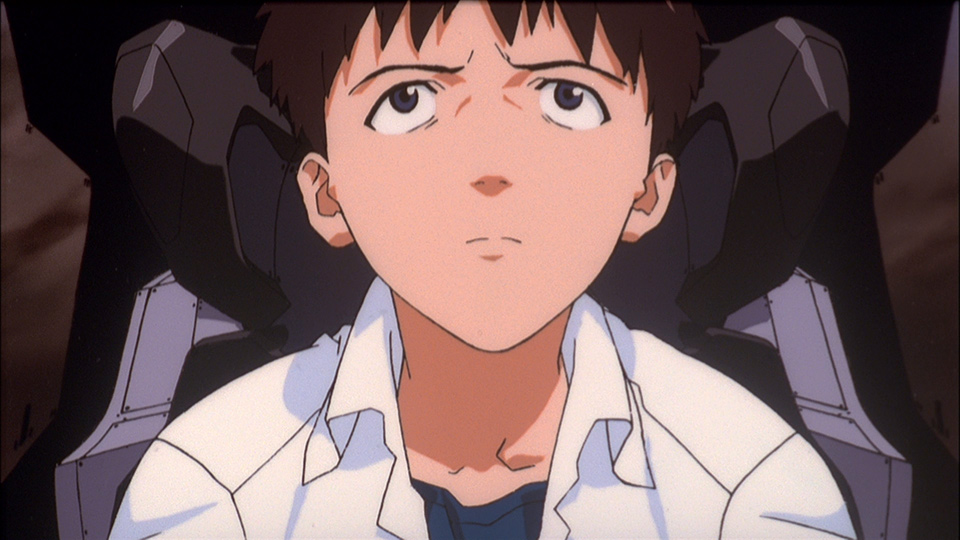

# 3+1 Trailer #3 Thoughts, Pt. 3

## Summary

Core country, moving mountains, creepy clones, and more. A far-too-detailed look!

## Content

I intended to start talking about the new trailer (or what I’ll informally call “trailer #4”) in this post, but my plans never, <em>ever</em> seem to work out the way I want… I realized I actually had a lot of unpublished material on the third trailer already done, so, instead of needlessly wasting it, I’m going to push it out over the next two days. Trailer #4 stuff will arrive as an early New Year’s present, I suppose. 

And speaking of... Happy New Year's Eve, everyone! See you on the other side.

<h3>Traveling Pilots</h3><figure></figure>
This shot is from the sequence we’ve been taunted with for a long time now, the three pilots trekking through the core-converted landscape. Same as the shot from this sequence we got in trailer #2, 
<figure></figure>
Asuka and Rei are leading, and Shinji is trailing behind, understandably not looking in the best of moods. <strong>Joseki</strong> caught that this shot is based on one of the storyboards that was hidden in the “Peaceful Times” short film, 
<figure></figure>
which suggests that not only will <a href="https://eva-fan.com/blog-entry-2723.html" rel="noopener" target="_blank"><u>more of said storyboards</u></a> show up in the finished movie, but corroborates the idea that this sequence had been storyboarded for inclusion within <em>Q</em>, as part of a “D Part” conspicuously missing from the finalized film. (Meaning that a chunk of the intended “D Part” was delayed until <em>Shin Evangelion</em>, whereas the rest of it might have been absorbed into <em>Q</em>’s “C Part.”) I expect this sequence will involve a fair amount of exposition — like, come on, what are the odds they’re going to spend all that time walking together amidst landscapes filled with creepy, deformed, Eva-shaped monstrosities, and Asuka isn’t going to spill<em> any</em> deets at all? — so the delay only makes sense, really. There’s some key information that was cut from Fuyutsuki’s scene with Shinji (<a href="https://www.arqacrypha.net/post/secrets-of-the-ayanami-series-part-2" rel="noopener" target="_blank"><u>more here</u></a>) that I also expect was held off for <em>Shin</em> because it simply revealed too much too early. If this ends up being true, it would basically confirm the meta-analysis of <em>Q</em> as an experience where the audience is very intentionally denied most of the same information that Shinji is, for the sake of putting them in his shoes. This could render one of the themes of<em> Shin </em>as “truths coming to light” — and funny enough, one of the possible readings of "<em>shin</em>" (シン) is "truth" (真)… 

Asuka remains fixated on the compass that’s helping her navigate them to an area with lower L Barrier density. If <em>Until You Come To Me</em> is any indication, she’s just leading them to the nearest large body of water, i.e., the ocean. 
<figure></figure>
Water resists coreification for reasons that haven’t been explained -- maybe it has something to do with the level of atomic motion in fluids -- so it makes sense that the L Barrier being generated by the gigantic Earth’s-surface-turned-core would thin at the shore. I dunno why Asuka would have to stare at the compass constantly like this, but maybe it just gives her something to focus on so she can block out the crapsack world around her, not to mention thoughts of that <em>baka-gaki</em> Shinji. Shikinami was always retreating into her Wonderswan even before the world was a red hellhole, so I guess she’d have even more motivation to engage in escapist weirdness now. 
<figure></figure>
Meantime, Tentative Name: Rei Ayanami turns around in this shot to check on Shinji, and even stops so that he can catch up a little. Where before there was complete indifference or disinterest, this one little gesture suggests that Rei 6 is becoming markedly more interested in other people. It’s curious that such a development might happen so quickly — or maybe not, if her facility acted in part as a way for Seele to keep her personality development suppressed. Now that she hasn’t checked in for a while, she can become more than just a wind-up toy awaiting orders. Almost like there was a person inside there waiting to come out all along. <a href="https://www.arqacrypha.net/post/rei-6-the-doll-who-shouted-i" rel="noopener" target="_blank"><u>More on that here.</u></a>

<h3>The Black Moon</h3><figure></figure>
For those not in the know, the giant thing you see here, which came out of the ground at Fourth Impact in <em>Q</em>, is in fact NTE’s version of the Black Moon. It’s identified as such in production materials (storyboards and script), and presumably <em>Shin</em>’s dialogue will finally name it out loud. Obviously it’s not just a hollow planetoid spaceship thingy anymore, but a sort of giant mechanical Holy Grail, with the primary "Moon" portion sitting on top of the bowl of the goblet.
<figure></figure>
Calling it a "Moon" is a bit strange, since it only looks moon-like from directly above and below. It's entirely possible that what we’re seeing is just the remaining core of something that used to be much bigger and rounder, but, uh… I better stop there if I ever want to finish this article…

So, on this particular trailer shot… The thick "saucer section" of the Black Moon (foreground) is somehow levitating here, moved by an unknown force, while the base is dragging behind on the ground. That's Mt. Fuji inexplicably being dragged along, which we actually saw the Black Moon<em> just barely</em> miss when it fell in <em>Q</em>. (My brain idly wonders if this was an intentional invocation of <a href="https://en.wikipedia.org/wiki/Henny_Penny" rel="noopener" target="_blank">,<u>"THE SKY IS FALLING!"</u></a>...)
<figure></figure>
That is, this is “moving mountains" in a very literal sense. Which is — you guessed correctly! — a Biblical reference.

<strong>Matthew 17:19-20</strong> 

(International Standard Version)

Then the disciples came to Jesus privately and asked, 

"Why couldn't we drive [the demon] out?"

He told them, "Because of your lack of faith. 

I tell all of you with certainty, if you have faith like a grain of mustard seed, 

you can say to this mountain, 'Move from here to there,' 

and it will move, and nothing will be impossible for you. 

If nothing else, it feels like it ties into Gendo’s philosophy of doing whatever’s necessary to achieve his goals, no matter how impossible it might initially seem. Requires more study on my part. (Somehow I only caught that this was a Biblical allusion mere hours before publication time.) 

I’m not sure if Mt. Fuji is "actually" important (I kind of hope not; imagine all the bad <em>Pacific Rim Uprising</em> crossover potential that absolutely nobody of sound mind could possibly want) or it just happened to get caught in a bad situation. Well, if the latter, props to whoever is relocating the Black Moon for taking care to keep a national landmark intact in a world where most of the organisms, human and otherwise, are probably absorbed inside the Earth’s-crust-turned-giant-core, unable to enjoy natural beauty or do much of anything else. 

Incidentally, the fact that Mt. Fuji is caught on the base at all means that the Black Moon is being moved in a north-west manner. Apologies for the shoddy visuals...
<figure></figure>
This was an extremely low-tech attempt (my age is probably showing a bit) to get an approximate length for NTE's Black Moon, and it's not even correct since I forgot to account for the "dome" of the Black Moon falling <em>past</em> Mt. Fuji, not <em>stopping</em> at it -- but, eh, you get the general idea. In NTE, the Black Moon's starting position (pre-4I) should still be centered beneath Tokyo-3 (or where Tokyo-3 <em>had</em> been, anyway...) on the north shore of Ashinoko; so if it emerges completely, and then tips over such that it nearly hits Mt. Fuji, that means it's laying approximately as shown above when <em>Q</em> ends. See also:
<figure></figure>
In any case: in order for Mt. Fuji to be moved along with the Black Moon, the BM would have to basically keep moving in same direction it fell. (...When I think about it like that, the whole situation reminds me of Marie in episode 13 of <em>Nadia</em>, where she repeatedly dropped a stick and then went in whatever direction the stick pointed. Huh.) Eventually, the base of the Black Moon would reach Mt. Fuji, and Mt. Fuji would either have to get out of the way or come along for the ride at that point. The former is more reasonable from a physics perspective, but I guess,  since there's absolutely nothing reasonable about the situation shown in the trailer, coolness rightfully wins out. 

At this point, I’ve got two big questions: how, and why? 

This is obviously being done on purpose by Gendo and/or Fuyutsuki in preparation for Final Impact, using whatever tools are at their disposal. The Black Moon moved under the influence of Eva 13 before (when it emerged completely from the ground and revolved counterclockwise in an upright position), so maybe that’s happening again, since we know from trailer #2 that they have Eva 13 in their possession. Or maybe Eva 13 is still bound on the CS rack at the time, and the Black Moon is being moved some other way. Say... by using the three Evas conspicuously missing from the previous movie (<em>Q</em> has Evas 09 and 13, but no 10 through 12).

But honestly, I’m more curious about the "why".  <em>Why</em> does the Black Moon need to be relocated?  If it were a simple matter of repositioning the BM as it had been at Fourth Impact, they would simply need to reorient it ninety degrees. Where could it possibly need to go that’s northwest of the Hakone area? Something really fucking weird is going on. 

And it gets worse. Remember how, last film, we saw the Failures of Infinity that had been inside the Black Moon get vented out of it in profuse quantities, and after the Impact ended they all unceremoniously dropped to the ground? 
<figure></figure>
<figure></figure>
<figure></figure>
<figure></figure>
This is just an assumption, but since the Black Moon is a huge weird thing connected to Lilith that hasn’t been sufficiently explained yet, presumably it will be an important part of Final Impact and, as in Fourth, be present at its epicenter. But if it’s relocated, how do we explain the FoIs being present in massive swarms beneath Final Impact’s Gates of Guf? 
<figure></figure>
<figure></figure>
Is the Black Moon only moved a negligible amount for… <em>reasons</em>? Or are the Failures somehow relocated as well? Most likely scenario I can picture is that they're attracted to the orbit of the "activated" Black Moon, so once Final Impact is triggered, they'll all pick themselves up and zoom through the air until they get where they need to be. Whole thing gives me a headache, honestly. @_@   

<h3>Rei with SDAT</h3><figure></figure>
Rei holding the SDAT, confirming what we already knew — that she did in fact pick it up at the end of Q — and extending her right hand to someone. Shinji presumably, since, well, SDAT and all, plus he’s so down in the dumps and he could use a helping hand. This shot taking place at dusk (or sunrise, perhaps, but gut says "dusk") implies that, however many days the trek on foot takes place over, Rei and Shinji will have spent a few hours together at least, if not an entire day, which provides some opportunity for bonding to occur and for him to come to accept her as a person, even if she isn’t the Rei he "wanted". It’s also been noted that this parallels the shot of Kaworu extending his hand to Shinji in <em>Q</em> -- a critical moment in the boys' relationship, where an emotionally devastated Shinji was able to actually place his trust in someone. Will Rei 6 become someone Shinji can trust, too?
<figure></figure>
While this quick little cut of Rei provides a lot of optimism about the possibility of new human connections forming, I do get a bad feeling about it as well. <a href="https://www.arqacrypha.net/post/rei-6-the-doll-who-shouted-i" rel="noopener" target="_blank"><u>More here.</u></a>

<h3>Guest of Honor</h3><figure></figure>
Asuka walking toward a box-shaped room positioned at the junction of four catwalks. Structurally it seems very similar to Asuka and Mari’s room, judging from the production art by Ikuto Yamashita;
<figure></figure>
note for example the diagonally etched (wrong term, I'm sure) glass with the distinctly-patterned frame over it. (Feels very familiar, but I can't quite put a finger on it.) However, in all likelihood this isn't Asuka and Mari's room, but some kind of holding cell for Shinji. What little we can see of the room through the glass certainly doesn't look like the girls' bunk (I can't make heads or tails of it, honestly), and Yamashita's notes also suggest that Wille's pilots are located on the commissioned officers’ deck, as opposed to… wherever the hell this is. So I suppose Asuka's paying the "stupid brat" a visit, much as the idea must offend her sensibilities.
<figure></figure>
By the way, if you go back and look at the shot where Shinji has a tense, mysterious encounter with Kaworu <strong>(above)</strong>, the window there does indeed match the one that Asuka is facing. 

This entire area of (presumably) Wunder is unfamiliar and very enigmatic. Curiously shaped and multi-tiered, with lots of red devices installed into the walls. Notice how the cell is positioned directly in the middle of a cross shape that’s formed via architectural elements. (Sasuga Impact-kun.) Strangely, there are no sealing pillars in sight, even though we know Wunder has those available (they’re used when Shinji’s deep sync is being measured). There’s some kind of scaffolding around the cell, and there’s a bizarre construction on top of it that’s being held in place with cables. All really visually confusing and, without other angles to reference, too much of a perspective-fuck to extract anything too useful from at the moment. If you have any thoughts, though, I’d love to hear them.

<h3>Midori and the Secret of Blue Water</h3><figure></figure>
The color of the uniform shows this is <a href="https://static.wixstatic.com/media/87d07b_60fc4f98f0ed4f28a88e1ebce0e5530c~mv2.png" rel="noopener" target="_blank"><u>Midori Kitakami</u></a>, i.e. pink-haired duck-face lady. A quiet moment — no battle taking place or battle preparations being made, just maintaining the ol’ meatsack. We can see she’s eating multi-colored pastes like Shinji did in <em>Q</em>, but there are some actual vegetables and grains mixed in, establishing that foods are still being cultivated somewhere. (Perhaps the fresh veg could even come from an on-ship greenhouse.) The pouch of water is like the drinking pouches used by astronauts, and is presumably attached to some sort of dispenser. Is this how Wunder’s crew normally drinks (for convenience reasons, maybe), or is this being done specifically in anticipation of the Wunder soon taking to space? 

Notice also the combination of English and Russian on the pouch — is this signifying something about the composition of Wunder’s crew? All of the bridge personnel are Japanese and, unlike Bethany Base, Wunder hasn't shown any indications (aside from this water pouch) of accommodating a multilingual crew. I'm not quite sure what to make of it, but I'm probably overlooking something stupidly obvious.

Incidentally, this brings to mind the shot from <em>Ha</em> where the camera fixates on a pouch of green tea hanging out near Fuyutsuki. 
<figure></figure>
I feel like we’re meant to compare the two… In one instance, the pouch is free-floating and says to add water, whereas the other is grounded by the hose and Midori’s hand and simply <em>is</em> water. One pouch has "Nerv" written on it, the other has "Wille". The pouches are also facing opposite directions in their respective shots. 

Green tea that needs water added; water. Nerv; Wille. Red; blue. Left; right. Everything will come together in the middle and make purple. NTE is full of weird little touches like this. Things that don't seem like they mean anything at first -- only for hindsight to show that the movies were accumulating a rich visual and thematic vocabulary under your nose the entire time. 

Speaking of which, Midori has purple eyes and wears a purple hazmat suit, which raises a lot of weird questions, given how purple is generally used throughout the films. But that's a matter for its own article, honestly.

(And yes, the most important parts of this entry were already written before trailer #4 came out. &gt;:-3 ) 

<h3>Dead Red Stare</h3><figure></figure>
<em> <strong>GAAHHHHH!!!</strong></em> Okay, that’s actually kind of unsettling. If it weren’t apparent, this is a close-up of some Rei-shaped thing or another, suspended inside a fluid (if the shifting hair didn't give it away, the watery distortions are made obvious by the looping GIF), and made completely out of core. Yes, <em>more</em> core-entities. There’s no escaping the damn things. As for the implied context… I’ve considered a couple of weird possibilities, and right now the one that feels most likely is that this shot is connected to the corresponding freaky one from trailer #2. 
<figure></figure>
Yeah, that one! The way flesh-Rei and core-Rei are drawn is similar, and we haven’t seen that creepy style used in any of the other art shown off so far. Also note the lighting. Very dark and unsettling in both. So my guess here is that this core-Rei is something that Fuyutsuki is showing our Number Six, for the purposes of freaking her out appropriately about her true nature and bending her budding personality to his will. My brain easily conjures up a dark echo of Fuyutsuki’s chat with Shinji that also provides heavy nods to episode 37 of <em>Nadia</em>… Remember Gargoyle showing Nadia all sorts of weird shit in the bowels of the Red Noah in an attempt to break her spirit? (And if you haven’t seen <em>Nadia</em> yet, what are you waiting for! Hop to it!) 
<figure></figure>
<figure></figure>
<figure></figure>
 Yes, I know I used this gallery in another article, but I just can't help myself... 

Part of the <a href="https://www.arqacrypha.net/post/secrets-of-the-ayanami-series-part-2" rel="noopener" target="_blank"><u>cut content</u></a> from <em>Q</em>’s shogi scene included a visual of glass capsules, so just imagine... Fuyutsuki turns the lights on for Rei 6 (preferably by snapping his fingers) and you have all these freaky core-Reis behind the glass, staring out through their LCL environments with vacant, lifeless expressions. 

Incidentally, Reis made of core are nothing new, having shown up in the previous two movies, but if this prediction is correct, this could be the first time we’d be getting a core-Rei "to scale". It’s worth noting that we’ve been told absolutely nothing about how the Ayanami Series is manufactured… And a rather foreboding detail, in retrospect, is this in <em>Ha:</em> 

REI:

It's okay, Ikari-kun. 

Even if I'm gone, there are replacements for me.

　　　　　

CORE-REIS:

Replacements...
<figure></figure>
What Rei tells Shinji feels like an obvious reference to the Ayanami Series. And interestingly, as soon as she says it, distorted effigies of Rei start to emerge from the 10th Angel’s core, partly echoing her words. A possible hint as to how Rei’s "replacements" have been created all along? This ought to be good, and maybe it will help bring some clarity to what an annoying puzzle NTE's obsession with core-shit is. 

<h3>Resolute Shinji</h3><figure></figure>
Curious shot here. No context in the trailer, so definitely stirs the imagination a bit. This somewhat channels a shot of Shinji that appears in the TV show’s opening, and gets specifically used in episode 12, when he’s in Eva-01 before the Sahaquiel chase, flashing back to Misato revealing her backstory. This ends with him looking up with determination, thinking, “Right. I mustn’t run away.” 
<figure></figure>
There’s also a slightly similar shot in EoE (pointed out to me by <strong>Derantor</strong>), when Eva-01 starts rising from the pyramid and Shinji looks up and sees Eva-02’s corpse.
<figure></figure>
 (And no, I'm not going to worry about that bit of weirdness from trailer #4 right now.)

If these two parallels provide even the slightest indication about the context of this “Shinji looking up with clarity and resolve” shot, what we could end up getting is a situation where Wille’s two pilots have failed, but Shinji is in a very different place than he was in EoE. We know that he’s going to find that thing he needs to fight again. The fundamental dynamic underlying Eva-01’s final sortie will be completely different. Given the call-back to episode 12, and the inevitable parallels to EoE, it feels possible that the scene here is one between Misato and Shinji. Note that, in NTE, Misato has not opened up to Shinji about her past; Kaji provided the scants bits of information that are in 2.0. We need Misato to step up to the plate and do the rest now — and I get the feeling that it’s going to overlap with NGE canon way less than most fans are expecting. There’s a reason NTE has been holding out on Misato’s backstory this long. 

Misato has always been Shinji’s adult counterpart in a sense, and now that Misato has effectively turned into another Gendo, that’s more true than ever. Given the significant setting changes, in what ways would Misato need to be different in order to maintain her counterpart relationship with Shinji? The answer lies in NTE’s version of Second Impact, naturally. Everything seems to come back to that, one way or another. I hope to write a treatment on the matter before the movie hits. Expect a really wild ride. 

The rest of my long-overdue treatment on trailer #3 to follow as quickly as I can manage.
