# 3+1 Trailer #3 Thoughts, Pt. 4 Descent Into Guf

## Summary

The mysterious destination of Wille's Evas, some new goodies they get to play with, and more!

## Content

That feel when your sense of excitement and adventure leads you to say dumb things like "a couple of days", but your osteoarthritis says "oh, honey..." while shaking its head sadly. But that aside, Happy New Year, everyone! The future is no less uncertain and terrifying, of course, but any possibility of a temporary reprieve from complete madness will help in the long-term. At least, I hope so. And speaking of madness, <a href="https://archiveofourown.org/works/28530840" rel="noopener" target="_blank"><u>here is a present</u></a> for all of you that hints at things to come at Arqacrypha (provided the relevant speculah isn't completely harpooned before I get a chance to write about it). Enjoy.  So, without further ado...

<figure>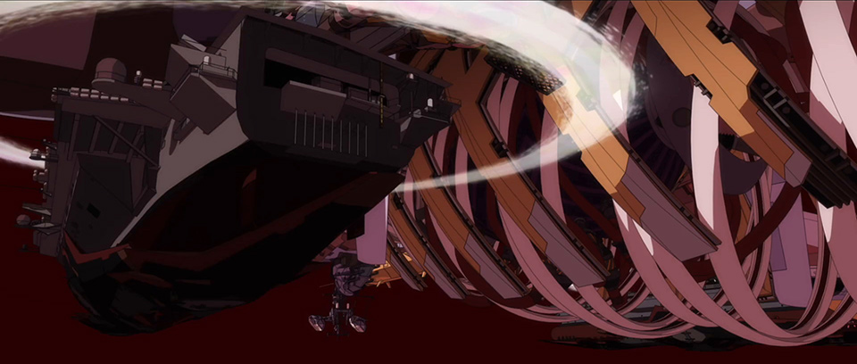</figure>
<figure>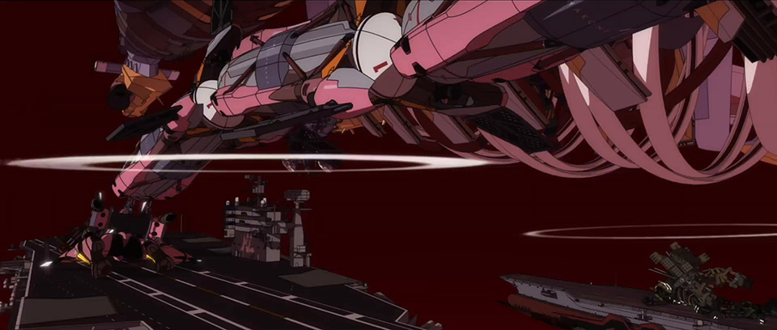</figure>
<figure>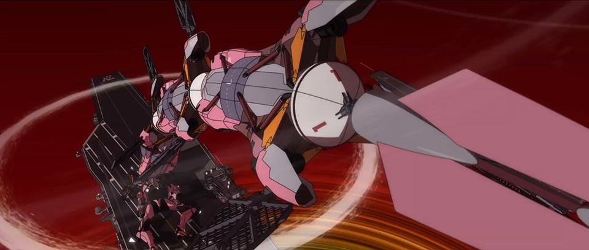</figure>
<figure>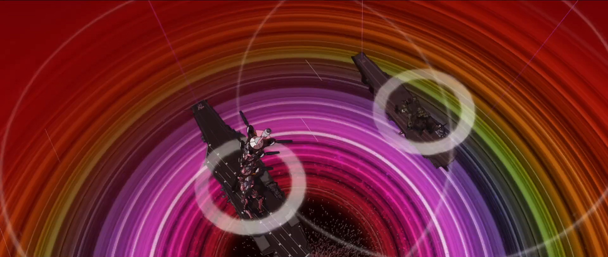</figure>
<figure>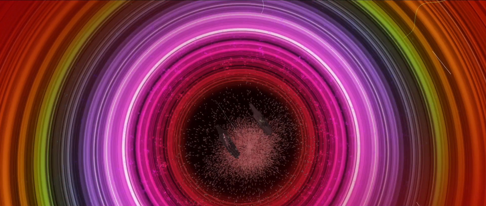</figure>
<figure>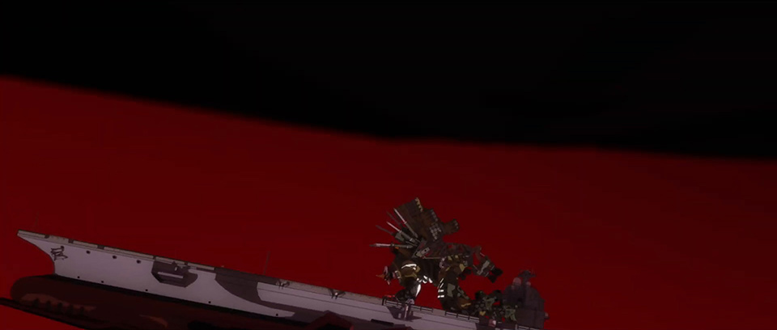</figure>
<figure>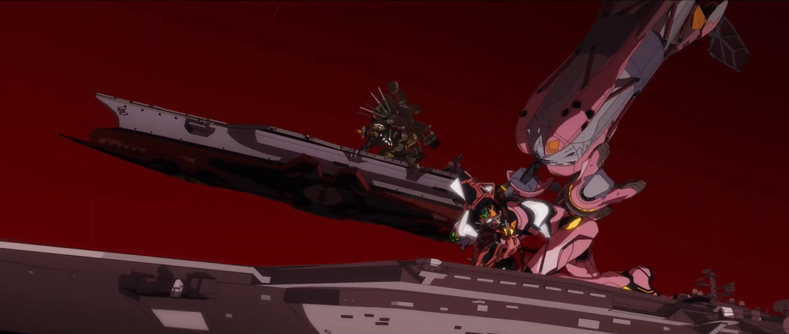</figure>
<figure>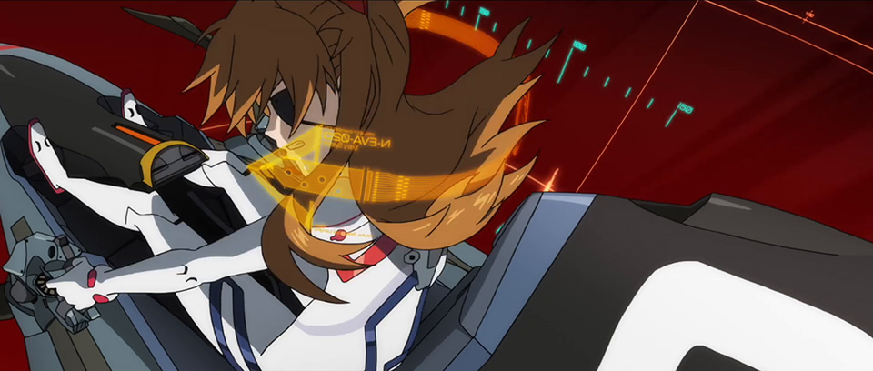</figure>
<figure>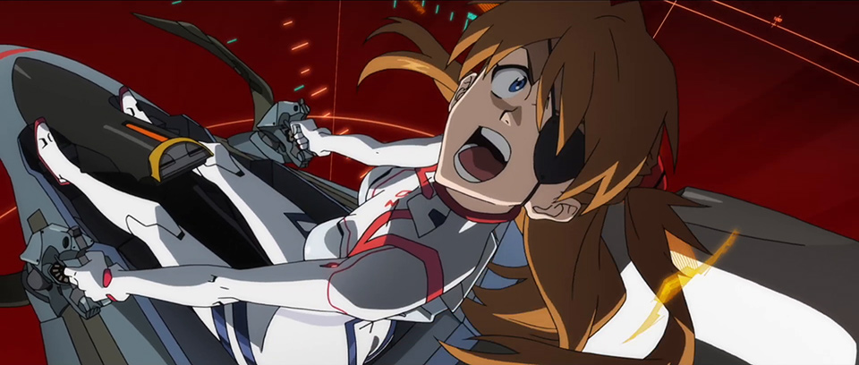</figure>
<figure>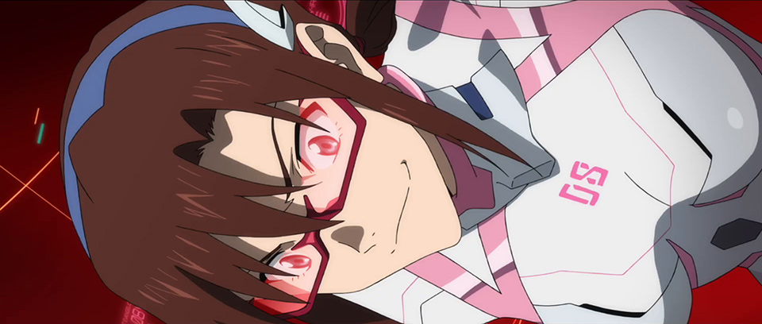</figure>
<figure>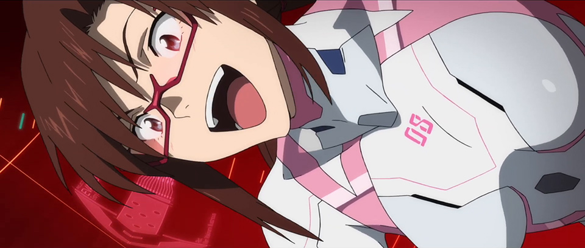</figure>
At this point, there’s a handful of shots that seem to be approximately sequential in <em>Shin</em> itself, so I’ll cover them together. There is really way too much crap happening here so it will be hard to touch upon everything. 

This shows Wunder above the center of the Gates of Guf, dropping Evas 02 and 08 right into the center of that black hole-looking thing. (Presumably the <strong>Chamber of Guf</strong>, since the things around it are called <strong>Gates</strong> of Guf, and all……) Interesting that when the Gates are approached from above, the multi-colored rings at the center seem to eventually radiate into a vast, uniform redness that extends high above the Gates themselves. Reminds me of the Spiritual World as depicted in NGE, which also seemed to include transitional areas where traditional reality breaks and you find yourself heading... <em>somewhere else</em>. 
<figure>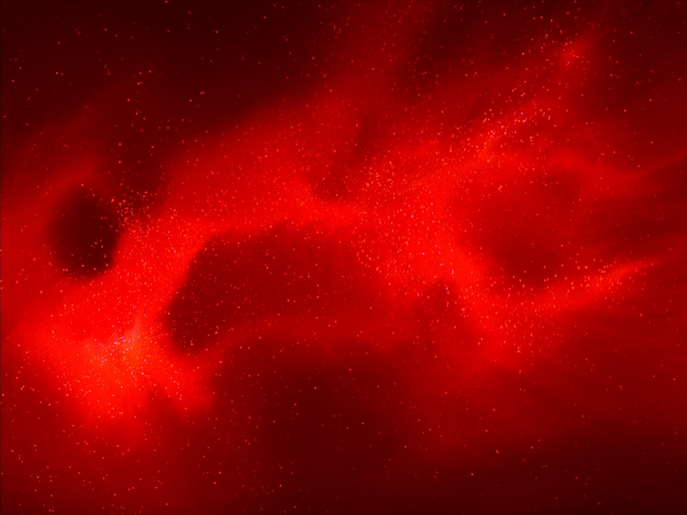</figure>
<figure>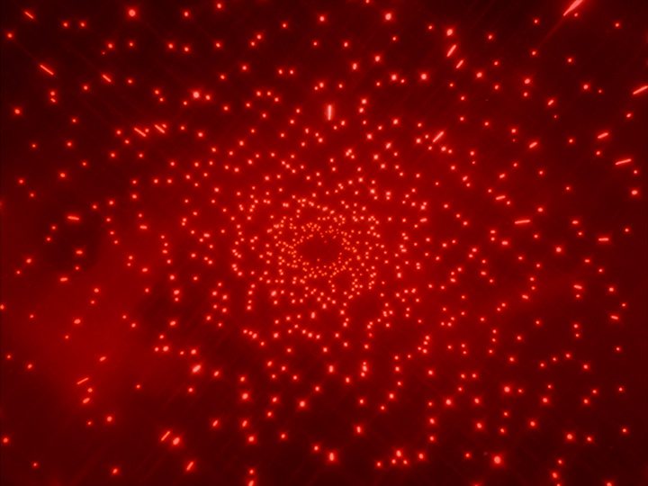</figure>
<figure>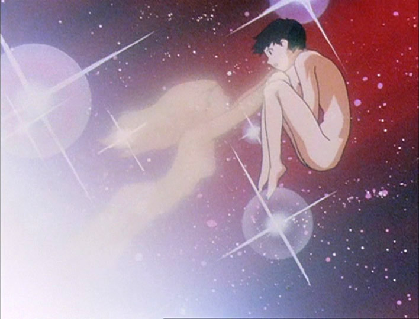</figure>
<figure>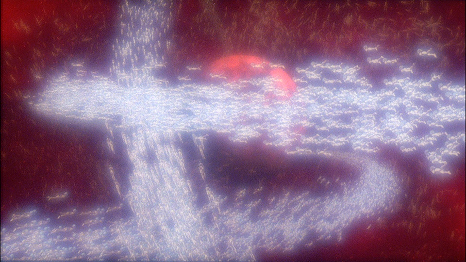</figure>
<figure>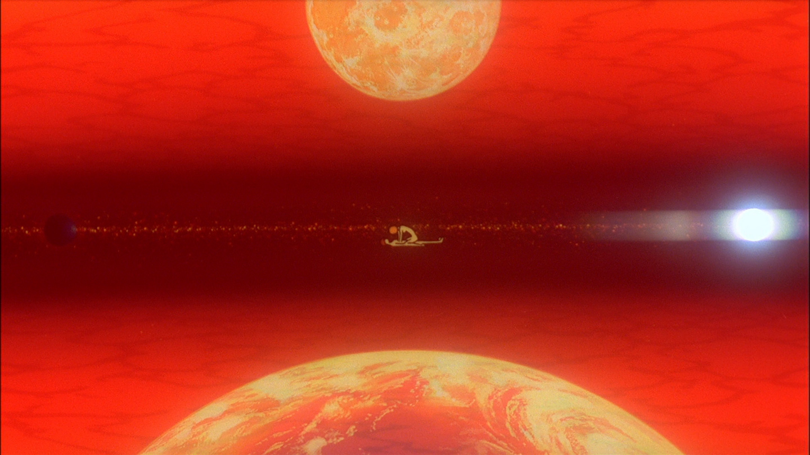</figure>
Or the redness could just be the trailer hiding something much more interesting from us, as NTE trailers have been known to do, but that's no fun to write about…

This from-the-top approach reveals something that is <em>definitely</em> new to us, which is this weird clustering of sepia-colored particles. My mind immediately flashed to that bit of technobabble in episode 20 about Shinji going "<strong>pattern sepia</strong>" — this is when he’s a disembodied soul, mind you. And I assume that’s precisely what these things are. It’s a clustering of souls that have been collected via the Gates. 
<figure>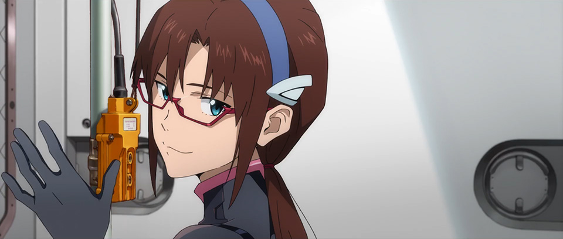</figure>
This congregation’s existence was hinted at in <em>Q</em>, where, during Fourth Impact, Eva 13 nearly gave Seele their desired outcome, and sent a significant number of souls into the Chamber via the Gates. <em>Q</em> is significantly more subtle about this than EoE was, and an article fully detailing this aspect of Fourth Impact is high on my to-do list. But, in the meantime, a GIF will have to suffice:
<figure></figure>
I removed every five frames to both make the size reasonable without sacrificing quality (always important!) and to bring out the motion of the particles. You can see here that they're going in a clockwise direction, changing color at a delay as they pass through sequential rings (check out the turquoise specks passing into the purple rings), and eventually reaching the central red rings and accelerating up into darkness (i.e., toward the Chamber). 

In <em>Q</em>, we only ever got to see Eva 13's fully deployed Gates from below, so if it <em>were</em> possible to see what happened to the gathered souls by changing POV, the option wasn't explored. <em>Shin Eva</em> trailer #3 seems to be saying that, yes, you <em>can</em> see them by looking down from above -- though it's impossible to say for <em>certain</em> without knowing more specifics. 

The clumping suggests that Seele wanted to create an agglutinated super-soul as in EoE, but thankfully <em>Q</em> embraced its post-EoE meta all the way, killing Seele off and moving the possibilities for the story's conflict far beyond foiling Seele's plans. Speaking of, do you notice what’s <em>specifically</em> going on here? 
<figure></figure>
 Look very carefully at the streaks the little sepia particles are leaving behind them.  They show that the particles are moving <em>away</em> from the clump, back toward the Gates. Meaning... the soul clump (Katamari Damacy…?) is flying apart!  
<figure></figure>
Final Impact is undoing Seele’s designs and sending the souls back out of the Chamber via the Gates! Which means that Final has something <em>very</em> different in mind. (Which you'd expect, since those Nerv blokes behind Final have been working against Seele all this time, and all.)

Just to illustrate one of the ways in which Anno's (I'm like 95% sure it's Anno) obsession with tiny details manifests itself, compare the Gates at Fourth and Final. Notice anything? (Remember that the speed difference is just an artifact of GIF timings, and ignore the snapping white prop strings from Wunder.)
<figure></figure>
<figure></figure>
During Fourth Impact, the Gates are revolving in a clockwise direction. At Final Impact, they're going counterclockwise. This reinforces the reversal in the souls' direction. Interestingly, the soul clump is moving clockwise, i.e., against the direction of the Gates. I'm not sure what that denotes, but if it means anything: at 4I, the Black Moon went CCW, and the "Guf Object" went CW. Clockwise vs. counterclockwise is a motif that's everywhere in NTE, and there's definitely enough material to write an article entirely on the subject. There's probably a ton of leads in physics that I need to dig into (like particle spin); if you know of anything that might help, definitely drop me a line. 

Moving onto other possible points of interest:
<figure></figure>
<figure></figure>
The two Evas are descending into the Chamber on top of aircraft carriers that have those shields from Operation US attached to the bottom. They’re dropped from beneath Wunder’s port and starboard wings, and you can see those support strings break as they fall. What look like halos are radiating from behind both Evas, seeming to act as some kind of propulsive force, following along with the Evas’ rate of drop and forming repeatedly to push the Evas down more. The halos stop forming right before the strings sever completely. Very curious. 

I assume these halos come from Wunder -- or Eva-01 rather -- but as for their actual purpose…  I guess the implication is that gravity is not enough, and that you cannot simply fall into the Chamber of Guf. [Insert crappy meme image here.] On some level this makes sense, since halos are closely linked to the Gates (one can turn into the other!), and could be said to act as a doorway between worlds, as it were. Five halos per Eva are created to push them into the Gates, which I’m sure is significant in some way that I’m not grokking at the moment.
<figure></figure>
As for why in the fucking fuck they would even want to go in there — well, that’s the epicenter of the Impact. Presumably this is how they’re going to get at Eva 13 (Gendo and Fuyutsuki’s <strong>Final Executor</strong> — get it, because it will usher in Final Impact?) and try to bring that big purple bitch down with some <strong>groovin’</strong> fusion <strong>magic</strong> of their own. The Eva being completely inaccessible unless you break through the Gates from above is a big change from last time, where Wunder could just approach from the underside of the Gates and ram Eva 13 without issue (well, any issue aside from Mark.09, anyway). It’ll be interesting to see the logistics behind it. 
<figure>&lt;3"" &gt;</figure>
And I wonder if this need to access the Chamber from above is the reason we see Eva-02 getting dropped from Wunder twice — first on the outskirts of the Gates (trailer #2), 
<figure></figure>
and then later (trailer #3, i.e., this one) right at the middle of them. Like say, their initial plan doesn’t work out because Wille for some reason thought they needed to get at Eva 13 from the ground, but it turned out, nope, complete opposite. Regroup, try again. Honestly, it's hard to form a useful guess right now. 

Further supplementing the idea that we’re dealing with two separate sorties is the state of Eva-08 here. In the "2.5" version of trailer #2, we saw a version of Eva-08 that corresponded to the Bonbori Festival lantern: <strong>Eva-08'γ</strong> (' = <em>kai</em> 改, "Improved") at some unknown location swarming with FoIs, a hot pink energy discharge going off behind it. 
<figure>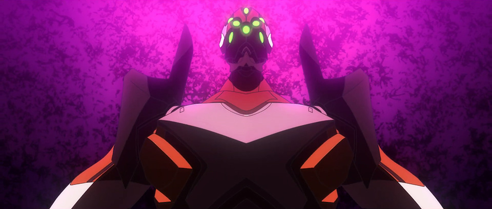</figure>
<figure>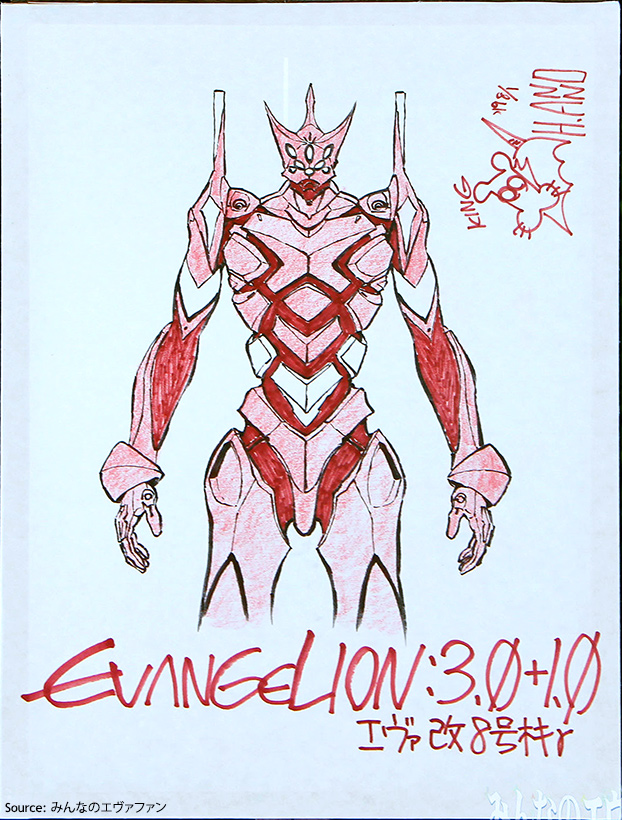</figure>
This shot feels like it’s from the same general part of the film as Eva-02’s initial drop into the swarming Failures of Infinity. Compare this to the later drop into the Chamber, where Eva-08 has clearly undergone yet another upgrade. Lucky for us, the plastic model by Kotobukiya has already been revealed (<a href="https://www.evastore.jp/products/detail/14684" rel="noopener" target="_blank"><u>Evastore page</u></a>), giving us a much better look at the upgrades, along with features of Eva-08'γ that weren't previously apparent.  
<figure>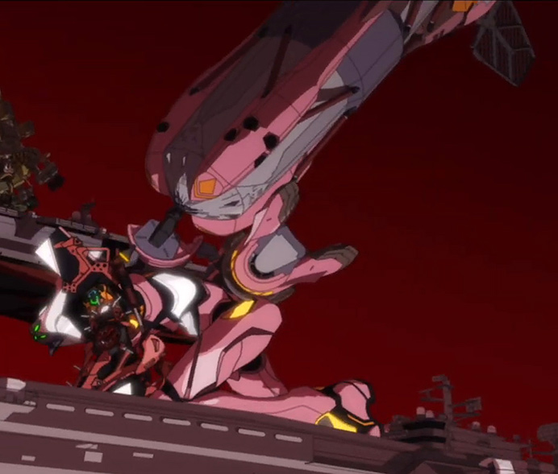</figure>
<figure>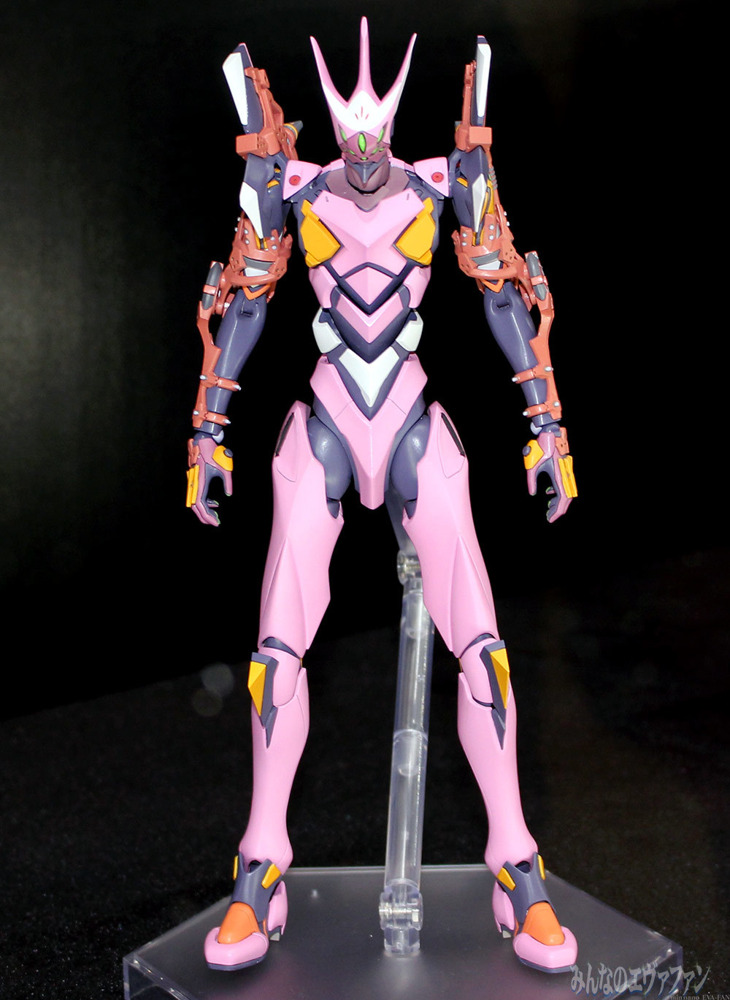</figure>
<figure>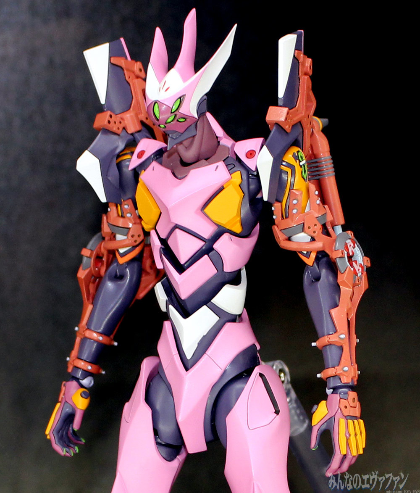</figure>
(Excellent photos are from <a href="https://eva-fan.com/blog-entry-6581.html" rel="noopener" target="_blank">,<u>Minna no EvaFan</u></a>.) 

Mari's plug interior during the "Drop into Guf" scene provides some enigmatic specifications on Eva-08's upgraded setup. The full readout isn't visible until trailer #4, so I'm just going to steal it from there. 
<figure></figure>
"IRUL", huh? Well... <em>that</em> doesn't feel uncomfortably familiar or anything... <em>Ahem</em>. Anyway. I'd assume that the "I" stands for "Improved" here, rather than "Improvised" (as in Eva-08β-ICC, the configuration from <em>Shin</em>'s opening scene), to account for the 改 (kai). I couldn't really hazard a good guess on the remaining three letters, though. 

The arm braces-looking things are described in the Kotobukiya figure write-up as, literally, "joints for armament retention support". <strong>BlueBasilisk</strong> suggested that this just means they're weapon mounts; and the figure apparently has some armaments included with it that won't be revealed until the film is released, so that sounds about right. My mind immediately envisioned something along the lines of the shoulder-mounted positron rifle from NGE, so maybe it'll be kind of like that, only way cooler and Mari gets to use two at the same time. Note that the silver studs on the figure actually appear as thin cylinders in the trailer, though whether this is an actual design discrepancy, or these are some kind of retractable or shape-changing pins, remains to be seen.
<figure></figure>
The Kotobukiya figure also gives a good look at 08γ's deltoid decal, which is much different from any other deltoid decal we’ve seen so far. The design raises all sorts of weird questions. The “8” looking like a keyhole with a turned key inside it is some blunt foreshadowing if I ever saw any, but foreshadowing <em>what</em>, exactly? Mari having some sort of integral role in Final Impact, I would assume. Strangely, in the trailer, the "key" is not present -- very mysterious. There's also a vague black shape behind the "8" but my associates and I haven't been able to make much sense of it. Broken down into its components, it's a trapezoid with one big arrowhead and two little arrowheads coming out of it, which means... I dunno. It also seems slightly anchor-like, but that's not a very useful description either.

The gigantic thing on 08’s back was truly perplexing to me at first, but after <strong>BlueBasilisk</strong> caught that “Hakone Express 1” was written on it, 
<figure></figure>
everything quickly came together. The two Evas have Wunder’s assistance when “crossing over” the first time, but what about when they need to return? Well, they’ve prepared for that! The Hakone Express looks like it’s a three-stage rocket of some sort, formed by connecting three identical modules; and its very name implies it’s to be used to get the pilots back home. (Hakone is where Tokyo-3 was built.) Since only Eva-08 is equipped with any such means (there's no Hakone Express 2, as far as we know), presumably the rocket would be employed when the Evas are in "overlapped" form. Meaning, they're saving their Fusion Dance for the fight against our Big Bad, #13. But one thing I gotta ask is… that rocket’s freely detachable, right? Like, they’re not planning to actually fight 13 with that thing weighing 08 (or 8+2) down, are they? ...<em>Are</em> they??

The Express attaches to Eva-08's back around where an umbilical cable would go. This base piece that joins to the back seems to be attached to another smaller piece that fits over the Eva's sacrum. What's that for? It's got four nozzles, so maybe it provides propulsion of some sort, but... What's that supposed to accomplish that strapping a ginormous rocket to an Eva can't? Does it kick in after the last rocket burns off its fuel and drops off, or something? "We just barely made our way out of the Gates before they closed on us, courtesy of this weaksauce ass blaster!"
<figure></figure>
On a final note: like just about every other power-up they've shown off for Wille's Evas so far, Eva-08's arm doodads and the Hakone Express were among the items visible in the Paris storage buildings.
<figure></figure>
<figure></figure>
<figure></figure>

I said back in part #1 that I'd be taking another look at the white plugsuits later, so here we are! In hindsight, I probably should have just gotten it over with then... Oh well.
<figure></figure>
<figure></figure>
So here we get to see the colors that the rainbow gradients settled into. Khara’s twitter provided full model sheets anyway, so that makes things easier. 
<figure>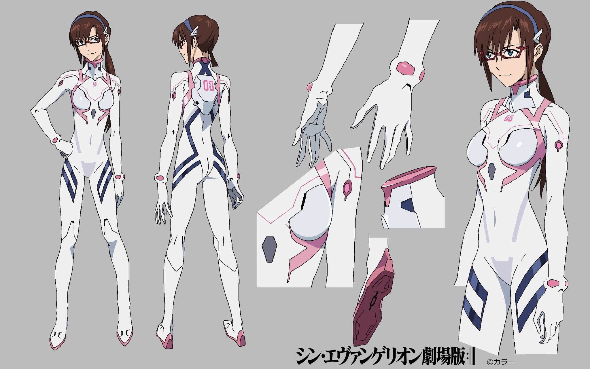</figure>
<figure>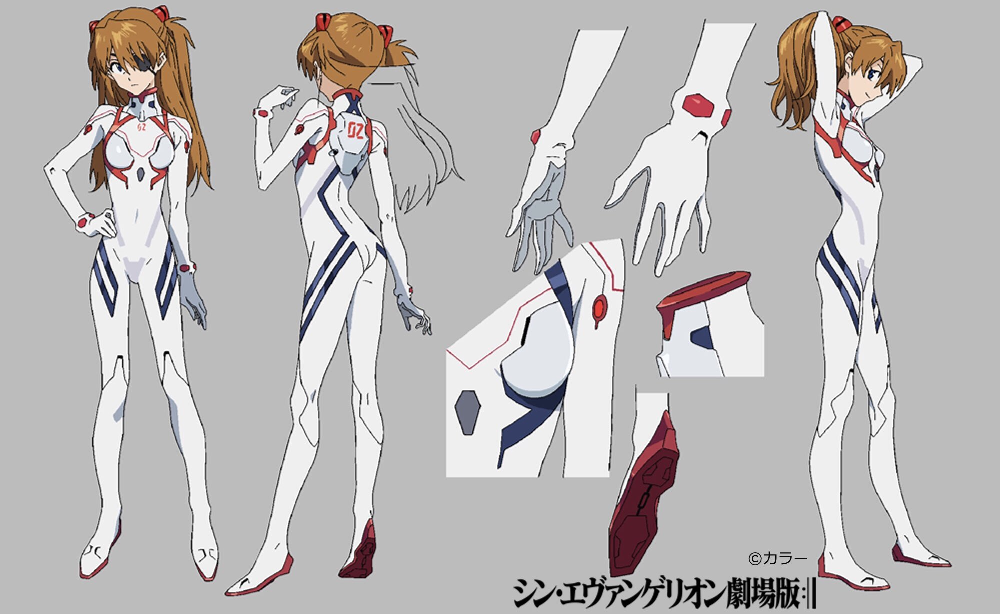</figure>
Asuka’s stripes are red and blue, while Mari’s are pink and blue. There’s no “core”, which feels quite odd. Asuka finally got one on her plugsuit in <em>Q</em> after mysteriously never having one, and now she's right back to zero; Mari is now missing one after having the feature from the start. They also, curiously, eliminate any kind of projection along the ribs. Both alterations bring these plugsuits more in line with the anti-L Barrier hazmat suits (yes, that's what they're officially called) we saw in the opening scene. Weird, suspicious changes, and plainly deliberate, but I couldn't begin to guess what they might mean. 

These suits also go back the original collar type, from the very first movie (and the TV show). So, since the plugsuits are white, that means we're getting part of Rei 2's original plugsuit recycled. I suppose the reason for this will become clear with time. Other fans have happily pointed out the gray areas on the suit that accentuate the hips and groin. (Service all the way to the end, indeed.) I wonder if this has anything to do with the similar <a href="https://static.wixstatic.com/media/87d07b_c89c96ee9da644558a8c71eae2efacd0~mv2.jpg" rel="noopener" target="_blank"><u>strange groin features</u></a> the female hazmat suits have. 

While we have the model sheets out for comparison, I might as well point out something silly I noticed. Remember that dark plugsuit Mari is wearing in trailer #2?
<figure></figure>
Turns out it was just her white plugsuit, recolored to hide it before the trailer #3 reveal. You can actually see part of the original color left untouched (whoops!) to the right of her twin tail. The "X" on the nape of her neck and the old school plugsuit collar are also evident.  

I was supposed to wrap the trailer #3 treatment with this post, but since I'm already overdue for an update, I suppose this will have to suffice for now. <strong>Next time</strong>, though... if I still can't manage to get through the rest, I--!!! 

...Well, I guess that just means you end up with more quality <em>Eva</em>-related reading material. Could be worse. 
