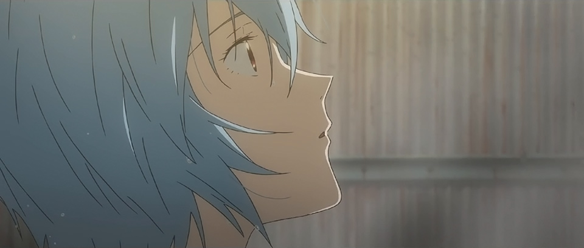
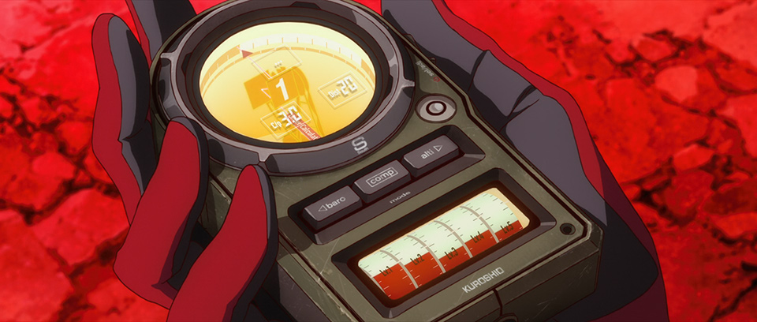
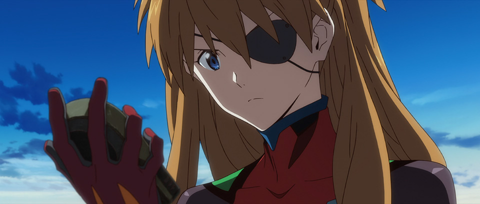
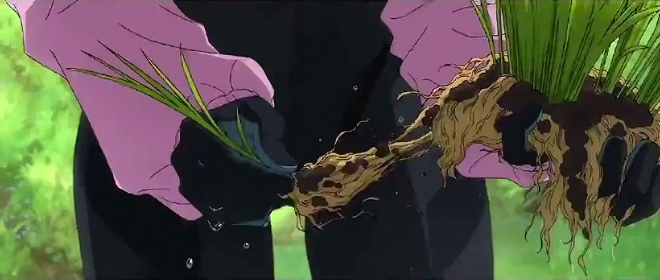
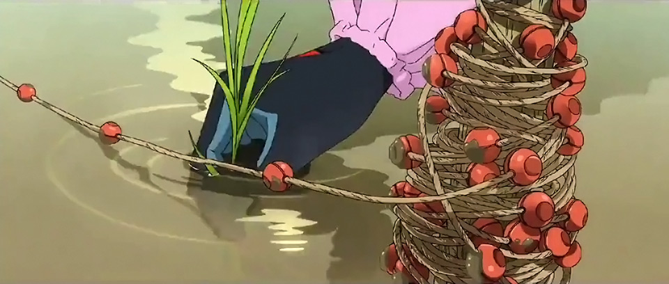
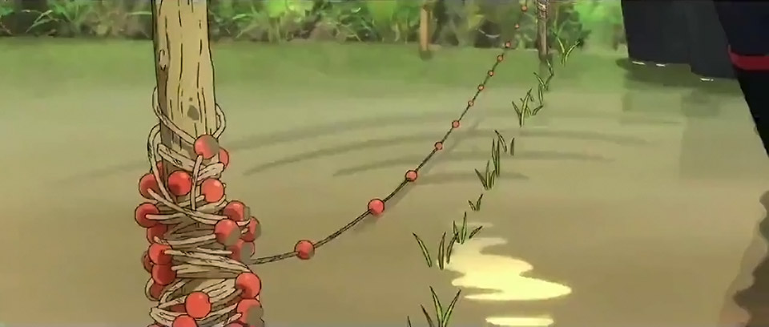
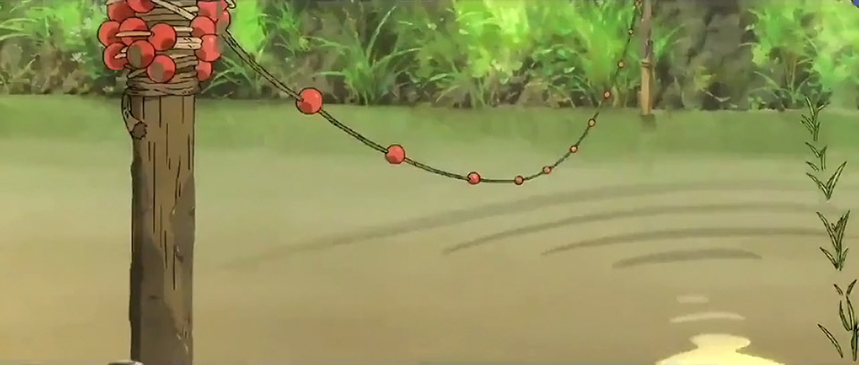
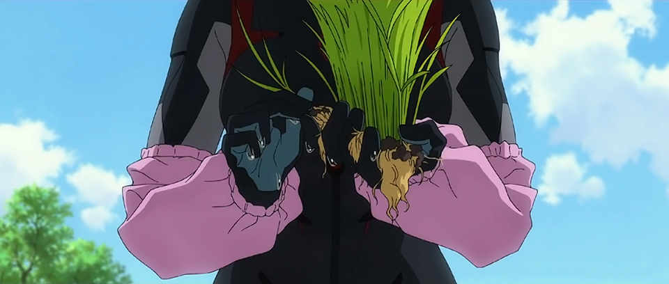
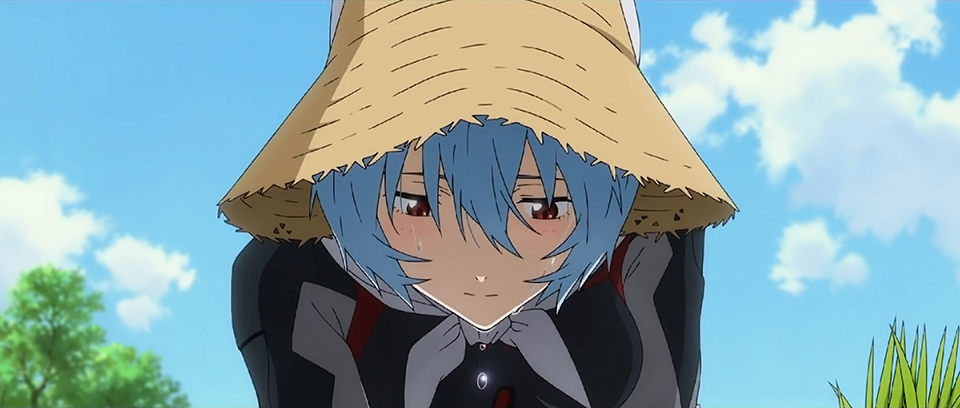

# Eva3.0+1.0 Translation Pt.1-A

## Summary

SPOILERS FOR EVA: 3.0+1.0. Translated closed captions matched to audio description. Section complete.

## Content

<strong>THIS IS YOUR LAST WARNING: </strong>

<strong>SPOILERS LIE AHEAD.</strong>

<u>Introduction &amp; Disclaimers</u>

<strong>Part 1A (You're There!</strong> - Complete<strong>)</strong>

<a href="https://www.arqacrypha.net/post/eva-3-0-1-0-cc-ad-translation-pt-1" rel="noopener" target="_blank"><u>Part 1B (Complete!)</u></a>
<a href="https://www.arqacrypha.net/post/eva-3-0-1-0-cc-ad-translation-pt-2-a" target="_blank"><u>Part 2-A (Incomplete)</u></a>
<a href="https://www.arqacrypha.net/post/eva-3-0-1-0-cc-ad-translation-pt-2" target="_blank"><u>Part 2-B (Incomplete)</u></a>
<a href="https://www.arqacrypha.net/post/eva-3-0-1-0-cc-ad-translation-pt-3" rel="noopener" target="_blank"><u>Part 3 (Complete!)</u></a>
<a href="https://www.arqacrypha.net/post/eva-3-0-1-0-cc-ad-translation-pt-4" rel="noopener" target="_blank"><u>Part 4 (Incomplete)</u></a> 

<u>Paris Assault Mission</u> 

<u>Boss Battle</u> 

<u>Traveling the Red Wastes</u> 

<u>Welcome to Village-3</u> 

<u>Dinner at the Suzuharas'</u> 

<u>"Look-alike" Meets Tsubame</u> 

<u>Catching Up With Kensuke ~ Trauma</u>

<u>"Goodnight" ~ "Good morning"</u> 

<u>First Day on the Job</u> 

<u>Extended Notes</u> 

<h3><strong>Introduction &amp; Disclaimers</strong></h3>

What you will find here is my own attempt to translate the Closed Captions and Audio Description for <em>Evangelion:3.0+1.0 Thrice Upon a Time</em>, or <em>Shin Evangelion Gekijouban</em>. (Closed Captions are the dialogue, select sound effects and music cues, and so forth. Audio Description is a spoken narration of what's happening on-screen. They're intended for the hearing- and visually impaired, respectively.)  Originally I started off just doing the CCs, but eventually I got restless and started digging into the AD as well. The four sub-pages are intended to mimic the four-part division of the film, but I'm just guessing how it's divided, and am therefore not using any official terminology (A-Part, B-Part, etc.) for my tentative quartering. 

Three of the sections are still incomplete, alas. This project gives me good motivation to get some much-needed practice in, so I'll continue to work toward its completion until it's either done or the movie reaches us <em>gaijin</em>. Please note that I am not fluent, so, while I do the best I can to be accurate, silly mistakes will happen. Full disclaimer that I do make use of machine tools, but <em>as</em> tools; I don't rely 100% on them. There are those who snub their nose at any novice efforts and think that nothing is better than something, while forgetting that "nothing" doesn't exist in this day and age. People will simply put blind trust in machines to quickly get what they want. For that reason, I make no apologies for the existence of these pages. The human oversight makes a very obvious difference in quality and reliability, <em>and</em> I'm getting better in the process.

The original CC and AD files were obtained (very cleverly and illicitly) by individuals who wish to not be named. Many thanks to their hard work getting us this information early. I've attempted to sync the CCs and AD with one another, and the timing -- provided here in 30-second increments -- should be generally accurate in a relative kind of way. The time stamps won't line up with the film itself, but they still show how things are spaced out, hence "relative". 

An initial AD transcription was obtained using YouTube (heh) and I've been cleaning it up as I go along. <a href="https://www.youtube.com/watch?v=aWGoquYI3X0" rel="noopener" target="_blank">,<u>You may find the AD with WIP transcription here</u></a>. I'll try to provide my cleaned-up transcription of the closed captions at some point. (Needs a bit of formatting done to it.) 

Due to my <strong>DANGEROUS</strong> LEVELS OF NON-PROFESSIONAL INEPTITUDE (lol), I'll try to note where I'm especially unsure about something and provide the raw Japanese as reference. Don't hesitate to inform me if you see an error.

<strong>Screenshot sources</strong>: theatrical booklet; Avant 1 &amp; 2 preview; teasers 2 and 3; main trailer; post-release trailers A and B; various TV spots; character promo reels; "Farewell, All Evangelion" NHK documentary (extended ver.); <em>Evangelion Extra</em> app making-of clips and promo stills; clear file and post card sets; "Now on Evangelion" promo. (Plus some illicit audience photography here and there.)

<strong>Free to use for individual personal use</strong> (including casual discussion).<strong> Providing credit and linking back</strong> are greatly appreciated, as I'm a little-known blog.<strong> Please ask before incorporating into fansubs or anything of a mass distribution nature.</strong>

Time Stamps (Approximate), Closed Caption File #

Audio Description
Personal Notes

Closed Captions (Dialogue) 

<em>Closed Captions (Sound Effects)</em>

<strong>↓ </strong>(down arrow) = in-page link to extended notes

[<strong>NOTE:</strong> Avant 1 may feel so old by now that a reassessment of its dialogue is probably not at the top of everyone's minds. However, as far as I'm aware, fans have never produced a translation for it completely from scratch based on the original Japanese. (It's... complicated.) So, here, I've revisited that old group effort from summer 2019 at EGF (which, at the time, I cleaned up to the best of my ability and added to the EvaGeeks Wiki). There are some old mistakes in there I'm not too proud of, so I've fixed those, along with making countless other adjustments. Hopefully the following section will provide some fresh insight into this sequence for English-speaking fans.]

[00:02:09, 102]

(Mari singing over comms)

(♪) <em>This life we lead is a long way up,</em>

<em>       but it's not about the length. If you...</em>

(Toei)

(♪) ...<em>lived the straight road of truth, then..</em>

[<strong>NOTE</strong>: Here, Mari is singing "<em>Shinjitsu Ichiro no March</em>", or "The Straight Road of Truth March", by Kiyoko Suizenji. (Same artist responsible for "The 365-Step March" that Mari sings at the beginning of <em>Ha</em>.) A little more information plus a full translation of the song <a href="http://kayokyokuplus.blogspot.com/2017/02/kiyoko-suizenji-shinjitsu-ichiro-no.html" rel="noopener" target="_blank">,<u>here</u></a>.] 

(khara, Inc.)

(A completely red Eiffel Tower seen from directly below.)

[00:02:30, 105]

<strong>Aoba (comms):</strong>

Paris Assault fleet is shipshape.

Currently descending to Point Zero of the inner city.

[<strong>NOTE</strong>: Paris IRL does have a geographical marking called "Point Zero", but it's outside Notre Dame Cathedral, not next to the Arc of Triumph.]

<strong>Nagara (comms): </strong>

All ships, assume a defensive position.

Slowly go astern.

Gravity control, autonomous behavior, and remote operations: all clear.

<strong>Hyuga (comms):</strong>

The skies over Paris are clear all around.

Status of the surface: category 6 core-conversion.

<strong>Kitakami:</strong>

Verifying our ship's spatial coordinates.

It's reached the operation's starting point.

<strong>Ritsuko:</strong>

Roger.

Deploy the fleet in alert mode.

(A vertically long cluster drops down at a perpendicular. 

It opens like an umbrella unfolding upside-down.

At that point, eight large-scale warships disperse, moving horizontally.) 

[00:03:01, 112]

<strong>Nagara (comms):</strong>

Switching fleet's formation to alert mode.

Eva-08 and DSRV now descending to objective point.

(The fleet, lined up end to end, revolves above the cityscape.)

<strong>Mari (comms):</strong>

(♪) <em>Tambourine!</em>

<em>Tambourine, tambourine!</em>

[<strong>NOTE</strong>: This is still "The Straight Road of Truth March".] 

(Eva-08, suspended at the center of a [mechanical] ring, 

unloads a submersible vessel-like transport onto the apex of a giant black pillar.)

<strong>Mari (comms):</strong>

(♪) <em>Tambouriiiiiine!</em>

<strong>Crewman B:</strong>

Landing pad anchors, normal.

[<strong>NOTE</strong>: "Landing pad anchors" is literally "foot component adhesion system" (脚部吸着システム).]

<strong>Crewman C:</strong>

Hull has locked into position.

<strong>Ibuki:</strong>

The DSRV has landed.

Analyzing the atmospheric composition...

CO² is tolerable.

We can stay here.

[00:03:31, 121]

<strong>Ritsuko:</strong>

Roger. Let's start the mission.

(Ritsuko, wearing a green protective suit, alights [from the transport] and goes all the way to the pillar's edge.

Under the blue sky, the Eiffel Tower and the whole downtown area are discolored by core-conversion.)

<strong>Ritsuko:</strong>

It's been 16 years since I was here last.

Look at what's become of the famous City of Light...

It breaks my heart.

[<strong>NOTE</strong>: Ritsuko actually calls it "<em>Hana no Miyako</em>" (花の都), literally "The Flower Capital", but <em>hana</em> here is probably in its 華やか sense -- "showy", "gaudy", or -- to use some old-timey language -- "gay". I wonder if "<em>Hana no Miyako</em>" comes from the old nickname "Gay Paris" (pronounced "Gay Paree").]

<em>{Warning Sound}</em>

<strong>Ritsuko:</strong>

The L-Barrier density is higher than we predicted.

The operation to restore Nerv EU Sealing Pillar No. 1 must be completed within 720 seconds, starting now.

[00:04:00, 128]

(The crew attach cables to the pillar and operate on their PCs.)

<strong>Crewman A:</strong>

The hell? 

That's 180 seconds less than planned!

<strong>Crewman B:</strong>

Does that even give us time to return to base?

(Kitakami, also suited up.)

<strong>Kitakami:</strong>

But seriously, only the Eva pilots should have to wear these awful things.

(Her figure is accentuated.) 

<strong>Ibuki:</strong>

Shut your yap and get to work!

(There's a hand-written message on the hatch of the pillar.)

<strong>Ibuki:</strong>

Well? Think we'll be able to activate the Anti-L System?

<strong>Crewman A: </strong>

Yes. We should be able to redo stages 4 and up.

[<strong>NOTE:</strong> Yes, that's the English word "redo". Anno's not at his most subtle here...]

<strong>Ibuki:</strong>

Thanks to our predecessors.

([The message] reads, "Take care of the rest".)

<strong>Ibuki:</strong>

We will uphold your wish to save the city.

(Ibuki presses her hands together.)

[00:04:30, 137]

<strong>Ibuki:</strong>

Let's get to work.

(They start the program.)

<em>{Electronic sounds}</em>

(Glowing specks appear in the distant sky.)

<strong>Kitamari:</strong>

Here they come!

Aerial specialization type, identified as Eva 44A.

Closing in at 4 o'clock!

(A huge number of enemies.)

<strong>Ritsuko:</strong>

Such a splendid single line formation.

(A vast swath of them stretches out [into the distance].)

<strong>Ritsuko:</strong>

Organizing into a colony all on their own...

They've already become a new organism.

 

[<strong>NOTE:</strong> "Colony" is 群体 (<em>guntai</em>), i.e. in a biological sense.]

<strong>Ritsuko:</strong>

I need you to intercept, Mari.

Buy us 560 more seconds.

<strong>Mari:</strong>

Yes, ma'am!<u>↓</u> 

I'll draw off all the 44A straightaway!

Alright, Nagara and the team, <u>↓</u> 

my wire stunts are in your hands! 

[<strong>NOTE</strong>: You might remember the subs having her refer to "cable flight" here. The term Mari uses is 操演 (<em>souen</em>), which refers to practical effects like pyrotechnics and wire stunts. So I decided to step out of the way and let Mari do her fourth wall breaking unimpeded.]

(Eva-08 gets pulled high into the sky.) 

[00:05:00, 147]

<strong>Mari:</strong>

Well, well, well...! (♪)

(The bespectacled Mari in her pink plugsuit, making her Eva -- suspended inside its ring -- rotate in all directions.)

<strong>Mari:</strong>

Yaw, roll, pitch...

[<strong>NOTE</strong>: This is aircraft lingo, referring to three rotational axes, with relation to the nose of the plane. Yaw is left-right (horizontal) rotation, roll is exactly what it sounds like, and pitch is up-down (vertical) rotation. <a href="https://en.wikipedia.org/wiki/Aircraft_principal_axes" rel="noopener" target="_blank">,<u>More here</u></a>.]

<strong>Mari:</strong>

It's interesting, but... this setup just feels plain off.

Wish they'd at <em>least</em> stuck with a humanoid motion range!

(Mari twists her body.

The autocannons on both arms emit muzzle flashes.)

<strong>Mari:</strong>

<em>*battle cry*</em>

<em>{Rapid-firing}</em>

(The enemy units detonate one after another.)

<em>{Explosions}</em>

[00:05:25, 153]

<strong>Kitakami:</strong>

Eva-08 currently engaged in hostilities with first wave of 44As.

Second wave has been detected.

As planned, all 44As are focused on Eva-08.

420 seconds remaining for the operation.

(The crew atop the pillar, still tapping away on their keyboards.)

<strong>Crewman A:</strong>

This is taking forever, Chief.

It's like working on an 8-bit computer.

<strong>Ibuki:</strong>

Same as the Evas, it's a non-human, unknown, and unexplained system.

It can't be controlled with our language easily.

[<strong>NOTE</strong>: Non-human as in a non-human sapience (人外,<em> jingai</em>). Meaning, the tech behind the Evas and the sealing pillars is "non-human" (non-Lilin) in origin. Not much of a revelation with Gendo's infodumps later, but this was a pretty big deal before the full movie came out.] 

<strong>Crewman B:</strong>

Stage 4's been cleared. 

We're way behind schedule.

<strong>Ibuki:</strong>

Stay calm but step it up.

<strong>Crewmen:</strong>

Yes, ma'am.

<strong>Mari: </strong>

<em>*battle cry*</em>

(Mari in the sky.) 

[00:05:58, 165]

<strong>Mari:</strong>

Maintain speed. Plus 20 to guiding.

Keep the current tilt. <u>↓</u> 

Forward ho! 

(She swings backwards.)

<em>{Rapid-firing}</em>

<strong>Mari:</strong>

Get back here!

(She turns the steering wheel. Eva-08 spins around repeatedly as it hangs in midair.)

<em>{Rapid-firing}</em>

<strong>Mari:</strong>

<em>Urrrgh!</em>

(Both arms outstretched, Eva-08 rapid-fires left and right.) 

<em>{Rapid-firing}</em>

<strong>Mari:</strong>

<em>Nya-nya-nyaa!</em> A<em>-HA!</em>

[<strong>NOTE</strong>: "<em>Nya-nya</em>" (にゃにゃ) is feline onomatopoeia, just as you'd think. Why is Mari using it as a refrain while she's killing things? I dunno, Mari is weird.]

<em>{Rapid-firing}</em>

<strong>Mari:</strong>

<em>Nya-nya-nya-nya-nyan! Nya-nya-nyaa!</em>

(The autocannons immaculately trace over the chain of enemy units.)

<em>{Rapid-firing}</em>

<strong>Mari:</strong>

<em>Nya-nya-nya, nya-nya-nya-nya-nyaa!</em>

(The bright red gun barrels melt down.)

<strong>Mari:</strong>

Whoops!

(Mari detaches the autocannons.

A building on the surface takes a direct hit.

A new enemy formation spirals around Mari.) 

[00:06:34, 177]

<strong>Mari:</strong>

The 4th wave, huh?

I'm outnumbered here.

As they say, "Many a small bird drive away a hawk."

(Top of the pillar.) 

<strong>Kitakami:</strong>

360 seconds remaining.

<strong>Crewman A:</strong>

This is bad! 

We haven't found the shortcut to stage 5.

<strong>Ibuki:</strong>

Don't give me that. Keep looking!

<strong>Crewman B:</strong>

We can't! 

There's not enough time to overwrite the data!

<strong>Ibuki:</strong>

"Can't", my rear end. 

Run more bypasses!

<strong>Crewman C:</strong>

But Chief, we don't have that long until...

[00:06:59, 185]

<strong>Ibuki:</strong>

Stop whining!

This is why I can't stand young guys.

(The sky.) 

<strong>Mari:</strong>

Hi there!

(Eva-08 charges into an enemy and punches it.

With one hand on the wheel, Mari steers backwards.) 

[<strong>NOTE</strong>: Several Mari vocalizations from the next 15 sec. of closed captions are omitted here.]

(While the weaponless Eva is swinging around, it indiscriminately delivers kicks to enemies.

Eva-08 moves around acrobatically.

Raising an arm, it smashes two enemy units.

Breezily it lands punches and chops on its foes.

It somersaults in front of the sun, then stomps on an enemy unit.) 

<strong>Mari:</strong>

<em>Heave-ho!</em>

(Together they fall to the surface, upon which Eva-08 is pulled up in a jiffy.)

<strong>Mari:</strong>

<em>Hah!</em>

<em>(Explosion}</em>

(The enemy unit releases a big explosion.) 

[00:07:28, 197]

(Mari is pursued by a crowd of enemies.

She seizes one of them, and skewers her pursuer on one of its companion's spears.) 

The enemy units successively thrust their spears into each other.)

<strong>Mari:</strong>

<em>*battle cry*</em>

(A rounded cluster is formed that Mari swings around in a wide arc.

Once she picks up enough momentum, she flings it.) 

<strong>Mari:</strong>

Bugger off, you stupid bastards!

[<strong>NOTE</strong>: If I was fluent in Brit, I would write <em>all</em> of Mari's lines accordingly. But alas...]

(The cluster of enemies blows apart as it rolls on the ground.) 

<em>{Explosions}</em>

(Bright light radiates from it, and it goes up in a giant ball of flame.)

<strong>Mari:</strong>

<em>Heh heh!</em>

That was too easy!

<em>{Warning sound}</em>

(There's a warning display on her monitor.)

<strong>Mari:</strong>

What's this...?

A pseudo-Angel using decoys?

You little devil!

[<strong>NOTE</strong>: You might remember my old mistranslation about "fake Angel lures". (I do apologize for that.) <a href="https://www.arqacrypha.net/post/eva-3-0-1-0-cc-ad-translation-pt-1#viewer-9tnot" rel="noopener" target="_blank">,<u>See here</u></a> for an explanation of this "pseudo-" business.] 

[00:07:58, 206]

(A camouflage cocoon is smashed open.

When the white wall tumbles down, 
<figure></figure>
the giant monster behind it is revealed.

It's accompanied by a horde of underlings.) 

<strong>Kitakami:</strong>

It's out! Time for the boss fight! <u>↓</u> 

(Ritsuko beholds this.) 

<strong>Ritsuko:</strong>

A military use of the Evas, forbidden by the Vatican Treaty.

A ground combat-type 4444C outfitted with a positron cannon, 

accompanied by 44Bs specialized for supplying power.

Unleashing them together like this... 

Deputy Commander Fuyutsuki must be testing us.

(The line-up of 44Bs stop walking.

Their generators vibrate, and bluish-white sparks begin to scatter.) 

<strong>Kitakami:</strong>

The 44Bs' high-energy levels are rising!

[00:08:31, 212]

<strong>Ritsuko: </strong>

All ships, shift to surface-to-surface defense. 

All hands, invoke anti-shock and -EM measures. 

(The revolving battleships all come together in unison.

They get in between the pillar and the hostiles, the bilges facing the enemy and the ships overlapping each other like the petals of a flower.) 

<strong>Kitakami:</strong>

The 4444C has entered firing stance.

44Bs, currently generating huge amounts of electricity.

Energy is being fed to the ultra-high voltage discharge system.

The entire 4444C power-feeding system is open! 

Positron acceleration system undergoing final phase.

Breechblock is closing! 

[00:09:03, 219]

(The laser receiver behind the aimed gun barrel takes on a glow.) 

<strong>Kitakami:</strong>

Incoming!

(The eyes of the 4444C Evas brighten, and the beams emitted by the surrounding 44Bs are collected by the sphere of the laser receiver.

The Evas' eyes flare up.

The barrel of the cannon releases a blinding light.) 

<em>{Cannon firing}</em>

(The warships take a direct hit.

One by one, the ships split in half and get blown away.

A hull and a turret fall onto part of downtown.

A triangular bow crashes into the Eiffel Tower,

and the smashed upper half comes tumbling down.) 

(Top of the pillar.)

[00:09:31, 221]

<strong>Kitakami, et al.:</strong>

<em>Uggghhhhh... </em>

(The scorching shockwave assails the crew.

The warship in the foreground is slowly being pushed toward the pillar.

Ritsuko, standing at full height, stares it down.

The ship's hull approaches right before her eyes.)

<strong>Mari:</strong>

<em>Hah!</em>

(Eva-08 does a flying kick.) 

<strong>Mari:</strong>

Made it just in time!

If they fire again, we're toast!

<strong>Kitakami:</strong>

44Bs' high-energy levels are rising again.

They're condensing electricity into their high-output power emitters!

(The 4444C demolishes the buildings around it to get a more stable foothold.) 

<em>{Smashing}</em>

[00:09:58, 227]

<strong>Kitakami:</strong>

Already?!

4444C has initiated particle acceleration. 

It's ready to fire!

We're screwed!

Second shot incoming!

<em>This is really, really bad!</em>

(While bumping the pointed top section against the ground, 

Eva-08 runs with the broken-off Eiffel Tower in its arms.)

<strong>Mari:</strong>

<em>Urrrrrggggh!</em>

Nagara, bridge crew -- a diversion please! 

<strong>Nagara (comms):</strong>

<em>Roger.</em>

(The mother ship in the sky above manipulates the support wires.

A warship that was lying on the ground is pulled up,

and it's sent flying toward the enemy.

The 4444C knocks the warship away with a tentacle.) 

<strong>Mari:</strong>

<em>*battle cry*</em>

(And then, Eva-08 appears from behind the ship.

The 4444C just barely evades the Eiffel Tower thrusting toward it,

binding Eva-08 within an octopus-like tentacle.) 

[00:10:34, 235]

<strong>Mari:</strong>

That's not gonna stop me!

(Eva-08 sprays gas from its arm nozzles.

Spinning around, it screws the pointy end of the Eiffel Tower into the 4444C's gun barrel.) 

<strong>Mari:</strong>

Excusez-moi Eiffel!

(The Eiffel Tower encroaches further and further.

The 4444C, its gun barrel destroyed, falls backwards to the ground.

The out-of-balance octopus tentacles sweep the line-up of 44Bs off their feet.

Eva-08 breaks away.

An enormous explosion surges out.)

[00:10:59, 239]

<strong>Kitakami: </strong>

4444C has gone completely silent.

30 seconds left to finish the operation!

<strong>Crewman C:</strong>

Now using C to analyze the algorithm.

<strong>Crewman B: </strong>

The final security lock has been deactivated!

Anti-L system, stage 5 completed!

<strong>Ibuki:</strong>

It's activating, XO-sempai!

(A red pattern appears on the black pillar.

The shaft of the pillar extends up.

Light radiates from the pillar's surface, creating a ring that expands into the surrounding area.

The red city regains its original colors.)  

<strong>Kitakami:</strong>

Paris' inner-city area has been restored. 

All cryosystems within the Nerv EU facilities are rebooting. 

Systems now online. 

[<strong>NOTE:</strong> Yes, "cryo-" as in cold storage. You can actually see a fine mist in the background after the storage lockers rise up. Why all of that shit needed to be literally frozen, I have no idea.]

(One after another, buildings gradually rise out of the ground.

Nerv facilities appear from beneath the surface, forcing the buildings above them upwards and reconfiguring into skyscrapers.) 

Aerial view of Paris' inner city. 

The Nerv facilities tower like castle walls alongside the decoreified Seine River.) 

[<strong>NOTE</strong>: Despite what the AD seems to be claiming here, the Seine was at no point turned into core.]

(The monitor display shows the countdown stopped with 11 seconds remaining.) 

<strong>Kitakami:</strong>

<em>*sigh*</em>

(Kitakami lets her head hang. 

Ritsuko walks up to the skyward-gazing Ibuki.) 

[00:11:57, 249]

<strong>Ritsuko:</strong>

Good work, Maya.

That was a close shave.

(She raises her face shield.) 

<strong>Ritsuko:</strong>

Mission complete.

Misato, head on down for the pickup.

[<strong>NOTE</strong>: Ritsuko actually says 「カチコミ完了」 ("<em>Kachikomi kanryou</em>"), which means something closer to "break-in complete". As explained <a href="https://meaning-words.com/1540" rel="noopener" target="_blank">,<u>here</u></a>, "<em>kachikomi</em>" is an organized crime term referring to a raid on a rival yakuza gang and/or their facilities.]

<strong>Misato (comms):</strong>

<em>Roger.</em>

<em>Now descending to the supply point.</em>

<strong>Aoba (comms):</strong>

<em>All hands, prepare for supply transfer.</em>

<em>Spare parts and munitions for the Evas take highest priority. </em>

<strong>Hyuga (comms):</strong>

<em>Lower all dedicated supply ships. </em>

<em>Lead with the aircraft carriers. Hurry! </em>

<strong>Ibuki (comms):</strong>

<em>Scrape together the parts we need for rebuilding Eva-02 -- every last one! </em><u>↓</u> 

<strong>Mari:</strong>

Whatever gets the job done.<u>↓</u> 

(Mari in Eva-08.) 

[00:12:24, 260]

<strong>Mari:</strong>

With this haul, we can rebuild Eva-02 using cannibalized parts <u>↓</u> 

<em>and</em> upgrade Eva-08 to an overlapping-capable model.

[<strong>NOTE</strong>: "Overlapping" is the actual English word, and, as you may already know, it's a shameless reference to one variety of multi-Ultra fusion observed in<em> Ultraman.</em> Knowing the reference in advance doesn't really prepare the audience much for what's coming, though.]

[00:12:32, 262]
<figure></figure>
<strong>Mari:</strong>

Wherever you are, I'll come get you.

Just hold tight, Puppy Boy.

***

(Title: "Shin Evangelion Movie Edition")

(A core-converted industrial district.

A circular, hollowed-out mass towers high into the sky.

♪～ ["Tema Principale: Orchestra Dedicata Ai Maestri" starts.]

Shinji walks, hanging his head, against a backdrop of smokestacks. 

Other-Rei and Asuka walk ahead of him.<u>↓</u> 

The trio advances through an empty town.)

[00:12:58]

(A headless, fallen humanoid giant protrudes from behind red-hued houses.

Twilight dims the looming wasteland. The trio traverses a railroad crossing.

High-voltage wires stretching toward the top of a cliff. Humanoid bodies tower next to the steel towers. 
<figure></figure>
The trio proceeding along a country road. Giant arms are sticking into the crop fields bordering the utility poles.

TV antennae turned reddish-brown. 

Bicycles lying in a heap.

A labyrinthine expressway.)

[00:13:33]
<figure></figure>
<figure></figure>
(Asuka looks at a digital compass, 
<figure></figure>
then gazes into the distance with her black eyepatch-wearing visage. 

Within the soft light shining through a break in the clouds, trucks, automobiles, etc., mixed with countless bits of debris are floating lazily in midair. 

Asuka and Other-Rei pass beneath an expressway overpass. Alone, Shinji lags behind them.)

[00:13:57, 265]

(Doused in the evening sun, a road closure barricade casts shadows onto a pedestrian crossing.

Night. A giant arm rises high over crushed utility poles. 

Shinji sits around, a vending machine behind him.

A numerical value ticks down on the wrist energy monitor.

♪～ ["Tema Principale: Orchestra Dedicata Ai Maestri" ends.]

Asuka approaches.

She puts her hand on his cheek and peers into his downcast face.)

<strong>Asuka:</strong>

Damned coward.

(A strong light overwhelms the darkness.)

<em>{Car approaching}</em>

(The illuminated Asuka and Other-Rei turn around.)

[00:14:28, 268]

(A car with its headlights on. Someone in protective gear, their face obscured, alights from the vehicle.)

<strong>Man:</strong>

Sorry I'm late.

You okay, Ikari?

***

(Shinji opens his eyes.)
<figure></figure>
<strong>Shinji:</strong>

<em>*gasp*</em>

(A dog and a child are looking down at him.) 

<em>{Dog barking}</em>

<strong>Boy:</strong> 

Ah...

<strong>Man:</strong>

Hey! Don't let dogs in there!

<strong>Boy:</strong>

Ah?

(The nearby curtain opens and a man in a white gown comes through.) 

<strong>Boy: </strong>

Ah?

<em>{Dog barking}</em>
<figure></figure>
<strong>Toji:</strong>

Nice, so you're awake.

You recognize me, doncha?

I'm Toji. Suzuhara Toji.

It's been forever, Shinji. 

[00:14:58, 278]

<strong>Toji:</strong>

I freaked out when you were brought in. 

I heard some stuff about what happened, but the whole thing was pretty weird. Kinda over my head.
<figure></figure>
Anywho, glad you seem in the clear.
<figure></figure>
So, think you can move already?

(He turns off his penlight.
<figure></figure>
Eight beds or so are arranged in a warehouse-like space with a high ceiling.) 

<strong>Shinji:</strong>

<em>*grunt*</em>

<strong>Toji:</strong>

Guess you can.

In that case, let's head to my place.

You must be starving. 

(He has Shinji put on a jacket.)

<strong>Toji:</strong>

It's kinda nippy outside, and all. 

(Other-Rei is beside him.)

<strong>Nurse:</strong>

Doctor, she doesn't seem to want to change her clothes. 

([Other-Rei] has her eyes fixed on the dog.)

<strong>Toji:</strong>

Guess I'll just take her like she is, then.

<strong>Nurse:</strong>

We also seem to be very low on Tamiflu. 

[00:15:31, 288]

<strong>Toji:</strong>

Sure thing. I'll ask the Head of Distribution about it. 

Sorry, but I'm gonna have to call it a day.

Okay, let's go.

<em>{Door opening}</em>

(Shinji starts to walk, eyes still cast down.

He stops, turning his attention to the bright outdoors.)

<strong>Shinji:</strong>

Whoa...

(A lock disengages and the transport rail moves like it's drawing a circle.

Toji, Shinji, and Other-Rei in front of a railway turntable. 
<figure></figure>
They look out over a plaza where electric and steam trains are lined up [on the tracks].)

[00:15:59, 292]
<figure></figure>
<strong>Other-Rei:</strong>

This is a peculiar place. 

There are so many people. 

<strong>Toji:</strong>

What, you've never seen a crowd before?

This is one of the communities where survivors from all over have gathered.

Village-3. 

About a thousand people live here. 

Over there is a food distribution center. 

It operates three times a week on fixed days. 

<strong>Matsukata:</strong>

Good afternoon, Doctor. 

<strong>Toji:</strong>

Hey, Matsukata-san! Any day now, huh?

Don't push yourself too hard.

<strong>Matsukata:</strong>

Doctor, are those the two kids that Kredit left in your custody?

<strong>Toji:</strong>

Yeah, something like that.

I'm counting on you.

[<strong>NOTE</strong>: Second part is よろしゅっう頼むわ = よろしく頼む. No idea why Toji says this.]

<strong>Matsukata:</strong>

Sure thing.

Well, I'd better get going.

(A lady holding her baby belly takes her leave.)

[00:16:31, 303]

<strong>Toji:</strong>

Later.

<strong>Other-Rei:</strong>

What is "Kredit"?

<strong>Toji:</strong>

Kredit is an aid agency founded by Wille.

They don't just help with supplies, they also assist with commerce between our village and others. 

This place can't get by all on its own, you know. 
<figure></figure>
<strong>Other-Rei:</strong>

What is that?

Its morphology differs from a dog's. 

<strong>Toji:</strong>

Huh? 

It's a cat.
<figure></figure>
<strong>Other-Rei:</strong>

A cat?

<strong>Toji:</strong>

Your first time seeing a cat, too?

About ten of them live in their little haven under the cars. 

We've got both dogs <em>and</em> cats here. It's nice. 

***

[00:17:02, 315]

(Entranceway with doorplate and paging button.) 

<strong>Toji:</strong>

This is my place. It's old, but cozy.

I'm being privileged with my own house.

(Shinji loiters, expressionless.)

<em>{Door opening}</em>

<strong>Toji:</strong>

I'm home. 

Dinner will be ready soon. 

(House interior.

Toji goes up to the living room with a pot in his hand.)

<strong>Toji:</strong>

So lessee... 

(Other-Rei and an old man sit at a low table.) 

<strong>Toji:</strong>

Sorry for the hold-up. 

Go on and eat while it's hot. 

Shinji, aren't you hungry?

You should eat <em>some</em>thing. 
<figure></figure>
(He hugs his knees in a corner, motionless.)

[00:17:28, 322]

<strong>Toji:</strong>

Well, that's okay. 

Come on over whenever you're ready, alright?

<strong>Toji:</strong>

Well, let's dig in!

<strong>Dad: </strong>

Thanks for dinner!
<figure></figure>
(Other-Rei sips from a bowl.)

<strong>Toji:</strong>

What do you think? Good, right?

<strong>Other-Rei:</strong>

The feeling in my mouth is strange. 

It's soft and flaky. 

<strong>Toji:</strong>

Oh, that means it's "tasty". 

<strong>Dad:</strong>

My daughter prepares the food, after all.

<strong>Toji:</strong>

She really is the best wife in the world.

You're in for a surprise when you meet her.

(Shinji, staring at the floor.) 

<strong>Woman:</strong>

I'm home.

Sorry for being late.

(She's completely frozen.)

<strong>Toji:</strong>

Hey! Welcome back. 

We've been waiting.

[00:17:57, 331]

<strong>Toji:</strong>

Shinji, you know my wife?

She was the class rep.

(Hikari sits.) 

<strong>Hikari:</strong>

When I got your call, I couldn't believe it. 

Even though they're right here, it's like I'm still dreaming. 

It's been a while, Ikari-kun, Ayanami-san.

<strong>Other-Rei:</strong>

No, I'm not Ayanami. 

<strong>Toji:</strong>

Huh? You're not? Alright...

You're "Look-alike".

<strong>Hikari:</strong>

"Look-alike" she is. 

(Other-Rei's attention is grabbed by something Hikari is holding in her arms.) 

<em>{Crying}</em>

<strong>Other-Rei:</strong>

What is it? 

<strong>Toji:</strong>

Oh, that's our daughter Tsubame. 

Isn't she cute?

<strong>Other-Rei:</strong>

She is very small for a human. 

Why did you make her so small?

[00:18:29, 343]

<strong>Toji:</strong>

What, is this your first time seeing a baby, too?

<strong>Hikari:</strong>

They're very small when they're born. 

Babies grow, getting bigger and bigger. 

(Other-Rei tries poking the chubby face.
<figure></figure>
She stares with big, wide eyes.
<figure></figure>
Tsubame's tiny hand squeezes Other-Rei's finger in turn.)
<figure></figure>
<strong>Other-Rei:</strong>

This is "cute"? 

<strong>Toji:</strong>

Exactly! Isn't she cute?

She's our daughter, after all.

<em>{Tsubame crying}</em>

<strong>Hikari:</strong>

Ah, excuse me.

<strong>Hikari:</strong>

Did the loud voice scare you?

[00:18:58, 352]

<strong>Toji:</strong>

Sorry, Tsubame. 

Did I make you cry? 

<em>{Knocking on door}</em>

<strong>Toji:</strong>

Hey, the general has arrived.

[<strong>NOTE</strong>: Probably doesn't mean that Kensuke has the rank of general. 大将 (<em>taishou</em>) can be a familiar form of address between males. Not sure how to translate this ATM.]

(There's a young man in the garden just outside.)

<strong>Kensuke:</strong>

Sorry I'm late.

(He presents a 1.8L bottle.)

<strong>Toji &amp; Dad:</strong>

<em>No, no! </em>

<em>(Tsubame crying)</em>

<strong>Toji &amp; Dad:</strong>

<em>Shhhh! </em>

(Adjacent room.

Hikari is breast-feeding Tsubame.) 

<strong>Other-Rei:</strong>

What are you doing?

<strong>Hikari:</strong>

Babies drink milk and get bigger. 

(Other-Rei, watching from behind, touches the chest of her black plugsuit.)

(♪) <em>(Toji singing)</em>

<strong>Hikari:</strong>

<em>*chuckle*</em>

Look-alike, I don't think you're ready for that.

[00:19:30, 362]
<figure></figure>
<strong>Other-Rei:</strong>

I don't understand.

What would Ayanami Rei do?

<strong>Hikari:</strong>

You're different from Ayanami-san, aren't you?

So you should do whatever <em>you</em> want to<em>.</em>

<strong>Other-Rei:</strong>

It's alright if I'm different from her?

<strong>Toji:</strong>

(♪) "...not yet speaking of life..."

 [<strong>NOTE: </strong>This comes from the song "Jinsei wo katarazu" by Yoshida Takuro.]

(Living room. The young man turns his head to Shinji.)
<figure></figure>
<strong>Kensuke:</strong>

Long time no see, Ikari. 

It's Aida. Aida Kensuke.

<strong>Toji:</strong>

Yeah.

(Shinji, head hanging, moves slightly.) 

[00:19:57, 370]
<figure></figure>
<strong>Toji:</strong>

It's Kensuke. 

He's the one who saved you.

Went full survival nut and helped the two of us out a bunch, too. 

If it weren't for him, we'd have died out there early on. 

(Shinji, unresponsive.

Kensuke and Toji exchange glances. 

The old man places the bottle [on the table].)

<strong>Dad:</strong>

Shinji-kun, it's fine if you don't say anything, but eat the meal we've served. 

It's only courteous!

<strong>Toji: </strong>

Come on, Dad...

I shouldn't have made him come to dinner. 

Let's give him a break today. 

[00:20:26, 379]

<strong>Dad:</strong>

But Toji-kun, with food so precious, 

him not taking a single bite of his meal is rudeness gone too far. 

Right, Shinji-kun?

[<strong>NOTE</strong>: "Oyaji" ("Dad') here is Bunzaemon Horaki, Hikari's father. Interestingly, he speaks in the Kansai dialect, and in that respect he's more like his son-in-law than his own daughter!]

(The fusuma opens.) 

<strong>Hikari:</strong>

Father, you're going to wake Tsubame.

Well, let's clean up and lay the futons out. 

Here, sweetie. 

For Look-alike and Ikari-kun, too. 

<strong>Kensuke:</strong>

No, I'll take Ikari.

I think that would be for the best.

***

(Outside.

Starlight falls upon the ramshackle village.

Kensuke walks with his head lamp off.)

[00:20:55, 387]

<strong>Kensuke:</strong>

Toji and the class rep getting married really took me off guard. 

Back in middle school, they were always at each other's throats.

I guess Near Third Impact broke the ice,

and all the resulting hardship brought them together. 
<figure></figure>
Ikari... N3I wasn't <em>all</em> bad.<u>↓</u> 
<figure></figure>
(A pale celestial body undergoes high-speed rotation.

There's an icy glow behind it.

A high-voltage transmission tower hypnotically revolves in the night sky over the rice paddies.

A stone-strewn mountain road.

[Kensuke and Shinji] stop alongside a digger.)

[00:21:31, 392]

<strong>Kensuke:</strong>

Once we're over this incline, Ikari, we'll be just about there.

(A train rotates [in midair] alongside a watchtower.

Solar panels are lined up directly below.)
<figure></figure>
<strong>Kensuke:</strong>

Well, here we are. 

It's a DIY house built on top of an abandoned station. 

Please make yourself at home. 

There's a toilet inside that car. 

I'm gonna get some fuel, so you head on in.

***

(House interior.
<figure></figure>
Outside a bare-bones shower stall, Asuka is drinking water from a scoop.

Shinji stares fixedly.)

[00:21:58, 397]

<strong>Asuka:</strong>

<em>Hmmph! </em>

Seeing me in the nude doesn't make you even a little excited or embarrassed? 

<strong>[NOTE</strong>: I know this rendition is awful. I'll fix it.] 

(Shinji, expressionless. 

Asuka sets the scoop down.)

<strong>Asuka:</strong>

Good lord!

Ken-Ken sure has a thing for taking in the pesky ones. 

<strong>Kensuke: </strong>

I'm back. 

(Kensuke drapes a bath towel over Asuka.)

<strong>Kensuke:</strong>

Ah, my first guest. 

She's staying here for now, I imagine.

For various reasons, Shikinami can't show herself in the village.

<strong>Asuka:</strong>

Meh.

There's too many Lilin and they're just annoying. 

(There's a choker on Asuka's neck.) 

<strong>Shinji:</strong>

Ugh...

(Shinji having a flashback. Kaworu's choker explodes.)

<strong>Shinji:</strong>

<em>*retching*</em>  [for ~4 seconds]

(Clasping his mouth, Shinji collapses.)

[00:22:30, 409]

<strong>Asuka:</strong>

You'll only react to my DSS choker, huh?

***

(Floor being wiped with a cloth. 

Asuka with her back turned, playing on a game console.)

<strong>Asuka:</strong>

Ken-Ken, you're pampering him. 

Make him clean that up himself. 

<strong>Kensuke:</strong>

Ikari isn't eating right now. 

He can't do anything on his own.

Something really awful must have happened. 

That's how it always is, isn't it?

So then he closes himself off emotionally.

It's just the way he does things.

We should let him be. 

Because at best, even though he doesn't want to live, he doesn't just want to die either.

(Shinji, cowering.) 

[00:22:59, 418]
<figure></figure>
<strong>Kensuke:</strong>

Ikari, that's good enough for now. 

Meeting again like this is something really special. 

I'm here for you if you need me.

We're friends, after all. 
<figure></figure>
I'm glad you're alive, Ikari. 

***

(Toji's house.

Tsubame is sleeping.

In the adjacent room, Toji is tossing and turning in his sleep.)

<strong>Toji:</strong>

Sure thing...

Head of Distribution! 

Nothing for you to worry about...

(Hikari puts a cover over the futon.)

<strong>Hikari:</strong>

<em>*titters*</em>

Your efforts are appreciated every day.

Goodnight, dear. 

(Other-Rei watching.) 

<strong>Other-Rei:</strong>

What is "goodnight"? 

[00:23:29, 580]

<strong>Hikari:</strong>

Let's see... 

It's a magic word that lets everyone sleep well.

Goodnight, Look-alike.

***

(Kensuke's house.

Asuka turns over in bed. Her plugsuit is hanging to dry nearby.) 

<strong>Asuka:</strong>

Hmmm...

(Asuka is wearing a T-shirt.) 

<strong>Asuka:</strong>

<em>*sigh*</em>

(The undersides of her pale thighs are visible. Beyond them, a tiny pair of briefs peeks through.

When she lies prone, her bent-kneed legs swaying like pendulums, 
<figure></figure>
her right eye -- the one not covered by an eyepatch -- opens.)

[00:23:59, 432]

<strong>Asuka:</strong>

<em>*exhales*</em>

I'm fed up. 

So sick of pretending to be asleep. 

When will I be able to sleep for real?

(A workshop nearby.

Shinji is laying in a corner.)

<em>(Shinji's quavering voice)</em>

(He sheds tears in anguish. 

Kensuke behind him, checking in.

Kensuke's eyes close.)

***

(Utility poles silhouetted against the blue sky.

The morning sun shines down upon the village; a distant mountain belt is veiled in mist.
<figure></figure>
People stroll across the convoluted railway tracks.)

[00:24:28, 436]

(Kitchen at Toji's house.

Hikari with Tsubame on her back, standing before a pot.

Other-Rei drops by, wearing a padded kimono.)
<figure></figure>
<strong>Hikari:</strong>

Oh, good morning. 

<strong>Other-Rei:</strong>

What is "good morning"? 

<strong>Hikari:</strong>

Well... 

They're magic words so we can get through the day together. 

Good morning, Look-alike.
<figure></figure>
(Other-Rei stares blankly.)

***

<em>{Shutters opening}</em>
<figure></figure>
(Light pours into the darkness.

Shinji, curled up into a ball. Asuka looks down upon him.)

<strong>Asuka:</strong>

Ken-Ken gets up at 6AM, no matter what day it is. 

He's left for work already. 

Breakfast is over there. Go eat it!

(Rectangular rations.)

***
<figure></figure>
(Other-Rei at the terraced rice fields, wearing her plugsuit and a straw hat.) 

[00:25:00, 454]

<strong>Woman B:</strong>

She's got one skin-tight get-up, hasn't she?

<strong>Woman A:</strong>

This is Look-alike, the young lady the doctor's wife asked us to look after.

I told her we'd start today. 

<strong>Woman C (?):</strong>

"Look-alike"? Sounds like a name with a story behind it.

[<strong>NOTE</strong>: Shamefully borrowed from the sackboy/fefemess subs. I make it a point to avoid mindless mimicry as much as I can, but every so often it makes sense to concede defeat... Inspiration will strike later, perhaps.] 

<strong>Woman D: </strong>

Is it okay to let her on the team? 

<strong>Woman C:</strong>

As long as she does <em>some</em> kind of work, I say it's fine.

<strong>Other-Rei:</strong>

Work? If that's an order, then I shall. 

<strong>Woman A</strong>:

No "orders". It's just a job.

<strong>Other-Rei:</strong>

"Job"? What is that?

<strong>Woman B:</strong>

Whaddya mean, "what is that?"

<strong>Woman D:</strong>

Never thought about it...

<strong>Woman A:</strong>

Well, guess you'll have to sweat things out with us. 

[00:25:30, 476]
<figure></figure>
<strong>Other-Rei:</strong>

"Sweat it out"?

***
<figure></figure>
(In a rice paddy.)

<strong>Woman B:</strong>

With three fingers, gently now... 

Like that. Feel it go straight down, planting in deep.  
<figure></figure>
<figure></figure>
(Other-Rei pushes the seedling she's holding into the mud.) 

<strong>Woman B:</strong>

Don't hold it so tight. Simply guide it with your fingers. 

Well, I guess you just need more practice.
<figure></figure>
<figure></figure>
(The posts that determine the team's position are moved forward. 
<figure></figure>
Other-Rei separates a seedling from the seedbed.
<figure></figure>
Standing in a row with the ladies, she plants the seedling.)

<strong>Woman B:</strong>

You're taking too long.

Keep pace with the group. 

[00:25:57, 488]

<strong>Other-Rei:</strong>

Will do. 
<figure></figure>
<figure></figure>
(She takes and plants another seedling.

Sweat drips from her chin, which has a handkerchief tied under it.)
<figure></figure>
<strong>Other-Rei:</strong>

This is "sweating it out"? 
<figure></figure>
(As she takes a step forward, she loses her balance.) 

<strong>Other-Rei:</strong>

Ah...<em> ahhh</em>!
<figure></figure>
<figure></figure>
(She falls onto her backside and looks up at the blue sky.) 

<strong>Other-Rei:</strong>

Ahh... 

So this is a job. 

<em>*laughs*</em>

They were so hard to plant.

[<strong>NOTE</strong>: Not sure of context on the last one. Original is せっかく植えた.]
<figure></figure>
<strong>Woman A:</strong>

So it goes, I suppose.

Here, give me your hand.

***

<em>(The ladies' laughing voices)</em>

(Irrigation ditch.

The women wash off the rootstock in the clear water.)

[00:26:28, 504]

<strong>Woman A:</strong>

Good work, ladies.

We managed to meet our quota again today.

<strong>Girl:</strong>

It's your first day and you worked hard, so this is special. 

(The girl holds out the rootstock.) 

[<strong>NOTE</strong>: Rei 6 is being given a bundle of rice seedlings? Huh? I don't get it.]

<strong>Other-Rei:</strong>

What should I say at a time like this?

<strong>Girl (?):</strong>

"Thank you". 

<strong>Other-Rei:</strong>

Thank you...

<strong>Woman A:</strong>

Come on, we're all going to the bath. 

<strong>Other-Rei:</strong>

"Bath"? What is that? 

***

(Switchyard.
<figure></figure>
A bathhouse converted from a train. A fire is burning.)

<strong>Other-Rei:</strong>

So this is a bath. 

(Other-Rei's foot hangs above the steam-shrouded tub.)

[00:26:58, 520]

<strong>Woman A:</strong>

You don't want to leave your clothes on. 

(A basket in the bathhouse, holding the plugsuit and rootstock.

Other-Rei runs her hands over her slender legs, stretched out in the hot water.)

<strong>Other-Rei:</strong>

The "bath" is extraordinary.

Unlike LCL, it's pleasantly warm. 

(She looks up at the heavenly body [the Moon] in the night sky.]
<figure></figure>
<strong>Other-Rei:</strong>

I'm alive even though I have no orders... 

Why?

<strong>END OF PART 1-A
</strong>ONWARD TO PART 1-B?　<a href="https://www.arqacrypha.net/post/eva-3-0-1-0-cc-ad-translation-pt-1" rel="noopener" target="_self"><u>⇒</u></a>

<h3>Extended Notes</h3>

[00:04:52, 144] <strong>"Yes, ma'am!"</strong> Mari says 「合点でいっ！」 (<em>Gatten dei!</em>) here. I'm not completely sure what the "<em>dei</em>" part is -- modified form of だ (<em>da</em>)? -- but the "<em>gatten</em>" is interesting. This is the relatively idiosyncratic way that Sanson and Hanson answer Grandis' commands (so "Roger!", "Will do!", "Got it!", "Yes ma'am!", etc.) in <em>Nadia: The Secret of Blue Water</em>. People often comment upon the recycled bit of Mari animation here, while not noticing the other thing that's "recycled". In <em>Q</em>, when the shot is first used, Mari says 「合点承知！」(<em>"Gatten shouchi!"</em>), which is a slightly longer way to say the same basic thing as just "<em>Gatten!</em>" (and Grandis' lackeys use the "<em>Gatten shouchi</em>" form sometimes, too). On top of all that, Mari actually channels Sanson specifically in a number of ways. This isn't really the place to get into it, so <a href="https://twitter.com/ArqaApocrypha/status/1349113928991834112?s=20" rel="noopener" target="_blank">,<u>I'll leave you with a fun example</u></a>.

[00:04:56, 146] <strong>"Alright, Nagara and the team(...)"</strong> Mari is saying 長良っち, "<em>Nagara-'tchi</em>", a contracted form of "<em>Nagara-tachi</em>". Nagara is the helmswoman, and "<em>-tachi</em>" (a pluralizing suffix) is including any other relevant crew.

<u>Dumb trivia:</u> back when Avant 1 first premiered as "Operation 0706", there was a mad rush to throw together <em>some </em>form of subtitling. Nobody with true fluency stepped up to the plate fast enough, so some of us at EGF were basically trying to minimize the damage from people running the French subtitles through Google Translate. (God, it was <em>bad.</em>) My listening comprehension was, and still is, rather limited, but I pushed it as far as I humanly could to make out the original wording whenever possible. This resulted in... some bits of weirdness. I didn't know about the contracted form of "-<em>tachi</em>" at the time, so I somehow convinced myself I was hearing "<em>puchi</em>" (petite). I.e., Mari, being herself and also being in Paris during this scene, had created some kind of neologistic diminutive  name suffix (sort of like -<em>cha</em>n, only... Frencher) right on the spot just to be weird and cute. I'm mildly disappointed this wasn't true; "Nagara-petite" was strangely endearing...

[00:05:58, 165] <strong>"Plus 20 to guiding. Keep the current tilt."</strong> There are couple of terms here where I'm unclear how they're being used in context, so I can't even say if the old translation is off. First up is in 「速度維持 トンボ位置 プラス２０」. トンボ位置 (<em>tompo ichi</em>) seems like it approximately means "crop mark positions", but what do crop marks (as in printing) have to do with anything here? I dunno. Next up is 「バカ棒、角度そのまま」. バカ棒 (<em>bakabou</em>) is a stick cut to a specific measurement that one needs to reference multiple times, as for construction. "<em>Bakabou, kakudo sonomam</em>a" would mean something like "maintain the angle of the idiot stick (<em>bakabou</em>)". Again, I'm completely stumped as to how that relates to anything in this scene.

[00:08:05, 206] <strong>"It's out! Time for the boss fight!"</strong> She literally says, "It came out! It's the boss character" (「出ました！ ボスキャラです」). You know, like in a video game. There are more verbal video game references later, so, awkward as this is, I figured it was worth preserving somehow. We don't (usually) say anything as specific as "boss character" in English, and, without a gaming context, "boss" on its own is too vague, but "Time for the boss fight!" makes the reference crystal clear.

[00:12:18, 258] <strong>"<em>Scrape together the parts we need for rebuilding Eva-02."</em></strong><em> </em>"Rebuilding" here is literally, like, "<em>new-</em>building" (新造, <em>shinzou</em>). My instinct upon seeing this term would be that it refers to something that is being created anew from scratch or something, whereas "New" Eva-02 is a case of "take whatever's left of your poor cyborg, strap it onto a Jet Alone, and call it a day". Not sure I quite understand why <em>shinzou</em> specifically gets used for this, but it won't be the last time we see the word in a head-scratching context in <em>Shin Eva</em>.

[00:12:22, 259] <strong>"Whatever gets the job done."</strong> You might recall "To the victor go the spoils" in the older subtitles, but in fact Mari is saying 「細工は流々」("<em>Saiku wa ryuuryuu"</em>), which is short for the proverb "<em>Saiku wa ryuuryuu, shiage wo gorou jiro.</em>" Handy little explanation <a href="http://kazuno.in.coocan.jp/99kotowaza/99sa/Saiku%20wa%20ryuuryuu,%20shiage%20wo%20gorou%20jiro.htm" rel="noopener" target="_blank">,<u>here</u></a>, but the gist is, "focus your criticisms on the finished product instead of the methodology used to get there". (Just a WEE bit meta. ;p ) I guess in context, Mari is acknowledging that Wille's methods are a bit messy and/or unorthodox, but as long as they get two working Evas out of it, nothing else much matters.

[00:12:24, 260] <strong>"</strong>(...) <strong>we can rebuild Eva-02 using cannibalized parts".</strong> 新造 (<em>shinzou</em>) appears again here (and expect to see it again in Pt.3). The literal phrasing is ニコイチ型２号機の新造, <em>nikoichigata Nigouki no shinzou</em>. <a href="https://kotobank.jp/word/%E4%BA%8C%E5%80%8B%E4%B8%80-2131441" rel="noopener" target="_blank">,<u>Per Kotobank</u></a>, <em>nikoichi</em> means "The act of extracting usable parts from two or more pieces of used machinery and combining them to make a single product" (whereas "<em>-gata</em>" = model or type), in reference to how Eva-02 Improved's remains from the end of <em>Q</em> will be combined with Jet Alone 2 parts found in Paris. However... in standard Anno fashion, <em>nikoichi</em> has another meaning that will be relevant a bit later...

[00:12:52] <strong>"Other-Rei and Asuka walk ahead of him."</strong> "Other-Rei" is originally 別レイ (<em>Betsu-Rei</em>), literally "Different Rei" or "Another Rei". (I went with "Other-Rei" since it conveys the necessary information -- "other" meaning "different or distinct from the one or ones already mentioned or implied" -- while rolling off the tongue.) This is how "Tentative Name: Rei Ayanami" -- revealed later in this film as Rei #6 -- is referenced in the script for <em>Q</em>, and presumably <em>Shin</em>'s as well; so I assume the people who put the audio description together were given a copy of the script for reference purposes.

[00:21:10, 391]<strong> "Ikari... N3I wasn't <em>all</em> bad."</strong><em> Shin</em> introduces an abbreviated version of "Near Third Impact", <em>Nia Sā</em>, as in <em>Nia Sādo Impakuto</em> (<strong>ニアサー</strong>ドインパクト). So if you rendered this very literally, you'd wind up with "Near Thir" (lol). For I while I used "Near Third", but eventually I realized that this made no sense -- in English, you would just abbreviate "Near Third Impact" to "N3I", so in the translation I will do precisely that.

<u>Return to Top</u> 
