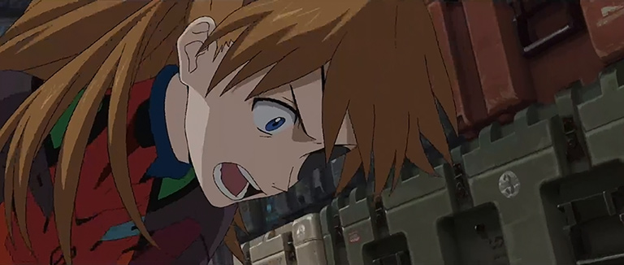
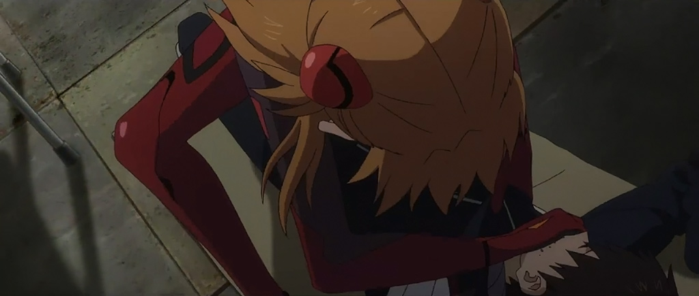
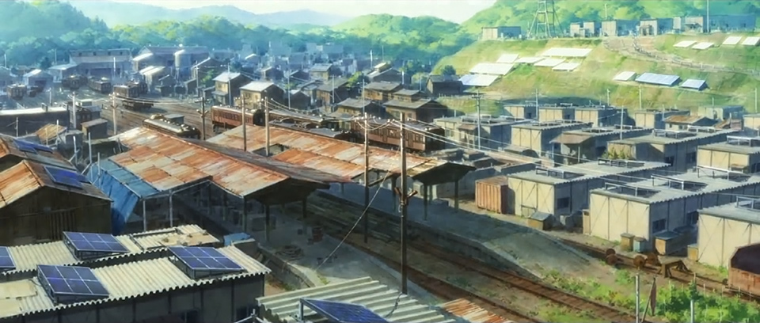
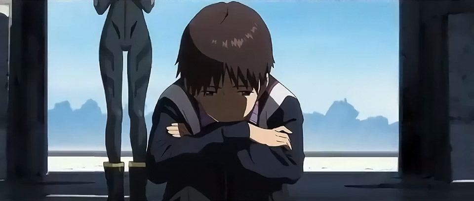

# Eva3.0+1.0 Translation Pt.1-B

## Summary

SPOILERS FOR EVA: 3.0+1.0. Translated closed captions matched to audio description. Section complete.

## Content

<strong>THIS IS YOUR LAST WARNING: </strong>

<strong>SPOILERS LIE AHEAD.</strong>

<u>Introduction &amp; Disclaimers</u>

<a href="https://www.arqacrypha.net/post/eva-3-0-1-0-cc-ad-translation-pt-1-a" rel="noopener" target="_blank"><u>Part 1-A (Complete!)</u></a> 

<strong>Part 1-B (You're There!</strong> - Complete<strong>)</strong>
<a href="https://www.arqacrypha.net/post/eva-3-0-1-0-cc-ad-translation-pt-2-a" target="_blank"><u>Part 2-A (Incomplete)</u></a>
<a href="https://www.arqacrypha.net/post/eva-3-0-1-0-cc-ad-translation-pt-2" target="_blank"><u>Part 2-B (Incomplete)</u></a>
<a href="https://www.arqacrypha.net/post/eva-3-0-1-0-cc-ad-translation-pt-3" rel="noopener" target="_blank"><u>Part 3 (Complete!)</u></a>
<a href="https://www.arqacrypha.net/post/eva-3-0-1-0-cc-ad-translation-pt-4" rel="noopener" target="_blank"><u>Part 4 (Incomplete)</u></a> 

<u>More Magic</u>

<u>Force-feeding ~ Runaway</u>

<u>Rainy Day</u> 

<u>Truth of the Eva Pilots</u> 

<u>Covenant</u> 

<u>Making the Rounds</u> 

<u>"My Name"</u><u> ~ </u><u>Impaired Functioning</u> 

<u>Rueful Hearts</u> 

<u>Misato's Hope</u> 

<u>"Goodbye"</u> 

<u>Extended Notes</u> 

<strong>Free to use for individual personal use </strong>(including casual discussion).<strong> Providing credit and linking back</strong> are greatly appreciated, as I'm a little-known blog.<strong> Please ask before incorporating into fansubs or anything of a mass distribution nature.</strong>

Time Stamps (Approximate), Closed Caption File #

Audio Description
Personal Notes

Closed Captions (Dialogue) 

<em>Closed Captions (Sound Effects)</em>

<strong>↓ </strong>(down arrow) = in-page link to extended notes

<a href="https://www.arqacrypha.net/post/eva-3-0-1-0-cc-ad-translation-pt-1-a" rel="noopener" target="_self"><u>←</u></a> GO BACK TO PART 1-A?

<strong>PART 1-B START</strong>

(Kensuke's house.

Shinji laying in the darkness.) 

<strong>Asuka:</strong>

Lying silently in the corner...

You just want to play up how rough you've got it. 
<figure></figure>
How can I clean with your ass in the way?

***

(Other-Rei comes into the clinic.)

<em>{Door opens and closes}</em>

<strong>Boy:</strong>

Oh. You're not Mommy.

<strong>Hikari:</strong>

Welcome back, Look-alike.

Thanks for your hard work today.

<em>{Door opening}</em>

<strong>Mother:</strong>

Sorry it took me so long. 

<strong>Boy:</strong>

<em>Ah!</em>

Yaaay, it's Mommy!

(The young boy slips past [Other-Rei].)

<strong>Mother:</strong>

Have you been a good boy?

<strong>Boy:</strong>

Yep!

<em>*giggling*</em>

<strong>Mother:</strong>

Thanks again, Hikari. 

<strong>Hikari:</strong>

My pleasure. 

We're all in this together.

<strong>Mother:</strong>

Well, let's head on home.

<strong>Boy:</strong>

Okay! 

Bye-bye. 

[00:28:00, 538]

<strong>Hikari:</strong>

Goodbye. Take care. 

<strong>Other-Rei:</strong>

What is "goodbye"?

<strong>Hikari:</strong>

Let's see... 

It's a magic word that lets people meet again.

<em>*titters*</em>

<strong>Boy:</strong>

Hurry up, Mommy!

<strong>Mother:</strong>

<em>Co-</em>ming! 

(The mother and the boy join hands.) 

<strong>Boy:</strong>

Let's go home and play!

<strong>Other-Rei:</strong>

What is that?

[<strong>NOTE</strong>: She's referring to the hand-holding, though it's not terribly clear.]

<strong>Hikari:</strong>

Well, it's a magic trick for becoming good friends with someone. 

<em>*chuckles* </em>

(Other-Rei looks at her extended hand.

The plugsuit-covered hand grasps repeatedly.) 

***

(Morning. Kensuke's house.

A train is floating near the watchtower.) 

[00:28:29, 545]

(Asuka ditches the game console on her bed. 

In the workshop, she looks down upon Shinji.)

<strong>Asuka:</strong>

I've had it with your shit.

<em>Argh!</em>

(She kicks him in the back.)

<strong>Asuka:</strong>

It's been hard on<em> us</em>, too!

(Shinji lifts his head up.

Asuka's choker comes into view and he turns away.)

<strong>Shinji:</strong>

Ugh... <em>*heaving*</em>

<strong>Asuka:</strong>

Throwing up again?

(She grabs a ration and stuffs it into Shinji's mouth.) 

<em>(Shinji breathing heavily)</em>

<strong>Asuka:</strong>

You brat!

Be grateful you're getting fed like this at all!

You're still a pseudo-Lilin.<u>↓</u> 

If you don't eat, you won't survive. 

[00:29:00, 555]
<figure></figure>
<figure></figure>
<strong>Asuka:</strong>

So <em>eat</em>!

It's only been water for <em>us</em>! 

Enjoy how gross the food is before you end up with a body that never changes!

Stupid brat!

You won't do anything just because you're scared of getting hurt again!

Since you've got free time anyway, 

at <em>least</em> try figuring out what made me want to hit you back there!
<figure></figure>
(Shinji with his mouth being clamped shut.)

<strong>Shinji:</strong>

<em>*sobbing*</em>

(He lies there, resigned to what's happening.)

<strong>Asuka:</strong>

<em>*sigh*</em>

You're too mentally weak.

No matter what, everything you do backfires, 

and it can't be undone.

[00:29:32, 568]

<strong>Asuka:</strong>

It's all your fault, so why bother doing anything anymore?

Yes, you were acting on your father's orders, 

but since your psychological fortitude is <em>that</em> low...

I wish you'd never piloted Evas to begin with!

(Asuka withdraws her hand, and Shinji's head hits the floor.

Still laying there, he watches Asuka's back-turned figure until it's out of sight.)

<strong>Shinji:</strong>

<em>*sob*</em>

(He abruptly gets up and goes out the door.)

<em>{Door opening and closing}</em>

(Exterior.

Far beneath the rotating train, Shinji walks at a pace, fading into the distance.

Asuka sits on her bed.)

[00:30:05, 573]

<strong>Asuka:</strong>

Sulk on your own, brat.

***

(A big blue sky over the roofs of galvanized sheet iron.

Factory buildings and giant cranes in close quarters.

Shinji proceeds alongside a straight unforked road.

A railway track wrapped in greenery.

Shinji's dispirited eyes casting downward, he keeps walking.)

[00:30:29, 575]

(Tunnel interior.

Shinji's image reflected in a puddle.
<figure></figure>
<figure></figure>
Shoulders sagging, Shinji -- his back to us -- heads for the sunlit exit.

Shinji, still hanging his head, a deep blue sky behind him.

Suddenly he looks up.

A tall, crumbling building is built alongside a lake.)

<em>{Penguin cries}</em>

(A hot springs penguin sends a sheet of spray into the air.
<figure></figure>
It swims with its flock beneath the concrete.)

(Interior of roofless building.)

[00:30:58]

(Even the floor is missing; only the towering walls are left.

Shinji is hugging his knees.

He hunches his back before the mountains that span from wall to wall.

The long shadows of pillars fall onto the lake.

Asuka checking in on him.

She leaves behind the sky, glowing with the setting sun.) 

***

(Night. Kensuke's house.) 

<strong>Kensuke:</strong>

I'm home!

Oh, what happened to Ikari?
<figure></figure>
(Asuka playing a game.) 

<strong>Asuka:</strong>

He ran away. 

[<strong>NOTE</strong>: 家出した refers to "running away from home"; different phrasing from "I mustn't run away".]

<strong>Kensuke:</strong>

I see.

Leaving him alone is probably the best option for now. 

Where'd he run off to?

[00:31:33, 582]

<strong>Asuka:</strong>

The ruins at the northern lake.

<strong>Kensuke:</strong>

The site of the old Nerv facility...

I guess it's fate.

What about the rations?

<strong>Asuka:</strong>

I force-fed him. 

He'll survive, for now.

<strong>Kensuke:</strong>

Thanks, Shikinami.

<strong>Asuka:</strong>

Meh. 

It's not like I did it for him.

There's just no way I'll let him enjoy a self-serving death. 

***

(Northern lake.

A celestial body revolves in the sky over the ruins.

Shinji lies on the concrete floor, his gaze empty.)

***

[00:32:00, 589]

(Bathhouse converted from a train.

A plugsuit, work clothes, etc., are in a basket in the dressing room.) 

<strong>Other-Rei:</strong>

My name?

<strong>Woman C (?):　</strong>

Right, you can't keep calling yourself "Look-alike" forever, now can you?

According to the doctor, though, you can't remember your own name.

<strong>Woman B (?):</strong>

So then how about giving yourself a new one?

<strong>Other-Rei:</strong>

I'm allowed to name myself?

***

(Daytime. Switchyard. 
<figure></figure>
Rain is pouring down. A light comes on in one of the electric trains.

Stray cats take refuge behind a wheel dripping with water.) 

[00:32:29, 594]

<em>{Cats meowing}</em>
<figure></figure>
<figure></figure>
(Tilting her umbrella, Other-Rei stands there, staring at the door leading into a train.)

***

(Train interior. It's been turned into a library.)

<strong>Other-Rei:</strong>

A book? 
<figure></figure>
(Insert:

In front of Ayanami Rei's room, Shinji topples a pile of books.)

<strong>Other-Rei:</strong>

The one Ikari-kun mentioned?

(Other-Rei shakes the water off her umbrella.

The potato she was holding tumbles down the aisle.

There's a girl sitting in a chair. She picks up the potato and rushes over.)

<strong>Girl:</strong>

I picked it up, so I'm giving it back to you. 

<strong>Other-Rei:</strong>

Thank you. 

[00:32:58, 598]

<strong>Girl:</strong>

Do you read?

(She holds out a picture book.

There's a little kid and a porcupine.) 

[<strong>NOTE</strong>: "Porcupine" is ヤマアラシ (<em>yama'arashi</em>). In Japanese, the Hedgehog's Dilemma is called ヤマアラシのジレンマ (y<em>ama'arashi no Jiremma</em>), literally "Porcupine's Dilemma". They do have a separate word for hedgehogs -- ハリネズミ (<em>harinezumi</em>), which is what Sonic is -- so I don't know why<em> that </em>wasn't used in the first place.]

<strong>Other-Rei:</strong>

Thank you.

***
<figure></figure>
(The fog-covered ruins.
<figure></figure>
Shinji isn't there at the usual place.
<figure></figure>
Beneath the floor of the building, he shelters from the rain with the penguins.) 

<em>{Penguins' cries} </em>

***

(Kensuke's house.

Asuka holding her puppet.) 

<strong>Asuka:</strong>

I'm alone.

I've always been, and forever will be, alone.

(She lays in bed with her limbs outstretched.)

<strong>Asuka:</strong>

That's just how it is, Asuka. 

<em>{Unidentified sound} </em>

<strong>Asuka:</strong>

<em>*gasps*</em>

(Grabbing a gun from under her pillow, 
<figure></figure>
she hides herself out of view.)

<strong>Asuka:</strong>

Who's there?

[00:33:30, 606]

<strong>Other-Rei:</strong>

It's me.

<strong>Asuka:</strong>

<em>*sigh*</em>

The one from the original batch. <u>↓</u> 

I'll unlock it now.

(Other-Rei's rain gear is left at the door.) 

<strong>Other-Rei:</strong>

I heard that Ikari-kun is here.

<strong>Asuka:</strong>

He's not. 

Right now he's a runaway. 

<strong>Other-Rei:</strong>

I see. Then I'll try to find him. 
<figure></figure>
(Asuka playing a game.) 

<strong>Asuka:</strong>

Lemme fill you in on something.

We Eva pilots, just like the Evas,

were constrained at the planning stage to not surpass human limitations. 

Same with us having inefficient emotions.

We're only <em>designed</em> to match human cognitive behavior.

[<strong>NOTE</strong>: The word for framework or limitations here is literally something like a picture frame. The metaphorical emphasis is on the confining borders.]

[00:34:00, 617]

<strong>Asuka:</strong>

All of you, the Ayanami Series, are programmed with an affinity for the Third Boy.

What you're feeling now was planned by Nerv from the start. 

[<strong>NOTE</strong>: "Programmed" is literally "adjusted" or "tuned", like a machine.]

<strong>Other-Rei:</strong>

I see. But it's fine.

I feel good about it.

<strong>Asuka:</strong>

Okay. Suit yourself then.

The object of your affections is at Nerv's Second Branch, the ruins of Building N109.

<strong>Other-Rei:</strong>

Thank you.

<strong>Asuka:</strong>

If you're going there, bring those rations with you.

He won't last much longer. 

[00:34:29, 626]

<strong>Rei:</strong>

You aren't going to stay in the village and work?

<strong>Asuka:</strong>

Are you stupid?

This isn't somewhere I live.

It's somewhere I <em>protect</em>. 

***
<figure></figure>
(The ruins.

A rainbow hangs in the sky after the rains.

Shinji is huddled into a crouch at the usual place.

Insert: Shinji surprised by a flock of birds taking wing.) 
<figure></figure>
<em>{Bird wings flapping}</em>
<figure></figure>
(His eyes open wide at a uniformed Rei standing still above the lake.) 

<strong>Other-Rei:</strong>

Ikari-kun.

(Other-Rei approaches him from behind and stops.) 

<strong>Other-Rei:</strong>

Someone taught me to return the things I pick up. 

(Shinji, his back still facing her, doesn't budge.) 

[00:34:59, 632]

<em>{Footsteps}</em>

(Other-Rei places Shinji's music player alongside him.)

<strong>Shinji:</strong>

...! 

(He knocks the player away. It stops right before it falls into the lake.

Other-Rei, giving it a sidelong glance.

She reaches down and leaves the rations on the floor next to Shinji.

She picks up the overturned player.) 

[00:35:28, 634]

<strong>Other-Rei:</strong>

I'll come again.

(Other-Rei departs.

She leaves Shinji behind, his back still facing her.) 

***

(Night.

A celestial body rises in the sky over the ruins.

Wavelets wash over a concrete pillar lodged in the lake.

Shinji curled up in a crouch, leaving the rations untouched.) 

[9 seconds later...]

<em>{Shinji sobbing}</em>

[00:35:55, 636]

(He picks up a ration and bites into it.

His tears keep coming without reprieve. 

A crumbling wall overlooks Shinji in the starlight.)

***

[00:36:07, 636]

(Morning.
<figure></figure>
<figure></figure>
Sunlight, pouring in from the horizon, brightly illuminates the village in the valley.
<figure></figure>
A group dressed for field work take a road that approaches woodlands.

Other-Rei among smiling women.

Helping to harvest from cucumber patches, she picks one that's not yet ready.

Children carry solid fuel.

Rei with back bent, chopping wood.)

[00:36:28]
<figure></figure>
(She timidly removes eggs from a henhouse.

The clinic, light pouring in from the windows. Toji places a stethoscope against a pregnant woman's abdomen.
<figure></figure>
Other-Rei, peeking beneath a train.
<figure></figure>
A cat releases a big yawn.

Everyone sitting together for dinner at Toji's house.

Other-Rei carries laundry that women washed at the river.

In a classroom full of empty chairs, Kensuke is instructing children and Other-Rei in their studies.
<figure></figure>
Asuka on top of the watchtower, gazing at the clouds.

Kensuke services the rice paddy pump. He wipes away his sweat.)

[00:37:00]
<figure></figure>
(The women who work the fields rest in the shade of the trees.
<figure></figure>
A dazed-looking Other-Rei lays [with them].
<figure></figure>
Tadpoles swim in a rice paddy.

The ruins, with an expansive blue sky.

Clouds drift across it.

Shinji crouches in front of the lake.

The clouds cast shadows onto his curled back.
<figure></figure>
<figure></figure>
The clouds drift in fast-forward across the sky overhead, and the building's shadows shift hectically.
<figure></figure>
<figure></figure>
<figure></figure>
Other-Rei continues to stand behind Shinji.)

[00:37:30]

(Rei laboring in the rice paddy.

She's participating in group field work.

She visits Shinji at the ruins. There are lots of rations next to him.

Kensuke gets video of her smiling.

Children run after Other-Rei.

Toji visits a patient's room.

The children and Other-Rei return at sunset along a raised footpath between paddies.

Game console left on the bed.

Asuka stops by the ruins. Having a lonely air about her, she leaves.

Shinji and Other-Rei at the usual place, the sun setting.

The madder-red sky enfolds the motionless Shinji's back.) 

***

[00:38:03, 637]

(The clinic.

A medical instrument is running.

Kensuke is doing maintenance.

Toji is next to him.)

<strong>Toji:</strong>

Is it safe to leave Shinji all alone?

The whole thing feels risky to me. 

<strong>Kensuke:</strong>

Let him do his own thing for now.

Ikari needs some time by himself.

<strong>Toji:</strong>

Yeah, but Kensuke...

Aren't you're being kinda cold-hearted?

<strong>Kensuke:</strong>

Worrying too much won't help anyone. 

He'll come back. 

Just wait and see.

[00:38:30, 644]

<strong>Toji:</strong>

<em>*sigh*</em>

Guess you're right.

I hope Shinji can settle into village life soon.

(Kensuke stands there, his eyes cast slightly downward.)

***

(The ruins.

The opposite shore of the lake also bears traces of destruction.)

<strong>Other-Rei:</strong>

Ikari-kun, why won't you come back to the village?

(Other-Rei looks intently at Shinji's back.) 

<strong>Other-Rei:</strong>

You're not doing anything here, either. 

Are you also a protector of the village?

[<strong>NOTE</strong>: The either/also is implicitly referring to Asuka, if that wasn't clear.]

[00:38:56, 649]
<figure></figure>
<strong>Shinji:</strong>

I'm not protecting it. 

I basically destroyed everything. 

I don't want to do anything anymore. 

Not even talk to anyone. 

Nobody should come here ever again!

I wish you'd all just lay off a waste of space like me!

Why is everyone being nice to me like this?!

[<strong>NOTE</strong>: He doesn't literally say that he's a waste of space, but he says "<em>boku nanka</em>", which is approximately "the likes of me" (derogatory). It was hard to make a more conservative translation sound... <em>not</em> stupid, so I added the slight flourish to bring out the sentiment.]
<figure></figure>
<strong>Other-Rei:</strong>

Because we like you, Ikari-kun.
<figure></figure>
(Shinji looks over his shoulder.)

<strong>Shinji:</strong>

Huh?

<strong>Other-Rei:</strong>

Thank you for talking to me. 
<figure></figure>
(Other-Rei extends a hand to him.) 

[00:39:27, 658]

<strong>Other-Rei:</strong>

This is a magic trick for becoming good friends. 

<strong>Shinji:</strong>

<em>Uh...</em>

(Shinji's eyes abruptly flow over with tears.) 

<em>{Shinji crying}</em>

(Mother Nature stretches out before him.

The walls towering at left and right frame the mountains and lake like a picture.)

***

(Night. Shinji stands in the darkness.)

<strong>Asuka:</strong>

Oh, so you're done running away?

Was it with the early type's help?<u>↓</u> 

(Asuka, facing the opposite direction.) 

<strong>Shinji:</strong>

Yeah.

(She stops playing her game.)
<figure></figure>
<strong>Asuka:</strong>

Feel better after getting all your tears out?

[00:39:59, 664]

<strong>Shinji:</strong>

Yeah.

<strong>Asuka:</strong>

I see.

If you're up and about, Ken-Ken could use a hand.

***

(An electric automobile on the move.

Disheveled railroad cars tumble alongside a tranquil country road.

Kensuke grips the steering wheel. Shinji is riding along.) 

<strong>Kensuke:</strong>

Taking a drive every so often is nice. 

An escape from the daily grind.

Agriculture is the village's key industry, but I've been exempt from field labor, 

since I'm a jack-of-all-trades.

The main task today is running checks on the enclosing infrastructure and environment.  

[00:40:30, 671]

<strong>Kensuke:</strong>

It's a lot to do.

But having said that, the existing infrastructure is on its way out.

Most of it's no longer working. 

Repairs are a pain, so we leave it alone. 

(Motionless windmills are visible in the distance.

The road ends due to halted construction, and the two of them exit the car.

Standing in front of a torii, they bow, 
<figure></figure>
then proceed along a mountain trail overgrown with lush greenery.) 

<strong>Kensuke:</strong>

I only make use of fallen or pruned branches. 

We want to take care of whatever forest is left.
<figure></figure>
(A mountain stream peeks through the trees further in.
<figure></figure>
<figure></figure>
Limpid water flows between the rocks.)

[00:41:01, 677]
<figure></figure>
<strong>Kensuke:</strong>

The water here is integral to life in Village-3. 

We rely on it.

It's really important to check the water volume. 

Literally the water of life. 

It decides whether the village thrives or fails. 

(A verdant lake shore.)

<strong>Kensuke:</strong>

Go on ahead and check out the source.

The road would be too intense for you, Ikari, so you'll have to work here.
<figure></figure>
Take this. Try to get us something to eat. 

(He hands Shinji a fishing rod.)

<strong>Shinji:</strong>

No. I've never done that before.

There's no way I can. 

<strong>Kensuke:</strong>

You'll do fine. Say when you're done.

***

(They're inside the moving car.

Shinji stares at the fishing rod in his hands.)

[00:41:32, 686]

<strong>Kensuke:</strong>

Oh, just so you know.

We're allowed one animal per week. You'll get another chance. 
<figure></figure>
(Scattered throughout the forest are giant, towering black pillars.)

<strong>Kensuke:</strong>

That's a parting gift from Wille. 

They're called Complementary L-Barrier Purification Override Blockers. 

Village-3 avoids being coreified thanks to them.

Or to Misato and her crew, I should say.

(The car stops in a thicket.

A camera set to record is capturing footage of humanoids.)

[00:41:57, 691]

<strong>Kensuke:</strong>

I've taken to watching them lately.

They're called "Haikai". <u>↓</u> 

Headless Evas that were buried this whole time.

All of a sudden, they started moving. 

Today I'm doing observation.

Just as you'd think, the sealing pillars keep them out of here. 

They do their job, even against Haikai. 

I may be a jack-of-all-trades, but I can't do everything. 

If the pillars stop working, it's game over.

(Leaving the group of giants behind, the car passes through the forest.)

<strong>Kensuke:</strong>

You've seen it for yourself. 

The reality is that we don't know how much longer we can hold out here.

But, meantime, all anyone can do is fight to stay alive. 

***

(Hikari in the kitchen.) 

[00:42:33, 701]

<strong>Hikari:</strong>

That's umeboshi.

My husband looks forward to eating it every year. 

Life is a cycle of pain and joy. 

I wouldn't mind if every day were like today. 

It is what it is, you know?

I'm not getting any younger, so... 

I want to live completely in the moment.

And there's Tsubame, too.

(Other-Rei looks over her shoulder at Tsubame on her back.)

<strong>Hikari:</strong>

I swear she's taken to you more than me. 

Look-alike, I wish you could stay here with us forever.

***

[00:43:02, 709]

(Inside the bathtub.) 

<strong>Other-Rei:</strong>

My name?

<strong>Woman A:</strong>

Yes, have you decided yet?

<strong>Other-Rei:</strong>

No. I still haven't thought of one. 

<strong>Woman B:</strong>

All the more reason to let someone do it for you. 

***

(The ruins.)
<figure></figure>
<strong>Shinji:</strong>

Your name?

<strong>Other-Rei:</strong>

Yes. 

I want you to give me one. 

I would like to stay here, and for that I require a name. 

Therefore, I need you to name me. 

<strong>Shinji:</strong>

I <em>could</em> say your name, but...

(There's a fishing rod in Shinji's hands.) 

<strong>Shinji:</strong>

you're not Ayanami, so... 
<figure></figure>
(The reel winds up.) 

[00:43:31, 719]

<strong>Other-Rei:</strong>

Any name will suffice, Ikari-kun, as long as it's you who chooses it. 

***

(Night.

Kensuke's house, his bicycle stationed outside.

Shinji washes [dishes] in the kitchen.)

<strong>Asuka:</strong>

Is the early type functioning properly? <u>↓</u> 

<strong>Shinji:</strong>

Yeah. She also dropped by today. 

Why do you ask?

<strong>Asuka:</strong>

I see... Good to hear.

***

(Toji's house.

Alongside the sleeping Tsubame, Other-Rei reads the picture book she borrowed.

It's just the two of them in the room. A lamp provides dim lighting.) 

[00:44:06, 723]

<em>{Electronic sound} </em>

(Suddenly Other-Rei looks at her wrist.

The monitor program is blinking red.)

[<strong>NOTE</strong>: The warning message on her wrist says "LCL IMBALANCE DETECTED / RECALIBRATE LCL IMMEDIATELY". No, I don't know how I was able to make this out from a shitty camrip either.]
<figure></figure>
(Insert: Ayanami Rei standing outside a bubbling tank.

Other-Rei drops the book...)
<figure></figure>
<strong>Other-Rei:</strong>

<em>*gasp*</em>

(...and flops onto the tatami.) 

<strong>Other-Rei:</strong>

<em>Ugh...</em>

<strong>Other-Rei (thinking):</strong>

***
<figure></figure>
(An eye open wide inside red liquid.

Multiple Ayanami Series individuals lie inside a tank.) 

***

[00:44:31, 726]

(The switchyard under a blue sky.

Toji and Shinji are leaving the area with wheelbarrows.)

<strong>Toji:</strong>

Whaddya think, Shinji?

You're getting pretty used to the place, right?

<strong>Shinji:</strong>

Yeah, kinda. 

<strong>Toji:</strong>

Great to hear. 

This village used to be a big mess of people who didn't know each other.  

What with all we've been through, everyone's finally getting settled in. 

<strong>Shinji:</strong>

Was it hard at first?

<strong>Toji:</strong>

Yeah, it was.

There's just so much that's happened. 

(Outside the village.) 

[00:44:55, 734]

<strong>Toji:</strong>

It was a world where you couldn't get by as a good-for-nothing brat. 

We had to grow up fast and become capable of anything. There was no other option. 

I've done some pretty shameful things for my family's sake. 

I couldn't keep being so naive if I wanted to survive. 

[<strong>NOTE</strong>: Had trouble making sense of the "naive" line. Original is 「生きるためには甘っちょろいこと言うてられんかったんや」. I think he's literally saying something like, "In order to survive, I couldn't keep saying naive things", but that doesn't make a whole lot of sense...]

<strong>Toji:</strong>

What I do now, it's nothing as admirable as being a doctor.

I just pretend to be one. Administer self-taught acts of mercy.

I'm getting by, on account of the medical equipment provided by Kredit. 

<strong>Shinji:</strong>

Toji, that <em>is</em> admirable. 

You're helping people, after all. 

[00:45:27, 743]

<strong>Toji:</strong>

But some lives can't be saved. 

I still believe it's a doctor's duty to shoulder the grief and rage when that happens. 

Guess I want to make up for all my mistakes. 

Take responsibility and absolve myself.  

That's just how I go about my life. 
<figure></figure>
Shinji, you already fought plenty on everyone's behalf. 

You can just stay here and live with us.

That'd be good for you, I think. 

***

(A plain-looking cemetery on the site of a quarry.

Kensuke with his hands joined [in prayer]. He, Shinji, and Asuka face a gravemarker.)

[00:46:02, 752]

<strong>Kensuke:</strong>

Thanks for joining me so early. 
<figure></figure>
My old man made it through Near Third Impact, 

so back then I never thought he'd just up and die in an accident.

Given what happened... I should have talked to him. Grabbed a drink or something, listened to him grumbling.

[<strong>NOTE</strong>: Presumably Kensuke turns to Shinji at this point.]

<strong>Kensuke:</strong>

Your dad is still alive, right? 

Even if you think there's no point,

meet up with him just once and talk for real. 

You'll regret it if you don't.

<strong>Asuka:</strong>

Ikari Gendo is more than a guy like him can handle.

[00:46:32, 762]

<strong>Kensuke:</strong>

But they're father and son.

They're still connected.

***

(The morning sun shines onto the many telephone poles...) 

<em>{Newborn's First Cry}</em>

(...and subdued light envelops the rows of temporary housing.) 

***

(The women in the evening switchyard, on their way back from field work.)

<strong>Woman C:</strong>

It sounds like Matsukata's wife had an especially tough delivery. 

She really pulled through. 

<strong>Woman A:</strong>

Thank god she had no complications. 

<strong>Woman C (?):</strong>

Her husband was crying tears of joy, too.

(They pass by a family of cats. 

Other-Rei stops and watches them until they're out of sight, her expression softening.)

[00:46:59, 768]

<strong>Woman ?:</strong>

Oh! You're smiling, aren't you?

<strong>Woman ?:</strong>

So she is. Very cute. 

<strong>Woman C:</strong>

I know, right? 

You have a fine figure, too. 

How about changing into something else for once?

<strong>Other-Rei:</strong>

Okay. I'll try wearing something different. 

***

(Toji's house.

The plugsuit is on a hanger.) 

<strong>Woman B:</strong>

So, how do you like the outfit this time?
<figure></figure>
<figure></figure>
(Other-Rei dressed in a middle school uniform.) 

<strong>Woman A:</strong>

I like it. It suits you. 

<strong>Woman D:</strong>

As adorable as ever. 

<strong>Woman C:</strong>

I want her as my daughter-in-law.

(She stands in front of a mirror.) 

<strong>Other-Rei:</strong>

Is this... bashfulness?

(Hikari is also present.) 

<strong>Hikari:</strong>

You're so cute. 

<strong>Other-Rei:</strong>

Is this... embarrassment? 

***

[00:47:30, 780]

(Kensuke and Shinji in protective gear, walking on the core-converted ground.)

<strong>Kensuke:</strong>

Sorry about this.

It's a bit stuffy, but keep the gear on for now.

Since I do a little of everything, I'm also the liaison with Kredit. 
<figure></figure>
(Small sealing pillars attached to cables.

There's lush grass growing only in the pillars' vicinity.)

<strong>Kensuke:</strong>

This is Kredit's field lab. 

Here they've been experimenting with the restoration of areas where the L-Barrier is relatively thin.

By the way, there's a guy on their staff I'd like you to meet. 

(One individual in protective gear waves their hands.) 

[00:48:00, 787]

<strong>Boy:</strong>

Mr. Aida!

(Top of an embankment. 
<figure></figure>
The boy takes off his protective mask.) 
<figure></figure>
<strong>Boy: </strong>

It's been a while.

Is he your new assistant? 

<strong>Kensuke:</strong>

Yeah, something like that.

<strong>Boy:</strong>

I've never met a stranger before.
<figure></figure>
(He holds his hand out.) 
<figure></figure>
<strong>Boy:</strong>

I'm Kaji. Kaji Ryoji.

What about you?
<figure></figure>
(Shinji blinks behind his mask.)   

***

(The evening sun, seen from a moving car.) 

<strong>Kensuke:</strong>

How'd you like him, Ikari?

Nice guy, right? 

<strong>Shinji:</strong>

Yeah.

He introduced himself as "Kaji", though... 

[00:48:32, 795]

<strong>Kensuke:</strong>

That's right.

He's Misato-san and Kaji-san's son.  

14 years old, and the boy doesn't know either of them. 

He's Misato-san's hope.

I guess she decided that, since she doesn't have a maternal bone in her body, her child would never meet her. 

She keeps him safe, but as the head of Wille, not as a mother. 

<strong>Shinji:</strong>

So... what happened to Kaji-san?

[00:48:55, 801]

<strong>Kensuke:</strong>

He died.

Third Impact could only be stopped if someone was sacrificed. 

Kaji-san chose that fate for himself...

and Misato-san let him do it. 

For a long time, Ikari, she's felt bad about making you shoulder so much responsibility. 

She thinks the burden should have been hers instead. 

That's why she didn't want you piloting an Eva again, right? 

Ikari, you're not the only one who's in pain.

Misato-san's suffering, too. 

***
<figure></figure>
(Madder-red clouds drift in the gradually darkening sky.) 
<figure></figure>
(Shinji sits at the top of a hill, on the ridge between two rice paddies.)

[00:49:31, 810]

<em>{Wind rustling} </em>
<figure></figure>
(The wind disturbs the water as it traverses the terraced rice fields.) 
<figure></figure>
<em>{Sniffing the air} </em>
<figure></figure>
<strong>Shinji:</strong>

An earthy smell? 

Kaji-san...

***

(Night. Kensuke at home.) 

<strong>Kensuke:</strong>

Sounds like the Wunder will swing by for a pickup tomorrow. 

We've discussed the return route. 

(He hands over a memory stick and an envelope.) 

<strong>Kensuke:</strong>

I agreed to document the village for Misato-san. 

There are photos of the crew's families, too. 

(Asuka accepts the items.) 

<strong>Kensuke:</strong>

Also, here's a letter from Toji for his sister. 

"Hope things go well", or along those lines. 

[00:50:00, 820]

<strong>Asuka:</strong>

You got it. 

<strong>Shinji:</strong>

I'm home.

(The two of them shift their attentions to Shinji.) 

***
<figure></figure>
(Tsubame's sleeping face being caressed by a finger.

Other-Rei is next to a dim lamp.

She brings her outstretched arm closer and looks at her palm.

The middle is turning red from core-conversion. 

Her eyes wide-open and wavering, a teardrop falls onto her palm.)  

<strong>Other-Rei: </strong>

Tears?
<figure></figure>
The one crying is me?

[00:50:29, 824]

(Her teary eyes gaze upon Tsubame's sleeping face.) 

<strong>Other-Rei:</strong>

This... is loneliness?

***
<figure></figure>
(Houses in the morning light.) 

(Hikari, holding Tsubame, stands in front of a room.) 

<strong>Hikari:</strong>

Good morning, Look-alike.

(She opens the fusuma, revealing the folded uniform placed upon the tatami.

Hikari walks up, and her gaze falls upon the accompanying note.)
<figure></figure>
<strong>Hikari:</strong>

"Goodnight. Good morning. Thank you."

[00:50:59, 827]

<strong>Hikari:</strong>

"Goodbye."

***

(The abandoned building. There's nothing but wall left. 

Other-Rei, looking at the lake. She glances over her shoulder.) 

<strong>Other-Rei:</strong>

Good morning.

<strong>Shinji:</strong>

Morning.

It's so early. Something going on?
<figure></figure>
<strong>Other-Rei:</strong>

I wanted to see you, Ikari-kun.
<figure></figure>
(A hazy celestial body hangs directly overhead.) 

<strong>Other-Rei:</strong>

Here.

<strong>Shinji:</strong>

Oh...

Thank you.

(Shinji accepts the music player from her.)

<strong>Shinji:</strong>

Um... 

That name you asked about... 

Ayanami is Ayanami.

That's all I can come up with. 

[00:51:30, 835]

<strong>Other-Rei:</strong>

Thank you, 

for thinking about what my name should be. 

That alone makes me happy. 
<figure></figure>
<strong>Other-Rei:</strong>

I can't exist here, 

even though I like this place.

<strong>Shinji:</strong>

Ayanami?
<figure></figure>
<strong>Other-Rei:</strong>

Knowing what it means to "like" makes me happy. 

[<strong>NOTE</strong>: Callback to Rei 6 asking Shinji "What is 'like'?" back in <em>Q</em>.]

<em>{Electronic sounds}</em>

(Her plugsuit-covered hands withdraw from Shinji.) 

<strong>Shinji:</strong>

Ayanami? What's wrong?

(She steps away from Shinji, keeping her eyes upon him.) 

<strong>Other-Rei:</strong>

I wanted to try harvesting rice. 

(Shinji's eyes open wide.)

[00:52:00, 843]

(Other-Rei's black plugsuit is turning white.) 

<strong>Other-Rei:</strong>

I wanted to hold Tsubame more.

(Other-Rei approaches the wall.) 

<strong>Other-Rei:</strong>

I wanted to keep being with the people I care about.<u>↓</u> 
<figure></figure>
(Shinji's eyes waver.)

<strong>Shinji:</strong>

<em>*gasp*</em>

(Other-Rei stands perfectly straight and looks dead ahead.)
<figure></figure>
<strong>Other-Rei:</strong>

Goodbye. 

(Other-Rei staggers, losing her shape.) 

<em>{Bursting sound}</em>

<strong>Shinji:</strong>

A-Ayanami!

(Her head is blown off her body.

Shinji rushes over to her.)

***

<em>{Tsubame crying}</em>

<strong>Hikari: </strong>

Oh right, Look-alike went over to see... 

(Hikari holding a telephone receiver.) 

[00:52:27, 850]

<em>{Tsubame crying}</em>

<strong>Hikari:</strong>

What's the matter?

***

(The plugsuit, splattered with red fluid.

A small cross-shaped light gleams upon the chest area, and vanishes.)

<strong>Shinji:</strong>

<em>*dumbfounded utterance*</em>

(Shinji stares in total stupefaction.

He tightly embraces the empty husk of the plugsuit.
<figure></figure>
Splashed with red fluid, the music player goes for a tumble.)

<strong>END OF PART 1-B
</strong>ONWARD TO PART 2-A?　<a href="https://www.arqacrypha.net/post/eva-3-0-1-0-cc-ad-translation-pt-2-a" target="_self"><u>⇒ </u></a> 

<h3>Extended Notes</h3>

[00:28:57, 554] <strong>"You're still a pseudo-Lilin."</strong> "Pseudo-Lilin" is リリンもどき (<em>Lilin-modoki</em>). The suffix "<em>-modoki</em>" means "being made in, or something made in, imitation; fake, sham, etc." (<a href="https://kotobank.jp/word/%E3%82%82%E3%81%A9%E3%81%8D-1211568" rel="noopener" target="_blank">,<u>See entries at Kotobank here</u></a>.) So, "X-like", "mock X", "pseudo-X", and so forth. I've gone for "pseudo-" since it helps bring out this particular continuation of NTE's "false vs. true" thematic dichotomy. (Incidentally, "<em>-modoki</em>" can be written in kanji as 擬き. The "pseudo-" used in NTE in <em>Ha</em> and <em>Q</em> is 擬似, <em>giji</em>; note the kanji in common. Nipponica's entry at Kotobank highlights this.) 

There is a "rule of 3" going on with<em> -modoki</em> in <em>Shin</em>. It was used during Avant 1 upon the arrival of 4444C, which Mari referred to as 使徒もどき ("<em>shito-modoki</em>"), or a "pseudo-Angel". The suffix will appear again in "part 2" during Eva-02 and Eva-08's drop, providing エヴァもどき ("<em>Eva-modoki</em>"), or "pseudo-Evas", that time around. <em>Shito-modoki, Lilin-modoki, Eva-modoki</em>? Curious indeed...

[00:33:32, 607] <strong>"The one from the original batch"</strong> is 初期ロット <em>(shoki rotto</em>), literally "initial lot".  Back at the end of Q, Asuka took one quick look at Rei 6 and said, 「さっきのパイロットね。綾波タイプの初期ロットか」("The pilot from earlier, I see. So you're [from the] initial lot of Ayanami Types." A "lot" in this context is a manufacturing term; you can find more information e.g. at the <a href="https://kotobank.jp/word/%E3%83%AD%E3%83%83%E3%83%88-153097" rel="noopener" target="_blank">,<u>third entry here</u></a> (which even addresses<em> shoki rotto</em> specifically) and, in English, <a href="https://ell.stackexchange.com/questions/18981/word-meaning-batch-vs-lot" rel="noopener" target="_blank">,<u>here</u></a>. 

In <em>Shin</em>, Asuka has reappropriated 初期ロット as her nickname for Rei 6, as this isn't the only time she uses it. Interestingly, this <em>is</em> the only time her nickname for another pilot doesn't reference nepotism in some way.

And in case you're wondering, Japanese is the kind of language that lets you do things like refer to a single clone as "initial lot". Obviously this doesn't work in English, though, so you have to do something like add "one of/from" or come up with another workaround. (I use "<strong>early </strong>[Ayanami]<strong> type</strong>" the second time Asuka calls Rei 6 "<em>shoki rotto</em>".)

[00:41:59, 692] <strong>"They're called 'Haikai'."</strong> "Haikai" is written all in katakana (ハイカイ), which means this is probably another case of Anno squeezing as many meanings out of something as humanly possible. Written 俳徊, <em>haikai</em> can mean "wandering" or "roaming", which isn't inappropriate, but it's far from the only possibility. Consider first the multiple potential ways to split up "Haikai"...

HAI-KAI

HAI-KA-I

HA-I-KAI

HA-I-KA-I

...and then account for the multiple thematically relevant kanji attached to each of those (<em>hai, kai, ha, ka, i</em>). It's crazy. So... I'm not even going to attempt to translate this term. Very curious what Kanemitsu ends up using for it.

[00:52:11, 844] <strong>"I wanted to keep being with the people I care about."</strong> Oh boy, this fucking line. Original is 「好きな人とずっと一緒にいたかった」 (<em>"Suki na hito to zutto issho ni itakatta"</em>). We're dealing with the notorious "<em>suki</em>" here, which can describe feelings anywhere from general fondness or affinity to "liking" someone in the "I'm too bashful (slash Japanese) to call it 'love'" kind of way); and, specifically, "<em>suki na hito</em>", which could refer to one person or multiple ("person/people I like"). The line as a whole could be given a "weak" rendition, a "strong" rendition, or something in between. The weak rendition is included by default. A stronger, shipper-friendly variant might be "I wanted to be with the one I like forever". 

There's an argument to be made for either interpretation. For the "strong" version, you might point to Asuka telling Rei that she's programmed with an affinity to Shinji, or to Rei telling Shinji "Because we like you". For the "weak" version, you might consider that Rei saying "I wanted to keep being with the people I care about" follows directly on her saying that she wishes she could hold Tsubame again, and calls back to the earlier scene where Hikari commends how good Rei is with Tsubame and tells her, "I wish you could stay with us forever". 

The best part of all this that the two versions are not mutually exclusive. (Which makes sense; Anno is big on that sort of ambiguity.) Now, that said, since I had to pick only <em>one</em> to be the default translation, I went with the non-shippy version, on account of it being more inclusive. "People I care about" includes Shinji, whereas "the person I like" does<em> not</em> include everyone in the village with whom Rei has formed a relationship. 

<u>Return to Top</u> 
