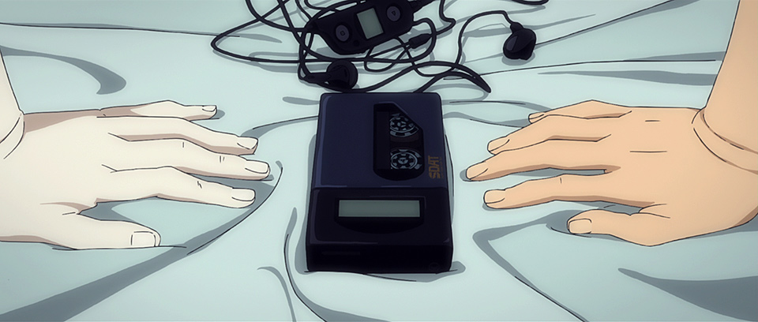
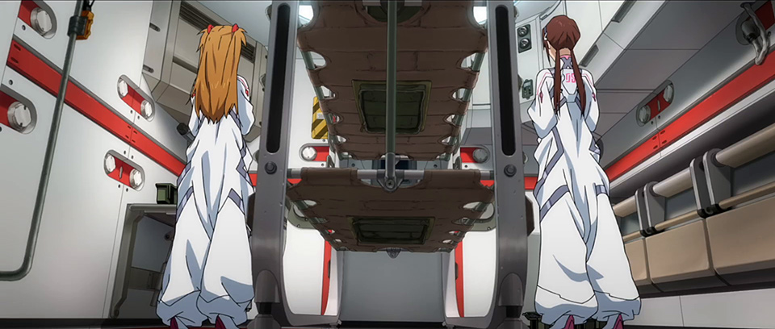
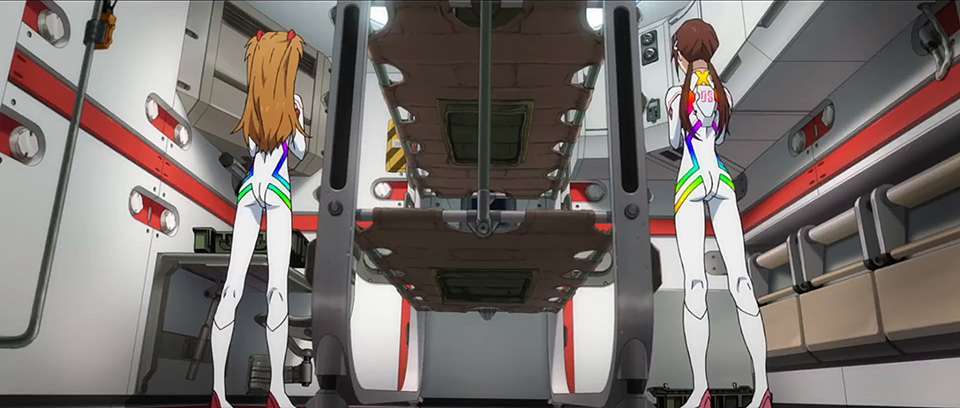
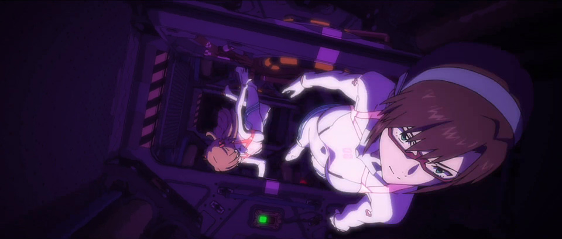
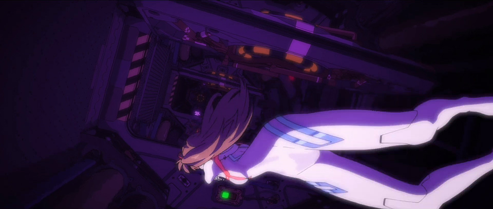
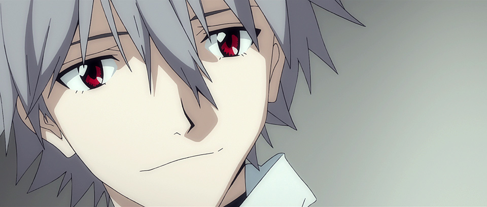
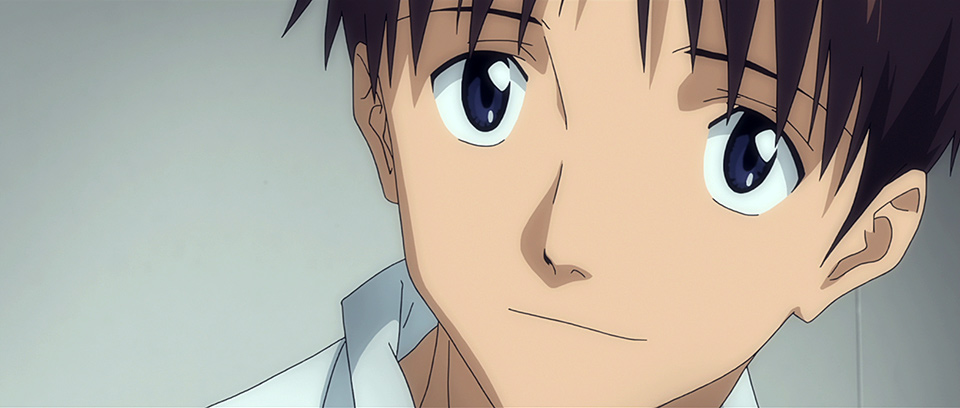

# Eva3.0+1.0 Translation Pt.2-A

## Summary

SPOILERS FOR EVA 3.0+1.0. Translated closed captions matched to audio description. WIP.

## Content

<strong>THIS IS YOUR LAST WARNING: </strong>

<strong>SPOILERS LIE AHEAD.</strong>

<a href="https://www.arqacrypha.net/post/eva-3-0-1-0-cc-ad-translation-pt-1-a#viewer-ftjt4" rel="noopener" target="_blank"><u>Introduction &amp; Disclaimers</u></a> 

<a href="https://www.arqacrypha.net/post/eva-3-0-1-0-cc-ad-translation-pt-1-a" rel="noopener" target="_blank"><u>Part 1-A (Complete!)</u></a> 

<a href="https://www.arqacrypha.net/post/eva-3-0-1-0-cc-ad-translation-pt-1" rel="noopener" target="_blank"><u>Part 1-B (Complete!)</u></a>
<strong>Part 2-A (You're There!</strong> - Incomplete<strong>)</strong>
<a href="https://www.arqacrypha.net/post/eva-3-0-1-0-cc-ad-translation-pt-2" target="_blank"><u>Part 2-B (Incomplete)</u></a> 

<a href="https://www.arqacrypha.net/post/eva-3-0-1-0-cc-ad-translation-pt-3" rel="noopener" target="_blank"><u>Part 3 (Complete!)</u></a>
<a href="https://www.arqacrypha.net/post/eva-3-0-1-0-cc-ad-translation-pt-4" rel="noopener" target="_blank"><u>Part 4 (Incomplete)</u></a> 

<u>Leaving Village-3</u> 

<u>BM-03, Back in Custody</u> 

<u>Matters of Trust </u> 

<u>Kaji's Ark</u> 

<u>The Culmination of Hubris</u> 

<u>The Chaos of the Human Heart</u>
<u>Fighting For a Blue Dream</u> 

<u>Dressed to Die</u> 

<u>Until We Meet Again</u> 

.........

<u>Extended Notes</u> 

<strong>Free to use for individual personal use</strong> (including casual discussion).<strong> </strong>Providing credit and linking back are greatly appreciated, as I'm a little-known blog.<strong> Please ask before incorporating into fansubs or anything of a mass distribution nature.</strong>

Time Stamps (Approximate), Closed Caption File #

Audio Description
Personal Notes

Closed Captions (Dialogue) 

<em>Closed Captions (Sound Effects)</em>

<strong>↓ </strong>(down arrow) = in-page link to extended notes

<a href="https://www.arqacrypha.net/post/eva-3-0-1-0-cc-ad-translation-pt-1" rel="noopener" target="_self"><u>←</u></a> RETURN TO PART 1-B?

<strong>PART 2-A START</strong>

[00:52:43, 852]

<em>{Helicopter rotors}</em>

(The village square.

A giant transport ship stretches ahead imposingly.) 

[<strong>NOTE</strong>: Unclear if one or many transports are being discussed in this scene.]

<em>{Cranes being operated}</em>

(Cranes and forklifts move around, unloading relief supplies.)

<strong>Worker: </strong>

OK... OK... OK... 

(Men are conducting checks alongside a procession of massive trucks. 
<figure></figure>
An intense-looking Toji provides instructions.

Video screen of a recording in progress.) 

[00:53:01, 855]

<strong>Kensuke:</strong>

So that's the Wunder. 

It's <em>huge</em>.

(The screen displays a transport ship right under the mother ship that hovers in the sky.) 

<strong>Kensuke:</strong>

All interested parties are disembarking. 

The climactic battle has come at last. 

(He swings the camera to the side, catching Asuka beside him.) 
<figure></figure>
<strong>Asuka:</strong>

Uh, please no. Don't film me.

<strong>Kensuke:</strong>

Sorry about that.

But <em>just</em> today, I'd like to make a record for posterity. 

<strong>Asuka:</strong>

Alright. Have a blast, then. 

<em>{Dog barking}</em>

<strong>Asuka:</strong>

<em>Ugh...</em>

(When the camera pans some more, Shinji comes into view. 

He looks in Kensuke and Asuka's direction.) 

[00:53:32, 863]

<strong>Asuka:</strong>

And? What are <em>you </em>doing here?

(Shinji stares back with weepy eyes.) 

<strong>Kensuke:</strong>

Ikari, it's okay if you stay behind.

<strong>Shinji:</strong>

Thanks, Kensuke.

Give Toji and the others my thanks, too.
<figure></figure>
(His grip tightens around the music player.) 

<strong>Shinji:</strong>

Asuka, I'm going too.

<strong>Asuka:</strong>

Okay. 

Then I gotta do this; regulations and all. 

(She shoots him with a taser.) 

[00:53:58, 869]

<em>{Discharge sound}</em>

<strong>Shinji:</strong>

<em>Ugh...</em>

***

(Sickbay.

A blurred field of vision focuses, 
<figure></figure>
and the face of a woman wearing a beret comes into view.)

<strong>Shinji: </strong>

<em>Ugh...</em>

Suzuhara... Sakura-san?

(She slaps the bed-ridden Shinji.) 

<strong>Sakura:</strong>

Running off as you please!

I told you not to pilot more Evas but you went and did it anyway! 

[<strong>NOTE</strong>: Sakura is in full Kansaiben Mode here. In <em>Q</em>, she only briefly let a "<em>honma</em>" slip out when she was telling Shinji not to do THE THING.] 

<strong>Sakura:</strong>

Moron! Dimwit! 

Ikari-san, you're such a dumb-ass! <u>↓</u> 

(She clings to his chest.)
<figure></figure>
<strong>Asuka:</strong>

Are you his wife?

(Asuka is next to them.) 

<em>{Sakura crying}</em>

(She firmly fixes her gaze upon Shinji, who inquiringly tries to feel for the base of his neck.) 

***

[00:54:29, 879]

(Outside a door.

Sakura and Asuka watch a hospital gurney being led out of sight.)

<strong>Sakura:</strong>

Verification of the escapee has been completed. 

As of now, we assume responsibility for BM-03's surveillance hold.

(Asuka casually throws her hands up.) 

[<strong>NOTE</strong>: I assume this is like a "he's <em>all</em> yours!" kind of gesture, but I'm not 100% sure.]

<strong>Sakura:</strong>

Sign here for the transfer, Wartime Special Major Shikinami.

<strong>Asuka:</strong>

What about a DSS choker?

*

(The bed advances in a corridor.) 

*

<strong>Sakura:</strong>

It's fine if it's not equipped. 

He'll be housed in the explosion-proof isolation ward until all operations have concluded. 

*

<strong>Announcement: </strong>

<em>Monitored subject BM-03 arriving at Chamber 2.</em> 

(The security officers and the bed disappear inside.)

[00:55:01, 886]

<strong>Announcement:</strong>

<em>Preparing ignition system.</em>

<em>*</em>

<strong>Asuka:</strong>

Seeing as he removed the choker at his convenience...

This is a more secure way of dealing with the issue, yeah.

<strong>Sakura:</strong>

The choker left a history of its activity in Magi C.

That tells us that another pilot was killed by the detonation, right before his eyes.

[<strong>NOTE: </strong>The "C" is pronounced "Copy".]

*
<figure></figure>
(The bed rises to a vertical.) 

*

<strong>Sakura:</strong>

Returning to the Wunder even after experiencing something like that...

(Shinji's restraints disengage.) 

<strong>Sakura:</strong>

<em>Why?</em>

<strong>Asuka:</strong>

No idea.

If you ask me, Captain Katsuragi giving him clearance to come aboard is the more pressing mystery. 

[00:55:30, 897]

<strong>Asuka:</strong>

Here's the documentation of Village-3 that our contact put together.

Also, a letter for you from Suzuhara.
<figure></figure>
<strong>Sakura:</strong>

From my brother?
<figure></figure>
(It comes with a photo of Toji's family.)

<strong>Sakura:</strong>

<em>Ah...</em>

<strong>Announcement:</strong>

<em>Chamber 2 fully locked down and emergency ignition system initiated.</em>

<em>{Sakura weeping} </em>[~5 sec.]

(Asuka takes her leave.)

<strong>Announcement:</strong>

<em>Monitored subject BM-03 successfully placed in isolation.</em>

<em>{Sakura crying}</em>

***

(Wunder in outer space.

Within a tunnel, the shuttle switches to another track and moves along.

Ibuki is inside.)
<figure></figure>
<strong>Ibuki: </strong>

No issues compensating for the crew who disembarked.

Things are proceeding smoothly at N-02's work site, 

so start integrating the power shift into Improved 08 as planned.

[<strong>NOTES</strong>: N-02 = N-Eva-02 = New Eva-02. Also, I'm not entirely sure what "power shift" or "powershift" refers to, but "power-shifting" is a car term, at least. Are they turning Eva-08 into a car? *<em>thinks about the steering wheel in Avant 1 and also how Utena turned into a pink car in the </em>Adolescence of Utena<em> movie and gets a funny feeling</em>*]

[00:56:00, 908]

<strong>Ibuki:</strong>

Status of main gun turrets and outboard operations? 

<strong>Worker A:</strong>

<em>No issues replacing turret 4 or adding the main armament to the stern.</em>

<strong>Worker B:</strong>

<em>Eva-related work in the outboard docks is about 3% behind, all in all.</em>

<strong>Ibuki:</strong>

Expedite things. 

Skip over one-fifth of the checks. 

<strong>Workers:</strong>

<em>Yes, ma'am!</em>

***

(Bridge.) 

<strong>Announcement:</strong>

<em>Five minutes until phase 2 of N1 rocket attachment resumes.</em>

(Kitakami having a meal.

Aoba and Tama are also present.)  

<strong>Kitakami:</strong>

I'm glad Major Shikinami is back on board,

but why'd we take the jinx, too? 

[<strong>NOTE:</strong> Midori literally says 疫病神, <em>yakubyougami</em>, or god of pestilence. (lol) I tried to naturalize it a bit.]

<strong>Aoba:</strong>

Just leave it alone. 

Better he's with us than getting used by Nerv again. 

[00:56:28, 919]

<strong>Tama:</strong>

If he tries to pilot an Eva, all personnel get unconditional use of firearms. 

We'll be fine this time around.

<strong>[NOTE:</strong> The previous three sets of lines have been tweaked based on Nuclear Lunchbox's commentary <a href="https://forum.evageeks.org/post/924660/Shin-Eva-General-Reborn/#924660" target="_blank">,<u>here</u></a>. These sorts of explanations are always lovely and much appreciated.]

<strong>Kitakami:</strong>

You're so full of it.

When he escaped the last time, the captain couldn't do what she needed to.

So now I've got no faith in her at all. 

(Nagara looks over her shoulder.)

<strong>Nagara:</strong>

We're talking about a kid.

It makes sense that she hesitated.

<strong>Kitakami:</strong>

That <em>kid</em> caused N3I and killed my entire family!
<figure></figure>
<strong>Hyuga:</strong>

N3I wasn't the outcome that he intended. 

(The bespectacled Hyuga.) 

<strong>Hyuga:</strong>

The Captain has committed herself completely to atonement as well.

(Takao, at center.) 

<strong>Takao:</strong>

Quite right.

She's the one Kaji entrusted Wille to.

I stand by our captain, come hell or high water. 

[00:57:00, 930]

(Kitakami looks away stubbornly.) 

<strong>Kitakami:</strong>

People are too soft on family and friends. 
<figure></figure>
(There's a water pack in her hand.)
<figure></figure>
<strong>Kitakami:</strong>

It's like this reclaimed water. Could be anyone's pee, 

but people act like that doesn't matter, long as it's purified. 

<em>What planet is everyone on?!</em>

[<strong>NOTE</strong>: I <em>think</em> Midori is making some kind of absurd metaphor comparing nepotism to drinking recycled piss, but it's a bit difficult for me to find the right formulation in English.]

***

(Explosion-proof isolation ward. The airtight door opens lengthwise, and Asuka proceeds further within.)

<strong>Announcement:</strong>

<em>No problems detected during linkage test between the JA parts and N-Eva-02.</em>
<figure></figure>
(She walks right up to the room and then peers behind the wall.)

<strong>Announcement:</strong>

<em>As planned, please begin work on the left wrist's standalone interlocking system.</em>

<strong>Asuka:</strong>

There are more explosives.

Less confidence in <em>us</em>, huh? 

(The place is rigged with red devices.) 

[00:57:30, 938]

<strong>Asuka:</strong>

I'm home.

(Mari embraces her.) 

<strong>Mari:</strong>

Welcome home, Princess.

The toil of your journey was not in vain.

I've missed you <em>très</em> much.<u>↓</u> 

<strong>Asuka:</strong>

Seriously?! What's with the room? 

You didn't clean up, you just stuffed it with more books!

<strong>Mari:</strong>

Books are aggregates of humanity's wisdom. 

Reading every book from around the world, past and present, that I can get my hands on... 

That's my impossible dream. 

<strong>Mari:</strong>

By the way,

how are things coming along with Puppy Boy?
<figure></figure>
<strong>Asuka:</strong>

Meh, don't care.

(She's holding a game console.)

<strong>Mari:</strong>

<em>Oh?</em>

So you're not interested in boys his age?

[00:58:01, 949]

<strong>Asuka:</strong>

The brat needs a mother, not a lover. 

***
<figure></figure>
(Zoological-Botanical Seed Storage Block.) 

<strong>Announcement:</strong>

<em>All transfers from the supply ships to the main ship are complete.</em>
<figure></figure>
(Misato is looking at a container. 

The name "Kaji" is written on a plate.)

<strong>Announcement:</strong>

<em>Logistics personnel on the supply ships are to promptly withdraw.</em>

(Ritsuko comes up on a lift.) 

<strong>Ritsuko:</strong>

Sign here to authorize Kredit's independent administration along with the release of all limiters on both Evas,

Captain Katsuragi. 

(Misato holds her palm over the electronic pad.)

<em>{Electronic sound}</em>

<strong>Ritsuko:</strong>

Authorization of both the captain and executive officer verified.

Maya, please get started.

<strong>Ibuki:</strong>

<em>Roger, XO-sempai.</em>
<figure></figure>
(The lift goes down the precipice of containers.) 

[00:58:31, 959]

<strong>Ritsuko:</strong>

You're always here when you're alone, Misato.

We ought to put the plate for the captain's room here instead.

Your feelings for Ryo-chan can't be pushed aside so easily, can they?

<strong>Misato:</strong>

It has nothing to do with Kaji.

I feel at peace here, that's all. 
<figure></figure>
<strong>Ritsuko:</strong>

This block embodies the ship's underlying practical purpose, to preserve the seeds of all life.<u>↓</u> 

An unmanned, fully automated ark capable of semipermanent operations, dedicated to safeguarding those seeds -- 

that is the true nature of the AAA Wunder.

[00:59:00, 967]

<strong>Misato: </strong>

Kaji didn't concern himself with the long-term prospects of the human species.

We would go extinct, collateral of the Instrumentality Project.

Ensuring that biodiversity remained in the natural world was of the utmost importance. 

<strong>Ritsuko:</strong>

And to accomplish that, as many life seeds would need to be evacuated off Earth as possible. 

This ship was stolen from Nerv while it was still under construction so this plan could be realized. 

We all had doubts about humanity's ability to hinder the Instrumentality Project. 

[00:59:29, 976]

<strong>Misato:</strong>

But no sooner had we pulled the heist than he threw his own life away to stop Third Impact. 

(Misato wearing sunglasses.) 

<strong>Misato:</strong>

He was an exasperating man who died a paradoxical, opportunistic death. 
<figure></figure>
(Ritsuko stares at the in-profile Misato.

Interior of an inclined elevator.) 

<strong>Misato:</strong>

And as a result, he's no longer here.

So I will use this ship to wipe Nerv off the map 

and stop the Human Instrumentality Project dead in its tracks.
<figure></figure>
<strong>Ritsuko:</strong>

Out of vengeance? 

<strong>Misato:</strong>

Not at all.

Instead of being an ark that preserves lives for the future, 

it will be a combat vessel that saves them in the here and now.

[01:00:01, 984]

<strong>Ritsuko:</strong>

Spoken like a true mother. 

<strong>Misato:</strong>

Must be mistaking me for someone else. 

(The elevator stops.

An airtight door opens.

Inside the bridge.

Kitakami keenly looks up toward Misato.) 

<strong>Aoba:</strong>

Captain and XO now present on the navigation bridge. 

<strong>Announcement:</strong>

<em>Nerv Headquarters has started moving.</em>

<em>Presumed to be heading for ground zero of the former South Pole, </em>

<em>accompanied by a soaring Black Moon.</em>

***

(The surface.)

[01:00:25, 990]

<em>{Impact}</em>
<figure></figure>
(A black mass, soaring high in the sky, rises while gouging the red Mt. Fuji out of the ground.

A thick, bright red cloud of dust billows up.

In a crater-like hollow above the Black Moon, 

the inverted pyramid-shaped Nerv HQ levitates, accompanied by a ring of light.)

***

(Fuyutsuki, inside headquarters.) 

<strong>Fuyutsuki:</strong>

The resurrection of the Black Moon, cornerstone of Fourth Impact.

And... the sacrificial offering of the Adams' Vessels, unsullied life-forms made only of pure soul, neither male nor female.

(There's more than one [of the Vessels? Ayanamis?].)

<strong>Fuyutsuki:</strong>

The revival of the Advanced Ayanami Series.

[<strong>NOTE</strong>: "Revival" could also be "resuscitation", "rebirth", "reincarnation", or "resurrection".]

<strong>Fuyutsuki:</strong>

The human salvation of humanity, the Human Instrumentality Project.
<figure></figure>
(One of the Ayanami Series blinks.)

<strong>Fuyutsuki:</strong>

And <em>this</em> is the culmination of your hubris. 
<figure></figure>
<figure></figure>
(Gendo stands before Evangelion 13, which is impaled upon two spears.

Fuyutsuki walks up to him from behind.) 

<strong>Fuyutsuki:</strong>

The Third Boy returned to Wille. 

It appears that Ayanami Type No. 6,  due to a lack of calibration, could not hold onto her individuality. 

Was the goal to make your son experience the same loss as you, Ikari?

***

(Inside Wunder.
<figure></figure>
Shinji is looking at the music player in his hands.) 

***

(Captain's room.)

[01:01:34, 1001]

<strong>Ritsuko:</strong>

He's emotionally stable, it would seem. 

(An observation monitor shuts off.) 

<strong>Ritsuko:</strong>

So, Captain Katsuragi,

how will you deal with our provisionally named Ikari Shinji-kun? 

Are you intent on never seeing him, just like your son?

[<strong>NOTE</strong>: Ritsuko's phrasing -- 「息子と同じく一生会わない気？」 -- is kind of weird, since it seems like she's implying that Misato has never met with "Provisional Shinji" before, when Misato did in fact speak to him in <em>Q</em>. It wasn't much, but it was presumably way more than Ryoji Jr. ever got.]

<strong>Misato:</strong>

Having him protected on the ship is enough. 

There's no need for me to meet with him.  

<strong>Ritsuko:</strong>

Are you sure you want to leave the DSS Choker unequipped? 

<strong>Misato:</strong>

Without the willful intent to make up for one's sins, atonement is meaningless.

[01:01:57, 1008]

<strong>Ritsuko:</strong>

Misato, for all the airs you're putting on, 

aren't you happy he came back, deep down?

(Misato leaves her back turned to Ritsuko.) 

<strong>Ritsuko:</strong>

You know from experience that bad things happen when your emotions take the reins. 

<em>(Misato sighing)</em>

<strong>Misato:</strong>

You're as brutal as ever.

<strong>Ritsuko:</strong>

It doesn't end well when I pamper you, Misato.

<em>I</em> know that from experience. 

***

(Insert shot: "Evangelion 3.0 + 1.0".)

***

(Explosion-proof isolation ward.)

<strong>Asuka:</strong>

Aside from my hair growing, my body doesn't really change at all. 

It's so depressing.

(Mari, cutting Asuka's hair.)

[01:02:28, 1017]

<strong>Mari:</strong>

Within one's hair, there exists divinity, impurity, and carnality alike.

It perfectly embodies the chaos of the human heart. 

A testament to your humanity, Princess, if there ever was one.

***

(Ground zero of the former South Pole.

Crowned by Nerv HQ, the Black Moon forces its way through a rainbow-colored ring.

It slowly descends toward the L-Barrier interfacial plane.)

<em>{Impact}</em>
<figure></figure>
(Five giant crucifixes tower over an even, bluish-white surface.

Inside a Nerv battleship.) 

[01:02:56, 1021]

<strong>Fuyutsuki:</strong>

The damned epicenter of Second Impact. 

(Fuyutsuki on the bridge.)

<strong>Fuyutsuki:</strong>

The Adams' Vessels are all present and accounted for. 

Evangelion 13's reactivation is now just a matter of time. 

<strong>Gendo:</strong>

Indeed. 

Let's begin, Fuyutsuki.

(Gendo rises from his seat.)

<strong>Gendo:</strong>

Take care of the rest.

(The monitor turns on.) 
<figure></figure>
<strong>Fuyutsuki:</strong>

Until now, everything has gone according to Seele's scenario.

***

(Wunder, captain's room.
<figure></figure>
Misato looks at the photograph she's holding.

Flashback.)

<strong>Misato (flashback):</strong>

Go for it, Shinji-kun!

(Misato watching the Eva go by.)

[01:03:30, 1028]

<strong>Misato (flashback):</strong>

Don't do this for anyone else!

Go after what <em>you</em> want! 

(The present day.
<figure></figure>
In the photograph, Kaji Jr. stands next to Shinji.

The former is making a V-sign.)

<em>{Phone ringing}</em>

(Misato picks up the receiver.)

<strong>Ritsuko (phone):</strong>

<em>Captain, bad news.</em><em><u>↓</u></em> <em> </em>

<em>Nerv Headquarters has arrived at its final destination.</em>

<em>It's begun working toward Evangelion 13's reactivation.</em>

<strong>Misato:</strong>

Meaning we only have a few hours left.

[01:03:54, 1034]

<strong>Ritsuko (phone):</strong>

<em>Yes.</em>

<em>I also have good news.</em><em><u>↓</u></em> 

<em>The stop signal plug has been fully assembled.</em>

<em>Both Evas are now in minimal working condition, as well.</em>

[<strong>NOTE:</strong> Last part is 「エヴァ両機も最低限形になったわ」.  A bit hard for me to wrap my head around Ritsuko's intended meaning so that it comes off as something that's "good news".]

<strong>Misato:</strong>

Roger.

All ships, prepare for takeoff.

***

(Maintenance control room.) 

<strong>Misato (comms): </strong>

<em>In 25 minutes, suspend current operations. </em>

<em>Departure in 30 minutes.</em>

<strong>Ritsuko:</strong>

Making crazy demands, as usual.

***

<strong>Misato (comms):</strong>

<em>All ships, prepare for takeoff, battle stations condition 2. </em>

<em>Departure in 25 minutes.</em>

<em>All personnel, be finished with operations in 20.</em>

***

<strong>Crew A (comms):</strong>

<em>Repeat, all ships prepare for takeoff, battle stations condition 1. </em>

<strong>Crew B (comms):</strong>

<em>Making final adjustments to unmanned fleets' launch positions.</em>

[01:04:25, 1043]

<strong>Crew C (comms):</strong>

<em>Injection of N1 rocket propellant, completed.</em>

<em>Switching to internal power supply.</em>

<em>Final status checks all clear.</em>

<em>Outboard workers, evacuate immediately.</em>

<em>***</em>

(Officers' quarters.

Hyuga wiping his glasses.

The long-haired Aoba shaves his goatee.
<figure></figure>
After tying on their blue arm bandannas, 
<figure></figure>
the two of them bump their fists.) 

<strong>Hyuga &amp; Aoba:</strong>

<em>*fist bump!*</em>

***

(Bridge.)
<figure></figure>
<strong>Tama:</strong>

You sure got a lot there, huh, Chief Engineer Takao?

(He has five bandannas on a single arm.) 

<strong>Takao:</strong>

Yep. For the comrades who died when we rose up against Nerv. 

<strong>Nagara:</strong>

You used these bandannas to distinguish friend from foe during the insurrection, right?

[01:04:54, 1050]
<figure></figure>
<strong>Takao:</strong>

You got it.

We're going to make the red oceans and earth blue again.

So it symbolizes the oath infusing this color with our dream. 

***

(Captain's room. Ritsuko lends a hand.) 

<strong>Misato:</strong>

Thank you.

<strong>Ritsuko:</strong>

This bandanna was a keepsake from Ryo-chan, if I recall.

(The bandanna now tied to her arm, Misato reminisces about Third Impact.)

***

(As countless skulls rain down, an Eva-like silhouette [Mark.06] stands atop a giant torso, tightly grasping a freshly severed head. 
<figure></figure>
Someone holds out a blue, blood-soaked bandanna. 
<figure></figure>
<figure></figure>
Having accepted it, Misato gazes ahead fixedly, as does Ritsuko. 

Kaji looks over his shoulder.)

<strong>Kaji:</strong>

Katsuragi, take care.
<figure></figure>
(He raises his arm, then walks away.

Misato stands there in a daze.)

***

[01:05:32, 1055]

<strong>Misato:</strong>

At the time, I really wanted to be left with Kaji, too.

[<strong>NOTE: </strong><em>"Too"?</em> (「あのとき 本当は私<strong>も</strong>加持と残りたかった」.) Implying what, Misato? What are you and Ritchan not saying?!?]

<strong>Ritsuko:</strong>

I can imagine.

If you weren't with child, I might have let it happen. 

(Misato smiles at the photograph of Kaji Jr. and Shinji.) 

***
<figure></figure>
<strong>Sakura:</strong>

Since we're at battle stations,

I'm transferring to the medical block.

(Sakura in officers' quarters.) 

<strong>Sakura:</strong>

Ikari-san, please stay put.

Whenever you need me, just use the red button. 

<strong>Kitakami:</strong>

Well, I'm off. 

<em>{Hanging up receiver}</em>

(Kitakami, who was sitting behind Sakura, leaves the room holding a pouch.) 

***

[01:06:00, 1064]

(Explosion-proof isolation ward.

Mari, completely naked, picks up a white suit.) 

<strong>Mari:</strong>

Pressure-resistant plugsuits for diving the deepest depths.

Must be fresh out of the oven! 

<figure></figure>
<strong>Asuka:</strong>

Pure, unspoiled, and never-before-worn, huh. 

We're dressing for our own funerals. 

***
<figure></figure>
(Asuka and Mari activate the switch on their suits.
<figure></figure>
<figure></figure>
The suits adjust to fit.

The game console is left on the bed.) 

***
<figure></figure>
<strong>Worker A: </strong>

<em>Activating N-Eva-02's J.A. reactor. </em>

<em>Output stable. </em>

<em>Initiating energy circulation. </em>

<strong>Worker B:</strong>

<em>Eva-08 Improved connected to the Dragon Carrier without issue.</em>

[01:06:29, 1071]

<strong>Ibuki:</strong>

<em>Don't bother with a detachment test. </em>

<em>We'll do it off the cuff!</em>

***

(A dim corridor.) 

<strong>Worker C:</strong>

<em>Releasing the temporary cages' final lock bolts.</em>

(There are two figures in white. 

As if swimming, they advance in the zero gravity conditions.) 

<strong>Worker C:
</strong><em>Both Evas currently locked in launch position.</em>
<figure></figure>
<figure></figure>
(Asuka, coming up behind, grabs the edge of a ??? and stops.
<figure></figure>
Her legs kick out and she changes course.

She goes back a little, then turns around.) 
<figure></figure>
<strong>Asuka:</strong>

Glasses, I need to make a quick stop.
<figure></figure>
(Mari, dangling floatily from the wall.)

 

<strong>Mari:</strong>

Roger.

***

(Explosion-proof isolation ward.

Shinji is sitting on the bed.

Someone covers his eyes from behind.)

[01:06:59, 1076]

<strong>Shinji:</strong>

<em>Uhn...!</em>

<strong>Mari:</strong>

Guess who?

<strong>Shinji:</strong>

Um... I'm not sure. 

<strong>Mari:</strong>

Some hints:  

"Rooftop. Glasses. Big boobs. Bonnie lass." 

[<strong>NOTE:</strong> "Bonnie lass" is probably a bit too silly a translation for いい女 (<em>ii onna</em>, probably "attractive girl/woman" in this context) to let it stay for long, but I'm like a big kid; I need to constantly test the boundaries of what I can get away with.]

<strong>Shinji:</strong>

...With the parachute? 
<figure></figure>
<strong>Mari:</strong>

You got it!
<figure></figure>
(She removes her hands.)

<strong>Mari:</strong>

I still haven't introduced myself. 

I'm Mari. Makinami Mari Illustrious.

A pleasure to meet you again, Wille's Puppy Boy.

(She brings her nose close.)

<em>{Sniffing}</em>

<strong>Mari:</strong>

Hmm. You're a little different.

Is that a hint of maturity I smell? 

[01:07:30, 1086]
<figure></figure>
<strong>Asuka:</strong>

The brat won't change <em>that</em> easily.

(Asuka, behind them.) 

<strong>Asuka:</strong>

This might be the last chance, so I'm gonna ask...

Did you figure out why I tried to punch you? 

(Shinji leaves his back turned to her.) 

<strong>Shinji:</strong>

Asuka, it's because... 

when you were in Eva-03, I didn't make any real decision. 
<figure></figure>
I didn't want to be personally responsible for saving you <em>or</em> killing you. 

[01:07:58, 1093]
<figure></figure>
<strong>Asuka:</strong>

So you <em>have</em> grown up a little.

I'll go ahead and say it, before it's too late. 

The bentos you made for me, back in the day, were really good. 

I think I liked you at the time. 

But... I'm the one who grew up first. 

Bye. 

<strong>Mari:</strong>

You did splendidly. 

Bravo, Ikari Shinji-kun. 
<figure></figure>
Zài jiàn!

[<strong>NOTE:</strong> This is Mandarin Chinese for "goodbye" or "see you later". It ties into Hikari's lesson from earlier about "goodbye" actually communicating a desire to see the person again, NOT a final farewell.] 

<em>{Door closes}</em>

(Shinji stares at the floor, motionless.)

***

(Corridor.)

[01:08:30, 1102]

<strong>Mari:</strong>

Princess, feel better after that?

<strong>Asuka:</strong>

Yeah, definitely. 

***

(Room interior.

Shinji, alone in the room, feels around his neck.) 

<strong>Announcement:</strong>

<em>Both Eva pilots, begin boarding of entry plugs.</em>
<figure></figure>
(Flashback Kaworu.) 

<strong>Kaworu:</strong>

Shinji-kun, you should find peace of mind and a place to call your own.

[<strong>NOTE: </strong>Four cuts' worth of <em>Q</em> footage are recycled in<em> Shin</em> here mostly unchanged, so I'm just using <em>Q</em> screenshots. But keep in mind that the <em>Shin</em> versions are slightly different; Kaworu is no longer wearing the collar, notably.]
<figure></figure>
(The two of them sit side by side.) 

<strong>Kaworu:</strong>

The ties that bind will show you the way.
<figure></figure>
(The music player lays between their hands.) 
<figure></figure>
<figure></figure>
<strong>Kaworu:</strong>

We'll meet again.

(The present. Shinji stares at the space next to him.) 

<strong>Shinji:</strong>

Yeah...

You're right, Kaworu-kun. 

(The room switches to red lighting.) 

<strong>PART 2-A TO BE CONCLUDED</strong>

ONWARD TO PART 2-B?　<a href="https://www.arqacrypha.net/post/eva-3-0-1-0-cc-ad-translation-pt-2" target="_self"><u>⇒</u></a> 

<h3>Extended Notes</h3>

[00:55:52, 874~5] <strong>"Moron! Dimwit! Ikari-san, you're such a dumb-ass!"</strong> Sakura says 「アホ！アホ！碇さんのどアホウ！」 (<em>Aho! Aho! Ikari-san no do-ahou!</em>).  <em>Aho(u)</em> is like the Kansaiben version of <em>baka</em>; <em>do-aho(u)</em> is an intensified version of that. According to the book <em>Colloquial Kansai Japanese</em>, "women need to pay special attention to usage and tone to avoid sounding unladylike [and will] usually avoid saying <em>aho</em> directly to the person they are criticizing." So, on account of the usually-polite and well-spoken Sakura lapsing into her original dialect and calling somebody an <em>aho</em> to his face, using "dumb-ass" for <em>do-haou</em> felt justified. 

[00:57:32, 939-940] <strong>"(...) I've missed you <em>très</em> much." </strong>As weird as this sounds, it's an attempt to approximate the quirkiness of Mari's speech patterns. Here, we get variations on two customary expressions (one of them relatively formal) combined with an idiosyncratic nickname, followed by more "normal" speech that has random English thrown in. (Mari uses the word "very", which brought to mind how one might occasionally see "<em>très</em>" or "<em>mucho</em>" thrown into English. I picked the French option for what are probably obvious reasons.) There really is no science to translating stuff like this; a lot of it is experimenting with possibilities and trying to find what feels right.

[00:58:45, 963] <strong>"(...), to preserve the seeds of all life."</strong> Ritsuko uses a phrase here, 生命の種 (<em>seimei no tane</em>), which literally means "seeds of life" / "life seeds", but the "<em>tane</em>" (seed) part can also mean "cause" or "source". The kanji 種, read as <em>shu</em> rather than <em>tane</em>, can also refer to a biological species (or, less formally, "kind" or "variety"). The movie plays around with this three-way meaning, just as you would expect. The design of the "life seed" evacuation capsules later in the movie drives the point in especially hard.

If "seeds of life" sounds familiar, that's because<em> seimei no tane</em> is the term used in <em>Evangelion 2</em> to refer to beings such as Adam and Lilith. You've probably come across the "Classified Information" from that game, or people referencing said document; for the C.I., I translated <em>seimei no tane</em> as "Seeds of Life". (Yep, I was the main translator behind that! Time sure flies, don't it?) The fact that the term appears in <em>Shin Evangelion</em> in a context paralleling the "giant progenitor humanoid god"-type Seeds of Life -- that is to say, the First Ancestral Race created Seeds of Life to ensure the existence of humanity and other life-forms beyond the viability of their own world, and with Wille's plan here we see something analogous put into play using these "life seeds" -- may indicate that Alfa Systems, the creators of <em>Eva 2</em>, did indeed get "Seed of Life" and other such details straight from Anno himself. The matter has been hotly contested over the years, with no real definitive answer to my knowledge, so it's just something to think about.

[01:03:54, 1034] <strong>"Captain, bad news. (...) I also have good news."</strong> Ritsuko says both "bad news" and "good news" in English. Incidentally, the Greek word "evangelion" is sometimes represented in English by the literal translation "good news". Coincidence? The "bad news" is about the "bad Eva" and the "good news" is about the "good Evas", so... probably not. For a fun bit of trivia, the opposite of "Evangelion" would be "Dysangelion". Neat.

<u>Return to Top</u> 
