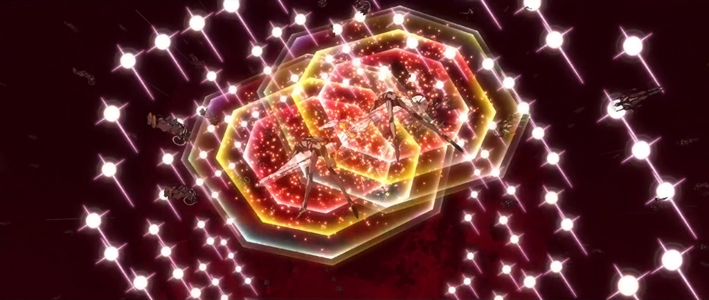
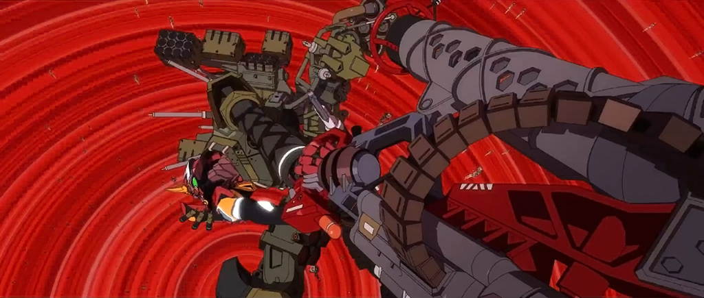
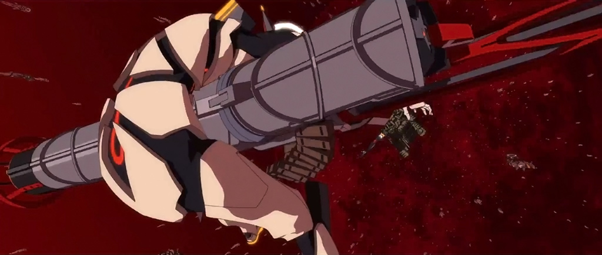
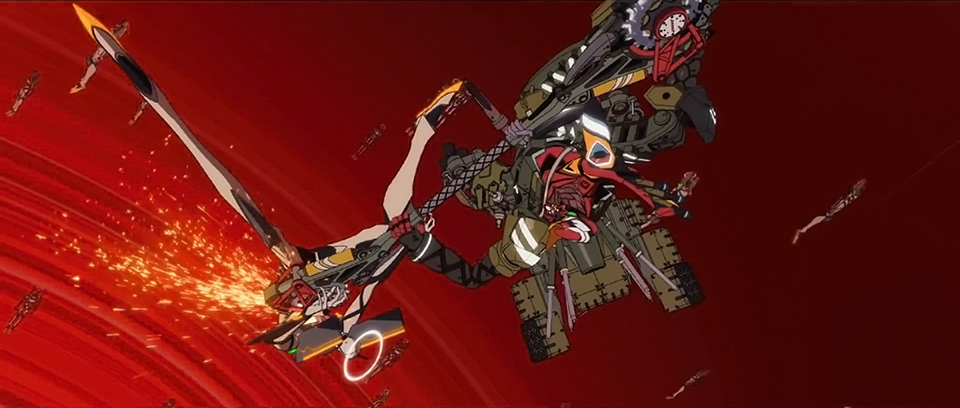
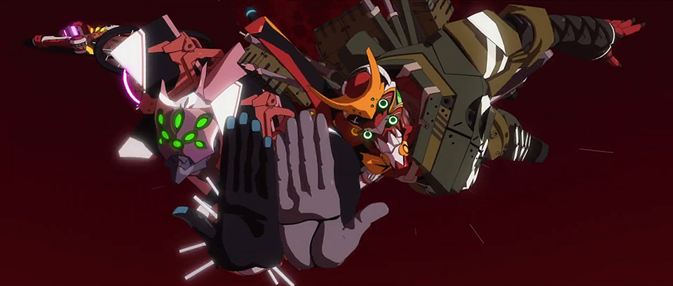
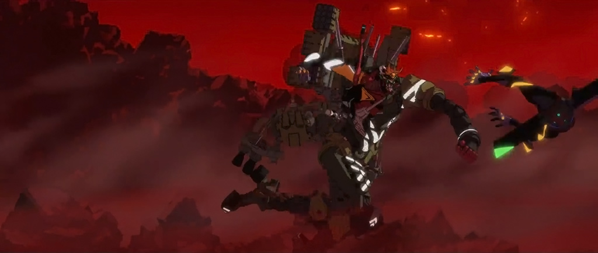

# Eva3.0+1.0 Translation Pt.2-B

## Summary

SPOILERS FOR EVA: 3.0+1.0.
Translated closed captions matched to audio description. WIP.

## Content

<strong>THIS IS YOUR LAST WARNING: </strong>

<strong>SPOILERS LIE AHEAD.</strong>

<a href="https://www.arqacrypha.net/post/eva-3-0-1-0-cc-ad-translation-pt-1-a#viewer-ftjt4" rel="noopener" target="_blank"><u>Introduction &amp; Disclaimers</u></a> 

<a href="https://www.arqacrypha.net/post/eva-3-0-1-0-cc-ad-translation-pt-1-a" rel="noopener" target="_blank"><u>Part 1-A (Complete!)</u></a> 

<a href="https://www.arqacrypha.net/post/eva-3-0-1-0-cc-ad-translation-pt-1" rel="noopener" target="_blank"><u>Part 1-B (Complete!)</u></a>
<a href="https://www.arqacrypha.net/post/eva-3-0-1-0-cc-ad-translation-pt-2-a" target="_blank"><u>Part 2-A (Incomplete)</u></a> 

<strong>Part 2-B (You're There!</strong> - Incomplete<strong>)</strong>
<a href="https://www.arqacrypha.net/post/eva-3-0-1-0-cc-ad-translation-pt-3" rel="noopener" target="_blank"><u>Part 3 (Complete!)</u></a>
<a href="https://www.arqacrypha.net/post/eva-3-0-1-0-cc-ad-translation-pt-4" rel="noopener" target="_blank"><u>Part 4 (Incomplete)</u></a> 

.........

<u>Another God-slayer</u> 

<u>Two Against One</u> 

<u>The Drop</u> 

<u>Landing on HQ</u> 

<u>Absolute Terror</u>
<u>Gates of Hell ~ Another Impact</u>
<u>Code 999</u> 

<u>The Thirteenth Reactivates</u>

<u>Shikinami Type</u> 

<u>Extended Notes</u> 

<strong>Free to use for individual personal use</strong> (including casual discussion).<strong> </strong>Providing credit and linking back are greatly appreciated, as I'm a little-known blog.<strong> Please ask before incorporating into fansubs or anything of a mass distribution nature.</strong>

Time Stamps (Approximate), Closed Caption File #

Audio Description
Personal Notes

Closed Captions (Dialogue) 

<em>Closed Captions (Sound Effects)</em>

<strong>↓ </strong>(down arrow) = in-page link to extended notes

<a href="https://www.arqacrypha.net/post/eva-3-0-1-0-cc-ad-translation-pt-2-a" target="_self"><u>←</u></a> RETURN TO PART 2-A?

<strong>PART 2-B START</strong>

[2-A/2-B dividing point currently indeterminate.]

(Wunder vertically descends, its leading edge turning red from the heat.

When it generates a forward A.T. Field ring, it accelerates.

The bridge, vibrating intensely.

At center, Misato stands imposingly, looking ahead.

The ship levels out.)

<strong>Aoba:</strong>

Monitor restored.

(It displays a world of white.
<figure></figure>
Five giant crucifixes stand in their flight path.)

[01:11:56, 1151]

<strong>Nagara:</strong>

Approaching ground zero area of former South Pole.

Entering the L-Barrier interface.

(Wunder, lowering a sled-shaped float.) [???]

[<strong>NOTE: </strong>The Japanese here is「そりの形をしたフロートを下げるヴンダー」. I can't think of any other way to render it, but with the context I have, it doesn't really make much sense, either. There isn't actually a "float" that Wunder is using to coast on the L-Barrier, is there??]

(When it's placed on the interfacial plane, the white surface shatters,

and Wunder leaves a red streak in its wake.) 
<figure></figure>
<strong>Nagara:</strong>

Now traversing the L-Barrier interfacial plane without issue.

(Kitakami looking around.)

<strong>Kitakami:</strong>

The L-Barrier, there to keep out life tainted with original sin...

We're right on top of it. 

(Takao, clutching the throttle lever.)

<strong>Takao:</strong>

Without a single blessing, humanity is venturing into that purified place. 

Courtesy of Kaji's data and the Anti-L System.

[01:12:29, 1159]

<strong>Nagara:</strong>

We'll reach the point of possible L-Barrier submersion in 20.

<strong>Misato:</strong>

Understood.

All ships, prepare to go under. 

(There's a blinding light at 10 o'clock...)

<em>{Explosion}</em>

(...and the ground shakes.) 

<strong>Everyone:</strong>

<em>Ugh!</em>

<strong>?:</strong>

Starboard second hull took a hit!

Damage unknown!

<strong>Kitakami:</strong>

Warship detected at bearing 3 o'clock!
<figure></figure>
<figure></figure>
(A massive warship appears from beneath the interfacial plane.)

<strong>Ritsuko:</strong>

Warship 2, installed with an Opfer Type -- the Erlösung!

I was <em>afraid</em> they'd finished it. 

(Fuyutsuki in the ship.)

<strong>Fuyutsuki:</strong>

My apologies.

You'll be humoring Ikari's whims just a bit more.

[<strong>NOTE:</strong> Original is 「すまんな。今少し碇のわがままにつきあってもらおう」. I kind of suck and struggle with もらう, so my rendition might be incorrect. Hope not, though.]

(The enemy warship, accompanied by a halo, surfacing as it comes around.

Hyuga on the bridge.)

[01:13:00, 1169]

<strong>Hyuga:</strong>

They're buying some time until Evangelion 13 reactivates.

<strong>Ritsuko:</strong>

Dealing with the same god-slaying power as Wunder's won't be easy.

<strong>Misato:</strong>

It's one on one. We can take them!

Ready starboard artillery for open fire!

Rush to the submersion point while we give Nerv's ship a diversion!

Attack!

<em>{Cannon fire}</em>

(Wunder's ship-borne guns all fire at once. 

The enemy ship, receiving the barrage.

While its armor repels the attack, it fires from its port side.
<figure></figure>
<figure></figure>
The Wunder, its A.T. Field breached, takes a hit.)

<em>{Explosion}</em>
<figure></figure>
(The starboard wing plows into the interface plane.
<figure></figure>
<figure></figure>
The enemy ship fires its seven main armaments.)

<em>{Explosion}</em>

[01:13:28, 1178]

(Wunder, tipped sideways by the recoil. 

It takes an additional barrage.) 

<em>{Cannon fire}</em>

<strong>Everyone:</strong>

<em>Wahhhh!</em>

<strong>Kitakami:</strong>

We're taking hits all over. 

Their firepower is unbelievable!
<figure></figure>
<strong>Tama:</strong>

This is bullshit! They have the same kind of ship we do!

<strong>Takao:</strong>

It's the difference between finished and unfinished. 
<figure></figure>
But <em>we've</em> got the superior main engine!

(Takao pulls the throttle down.

Behind the body of the ship, halos are successively generated.)

<em>{Rapid-firing}</em>

(Wunder distances itself from the attacking enemy ship.)

<strong>Nagara:</strong>

We've reached the L-Barrier submersion point!
<figure></figure>
<strong>Misato:</strong>

Quickly take us under!

<strong>Nagara:</strong>

Aye aye, ma'am.

[01:13:58, 1188]

(Wunder lowers its bow and goes into a nose dive.

Large undulations distort the interfacial plane.

Shredding the perfectly white surface, Wunder's silhouette descends into a red airspace.) 

<strong>Nagara:</strong>

We've cleared the first layer of the L-Barrier.

Now penetrating the second layer.

L-Barrier density plus 30. 

<strong>Kitakami:</strong>

Massive swarm of Eva Infinity at 12 o'clock off our bow.

<strong>Misato:</strong>

Ignore them! Cut straight through! 

(A massive amount of Infinities obstruct the forward field of vision.)

[01:14:28, 1192]

<strong>Kitakami:</strong>

Warship sighted ahead at 12 o'clock!

<strong>?:</strong>

An ambush?

(There's pale blue light within the darkness.

An enemy ship is blocking the way.) 

<strong>Ritsuko:</strong>

Warship 3, the Erbsünde.

They've snared us in a pincer attack. 
<figure></figure>
(The enemy ahead fires its two main cannons.)

<em>{Cannon fire}</em>
<figure></figure>
<figure></figure>
<figure></figure>
<figure></figure>
(Wunder's gun turrets explode.) 

<em>{Cannon fire}</em>

(They're fired on from behind, as well.)

<strong>Tama:</strong>

Not good!

Any more damage and it'll mess with our navigation.
<figure></figure>
<strong>Misato:</strong>

Warship 3 has fewer cannons; we'll take those out. 

Keep the helm steady, full battle speed!

[<strong>NOTE:</strong> First line is a bit difficult to parse and I probably messed up. Original is 「艤装が手薄な３番艦から排除する」.]

<strong>Nagara:</strong>

Aye aye!
<figure></figure>
(Nagara steps on the pedals.
<figure></figure>
<figure></figure>
<figure></figure>
Halos repeatedly generating, the Wunder accelerates.
<figure></figure>
<figure></figure>
<figure></figure>
<figure></figure>
<figure></figure>
Inside the maelstrom of Infinities, Wunder charges toward the enemy ship while taking cannon fire.

A halo forms under the enemy.) 

[01:15:05, 1200]

<strong>Hyuga:</strong>

Warship 3 is taking evasive action!

(It raises its bow.)

<strong>Misato:</strong>

It won't escape! We'll ram right into it!

(Wunder also lifts its head and rises.

The enemy ship is dead ahead.
<figure></figure>
<figure></figure>
Wunder lunges up at its opponent from below.)

<em>{Collision}</em>

<strong>Kitakami:</strong>

Fuck this shit!

[<strong>NOTE</strong>: Inserting "foul language" into J-&gt;E translations can be a bit contentious. There's a risk of coming off as ... edgy, if you will. I'll usually try to save it for special occasions, but Midori in particular has this very blunt way about her; she's not one for mincing words. So having her curse off the cuff captured her spirit, I thought.]
<figure></figure>
<figure></figure>
(The two remain entangled as they continue to rise.)

<strong>Misato:</strong>

Rotate the ship! Do a 180° roll!

We'll switch places with the enemy ship!

[01:15:29, 1206]

<strong>Nagara:</strong>

Yes, ma'am!

(A giant halo is generated.
<figure></figure>
The fingers spreading at the end of Wunder's starboard main wing, it slaps the enemy ship.

Both ships, their bows pointing up, slowly spin around the center of a vertical axis. 

After rolling 180°, Wunder pushes its opponent aside.

Fuyutsuki in Warship 2.) 
<figure></figure>
<strong>Fuyutsuki:</strong>

So she's using Warship 3 as a shield.

Heh. Still up to her old tricks. 
<figure></figure>
(Wunder, withdrawing from combat airspace.

The Black Moon's massive form appears in their flight path.)

[01:15:58, 1209]
<figure></figure>
<strong>Kitakami:</strong>

We're out of the Infinity swarm!

Breaking into the third layer of the L-Barrier!

<strong>Aoba:</strong>

Target Nerv Headquarters verified.

It's already relocated beneath the Black Moon. 

(Takao, eyes fixed on Nerv HQ.)

<strong>Takao:</strong>

Evangelion 13 will reactivate any time now.

<strong>?:</strong>

Warships 2 and 3 are gaining on our stern. 

<strong>Misato:</strong>

We're out of time. 

Use the Black Moon as a shield and keep us on course to rush Nerv HQ.

Prepare to fire the guided missiles. 

Get a coordinated lock on target Evangelion 13. 

[<strong>NOTE: </strong>Not 100% on the second part. Line is 「目標 第13号機再調整区画」 and it's hard to get a feel for what 再調整区画 is supposed to mean as a unit.]

<strong>Kitakami:</strong>

Nerv's warships approaching our stern at 6 o'clock! 

(Wunder, being bombarded from behind.) 

<em>{Cannon fire}</em>

[01:16:28, 1219]

<strong>Misato:</strong>

Tilt the ship. 

Minimize the vulnerable surface area. 

<strong>Nagara:</strong>

Aye aye, ma'am!

Starboard gravity ballast, blowing down by 20. 

<strong>Ritsuko:</strong>

Focus the A.T. Field on protecting the fleets over the main wings.

(The A.T. Field over the wings repels the cannon shot.) 
<figure></figure>
<em>{Cannon fire}</em>
<figure></figure>
(A fireball skims the surface of the Black Moon.

The shot breaks through and explodes.) 

<em>{Explosion}</em>

<strong>Kitakami:</strong>

<em>Ugh... </em>

Stern main armament has been badly damaged! 

We're getting pounded here!

<strong>Misato:</strong>

Keep your cool!

We have to hold out until we reach the launch point!
<figure></figure>
(While enemy fire explodes continuously at point-blank range...) 

<em>{Impact}</em>

<strong>?:</strong>

<em>Ugh.</em>
<figure></figure>
<figure></figure>
<figure></figure>
<figure></figure>
<em>{Repeated bombardment}</em>

(...Wunder flies forward at a parallel to the gouged-out Moon.) 

[01:17:00, 1229]

<strong>Nagara:</strong>

Optimal launch site for guided missiles will be reached in 10.

(Nerv HQ comes into view ahead of them.) 

<strong>Nagara:</strong>

We're all set!

<strong>Misato:</strong>

Launch all guided missiles!
<figure></figure>
<strong>Hyuga (?):</strong>

Launching all guided missiles!

(One after another, the massive battleships separate from the wings of the belly-up Wunder.

When they drop like bombs, 
<figure></figure>
they line up side by side and their N1 rockets ignite. 

They promptly accelerate.
<figure></figure>
The cluster of battleships, rushing in headfirst. 
<figure></figure>
<figure></figure>
Nerv HQ takes a direct hit.)

<em>{Explosion}</em>

(Debris from the flame-wreathed HQ caves in.

One can see inside the gaping empty hole.)

[01:17:33, 1234]

<strong>Aoba:</strong>

Our ultimate target, Eva 13, has been confirmed visually!

<strong>Ritsuko:</strong>

It's pre-reactivation, as we expected.

Eva 13 is still inoperable.

(Black smoke rises from HQ.

Granular objects fly out in all directions.)

<strong>Kitakami:</strong>

Eva 7 Series confirmed, currently closing in!

There's a ton of them! Impossible to get a count.

<strong>Misato:</strong>

Ignore the small fry!

Launch both Evas ASAP!
<figure></figure>
<strong>Ritsuko:</strong>

Maya, prepare to launch both Evas.

<strong>Ibuki:</strong>

Roger. Readying both Evas for launch!
<figure></figure>
<strong>Misato:</strong>

Launch them!

[01:17:58, 1242]

[<strong>NOTE</strong>: A lot of footage has been released for the following sequence, so <a href="https://www.youtube.com/watch?v=qwovDORTHIo" rel="noopener" target="_blank">,<u>I took the liberty of making an edit</u></a>. It's much more impressive in video form with "Paranoia" playing.]
<a href="https://youtu.be/qwovDORTHIo">https://youtu.be/qwovDORTHIo</a>
(Two aircraft carriers are dropped from the bottom of the ship.

The Wunder, overhead, becomes distant in a flash.) 
<figure></figure>
<figure></figure>
<figure></figure>
↑ [<strong>NOTE</strong>: I <em>suspect</em>, though have not confirmed, that this shot is notably different in the final movie.]

<strong>Misato:</strong>

I'm counting on you... 

Mari, Asuka.
<figure></figure>
(Eva-02 and -08 riding the decks of the still-falling aircraft carriers.
<figure></figure>
A massive throng of 7 Series comes up from directly below.

Pummeling against the aircraft carrier's bilges, several break through and reach the decks.

The shredded aircraft carriers both explode massively.

Fireballs billowing up, Mari in Eva-08 comes flying out.)
<figure></figure>
<strong>Mari:</strong>

<em>Woo-hooo!</em>

(Eva-02, as well, forces its way through the 7 Series throng, 
<figure></figure>
<figure></figure>
<figure></figure>
and it braces itself with limbs outstretched.

Skull faces are approaching from below.)

<strong>Asuka: </strong>

<em>*battle cry*</em>

Outta my way!

[01:18:31, 1246]
<figure></figure>
<figure></figure>
<em>{Mines launching}</em>

(Asuka continuously launches her dorsal mines.
<figure></figure>
<figure></figure>
<figure></figure>
The trail of countless pale blue ballistics follows the center of the spiraling explosions.)

<strong>Asuka:</strong>

Take that!
<figure></figure>
<figure></figure>
(While spinning around, Asuka fires with her autocannon.)

<em>{Machine-gun rapid-firing}</em>
<figure></figure>
<figure></figure>
(The band of shells aimed at the 7 Series gleam.
Eva-02's form vanishes down into the swirling red abyss.)

<strong>Mari:</strong>

Right, right.

Dearest apologies!
<figure></figure>
<figure></figure>
<figure></figure>
(Swinging the Dragon Carrier on its back, Eva-08 follows on after.) 

<em>{Machine-gun rapid-firing}</em>

<strong>Asuka:</strong>

<em>Tch!</em>

(Asuka, out of bullets.)

<strong>Asuka:</strong>

<em>*yelling*</em>

[01:19:00, 1263]
<figure></figure>
<figure></figure>
<figure></figure>
<figure></figure>
<figure></figure>
<figure></figure>
(She sends nearby enemies flying with the gun barrel.)

<strong>Asuka:</strong>

<em>Urrgh! </em>
<figure></figure>
<figure></figure>
<figure></figure>
(She throws the autocannon at the third enemy unit.)
<figure></figure>
<strong>Asuka:</strong>

Glasses, next target!<u>↓</u> 
<figure></figure>
<strong>Mari:</strong>

Got it!

(Mari uses emergency brakes.

The hood of the Dragon Carrier cleaves open. 

She tosses the naginata that's inside it.)
<figure></figure>
<strong>Mari and Asuka: </strong>

<em>*mild exertion sounds*</em>

(Asuka catches it.) 

<strong>Asuka:</strong>

<em>*battle cry*</em>

(After she takes down [one of the] 7 Series that comes rushing at her, 

she indiscriminately skewers successive enemies and flings the whole lot aside.)

<strong>Asuka:</strong>

<em>There!</em>

Next!

<em>{Impact}</em>

<strong>Asuka:</strong>

<em>Ah!</em>

(Tripped up by an enemy, she's thrown off balance.)

Asuka:

<em>Uuuwaaahhh!</em>

(Two, then three enemy units latch onto her.)

<strong>Asuka:</strong>

<em>*battle cry*</em>

<em>*fighting sounds*</em>

(She shakes them off, but fresh baddies barrel into her.)

[01:19:30, 1971]

(A big mouth approaches, with intent to bite.

The skull-head is split right in half with a rotating saw.)

<strong>Asuka:</strong>

<em>Crap.</em>
<figure></figure>
<figure></figure>
(Eva-08, who'd just provided assistance, tosses the saw to her.)

<strong>Mari:</strong>

Princess!
<figure></figure>
<figure></figure>
(Eva-02 catches it.

Brandishing the weapon, Eva-02 switches it on.) 
<figure></figure>
<figure></figure>
<strong>Asuka:</strong>

<em>*battle cry*</em>

(She decapitates the enemy that's before her, and takes up its headless body.)

<strong>Asuka:</strong>

<em>Hah!</em>
<figure></figure>
<figure></figure>
<figure></figure>
(She slashes at enemies with the saw, one after another.)

<strong>Asuka:</strong>

<em>Ugh!</em>

(The handle of the saw snaps in half, and she duel-wields the blades fore and aft.)

<strong>Asuka:</strong>

<em>*grunts &amp; growls*</em>

<strong>Mari:</strong>

Nyarome! 

[<strong>NOTE</strong>: Nyarome is a manga/anime character by Fujio Akatsuka. I couldn't begin to tell you why Mari says his name.]

<em>{Machine gun rapid-firing}</em>

(Eva-08 provides back-up, machine gun in hand.)

<strong>Mari:</strong>

<em>*grunt of effort*</em>

(It uses Eva-02 as a springboard and flies off.)

<strong>Asuka:</strong>

<em>Aiiee!</em>
<figure></figure>
<figure></figure>
(An enemy is lacerated by Eva-02.

The saw sends sparks scattering.)

[01:19:59, 1274]

<strong>Asuka:</strong>

<em>Hnnnghh! </em>

(Enemies are forming a dense mass beyond Asuka's line of sight.
The jumbled mass, while spinning like the teeth of a drill, closes in.)

<strong>Asuka:</strong>

Huh. 
The pseudo-Evas, of all things, are buddying up to block us.

Pain in the ass!

<em>*grunt*</em>! 

[<strong>NOTE: </strong>Asuka's phrasing here for "pseudo-Evas" is エヴァもどき (<em>Eva-modoki</em>). <a href="https://www.arqacrypha.net/post/eva-3-0-1-0-cc-ad-translation-pt-1#viewer-9tnot" rel="noopener" target="_blank">,<u>More here</u></a>.]

<em>{Rapid-fire sound}</em>

(Torpedoes are being rapid-fired from Eva-02's thighs. 

They penetrate the maelstrom and there's a big explosion.

The mass of clustered enemies reappears from within the whirling flames.)
<figure></figure>
<strong>Asuka:</strong>

Tsk! 

Glasses, need an assist!
<figure></figure>
<strong>Mari:</strong>

Yes, ma'am!
<figure></figure>
<figure></figure>
(Eva-02 and -08 hold their hands forward.
<figure></figure>
Their respectively generated A.T. Fields combine and magnify.

When the combined A.T. Field, shaped like the teeth of a tunnel boring machine, achieves high-speed rotation,

the enemy mass starts getting pulverized.)

[01:20:30, 1281]

<em>(Asuka and Mari's straining voices)</em>

(Asuka and Mari grit their teeth.

Once the mass is fully thwarted, their A.T. Fields promptly vanish.)

<strong>Asuka &amp; Mari:</strong>

<em>*vocalizing*</em>

(Without further interruption, they drop down into the deep-red space.
Nerv HQ draws closer.
Asuka braces herself.
Eva-02 takes Eva-08 into its arms.
Its backpack generates reverse thrust.

They move forward with resistance.) 

<strong>Aoba:</strong>

Both Evas have touched down on Nerv HQ.

(On top of HQ.
Asuka and Mari scramble down the slope of rubble.) 

<strong>Asuka:</strong>

Our target is below that blast hole.

<strong>Asuka:</strong>

Eh? ... <em>Ah!</em>

[01:20:59, 1287]
<figure></figure>
(Eva-02 turns around, and its face is seized by a giant arm.

The arms-only unit produces a knife.)

<strong>Asuka:</strong>

<em>Uwaahhh...</em>

(Staggering, Eva-02 struggles to shake off the arm unit.
<figure></figure>
When Eva-02 drops down and rolls, the arm unit goes away.
<figure></figure>
<figure></figure>
<figure></figure>
<figure></figure>
Eva-02 rights itself, and two arm units attack it.) 

<strong>Asuka: </strong>

<em>*fighting sounds*</em>
<figure></figure>
(Eva-02 is toyed around with by several arm units bouncing around the vicinity.)

<strong>Asuka:</strong>

These things are annoying as all hell!
<figure></figure>
<figure></figure>
<figure></figure>
(Eva-02 fights back bare-handed.)

<strong>Asuka:</strong>

<em>*grunt*</em>
<figure></figure>
<figure></figure>
(She shakes them off again and again...)
<figure></figure>
<figure></figure>
<strong>Asuka:</strong>

<em>Wahhh!</em>

(...but an arm unit's knife comes at her.)

<strong>Asuka:</strong>

<em>*struggling*</em>

[01:21:31, 1294]

(A cluster of enemies explodes.
<figure></figure>
Eva-02 turns its head.)

<strong>Asuka:</strong>

<em>*breath*</em>

<strong>Mari:</strong>

After you, Princess!

<strong>Asuka:</strong>

My bad, Glasses!

(There's a glowing whip in Eva-08's hand.

Eva-02 is pursued by arm units.

She detaches the backpack. It explodes on her pursuers.)

<em>{Explosion}</em>
<figure></figure>
<figure></figure>
(Eva-02 jumps, escaping the approaching fireball.

Upon plunging into the fissure in HQ, it lands in a pool of red liquid.

A giant column of the liquid rises up.

When the huge wave settles, Eva-02 is kneeling with the stop signal plug on its back.

Rising with the plug in hand, it looks to a cross-shaped pedestal further in.)

[01:22:01, 1299]

<strong>Asuka:</strong>

Eva Unit 13.

Just in time.
<figure></figure>
(Pushing through the liquid accumulating underfoot, Eva-02 walks forward.)

<strong>Asuka:</strong>

No matter how much you were extolled as a divine Eva unit...

In the end, you're just the thirteenth man-made all-purpose decisive humanoid weapon. 

(Something massive is stretched out on the pedestal.)

<strong>Asuka:</strong>

Even if I can't destroy the Eva...

driving a forced stop signal plug into the core should keep it from activating. 

[01:22:31, 1307]

<strong>Asuka:</strong>

And so this... 

is... 

(The plug transforms into a cross. 
<figure></figure>
<figure></figure>
<figure></figure>
Asuka aims at the core and swings down.)

<strong>Asuka:</strong>

the end!
<figure></figure>
<figure></figure>
<figure></figure>
(But then she is obstructed by a barrier radiating from the surface.)
<figure></figure>
<strong>Asuka:</strong>

An A.T. Field?

But Eva 13 shouldn't have an A.T. Field!

<em>How?</em>

<strong>Asuka: </strong>

This is the Eva's own A.T. Field!<u>↓</u> 

N-02 is scared of Eva 13?

***
<figure></figure>
(Amidst the debris, Eva-08 stands in place, swinging its light-whip.) 

<strong>Mari:</strong>

<em>*exhales*</em>

[01:22:59, 1314]

(Three arm units explode in midair at close range.

Eva-08 is completely surrounded.) 

<strong>Mari:</strong>

<em>Uwaa!</em>

Uh...

<em>{Explosion}</em>

(The left arm is lost in the arm units' self-destruct attack.)

<strong>Mari:</strong>

<em>*grunt*</em>

(In the entry plug, Mari grabs her left arm.)
<figure></figure>
<strong>Mari:</strong>

Something strange is going on...

Gendo-kun, what are you up to?

***

(Combat airspace. The two enemy ships break away from Wunder in front and behind.)

<strong>Kitakami:</strong>

Huh, that's odd.

Nerv's warships are breaking away from the front.

They're descending.

(Warships 2 and 3 are slowly descending.

The rainbow-colored barrier that's spread out below vanishes as though opening a path.)

[01:23:28, 1322]

(Terrain resembling a crater appears at the center of the swirling barrier.

Misato, looking down from the bridge.)

<strong>Misato:</strong>

The accursed epicenter of Second Impact.

So that's Calvary Base.

(There's a giant purple hole at the center.)

<strong>Misato</strong>

The Gates of Hell are opening again...

It can't be!

(Warship 2's towers emit light.

Warship 3's, as well.)

<strong>Misato:
</strong>Wings of light?

They plan to make Fourth Impact happen the same way Second did? 

[<strong>NOTE</strong>: Literally "through the same means as Second".]

<strong>Ritsuko:</strong>

No.

The ships were built to be the Guards of Guf.

Triggering them shouldn't be possible. 

[01:24:01, 1330]

<strong>Ritsuko:</strong>

Moreover, the phenomenon surrounding the Black Moon differs from the plan.

This isn't part of Seele's scenario.

It's a rite unknown to us.

<strong>Misato:</strong>

Completely unexpected...

So that makes this Another Impact.

(The Black Moon shape-shifts into a giant spear.)

<strong>Misato:
</strong>Whatever happens... 

we'll completely obliterate Nerv's plans!

<strong>Misato:</strong>

Prepare to fire main cannons!

We'll sink them first, starting with Warship 3.

Aim all available gunports at Warship 3!

Load super-electromagnetic direct fire ammo.

Pelorus linkage unnecessary.

Soon as all guns are ready, start firing!

[01:24:30, 1338]

<strong>Ritsuko:</strong>

But there should be one more ship in the construction plans.

<strong>Misato:</strong>

Attack!

(The main guns float in the air and the turret bases explode.)

<em>(Everyone sounding surprised)</em>

<strong>Misato:</strong>

Status?

<strong>Tama:</strong>

Direct hit! 

Something has pierced the second hull of both gunwales!
<figure></figure>
<strong>Hyuga:</strong>

Damage to the bow.

Main gun turret system is down!

(Wunder being pierced through both port and starboard sides.

The cloaking cocoon breaks, and the enemy warship impaling Wunder reveals itself directly below.)

<strong>Ritsuko:</strong>

Warship 4, the Gebet!

We fell right into their trap.

***

(Nerv HQ. Asuka brandishing the stop signal plug.)

[01:25:02, 1345]

<strong>Asuka: </strong>

However they cap off the Impact, they're going to need this thing.

So I <em>have</em> to take care of this right now, for real. 

(She's being repelled by the A.T. Field.)

<strong>Asuka: </strong>

Figures that my quarry is right here and I can't bag it. 

Time for last-ditch measures.

Sorry, N-02!

I need to push you to the brink again.

<strong>Asuka:</strong>

Release all limiters. 

Backdoor code 999!

[<strong>NOTE:</strong> "999" is pronounced "three-nine".]

(The entry plug interior lighting shuts off and switches to the backdoor mode monitor.

Asuka tears off the eyepatch.)

<strong>Asuka:</strong>

<em>Urgh!</em>

(Her left eye, glowing blue, is exposed...)

[01:25:30, 1352]

<strong>Asuka:</strong>

<em>*grunts of pain*</em>

(Her left eye, glowing blue, is exposed; 
<figure></figure>
and the wide-open eye is penetrated by a small black pillar emerging.)

<strong>Asuka:</strong>

<em>*crying out in pain*</em>

(Asuka, bending backwards, pulls out the sealing pillar with both hands.

She throws it at the wall. The DSS Choker at the base of her neck starts up.)

<strong>Asuka:</strong>

<em>*grunt*</em>

<em>***</em>

(Bridge.)

<strong>Aoba:</strong>

Pattern blue! 

9th Angel reaction present in Nerv Headquarters!

***

(Mari engaged in hostilities with arm units.)

<strong>Mari:</strong>

<em>Hngh! Ugh! </em>
<figure></figure>
<strong>Mari: </strong>

Princess! You're going to use the Angel's power?<u>↓</u> 

***

(Eva-02 interior.

An aurora-esque light fills the entry plug.

Pale, glittering particles swirl about.

The rainbow-colored Asuka grits her teeth.)

<strong>Asuka:</strong>

<em>*straining*</em>

[01:26:01, 1360]
<figure></figure>
<strong>Asuka:</strong>

The Angel blood...

Transfuse it all!

(The three cylinders on Eva-02's shoulder fire up.

The Angel serum gets pumped throughout Eva-02.)

<strong>Asuka:</strong>

<em>*grunting*</em>

(Eva-02, its stiffened body violently spasming, 
tenses its shoulders and bends backward, the left arm jettisoning.) 

<strong>Asuka: </strong>

<em>*straining*</em>

(The Eva's vacant-looking eyes flicker.

Asuka, in agony, sends tears flying.)

<strong>Asuka: </strong>

<em>*groaning*</em>

From Eva-02's left shoulder, where nerve cables are hanging, an A.T. Field arm is generated. 

The Eva tries to emerge from the armored suit comprising its lower body.)

[01:26:30, 1365]

<strong>Asuka:</strong>

<em>Ungggh...</em>

<em>*exhales*</em>

(The jaw lock disengages, and Eva-02 opens its mouth wide.)

<em>(Asuka yelling and Eva roaring)</em>

(While the head transforms, powerful light radiates forth.
As the armored body crumbles away, there's a glimpse of the exposed silhouette.)

<em>{Roar}</em>
<figure></figure>
(A dazzling dome like a nuclear explosion engulfs the vicinity.
<figure></figure>
An Eva-02 made of A.T. Field emerges from within the light. 
<figure></figure>
Asuka rears up.)
<figure></figure>
<strong>Asuka:</strong>

<em>Waaahhh!</em>
<figure></figure>
<figure></figure>
<figure></figure>
<figure></figure>
(Breaking through the rubble of HQ, Beast Eva-02 reveals its massive, glittering body.)

[01:26:58, 1370]

<strong>Mari:</strong>

Princess... 
You're going to throw your humanity away?

(Beast Eva-02, accompanied by a glowing halo.

A second set of arms -- in addition to those holding the enlarged stop signal plug -- enter frame.

It thrusts its rainbow-colored fingers into the multicolored barrier between it and Eva 13.)

<strong>Asuka:</strong>

I'll use my A.T. Field... 

to neutralize N-02's!

(Light in the seven prismatic colors, mutually interfering.

Both hands trembling from exertion, the ten fingers rip through the barrier.)

<strong>Asuka:</strong>

<em>Urggh! </em>
<figure></figure>
<em>Gwaaaaahhh!!</em>

(Beast Eva-02 thrusts down the shining plug it had been holding aloft.

Eva 13 suddenly opens its eyes.)
<figure></figure>
<figure></figure>
[01:27:30, 1375]

(A beam of light surges forth, blowing off Eva-02's arms and detonating.)

<em>{Explosion}</em>

<strong>Asuka:</strong>

<em>*screaming*</em>

(Asuka in agony, her arms being burned.

A giant glowing crucifix rises up over HQ.)

<em>(Asuka screaming)</em>

(Beast Eva-02's A.T. Field body ruptures. 

The two spears impaling Eva 13's chest smoothly slide out, and they fly toward [Eva-02's?] body.

Both hands that were fixed to the pedestal come out of the restraints, and Eva 13 stands up.

When it seizes Eva-02 -- which has returned to normal -- by the neck,  its four glowing eyes turn towards Asuka.)

[01:27:56, 1378]

<strong>Asuka:</strong>

Wasn't it single-entry?

[<strong>NOTE:</strong> Presumably she's operating on the assumption that four open eyes = two active pilots.]

(Eva 13 extends the second set of arms that were folded over its chest.

Its left hand lunges like a sword and penetrates Eva-02's chest.

Eva-02 vomits blood. The halo vanishes.) 

***

(Mari engaged in hostilities.)

<strong>Mari:</strong>

Oh no! 

Gendo-kun's sights are set on the Angelized Princess!

(She's fighting one-armed, but the three arm units use a suicide attack to seriously damage the right arm too.)

<strong>Mari:</strong>

<em>*grunting*</em>

<em>{Explosion}</em>

<strong>Mari:</strong>

<em>Waaah!</em>

***

(Eva-02 interior.

Asuka in the entry plug, surveying her environs.)

<em>(Laughter)</em>

<strong>Asuka:</strong>

<em>*gasp*</em>

(When she faces forward, a naked female is standing up.)

<em>(Laughter Continues)</em>

<strong>Asuka:</strong>

A Shikinami Type... My original?

[01:28:30]

(Long hair fluttering, Original Asuka steps forward.)

<strong>Shikinami Type: </strong>

<em>*malevolent laugh*</em>

(Bending her knees and crouching down, she brings her face close.)

<strong>Shikinami Type: </strong>

The last Eva is in the image of God.

You, too, need but receive me with love. <u>↓</u> 

Now, come along.

(When Asuka grabs her own throat, she tears off the plugsuit.)

<strong>Asuka:</strong>

Sucks for you, huh?

[<strong>NOTE:</strong> I presume this is referring to her DSS choker getting ready to detonate, i.e., "hah! I'll die before you can take me!".]
<figure></figure>
<figure></figure>
(Original Asuka smiles.)

<strong>Shikinami Type:</strong>

Heh.

(She reaches for Asuka's DSS Choker -- which is advancing in its response -- 

and embraces her.)
<figure></figure>
<strong>Shikinami Type:</strong>

There's no point, dummy.

<strong>Asuka:</strong>

<em>*gasp*</em>

(The light enclosing the entry plug begins to spread before them.)

[01:29:01]

(Original Asuka has turned deep red, her body converted into energy.) 

<strong>Asuka:</strong>

Ah...
<figure></figure>
(She pulls on the face of Asuka, who has been Angelized blue. 

The choker that was left behind inside [the entry plug] explodes.)

<em>{Explosion}</em>

(Eva 13 uses the hand that's stuck inside Eva-02 to rend 02's flesh. 

At the same time, it pulls the entry plug out.

Eva-02's eyes lose their radiance.)

<em>{Roar}</em>

(Its body expands and bursts. The LCL ?that popped out? pours down.)

<strong>END PART 2</strong>

ONWARD TO PART 3?　<a href="https://www.arqacrypha.net/post/eva-3-0-1-0-cc-ad-translation-pt-3" rel="noopener" target="_self"><u>⇒</u></a> 

<h3>Extended Notes</h3>

[01:19:05, 1254] <strong>"Glasses, next target!"</strong> "Glasses" is, of course, コネメガネ (<em>konemegane</em>), Asuka's nickname for Mari. This one is a pun on <em>honemegane</em> (horn-rimmed glasses), with "<em>kone</em>" coming from the word "connection" -- as in, social connections. All of Asuka's pilot nicknames imply that the others got their roles through nepotism rather than merit/talent, and this one is no different. I haven't seen any good way to translate k<em>onemegane</em> into English (Dan Kanemitsu tried with "Four-Eyed Crony", but just... <em>yeeeeesh</em>), so I settle for "Glasses". It lets you, the reader of my humble attempted translations, know when Asuka is using the nickname, without forcefully subjecting you to something horrible every time.

[01:22:49, 1311] <strong>"This is the Eva's own A.T. Field!"</strong>  Obnoxious line. It's apparently taken in context to be referring to Eva-02's A.T. Field, rather than Eva 13's, and this is probably how <em>Asuka</em> intends it. But there does seem to be something... "fucky"... going on here. I'm keeping the translation ambiguous because I think there's a good chance Anno is up to his usual "EXACT WORDS / double meanings" tricks. For reference, here's the relevant dialogue:]

第13号機は A.T.フィールドを持たないはずなのに

なんで?

これって このエヴァ自身のA.T.フィールド!

[01:25:50, 1358]<strong> "Princess! You're going to use the Angel's power?"</strong> Original is 「姫！ 使徒の力を使う気？」 ("<em>Hime! Shito no chikara o tsukau ki?"</em>). Hard to translate this in a way that retains the Japanese's vagueness. "<em>Shito no chikara</em>" could be equally interpreted as differently as <em>"the</em> Angel's power" (implying the Angel is something separate from Asuka) or "<em>your</em> Angelic power" (that is, the Angel is Asuka and the power is hers). The mystery is, as always, on purpose.

[01:30:14, 1390]<strong> "You, too, need but receive me with love." </strong>The second line here is originally あなたも 愛と共に私を受け入れるだけ. Thanks to <strong>Nuke-kun</strong> for suggesting a much-needed fix to my previous rendition. For 受け入れる, I have deliberately chosen "receive" rather than "accept" in order to play up the religious connotations that have been invoked by comparing Eva 13 to God (or <em>a</em> god) in the previous line, and earlier by Asuka when she first approaches Eva 13 (「<strong>神の</strong>機体をうたったところで所詮は人の作り出した第13番目の汎用人型決戦兵器」). Suspicion confirmed via Google search, too<em>; </em>キリストを受け入れる =<em> Kirisuto o ukeireru</em> = "to receive Christ" is very much a thing. Why is "Original Asuka" implicitly comparing herself to Jesus? Well... I've been saying for years now that Asuka is the incarnation of Eva 13's base body, so... yeah.

<u>Return to Top</u> 
