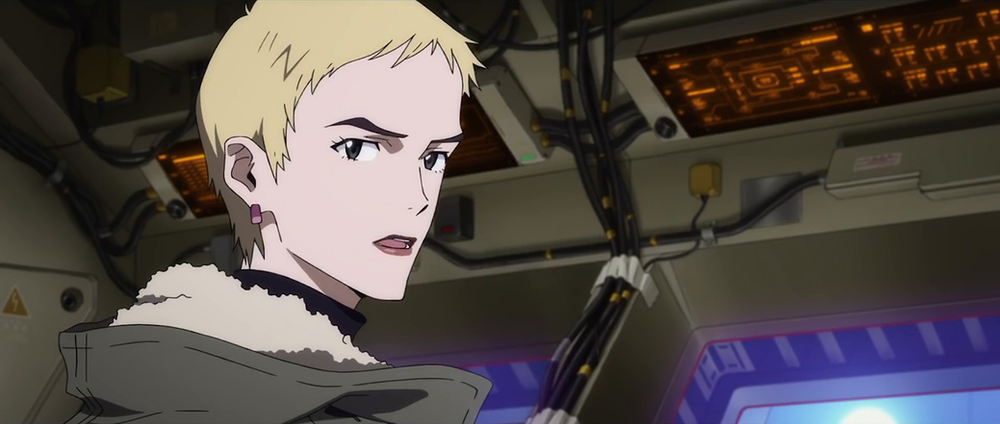
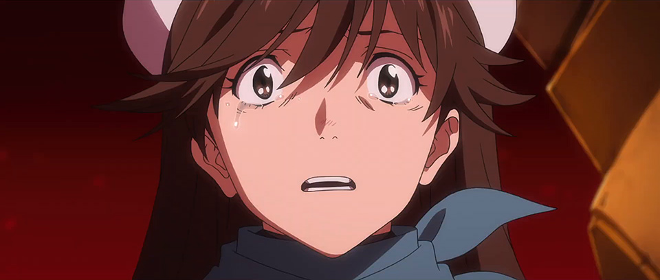

# Eva3.0+1.0 Translation Pt.3

## Summary

SPOILERS FOR EVA: 3.0+1.0. Translated closed captions matched to audio description. Section complete.

## Content

<strong>THIS IS YOUR LAST WARNING: </strong>

<strong>SPOILERS LIE AHEAD.</strong>

<a href="https://www.arqacrypha.net/post/eva-3-0-1-0-cc-ad-translation-pt-1-a#viewer-ftjt4" rel="noopener" target="_blank"><u>Introduction &amp; Disclaimers</u></a> 

<a href="https://www.arqacrypha.net/post/eva-3-0-1-0-cc-ad-translation-pt-1-a" rel="noopener" target="_blank"><u>Part 1-A (Complete!)</u></a> 

<a href="https://www.arqacrypha.net/post/eva-3-0-1-0-cc-ad-translation-pt-1" rel="noopener" target="_blank"><u>Part 1-B (Complete!)</u></a>

<a href="https://www.arqacrypha.net/post/eva-3-0-1-0-cc-ad-translation-pt-2-a" target="_blank"><u>Part 2-A (Incomplete)</u></a>
<a href="https://www.arqacrypha.net/post/eva-3-0-1-0-cc-ad-translation-pt-2" rel="noopener" target="_blank"><u>Part 2-B (Incomplete)</u></a>
<strong>Part 3 (You're There! - Complete!)</strong>
<a href="https://www.arqacrypha.net/post/eva-3-0-1-0-cc-ad-translation-pt-4" rel="noopener" target="_blank"><u>Part 4 (Incomplete)</u></a> 

<u>Master of the Buße</u> 

<u>Showdown on the Bow Deck</u> 

<u>The Commodification of Life</u> 

<u>Purple Tsunami</u> 

<u>08 &gt; 09</u> 

<u>A Shared Burden</u> 

<u>The Sorrow of Suzuhara Sakura</u> 

<u>Ittekimasu / Itterasshai</u>
<u>Entering Negative Space</u> 

<u>Sync Ratio: Infinity</u>
<u>The Promised Land</u>
<u>Alpha and Omega</u> 

<u>Stage of Memories</u> 

<u>Additional Impact ~ Another Miracle</u>

<u>Extended Notes</u> 

<strong>Free to use for individual personal use (including casual discussion). </strong>Providing credit and linking back is greatly appreciated, as I'm a little-known blog.<strong> Please ask before incorporating into fansubs or anything of a mass distribution nature.</strong>

Time Stamps (Approximate)

Audio Description
Personal Notes

Closed Captions (Dialogue) 

<em>Closed Captions (Sound Effects)</em>

<strong>↓ </strong>(down arrow) = in-page link to extended notes

<a href="https://www.arqacrypha.net/post/eva-3-0-1-0-cc-ad-translation-pt-2" target="_top"><u>←</u></a> RETURN TO PART 2-B?

<strong>PART 3 START</strong>

<figure></figure>
<strong>Mari:</strong>

Asuka!

***

<strong>Aoba:</strong>

We've lost all signals from N-Eva-02!

Status of pilot unknown!

(The hull is engulfed in an explosive orange blaze.)

<em>{Explosion}</em>

<strong>Tama:</strong>

Auxiliary N2 engine badly damaged!

[01:29:29]

<strong>Hyuga (?):</strong>

Damn it, what <em>now</em>?!
<figure></figure>
(A giant shadow appears on the full monitor. 

It's ramming into the ship from below.)
<figure></figure>
<strong>Kitakami:</strong>

Something Eva-like. 

It's holding fast to us!

(The humanoid weapon that's upside down on the bottom of the ship starts to walk slowly.)

<strong>Ritsuko:</strong>

Pattern blue.

An Eva Opfer Type. 

<strong>Misato:</strong>

So they rebuilt the Mark.09, pilot and all!

(Mark.09, having finally arrived at ??, places its hands down. 

Its hands, turned blue and syrupy, slowly ooze into the hull.) 

<strong>Kitakami:</strong>

This is bad! 

The ship internals are being physically corroded!
<figure></figure>
<strong>Ritsuko:</strong>

Get it out! Hurry!

***

[01:29:58, 1412]

<strong>Ibuki: </strong>

We're on it, but...

It's intruding too quickly; we can't catch up!

(The blue goo approaches Ibuki. She closes the hatch.)

***

<em>{Alarm}</em>

(Warning display on the monitor. The ship's name changes to Buße.)

<strong>Aoba:</strong>

Mark.09 broke through the VD wall!

<strong>Tama:</strong>

No good! Controls have been completely taken over!

(The control tower is forcibly removed; Misato and the others are driven out of the bridge.)

<em>{Impact}</em>

<strong>Everyone:</strong>

<em>Wahhh!</em>

<em>(Repeat)</em>

(Control of door locks on the ship is lost.)

***

(Explosion-proof isolation ward. The lock is disengaged, and the door to Shinji's room opens slightly.)

***

(Control tower. Takao.) 

<strong>Takao:</strong>

Guess this thing's been done in. 

[<strong>NOTE</strong>: Original is 「こいつは やられたな」. Referring to the Wunder finally being taken by Nerv after a long fight?]

<strong>Ritsuko:</strong>

I'd expect no less from Deputy Commander Fuyutsuki. 

Masterful.

***

[01:30:31]

(Exterior. 

Warship 4 is descending slowly.

Wunder, which was being impaled where the main wings meet the body, becomes free.

Wunder's body radiates faintly.

Beams are fired off from the three parabolic antennae. 

Wings of light are formed above the four warships.)

***

<strong>Fuyutsuki:</strong>

The artificial recreation of Lilith,

along with the forced siphoning of the Black Moon into a spear. 

The stage is set. 
<figure></figure>
How will you perform the finale to come, Ikari?

***

(A human figure suddenly descends onto the Wunder.)

***

[01:31:00]

<strong>Aoba:</strong>

Intruder detected on the bow deck!

(Misato, her eyes fixed on the monitor.)

<strong>Misato:</strong>

Commander Ikari!

***

(Quarantine chamber.)
<figure></figure>
 (Shinji opens his eyes. He rises, holding the music player.)

***

(Mari inside Eva-08, hanging her head.)

<strong>Mari:</strong>

<em>*grunting*</em>

Sorry, Princess.

It's the very epitome of shame.

This situation is a temporary setback, I guess.

(She jumps clear of the spear tip that comes rushing down from above.

The levitating Nerv HQ is pulverized by a direct hit by the Black Moon-turned-spear.) 

***

(Wunder's deck.)

<strong>Misato:</strong>

Long time no see,

[01:31:31, 1430]

(A certain someone with black goggles, looking up into the sky, turns his head.)

<strong>Misato:</strong>

Commander Ikari.
<figure></figure>
(He and Misato facing off, standing at a distance from each other.)

<strong>Gendo:</strong>

Your efforts up to this point are appreciated, Colonel Katsuragi.

We will use this ship as planned.

<em>{Gunfire}</em>
<figure></figure>
(He takes a gunshot in the goggles. 

Ritsuko, standing behind Misato.) 

<strong>Gendo:</strong>

It's you...

Uncompromising as ever. 

Zero hesitation where your objectives are concerned. 

(She has a handgun at the ready.)
<figure></figure>
<strong>Ritsuko:</strong>

Yes. 

Things I learned from you.
<figure></figure>
<em>{Gunfire}</em>

[01:32:01, 1438]

(Gendo, his head thrown back, collapses.

Ritsuko, the muzzle of her gun still aimed.) 

<strong>Ritsuko (?):</strong>

<em>*gasp*</em>

(Gendo picks up his scattered brain tissue and puts it back into the hole in his head.)

<strong>Gendo:</strong>

Gods are bound by nothing.
<figure></figure>
(??? a glowing crevice.)

<strong>Gendo:</strong>

They simply roll with whatever comes their way.

<strong>Misato: </strong>

Ikari Gendo,

you <em>wanted</em> to use the Key of Nebuchadnezzar and throw your humanity away?!

<strong>Gendo:</strong>

I merely appended my body with data transcending the Logos of this world.

Without issue.

[01:32:30, 1445]

(Eva-02's head drops onto the deck.)

<em>{Impact}</em>

(Eva 13 alights behind Gendo.)

<strong>Misato &amp; Ritsuko:</strong>

<em>*gasp*</em>

<strong>Gendo:</strong>

Slaying God, I will weave humanity and the divine together...

[<strong>NOTE:</strong> But if you murder '<em>kami</em>', how can you combine '<em>kami</em>' with humanity? MAKE SENSE, GENDO!!!]

<strong>Gendo:</strong>

With the sacrifice of the Angels, 

I will bring about humanity's evolution and complementation. 

<strong>Misato:</strong>

That's why you're treating Asuka like a disposable,

Ikari Gendo?!

[<strong>NOTE</strong>: Hard to streamline the first part. She says アスカを使い捨てる, literally "you're using and throwing away Asuka", like a product that's meant to be used once and then tossed.]

<strong>Gendo:</strong>

It's because the Ayanami and Shikinami Type pilots were prepped for this purpose from the very start.

Without issue.
<figure></figure>
<figure></figure>
<figure></figure>
(Eva 13 bites down on the entry plug ?inserted [in its mouth]?.)

[1:33:01, 1454] 
<figure></figure>
<figure></figure>
<figure></figure>
(It awakens and its body glows white.

The Black Moon spear, the tip of which changed color to red, starts revolving and turning into core. 

In the background, wings of light hover in the air.

The spear aims at the Gates of Guf that are yawning open below, and it drops down.

The Gates of Guf are penetrated by the spear.
<figure></figure>
<figure></figure>
<figure></figure>
<figure></figure>
<figure></figure>
The giant hole is expanded, and purple Eva Infinities gush out in swarms.
<figure></figure>
<figure></figure>
A swelling wall of purple approaches Ritsuko and the others on the deck.)

<strong>Ritsuko:</strong>

This is the commodification of humanity -- 
no, of the ancient life of this planet.

[01:33:30, 1456]

<strong>Misato:</strong>

Converting all souls into core...

Making them assimilate with the Eva Infinities...

You've initiated Fourth Impact?!

(The Infinity swarm engulfs Wunder.)

[<strong>NOTE</strong>: Audio description is basically absent during Gendo's expo-dump -- annoying, but presumably Gendo doesn't give the AD guy a chance to say anything.]

<strong>Gendo:</strong>

That's right.

The ocean was purified via Second Impact.

The earth was purified via Third.

And souls will be purified through the Fourth. 

[01:33:54, 1463]

<strong>Gendo:</strong>

The core forming the Eva Infinities is the soul made material. 

The vessels of the species called humanity will be cast aside... 

And its collective wisdom beckoned to an unsullied paradise...

With <em>this</em>, the final ceremony.

<strong>Gendo:</strong>

In exchange for the Second Impact,

your father, Dr. Katsuragi, verified the hypothesis he had proposed: 

the Human Instrumentality Project. 

<strong>Misato:</strong>

I'm putting an end to my father's bullshit,

whatever it takes.

[01:34:25, 1471]

<strong>Gendo:</strong>

To humanity, who ate of the Fruit of Knowledge, God handed down two destinies. 

Be destroyed by the Angels bestowed with the Fruit of Life;

or annihilate the Angels, supplant them, and turn ourselves into children of God, existing eternally without wisdom. 

[<strong>NOTE:</strong> "<strong>Wisdom</strong>" here is "<strong><em>chie</em></strong>". "Fruit of <strong>Knowledge</strong>" is "<strong><em>chie</em></strong><em> no mi</em>". Same word in Japanese, just so you don't get confused.]

<strong>Gendo:</strong>

We must choose one, or the other.

Nerv's Human Instrumentality Project is a resistance -- using the Adams -- to the God of Seele, they who chose the latter destiny. 

However ephemeral, it's something worth doing in full.<u>↓</u> 

[01:34:58, 1482]

<strong>Ritsuko:</strong>

We'll take a hopeful "Continue" over a despairing "Reset" via an Instrumentality Project that bows to God.

<strong>Misato:</strong>

I believe in the wisdom and will of humanity; 

it will overcome even God's power. 
<figure></figure>
(She clutches the bandanna.) 

<strong>Gendo:</strong>

It's a difference in how we perceive the truth.

The world is outside your notice, Colonel Katsuragi, much as Akagi-kun sees no way to be happy.

(Infinities overhead.)

<strong>Gendo:</strong>

Nothing in the human heart changes.

(They form into a giant purple cross.)

<strong>Gendo:</strong>

With this, all the horsemen are gathered.

[01:35:29]

(Gendo, who had been looking up, looks over his shoulder.

A powerful radiance is emitted from the center of his forehead.)

<em>{Explosion}</em>

(The center of Wunder explodes.

Behind Gendo, a green-eyed Eva comes floating up.)

<strong>Gendo:</strong>

Now then, you will return Eva-01 to me from your custody.
<figure></figure>
<figure></figure>
<figure></figure>
(Gendo, his forehead brightened, turns his back.) 

<strong>Shinji:</strong>

Father!
<figure></figure>
(Shinji perceptively taking in what's before him.
<figure></figure>
Misato and Ritsuko looking over their shoulders at Shinji.

With his back still turned, Gendo's feet take to the air,

and he rises toward Eva 13, which is glowing white and holding the two spears.)

[01:36:00]

(Misato and Ritsuko are looking up.
<figure></figure>
Gendo enters Eva 13's mouth.

Eva 13's mouth shuts.

When it raises itself up, it returns to its original colors.

Eva-01, being gently held against Eva 13's chest.)

<em>{Roar}</em>
<figure></figure>
<figure></figure>
<figure></figure>
<figure></figure>
<figure></figure>
(Eva 13 flies off, doing a somersault like it's bending backwards,

and goes diving headfirst into the Gates of Guf.)

***

(A giant swarm of Infinities, surging toward ground level.

The swell of purple becomes a tsunami and swallows up the ground.) 

[01:36:28]

(It descends upon the houses and buildings.)

***

(Village outskirts.

The giant purple wave is being held back by the sealing pillars.)

<em>{Impact}</em>

(Kensuke stares at it, a camera in his hands.)

<em>{Windows shaking}</em>

(Toji's residence.

Hikari's father near a 1.8L bottle, stirring a sake cup.)

<em>{Frightened voices}</em>

(Toji, looking up at the purple wall on the roadside.)

[01:36:59]

<strong>Toji:</strong>

We kept on going even after N3I. 

Have faith in our fortunes and in Misato-san's Wille.

(Hikari holding Tsubame closely.)

***

(Wunder's deck. Ritsuko holding a tablet.)

<strong>Ritsuko:</strong>

Beyond the Gates of Guf lay negative space. 

Wunder is incapable of affecting it. 

Unfortunately, Wille has no way to stop the Instrumentality Project.

There's nothing more we can do.

<strong>Shinji:</strong>

Misato-san.

I'll pilot Eva Unit-01.

***

[01:37:27]

(On the hull.

Eva-08 dropkicks onto Mark.09's head...)

[<strong>NOTE:</strong> Um, <em>excuse</em> me, AD guy, Eva-08's feet clearly land on Mark.09's back, not its head! Oh well...]
<figure></figure>
<figure></figure>
<strong>Mari: </strong>

<em>*screaming* </em>

[01:37:32]
<figure></figure>
<figure></figure>
(...and quickly opens its mouth.

Mari, her eyes open wide.

Eva-08 bites off the other Eva's right arm, then transplants it to its own shoulder.

The arm regenerates.

Holding down the head of its prey, Eva-08 bites into the nape of Mark.09's neck.

Blood sprays up.)

***

(On the deck.)

<strong>Shinji: </strong>

The way back, where Ayanami disappeared.

There was the smell of earth that I learned about from Kaji-san.

[<strong>NOTE:</strong> Confused as you are. No idea what he's talking about.]

<strong>Shinji: </strong>

I'll take on half the burden that you've been carrying, Misato-san.

[01:37:59]

<strong>Misato:</strong>

You'll be going up against Ikari Gendo to do that.

(Shinji closing his eyes.
<figure></figure>
Still hanging his head, he opens them.)

<strong>Shinji:</strong>

I... I want to settle this.

(He accepts the DSS Choker that was presented.

When he puts the choker on, it activates.

Suddenly he brings his gaze up and looks at Misato.)

<strong>Kitakami:</strong>

Just hold on a second!

Is this a joke?

You don't really intend to let him pilot, do you?!

(Facing Shinji, who turned his head to look at her, she produces a handgun from a pouch.) 

<strong>Kitakami:</strong>

I figured something like this would happen.

If this is how it is, Captain, then we have authorization to open fire, right?
<figure></figure>
(She points her gun.)

<strong>Kitakami:</strong>

Goddamned jinx! 

Because you made N3I happen... 

our lives are all fucked up!

You and your father are the ones behind everything,

and I'll never forgive you!

(The finger on the trigger is shaking.)

<em>{Gunshot}</em>

(A bullet bounds at Shinji's feet.)

<strong>Kitakami:</strong>

<em>*gasp*</em>

Sakura?

<strong>Sakura:</strong>

Ikari Shinji won't pilot the Eva.
<figure></figure>
(She's holding a handgun.) 

<strong>Sakura:</strong>

Ikari-san, you pilot Evas, and bad things happen to everyone.

I've personally suffered too.

So you won't do it any more, Ikari-san.

<strong>Shinji:</strong>

No, Sakura-san.

Please let me pilot the Eva.

<strong>Sakura:</strong>

Be reasonable, Ikari-san. 

If you're injured, then you won't have to pilot the Eva again.

It'll hurt but it's better than you being in the Eva.

Please bear with this!

<em>{Gunshot}</em>

(Shinji closes his eyes. Misato shields him.)

<strong>Misato:</strong>

Uh...

(Her sunglasses take a tumble.)
<figure></figure>
<strong>Ritsuko:</strong>

Misato!

<strong>Hyuga:</strong>

Captain!

<strong>Sakura:</strong>

Ah...

[01:39:31]

<strong>Shinji:</strong>

Misato-san!
<figure></figure>
(Hyuga and the others come running.)

<strong>Misato:</strong>

It's alright, Shinji-kun.

If you hadn't piloted Eva Unit-01 fourteen years ago,

we would have all died right then and there.

So thank you.

Even if N3I happened as a result,

the onus for the actions that Shinji-kun took is entirely on me.

And Ikari Shinji <em>still</em> falls under my -- Katsuragi Misato's -- supervision. 

Meaning that I take responsibility for his actions going ahead.

[01:40:01]

(Shinji is taken aback.)

<strong>Misato:</strong>

I want to try entrusting everything to the Shinji-kun of today.

(Sakura, tears streaming down her face.

She continues to have her handgun ready.)

<strong>Sakura:</strong>

It's true! 

Ikari-san is the one who saved us.

But my father still died for his family at N3I. 

Ikari-san is a benefactor <em>and</em> an enemy!

So I <em>have</em> to do this; there's no choice!

<em>{Gunshot}</em>

(Kitakami standing stiffly, her firearm discharged underfoot.)

<strong>Kitakami:</strong>

Enough!

That's enough, Sakura!

Think about just making it another day!
<figure></figure>
<figure></figure>
<strong>Sakura:</strong>

What am I even doing...? 

(Sakura crouches down in front of her dropped pistol.

Light stops beaming from the parabolic antennae, and Eva-08+09 enters frame, ?landing? on the deck.)

<strong>Mari (speakers):</strong>

Sorry!

(Shinji, who is giving Misato support, looks up.)

<strong>Mari (speakers):</strong>

Took a while to get ready.

Well, let's go, 

<strong>Mari:</strong>

Puppy Boy!
<figure></figure>
(Mari extends her hand.)

<strong>Ritsuko:</strong>

Maya, retrieve the plugsuit that's stored in the captain's room.

***

(Shinji pressing down on the wrist switch. The suit adjusts its fit.)

[01:41:02]

<strong>Sakura:</strong>

The bullet will dissolve right away. 

Now I'm applying emergency treatment accordingly. 

<strong>Misato:</strong>

I'm okay, Ensign.

(Misato's gentle eyes look up.)
<figure></figure>
<strong>Misato:</strong>

Ikari Shinji-kun. 

The most a son can do for his father is pat him on the shoulder, or kill him.

It's something Kaji used to say.

[<strong>NOTE:</strong> That's a pretty weird thing to say, Kaji...]

(Shinji squats in front of her.)

<strong>Shinji:</strong>

Misato-san,

I met Kaji Ryoji-kun.

<strong>Misato:</strong>

Was he doing well?

<strong>Shinji:</strong>

Yeah.

[01:41:29]

<strong>Misato:</strong>

Glad to hear it.

<strong>Shinji:</strong>

He was a really nice guy.

We only talked a little, but I liked him. 

<strong>Misato:</strong>

Thank you.

(The two embrace each other.)

<strong>Misato:</strong>
We'll support you no matter what.

I'm counting on you, Shinji-kun.
<figure></figure>
<strong>Shinji:</strong>

Right.

Misato-san, I'm heading out. 
<figure></figure>
<strong>Misato:</strong>

See you soon.

[<strong>NOTE:</strong> <em>Ittekimasu</em> / <em>Itterasshai</em> is a callback to <em>Tadaima</em> / <em>Okaerinasai</em> from when Shinji first moves into the apartment. These are paired greetings used when someone is departing from home or returning.]

(Eva-08+09, a glowing halo floating over its head, ascends.)

[01:42:01]

(Everyone sees them off from the deck.

Its halo expanding, Eva-08+09 turns upside down.

Becoming a point of light, it dives into the Gates of Guf.

Misato gets up and puts her sunglasses back on.)

<strong>Misato:</strong>

Well, let's get back to work. 

<strong>Ritsuko:</strong>

The ship's in bad shape.

We still have no main or backup engines.

It's a miracle that we're still in the air at all. 

<strong>Misato:</strong>

That's fine.

Before the reserve power runs out, 

we'll produce yet another miracle. 

***

[01:42:27]

(Mari in her Eva.)

<strong>Mari:</strong>

The +4-in-1 state incorporates the Adams' Vessel with overlapping-compatible Improved 08.

Luckily, with its help, we can easily proceed even into this inverted space.

<strong>Mari:</strong>

Well then, Puppy Boy. 

Before the anti-L systems all stop and everyone turns completely into core,

you're gonna have to destroy Evangelion 13 and strive to make the impossible possible. 

<strong>Shinji:</strong>

Okay, got it.

<strong>Mari:</strong>

Still, it's just like Gendo-kun.

Taking advantage of inverted space to repeatedly quantum teleport. 

<strong>Mari:</strong>

Seems like a real pain to catch him.

[01:43:01]

<strong>Shinji:</strong>

Hehe. It's alright, Mari-san. 

Here I go.

<strong>Mari:</strong>

Oh, 

Puppy Boy, the Princess's soul might still be inside Evangelion 13.

So please, save the Princess... Save Asuka!

<strong>Shinji: </strong>

I'll try.

<strong>Shinji: </strong>

Ayanami.

(A giant hole appears in the wall of the entry plug.

Shinji approaches it.
<figure></figure>
Mari rises from her seat.)

[01:43:27]

<strong>Mari:</strong>

Wherever you are, I'll always come get you.

So be sure to wait, Shinji-kun.

<strong>Shinji:</strong>

I will. Thank you.

<strong>Mari:</strong>

I'll be waiting. 

Good luck.

(The hole closes and Shinji vanishes.)

***

<strong>Gendo:</strong>

Are you sure about this, Rei?

[<strong>NOTE</strong>: Gendo says もういいのか? (<em>Mou ii no ka?</em>) a variation on that phrase Yui says twice and Kaworu says once in NGE.]

***

<strong>Shinji:</strong>

Ayanami.
<figure></figure>
(Rei turns her head.)

<strong>Rei:</strong>

Ikari-kun, I'm sorry.

I wasn't able to keep you from piloting the Eva.

<strong>Shinji:</strong>

Haha.

It's alright.

Thank you, Ayanami.

I'll take it from here.

[01:44:02]
<figure></figure>
<strong>Rei:</strong>

Yes, please do.

***
<figure></figure>
<figure></figure>
<figure></figure>
(Eva-01's eyes light up, 
<figure></figure>
and an arm of energy manifests from the right shoulder.
<figure></figure>
It squeezes Eva 13's neck.)
<figure></figure>
<strong>Shinji:</strong>

<em>*growls*</em>

<strong>Gendo:</strong>

***

(Shuttle interior.)

<strong>Ibuki:</strong>

Receiving signals from negative space via 08 Improved!

Eva-01 has reactivated!

<strong>Kitakami:</strong>

No fucking way!

The jinx's sync ratio is <em>zero</em>!

<strong>Ritsuko:</strong>

So then Shinji-kun's true sync ratio isn't actually zero,

but the value closest to it?

<strong>Ibuki:</strong>

Correct.

His sync ratio is infinity.

***

(Eva-01, harboring power in its eyes.

A left arm also appears and reaches out.

It snatches one of the spears from Eva 13,

then sends its opponent flying with the foot that entered frame.)

The spear tip that was twisted into two tines unravels, transforming into a pointed chevron.)

<strong>Gendo: </strong>

Oh?

So it changed to the Spear of Hope, Cassius. 

(Eva-01 switches the spear to its other hand, 
<figure></figure>
<figure></figure>
and flips it over to the pointy end.)

<strong>Shinji:</strong>

Stop this, Father!

(The spear is seized by Eva 13.)

<strong>Shinji:</strong>

<em>*gasp*</em>

<strong>Gendo:</strong>

Too bad. 

There are things I must do!

[01:45:03]

<strong>Shinji:</strong>

<em>*grunting*</em>

(After Eva-01 is pushed down, they are falling deep into inverted space, both parties posed face to face.) 

***

(Shuttle interior. Kitakami using a tablet.) 

<strong>Kitakami:</strong>

Why would he go so far as to make Another Impact happen?

<strong>Ritsuko:</strong>

I can conceive of only one thing he'll be aiming for with Another Impact. 

He had a spear created anew to use in Fourth, 
and set the two spears for Additional Impact aside for the very end. 

In all likelihood, this was done in pursuit of just one wish.
<figure></figure>
<strong>Kitakami:</strong>

That's nuts! Pure ego, if you ask me.

***

(Gendo looking at Eva-01.)

<strong>Gendo:</strong>

We'll see each other soon, Yui. 

<strong>Shinji:</strong>

<em>*grunt*</em>

It won't move.

Let me go, Father!

<strong>Shinji: </strong>

W-What is that?

(His field of vision up ahead opens up a little.

Cross-shaped pillars are floating in the air.) 

<strong>Gendo:</strong>

The Golgotha Object.

Someone not human left the world of gods here, along with the Adams and the six spears. 

My wife... your mother... was also here. 

[<strong>NOTE:</strong> Vibes of "This was already excavated by SOMEONE OTHER THAN US". Super mysterious shit. Original is 人ではない何者かがアダムスと6本の槍と共に神の世界を ここに残した. Translation pointers borrowed from <a href="https://forum.evageeks.org/post/919825/The-Adams-Eva-13-The-ships-The-vessels/#919825" rel="noopener" target="_blank">,<strong><u>DantesInferno</u></strong></a>, who, unlike me, knows what he's doing.]

<strong>Gendo:</strong>

The beginning of everything: the Promised Land.

[<strong>NOTE</strong>: But if it's the beginning of <em>everything</em>, how did someone leave it there?]

[01:46:03]

<strong>Gendo:</strong>

Only here is it possible to change destiny over which humanity has no power.

(The two Evas falling.)

<strong>Shinji:</strong>

<em>*gasp*</em>

(They approach the pillars.)

***

(Shinji wakes up.
He rises from the ?well-lit? bed.)

<strong>Shinji:</strong>

Where are we?

(Another floor.)
<figure></figure>
<strong>Shinji:</strong>

The Eva cage?

What is this place?

<strong>Gendo (speakers):</strong>

The world of your memories.

<strong>Shinji:</strong>

Father.

(Control booth.)
<figure></figure>
<strong>Gendo:</strong>

Our senses are incapable of comprehending negative space.

<strong>Gendo (speakers):</strong>

Thus the LCL shapes a perceivable virtual world.  

<strong>Gendo:</strong>

Hand over Eva-01 like a good boy. <u>↓</u> 

If you do, you'll see your mother again as well.
<figure></figure>
(Shinji, looking up, gives him a sharp glare.) 

<strong>Shinji:</strong>

<em>*cursing under breath*</em>
<figure></figure>
(He forms a tight fist.
The cage doors open.

Locks disengage and the bridge retracts.)

<strong>Gendo:</strong>

Pointlessly resisting, I see.

This is why I don't like children.

<em>{Alarm}</em>

[01:47:00]

(Ground level. Gate 20's shutters open.

Eva-01 comes flying out from below.
<figure></figure>
When it steps down to the surface, it turns.

A giant foot comes down near a telephone booth.
<figure></figure>
With buildings separating them, it confronts Eva 13.)
<figure></figure>
<strong>Gendo:</strong>

You leave me no choice.

We'll do this the hard way.
<figure></figure>
(Skyscrapers line up against the backdrop of the setting sun.

Eva-01 exhales smoke from its mouth.)

[<strong>NOTE:</strong> Water vapor, surely... The Eva's not taking a drag, ffs.]

(Spears are lowered and at the ready.

Eva 13, eyes glowing.)

[01:47:29]

(Holding the spear ?too high with respect to its waist?, it charges onto the street.)

<em>*Gendo and Shinji begin to fight noisily*</em>
<figure></figure>
<figure></figure>
(Eva-01, dodging the points of the spear, steps back while repeatedly defending.
<figure></figure>
<figure></figure>
The bifurcated spear tip thrusts forward.

Eva-01, its chevron spear caught between the tines, gets pulled down with a tumble.

Set interior.

The house miniatures are kicked and scattered about.

Eva-01 throws its fist at 13.
<figure></figure>
At the point of pitching forward, it's shoved away.

As it tumbles into the wide street, it displaces a prop pedestrian bridge and buildings.)

[01:48:02]

(Eva 13 approaches, swinging its spear downward.

Eva-01's hand extended defensively, an A.T. Field spreads from its palm.

Eva-01 hovering in the air, ????.

Knocking down miniature high-rise buildings like bowling pins, it crashes into the wall of the set.

It leans against the cyclorama of a painted blue sky.

Eva-01 doesn't move due to the many buildings.

With a pointed gaze, Shinji straightens up.)
<figure></figure>
[01:48:31]

(Eva 13 is looking down from the stage scattered with stepladders and wooden crates.

Shinji pushes the levers in, and Eva-01 stands up.

Misato's apartment. 

In the well-lit living room, the two Evas cross their weapons.

Beer cans scatter.

Eva 13 kicks.

Eva-01 bears the brunt with its A.T. Field.

The set wall is smashed down, and Eva-01 takes a pratfall onto a dark stage.

Shinji looking up.

Eva-01 bares its teeth.

Classroom 2-A.

The Evas crossing their spears. The square chairs are blown away.)

[01:49:00]

(In Rei's apartment, where the morning sun shines in...

And in the Geofront, wrapped in the curtain of night...

The fighting is mirrored.)

<strong>Shinji:</strong>

The hell? You move just like I do. 

What a pain!
<figure></figure>
<strong>Gendo:</strong>

The thirteenth Eva, unit of despair, is counterpart to Eva-01, unit of hope. 

Together, they are coming into alignment... <em>tuning</em>. 

This, too, is a ceremony I require.
<figure></figure>
<figure></figure>
<strong>Shinji:</strong>

Just stop already, Father!

<em>{Impact}</em>

<strong>Shinji:</strong>

Uh!
<figure></figure>
(Eva-01 holding back the two-tined spear with its A.T. Field.) 

[01:49:30]

<strong>Gendo:</strong>

It's futile.

You can't stop me with such a feeble show of force!
<figure></figure>
(Breaking through the wall of ruins, it falls into the northern lake back-first.
<figure></figure>
A sheet of spray pours down like rain, forming a rainbow in the sky.
<figure></figure>
A grand piano lay before his eyes. The keys are pelted by the falling water.

Eva-01, looking up at the rainbow, abruptly opens its mouth.

Shinji getting up. Eva-01 braces its feet at the edge of the precipice.)

[01:50:00]

<strong>Gendo:</strong>

You still don't understand?!

<strong>Shinji:</strong>

<em>Wah!</em>

(Being hurled high into the sky, [Eva-01] falls onto the ?inward side? of a sealing pillar.

When it slides down the mountain, it stops in front of Kensuke's house.)

<strong>Shinji:</strong>

Ugh...

<strong>Shinji:</strong>

...!

(Shinji pushes the levers in. Going through a forest, he emerges in the village.)

<em>{Groaning}</em>

<strong>Gendo:</strong>

Being stronger wouldn't even help you. 

(Eva-01 rushes Eva 13, but it's seized by the neck.

Both feet leave the ground.)

<strong>Gendo:</strong>
Moreover, violence and fear are not how we settle things!

(When it's thrown away by Eva 13, it falls face up onto a railway track.)

<strong>Shinji:</strong>

<em>*groaning*</em>

(Shinji clenching his teeth.)

[01:50:30]
<figure></figure>
<figure></figure>
(When he looks to the side, the derailed cars roll heavily.

Beyond the clouds of dust, Eva 13 stands, towering over everything.

Memories from the village are recalled: the faces of Kensuke, Toji, Other-Rei.

Shinji's fingers release the levers. 
<figure></figure>
The dropped chevron spear plants upright into the ground.)

<strong>Gendo:</strong>

That's right.

This isn't something that will be decided through strength.
<figure></figure>
<strong>Shinji:</strong>

I know.

I want to talk to you, Father.

(Gendo's office.)

[01:50:59]

<strong>Shinji:</strong>

Father...

What do you want to do here?

<strong>Gendo:</strong>

This Golgotha Object is the only way to make it happen.

An Additional Impact.
<figure></figure>
<figure></figure>
(Gendo opens his hands.)

<strong>Gendo:</strong>

It will pave the way for my god-slaying.

(There are two tiny spears inside.)

<strong>Gendo:</strong>

The final two spears were brought here for that purpose.

***

(Corridor inside Wunder.)

<strong>Ritsuko:</strong>

As I feared.

Even the Magi C predicts a high probability that Commander Ikari 

will use up both remaining spears.

<strong>Misato:</strong>

If all the spears are lost... 

Shinji-kun won't have any way to stop the invocation?

<strong>Kitakami:</strong>

So then what do we do?!

<strong>Misato:</strong>

We'll make a new spear and deliver it to him.

[01:51:31]

<strong>Kitakami:</strong>

We can't do that, right?

So what then?

<strong>Misato:</strong>

When this ship was captured as the Buße...

its frame was using the Black Moon as material to generate a strange spear.

In that case, we should be able to use this ship to produce a new spear.

If Wunder bears the will of humanity... 

more miracles are likely to happen. 

<strong>Misato:</strong>

I believe in the power of words; 

of Ritsuko and her wisdom, of Wille and the Wunder.

<strong>Ritsuko:</strong>

You're out of your mind. 

[01:52:01]

(A tablet she's holding.)

<strong>Ritsuko:</strong>

We only have the data from the previous invocation, as samples go.

<strong>Misato:</strong>

That should be plenty for you, Ritsuko.

(Her eyes are fixed on the screen.)
<figure></figure>
<strong>Ritsuko:</strong>

Fine. I'll give it a shot.

The spine-coupled system seems to hold the key.

<strong>Ritsuko:</strong>

Apologies, Maya. 

We'll be performing without a rehearsal. 

<strong>Ibuki:</strong>

It's no problem, XO-sempai. 

That's how it always is.

(Operations block.)

<strong>Worker:</strong>

Chief! Lucky for us, the reserve power 

and spine-coupled block are safe and sound.

<strong>Worker:</strong>

We'll do all of the recombination work right here. 

[01:52:29]

<strong>Ibuki:</strong>

No! You guys are evacuating!

It's dangerous just to be here!

<strong>Worker:</strong>

It's one last public service.

<strong>Worker:</strong>

We'll do all that we can!

<strong>Ibuki:</strong>

This is why young guys are the best.

<strong>Ritsuko:</strong>

Well, let's help out Shinji-kun before Commander Ikari can make his move. 

<strong>All Present:</strong>

Yes, ma'am!

<strong>END PART 3
</strong>ONWARD TO PART 4?　<a href="https://www.arqacrypha.net/post/eva-3-0-1-0-cc-ad-translation-pt-4" rel="noopener" target="_self"><u>⇒</u></a> 

<h3>Extended Notes</h3>

[01:34:46, 1476] <strong>"(...) a resistance -- using the Adams -- to the God of Seele, (...)."</strong> <strong> </strong>Gendo has a monstrous, confusing run-on of a line here:

ネルフの人類補完計画は――

後者を選んだゼーレのアダムスを利用した――

神への儚いレジスタンスだが

果たすだけの価値のあるものだ

 Many, many thanks to <strong>Nicholas Miari</strong> (see: comments section) for helping to break this beast down! Note that 後者を選んだゼーレ literally just means "Seele, who chose the latter", but to make the intended meaning unambiguous in English, I expanded it to "Seele, they who chose the latter destiny".

What I've translated at "God" in this line (and others) is the ever-ambiguous <em>kami; </em>it may be -- in whole or in part -- referring to Lilith, who is the "God" with whom Seele had a covenant.

<strong>"Hand over Eva-01 like a good boy." </strong>Gendo says 「おとなしく初号機を渡せ」 (<em>Otonashiku Shogouki o watase</em>). "<em>Otonashiku</em>" is also part of Asuka's infamous "Shut up and let me kill you" (「おとなしくやられろ、がきシンジ！」）line from <em>Q</em>. All it means is to do something compliantly or without a fuss. Mari uses the word as well when she's teasing Asuka and asking her, "Did he sit like a good puppy?" The word feels like it ties into the ongoing motif of Shinji being a submissive trained dog -- "Wanko-kun", as per Mari. Lots of potential for analysis here, e.g. with regard to the relationship between young people and authority.

<u>Return to Top</u> 
