# Eva3.0+1.0 Translation Pt.4

## Summary

SPOILERS FOR EVA: 3.0+1.0. Translated closed captions matched to audio description. WIP.

## Content

<strong>SPOILERS LIE AHEAD.</strong>

<a href="https://www.arqacrypha.net/post/eva-3-0-1-0-cc-ad-translation-pt-1-a#viewer-ftjt4" rel="noopener" target="_blank"><u>Introduction &amp; Disclaimers</u></a> 

<a href="https://www.arqacrypha.net/post/eva-3-0-1-0-cc-ad-translation-pt-1-a" rel="noopener" target="_blank"><u>Part 1-A (Complete!)</u></a> 

<a href="https://www.arqacrypha.net/post/eva-3-0-1-0-cc-ad-translation-pt-1" rel="noopener" target="_blank"><u>Part 1-B (Complete!)</u></a>
<a href="https://www.arqacrypha.net/post/eva-3-0-1-0-cc-ad-translation-pt-2-a" target="_blank"><u>Part 2-A (Incomplete)</u></a>
<a href="https://www.arqacrypha.net/post/eva-3-0-1-0-cc-ad-translation-pt-2" target="_blank"><u>Part 2-B (Incomplete)</u></a>
<a href="https://www.arqacrypha.net/post/eva-3-0-1-0-cc-ad-translation-pt-3" rel="noopener" target="_blank"><u>,<strong>Part 3 (Complete!)</strong></u></a>
Part 4 (You're There! - Incomplete)

<u>Eva Imaginary</u><u> ~ Additional Impact</u> 

<u>Mary Iscariot</u>
<u>Overlapping</u>
<u>"The captain goes down with the ship."</u> 

<u>World of Serenity ~ Breakthrough</u><u>
</u><u>Like Father, Like Son ~ The Pain of Loneliness</u>

<u>The Spear of Gaius</u>

<u>Fare Thee Well, Princess </u>

<u>The Predetermined Toroidal Narrative</u> 

<em><u>Neon Genesis</u></em> 

<u>Goodbye, All Evangelions ~ Wherever You Are</u>

Platform 3

<u>Extended Notes</u> 

<strong>Free to use for individual personal use</strong> (including casual discussion)<strong>. </strong>Providing credit and linking back are greatly appreciated, as I'm a little-known blog.<strong> Please ask before incorporating into fansubs or anything of a mass distribution nature.</strong>

Time Stamps (Approximate), Closed Caption File #

Audio Description
Personal Notes

Closed Captions (Dialogue) 

<em>Closed Captions (Sound Effects)</em>

<strong>↓ </strong>(down arrow) = in-page link to extended notes

<a href="https://www.arqacrypha.net/post/eva-3-0-1-0-cc-ad-translation-pt-3" rel="noopener" target="_self"><u>←</u></a> GO BACK TO PART 3?

<strong>PART 4 START</strong>

<strong>Gendo:</strong>

Pilot of Eva-01.

There's something I want to show you.

(Office.

A pitch-black giant is nailed to a cross.

There are two round eye holes in the white mask.)

<strong>Shinji:</strong>

It's... a black Lilith?

[01:52:59, 1739]

<strong>Gendo:</strong>

That's how it appears in your memory, it seems.

Evangelion Imaginary.

Predicted by Dr. Katsuragi, it is a fictitious Eva that doesn't exist in the lower world.

Only humanity, an organism that believes in truth and fiction equally, is capable of perceiving it.

[<strong>NOTE: </strong>"lower world" = 現世 = Buddhist concept; investigate further.]

(In front of the black giant, the two spears fly past each other.)

<strong>Gendo:</strong>

Together, the spears of hope and despair will become trigger and sacrifice.

Fiction and reality will melt together, becoming equal as everything is reduced to data.

[01:53:30]

(The entangled spears impale the giant's chest.

It turns pure white, and its hands pass through the nails that were holding them down.)

<strong>Gendo:</strong>

And thus an Additional Impact that rewrites one's Gnosis

— that is, the world — will begin.

[<strong>NOTE:</strong> "Gnosis" is a nerd translation of 認識 (<em>ninshiki</em>). This pedantry is intended in the same vein as Dan Kanemitsu translating 理 (<em>kotowari</em>) as "Logos". Have I succeeded at anything aside from confusing people, including myself? Dunno.]

(Eva Imaginary tumbles down.

Large amounts of fluid gush out from beneath the giant's feet,

and its upper body collapses into the swelling waves.

Shinji, standing stock-still, stares fixedly.)

<strong>Gendo:</strong>

It's the only way to make my wish come true.

***

[01:53:59, 1753]

(Airspace where Wunder and Nerv warships are hovering.
<figure>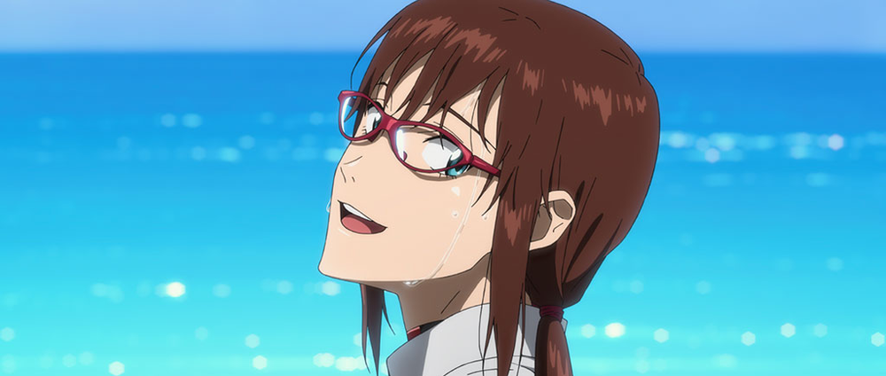</figure>
From the horizon line of the Gates of Guf, Lilith's white mask rises up like a full moon.

When about half of [Eva Imaginary] has come into view, the mask comes off, exposing the face of a giant Rei.

She opens eyes resembling light brown marbles wide, and pale blue hair ???s.)

<strong>Kitakami (?):</strong>

This is the Additional Impact?

<strong>Ritsuko: </strong>

Yes. In all likelihood, that is the Eva Imaginary.

Hard to believe that it's real.

<strong>Kitakami:</strong>

It's weird!

[01:54:29, 1761]
<figure></figure>
(A wide-eyed Kitakami.
<figure></figure>
Rei's eye stares back.)

<strong>Kitakami:</strong>

Nothing could be weirder!

(The eye blinks.)

<em>{Shattering sound}</em>

(A giant explosion fills the space, and a shining golden world comes into view.)

***

(The surface.

Golden light suddenly shines in from beyond the horizon.DRAFTJS_BLOCK_KEY:9b2ld
<figure>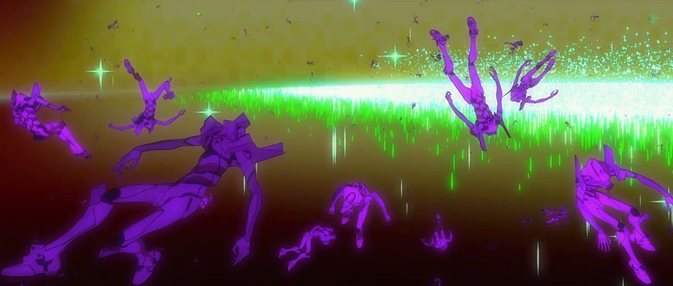</figure>
<figure>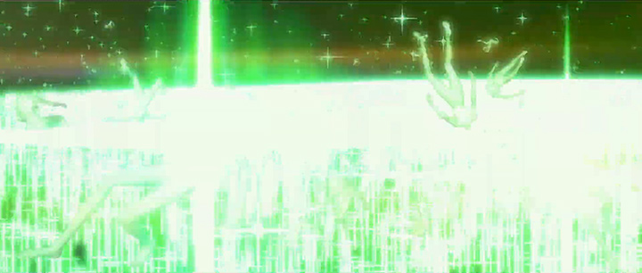</figure>
When the floating, headless Infinities are showered with the light, they turn into pure white Rei bodies.)

[01:54:53, 1765]

(A marching swarm of Infinities, too, turns into headless Reis and keeps walking.

Their white bodies completely cover the red earth.
<figure></figure>
They rise into the sky like a swelling cloud.)

***

(Nerv warship. Fuyutsuki is looking outside.)

<strong>Fuyutsuki:</strong>

Mmm. So it's starting at last.

(Feet approaching behind him.)

<strong>Fuyutsuki:</strong>

There you are.
<figure></figure>
<strong>Mari:</strong>

It's been a while, Fuyutsuki-sensei.

[01:55:31, 1771]

<strong>Mari:</strong>

Say... Isn't the L Barrier density too high on this ship?

<strong>Fuyutsuki:</strong>

Yes.

It inherently lacks crew specifications.

I know it's futile.

People are constantly being filled with a light called "hope".

But it is also human nature to hold onto the sickness of hope,

and drown in it.

Both Ikari and I cling to that sickness far too tightly.

[<strong>NOTE</strong>: Hmm... Shinji is a "god of pestilence", Eva-01 is the "[Eva] unit of hope", hope is a "sickness"... What does Anno mean by this.]

[01:55:56, 1783]

<strong>Mari:</strong>

Gendo-kun is trying to make his wish come true...

by putting himself at the center of Instrumentality.

I'd like to help out... 

No. I have a request. 

I do understand how you feel, Fuyutsuki-sensei,

but I don't want all humankind to be involved.

<strong>Fuyutsuki:</strong>

So it seems.

My role ends here.

The things you wanted have been gathered.

Handle the rest as you see fit,

(The monitor turns off.)

<strong>Fuyutsuki:</strong>

Mary Iscariot-kun.

[<strong>NOTE:</strong> The Japanese is "Ischariothe no Maria-kun" (イスカリオテのマリア君). "Maria" is how the Biblical name "Mary" is rendered in Japanese (and other languages, too, like Spanish). "Ischariothe no Juda" is how "Judas Iscariot" would be rendered. So I've naturalized it completely into the standard English forms used for the Bible.]

<strong>Mari:</strong>

Heh...

I haven't heard that name in a long time.

[01:56:29, 1801]

<strong>Mari:</strong>

Well, this is goodbye, then.

(Fuyutsuki, left behind in the dark ship interior, gazes at a photo of Yui holding an infant.)

<strong>Fuyutsuki:</strong>

Yui-kun... will this suffice?

(His head bursts and LCL scatters.)

***

(The earth's surface, wrapped in white by the swarms of headless Reis.
<figure></figure>
The Rei bodies -- joined hand to hand high in the sky -- fly about in multiple circles.

The head of the Rei-shaped Eva Imaginary comes rising up from the horizon.)

***

[01:57:01, 1805]

<em>{Sound of chains falling}</em>

(Sparks flying and chains tumbling down into a hole.

From the operations block -- where a massive apparatus is being put worked on --,

a giant stretch of spinal column is put through the hole and dragged on down.)

[<strong>NOTE</strong>: This sounds dodgy and I can't even imagine what's supposed to be going on here. For the transcript, I have 「大型の機械が稼働する作業ブロックから　巨大な脊椎の連なりが　穴を通してずるずると下される」. <a href="https://www.youtube.com/watch?v=aWGoquYI3X0&amp;t=7026s" rel="noopener" target="_blank">,<u>Hear the audio also.</u></a>]

<strong>Ibuki(?):</strong>

It worked. 

We can do this!
<figure></figure>
<figure></figure>
<strong>Ritsuko:</strong>

Captain, the crew here can handle the rest.

<strong>Misato:</strong>

Understood.

All hands, abandon ship.

<em>{Warning sound}</em>

(Sakura and other crew rush a stretcher through a corridor.)

<strong>Aoba (speakers):</strong>

All hands, abandon ship!

Repeat: all hands, abandon ship!

[01:57:31, 1811]

<strong>Aoba(?) (speakers):</strong>

Prioritize accommodating the wounded!

Hurry to the escape capsules!

***

(Above the Nerv warship.
<figure></figure>
Marks.10, 11, and 12 surround Eva-08+09.)

<strong>Mari:</strong>

The full line-up of Eva Opfer Types,

a.k.a. the Adams' Vessels.

(Mark.10 opens up its mask.)

<strong>Mari:</strong>

Just the finesse you'd expect from Fuyutsuki-sensei.

(A fireball comes flying.)

<strong>Mari:</strong>

Sorry, but I need you guys...
<figure></figure>
(Cutting through the sky,

Eva-08+09 does a flying kick to the second fireball.

It punches Mark.10 in the face.
<figure></figure>
While grappling with Mark.10, it drops.)

<strong>Mari:</strong>

...to become vittles for the overlapping.

Like so!

[01:58:01, 1825]

(When it bares its teeth, it throws its head far back and bites into Mark.10's head.)

<strong>Mari:</strong>

Now we're 08+09+10!
<figure></figure>
(Mark.11 approaches in the background.

Eva-08+09+10 suddenly holds its hand up over its head.)

<strong>Mari:</strong>

<em>Hah!</em>

<em>{Snarl}</em>

(A powerful A.T. Field is generated that expands three-dimensionally.

It transforms into a giant beast.

The jaws pop open and it devours the top half of Mark.11.)
<figure></figure>
<strong>Mari:</strong>

...+11!

(Mark.10 drops with a thud nearby.)

[<strong>NOTE:</strong> No, that's not a mistake, the narrator really does say「 傍らでMark.10がバッタリと倒れる」. Why are Mark.10's uneaten remains dropping when you'd expect 11's to be doing that? I dunno.]

(Three halos manifest from Eva-08+09+10+11's back.

Mark.12 shrinks away.)

[01:58:30, 1833]
<figure></figure>
<strong>Mari:</strong>

Alright, let's go for the last one!

***

(Inside Wunder.)

<strong>Announcement:</strong>

Closing hatches on first four escape capsules.

Those still on board, please hurry to capsule 5!

(Nagara inside a capsule. She contacts the secured lock.)

<strong>Nagara:</strong>

I'm going back to my post after all.

<strong>Takao:</strong>

Surviving is our job now.

No matter how tough it gets.

***

(Bridge.

Misato from behind, standing alone.)

<strong>Ritsuko (comms):</strong>

<em>Captain, the rearrangement work is complete.</em>

<em>I think this should do the trick.</em>

[01:59:00, 1841]

<strong>Misato:</strong>

Roger.

Reroute all steering systems to the captain's chair. 

After that, hurry and leave the ship.

*

<strong>Ritsuko:</strong>

Misato?

<strong>Misato (comms):</strong>

Somebody<em> sure as hell has to do this.</em>

<em>*</em>

<strong>Misato:</strong>

And the person in charge of this ship is me.

(She takes off her sunglasses.)

*

<strong>Misato (comms):</strong>

<em>I leave the survivors and the children in your hands, Ritsuko.</em>

<strong>Ritsuko:</strong>

Understood, Misato.

I'll give it my best.

*

<strong>Misato:</strong>

Thank you.

***

[01:59:29, 1849]

(The same pattern as the sealing pillars appears on the capsules.

The boosters ignite.

The five capsules protruding from the center of the hull shoot up one by one, and they leave the ship behind.

Wunder sees the five white streaks off.
The capsules become tiny specks and vanish far in the distance.)

***

(Misato, with the photo of her son beside her.)

<strong>Misato: </strong>

There's not much reserve electromagnetic force left.

Figures, 

that in the end we'd be relying on...
<figure></figure>
(She frees up the hair on the back of her head.)
<figure></figure>
<strong>Misato: </strong>

...the reaction engine from long ago.

[02:00:00]

(She removes the cover and pushes the switch.

The main nozzles spew flame.
<figure></figure>
While emitting pinkish light, Wunder takes off.)
<figure></figure>
<figure></figure>
(A silhouette resembling a bird with its wings spread drifts into the distance.)

***

(Above the Gates of Guf, Mari's Eva emits light.

The Nerv warships are engulfed in massive explosions.

All three ships go down.)

[02:00:32, 1853]

<strong>Mari:</strong>

The Lilin won't use you guys anymore.

Sleep well, Adams.

(She gazes into the distance.)

<strong>Mari:</strong>

The Wunder's started moving.

Guess I'll hurry and join up.

But still...

Humanity's physical and mental complementation,
<figure></figure>
(Giant Rei is below her.)

<strong>Mari:</strong>

being invoked at the same time...

Gendo-kun, are you really doing this?

[<strong>NOTE</strong>: She just says 「ゲンドウ君 君は…」, so everything after the "you" is implied.]

***

(He<em> is</em>!)

<strong>Shinji:</strong>

Father, what do you want from this?

[02:00:56, 1860]

<strong>Gendo:</strong>

A world of the human mind, where there is no A.T. Field, and all things exist in harmonious unity... 

a world you did not choose. <u>↓</u> 

Without differences between people.

Without class disparity, discrimination, strife, cruelty, pain, or sorrow.

A world comprised entirely of cleansed souls.

And a world of serenity where I will meet Yui again.

***

(Inside Gendo's mind.)

<strong>Gendo:</strong>

(At college, a hotel, the hospital, etc., there are the figures of plugsuit-clad girls.)

<strong>Gendo:</strong>

Where are you, Yui?!&gt;

[02:01:30, 1869]

<strong>Gendo:</strong>

Where are you? Where can I find you, Yui?!&gt;

(Graveyard.)
<figure></figure>
<strong>Shinji:</strong>

Father, just stop already.

<strong>Gendo:</strong>

<em>Why?</em>

Why are you here, Shinji?

<strong>Shinji:</strong>

Because I want to know you, Father.

I never tried to get closer, even when I felt lonely.

I was scared to find out you really hated me. 

But now I want to know.

About <em>you</em>, Father.

[<strong>NOTE:</strong> Not 100% on 「嫌われているのが はっきりするのが怖かったんだ」. What I put down makes sense in context, at least.]

[02:02:01, 1877]

(Shinji approaches.

A rainbow-colored barrier appears before Gendo.)

<strong>Gendo:</strong>

An A.T. Field.

Coming from the me who abandoned his humanity?

[<strong>NOTE:</strong> Verb here is implied. (発生される? 展開される? I dunno.) Japanese is just 「A.T.フィールド 人を捨てた この私に？」.]

<strong>Gendo:</strong>

This me can't be afraid of Shinji,

can he?

<strong>Shinji:</strong>

I should have given this to you instead of throwing it out.

(He breaks through the barrier and holds out the music player.)

***

(A running train, bathed in the evening sun.

Just father and son, sitting across from each other inside the train.)

[02:02:31, 1881]

<strong>Shinji:</strong>

You were the same as me, Father.

<strong>Gendo:</strong>

Yes, it's true.
<figure></figure>
<strong>Gendo:</strong>

The headphones let me sever myself from the outside world.

As I feigned apathy, they shielded me from the noise of others.

(SDAT playing music.)

<strong>Gendo:</strong>

(It shuts off.) 

***

(Inside his mind.)

<strong>Yui's Voice:</strong>

Did you pick the names?

<strong>Gendo's Voice:</strong>

If it's a boy, "Shinji". 

If it's a girl, "Rei".

[02:03:00, 1891]

<strong>Yui's Voice:</strong>

Shinji... Rei... <em>*laughs*</em>

<em>(Newborn's First Cry)</em>

(An industrial complex looking out on the ocean.

Clustered smokestacks tower in the blue sky.

The player starts up again.)

<strong>Gendo:</strong>

<i></i>

In the end, this world is unstable, imperfect, and irrational.&gt;

(Scenery rushing by.)

<strong>Gendo:</strong>

People say one thing now and another thing later.&gt;

(The train abruptly changes direction.)

[02:03:28, 1898]

<strong>Gendo:</strong>

[<strong>NOTE</strong>: Been having trouble pinning the second part down. (I suck.) Original is, 「どっちが本当でどっちに合わせていいのか分からない」.]

<strong>Gendo:</strong>

<em>both</em> are true for someone, 

and their feelings simply change in the moment.&gt;

(Inside his mind.)

<strong>Gendo:</strong>

<i></i>

I hated the world, overflowing with people.

From a young age, solitude was my norm.

So, I never felt lonely.

But there are people in the world who don't approve of that.&gt;

[02:03:55, 1907]

<strong>Gendo:</strong>

<i></i>

I despised being brought to the households of my boring classmates and their families,

forced to learn about their lives and how they lived them.

Being with others was agony.

The fact is, I always wanted to be alone.&gt;

<strong>Gendo:</strong>

One of those is knowledge.

I satiated my hungry mind with the unilateral procurement of knowledge.

With knowledge, there's nothing to worry about.

As long as you have time,

you can furnish yourself with as much as you please.&gt;

[02:04:31, 1917]

<strong>Gendo:</strong>

A tuned sound returns the correct notes on the keys.

There are no lies in it. 

There's no betrayal. No disappointment.

I'm quietly transformed into a stream of sound.&gt;

<strong>Gendo:</strong>

<i></i>

I relished my solitude.

Neither I nor anybody else got hurt. 

Being alone was comfortable.

But then I met Yui and...&gt;

[02:05:01, 1924]

<strong>Gendo:</strong>

<i></i>

Only Yui accepted me for who I was.

When I lost her, I...
<figure></figure>
I no longer had the confidence to live on my own.&gt;

(Insert: Human Instrumentality Project document.)

<strong>Gendo:</strong>

I couldn't bear losing her.&gt;
<figure></figure>
[02:05:29, 1930]

<strong>Gendo:</strong>

<i></i>

To change myself by Yui's side...

To make those wishes come true.&gt;

(Train interior.)

<strong>Gendo:</strong>

So my weakness is why I won't get to see Yui.

Shinji...

(Young Shinji.)

<strong>Shinji:</strong>

I think it's because you don't admit you're weak.

(The Shinji of today and Gendo as a boy.)

[02:05:59, 1936]

<strong>Shinji:</strong>

You knew it all along, right, Father?

<em>{Impact}</em>

(Present-day Gendo looks up.)

<strong>Gendo:</strong>

What was that?

<strong>Shinji:</strong>

It must be Misato-san.

***

(Inside Wunder.)

<strong>Misato:</strong>

<em>Urrrrgh!</em>

(Misato grits her teeth.

Wunder's flight path is obstructed by a wall.

The wall is actually a giant hand.

Rei's face can be glimpsed further in.
Wunder is taking the shock.)

<em>{Explosion(s)}</em>

(The ship's bow is smashed.)
<figure></figure>
<strong>Misato:</strong>

Just a little more!

(Wunder, wings spread, slowly ???s. [<a href="https://www.youtube.com/watch?v=aWGoquYI3X0&amp;t=7584s" rel="noopener" target="_blank">,<u>Audio</u></a>]
Both of Rei's hands, floating and nonexistent below the wrists, are pushed in front of her face.

Misato turns a switch.)

<strong>Misato:</strong>

<em>*grunt*</em>

[02:06:34, 1944]

(Three stretches of spine rotate like screws being turned.
When they ooze[??] out of the ship, their form changes to a spear with a glow.
Gendo looks up from a window.)

[<strong>NOTE</strong>: Second sentence seems to be 「船の外に流れ出ると、輝きとともに槍に姿を変える」 (<a href="https://www.youtube.com/watch?v=aWGoquYI3X0&amp;t=7600s" rel="noopener" target="_blank">,<u>audio link.</u></a>). I'm not sure if this is right, since jumping from the sections of "spine" revolving inside the ship to them somehow seeping or oozing to reveal a spear is a bit @_@. But it's <em>Eva,</em> and <em>Eva</em> is weird, so who am I to question it, really?] 

<strong>Gendo:</strong>

Inconceivable... 

All of the "Holy Spears" are gone.

A new spear for rewriting the world shouldn't be possible.

***

(Mari in her Eva.)

<strong>Mari:</strong>

The God-given spears were Cassius, the Spear of Hope, and Longinus, the Spear of Despair.

Even though they were lost, there's now a spear made from the willpower to restore the world to how it was:

Gaius.

[02:07:05, 1950]

(She looks at her monitor.)

<strong>Mari:</strong>

No -- the Spear of <em>Wille</em>.

(Its image is displayed.)

<strong>Mari:</strong>

Humanity, possessing wisdom and volition, got this far without God's help, Yui-san.

(Wunder continues to undergo intense jet propulsion.)
<figure></figure>
↑ [I wonder when the "golden world" turned blue? The AD doesn't mention this at all.]

(Accompanied by Mari's Eva, clinging to the rear, it steadily presses down on Rei's palm.

When it pierces her hand, Rei's face draws near, and the bow hits her eye.)

[02:07:30, 1953]
<figure></figure>
<strong>Misato:</strong>

I've got you!

[<strong>NOTE</strong>: Original is 「取りついた！」. Not sure if I rendered it correctly.]

(It continues to contact the unblinking eye on a perpendicular.
<figure></figure>
Inside the bridge, sparks scatter.)

<strong>Misato:</strong>

Mari! Get Shinji-kun!

<strong>Mari:</strong>

Of course!

<strong>Mari (comms):</strong>

<em>I'll bring him back for sure!</em>

<strong>Misato:</strong>

I'm counting on you. 
<em>*grunt*</em>

(Misato presses a bright red switch.
The locking device disengages, 

and the Spear of Gaius detaches from the bottom of the ship

 -- where it was suspended -- and starts shooting forward.
The spear, giving Mari a lift in back, breaks through the eye.)

<em>{Smashing sound}</em>

[02:07:58, 1959]

(It drops down while revolving slowly.)

<strong>Gendo:</strong>

So the new spear arrives without me seeing Yui.

Unfortunate.

(Surface of the eye. Wunder's engine stops.)

<strong>Misato:</strong>

This was all your mom could do for you.

I'm sorry, Ryoji.
<figure></figure>
(The front of the bridge is engulfed in a huge explosion.

The flames envelop Misato,

and Wunder is swallowed up in a ball of fire.)

***

(Inside the train.)
<figure>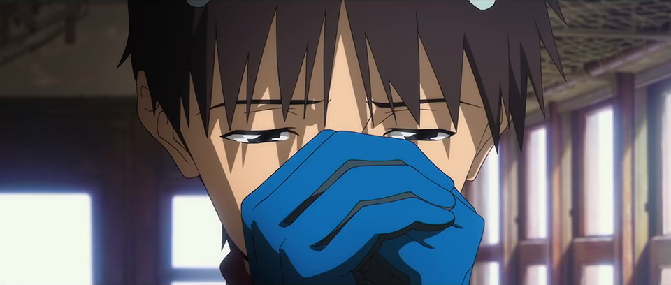</figure>
<figure>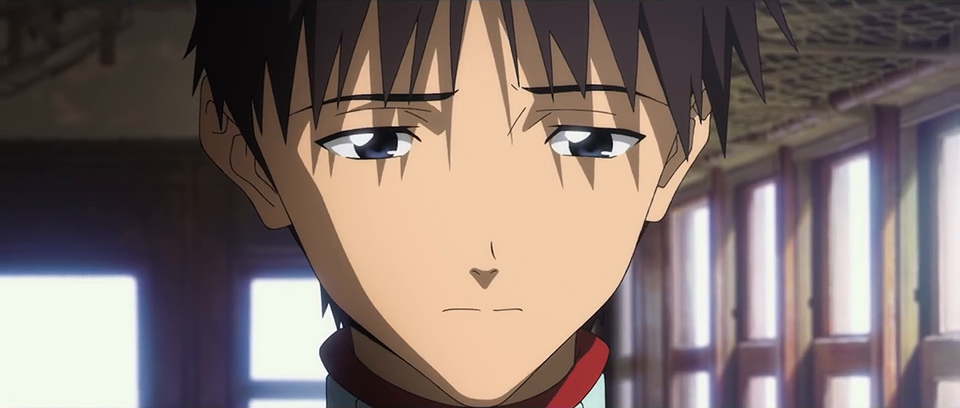</figure>
Shinji joins his hands together as though praying.
A tiny spear is rotating within his opened hands.)

[02:08:30, 1964]

<strong>Shinji: </strong>

Thank you, Misato-san.

<strong>Gendo:</strong>

Accepting someone else's death and desires...

You've grown up, Shinji.

(He remembers a very young Shinji.)

<strong>Gendo:</strong>

<i></i>

With the fulfillment of my hopes comes my karma.<u>↓</u> 

My own child felt like a punishment.&gt;

[02:08:59]

<strong>Gendo:</strong>

<i></i>

I believed that it was better for <em>him</em>, too.&gt;

(Station.)
<figure></figure>
(Gendo, stopped with his back turned, looks over his shoulder at child Shinji.

The image of Yui holding a baby enters his thoughts.)

<em>{Train departure bell (start)}</em>

(Gendo passes through an automated ticket gate.

He returns to Shinji, who he'd abandoned on the platform.
<figure></figure>
Kneeling, he tightly embraces the little body.)

<em>{Train departure bell (end)}</em>

[02:09:32]

<strong>Gendo:</strong>

Forgive me, Shinji.

<strong>Gendo:</strong>

I see...

(Inside the train.)

<strong>Gendo:</strong>

So that's where you were, Yui.

(A shadowy figure is in front [of him].)

<em>{Sound of [SDAT] stopping}</em>

(He is standing with a smile on his face.

Gendo gets off the train, holding the stopped player.

His back-turned figure, shoulders stooped, is left behind on the platform.)

***

(Kaworu and Shinji inside the train.)

<strong>Kaworu:</strong>

Ikari Gendo...

He is the center of Instrumentality this time. 

The source of the rings.<u>↓↓</u> 

I'll take over from here.

[02:10:03, 1980]
<figure></figure>
<strong>Kaworu:</strong>

Ikari Shinji-kun. 

What is it you wish for?

[<strong>NOTE</strong>: Not sure if this qualifies as a callback to NGE. Kaworu says 「何を望むんだい？」 (<em>Nani o nozondai?</em>) rather than a variation on 「なにを願うの？」 (<em>Nani o negau no?</em>) -- different verb.]

<strong>Shinji:</strong>

I'm fine.

I don't mind if things are painful or difficult.

I want to help Asuka and everyone else instead of myself.

[<strong>NOTE</strong>: Not 100% on the third sentence. Original is 「僕よりもアスカやみんなを助けたい」.]

<em>{Piano playing}</em>

<strong>Kaworu:</strong>

Indeed so. 

You had picked yourself up already,

(He's in front of the piano.)

<strong>Kaworu:</strong>

in reality and not in the imaginary.

<strong>Shinji:</strong>

Yeah.

I want to settle the score for what Father has done.

<strong>Shinji:</strong>

Asuka.

***
<figure></figure>
(She wakes up inside an LCL capsule.)

[02:10:31, 1989]

<strong>Asuka:</strong>

I don't know Papa.

Mama's not here either.

(In bed.)
<figure>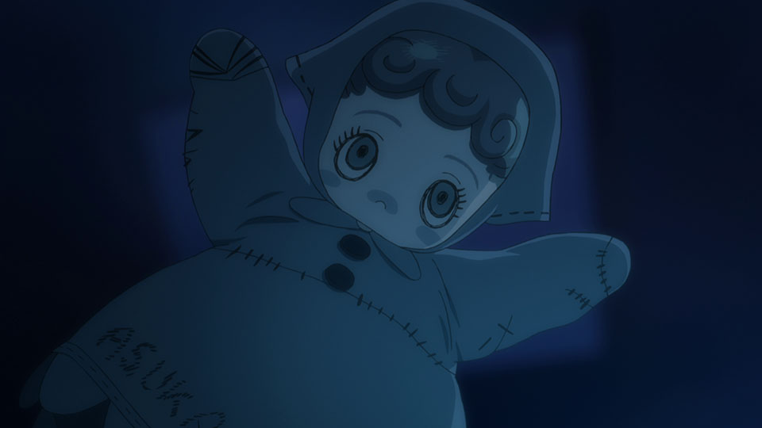</figure>
<figure>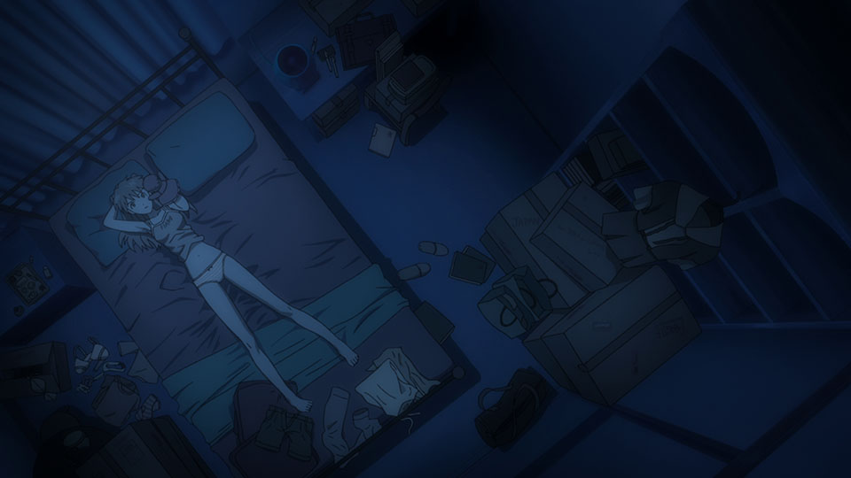</figure>
<strong>Asuka:</strong>

So you don't need anybody, 
<figure></figure>
Asuka.

(After addressing her puppet, Asuka reminisces about being younger.)
<figure></figure>
<strong>Asuka:</strong>

<i><u>↓</u> </i>
<figure></figure>
Because it's painful if I don't do that.

Because life is pain.&gt;

(Euro Nerv.

Asuka glares at the monitor of the simulation in progress.)

[02:10:56, 1994]

<strong>Asuka:</strong>

<i></i>

(The timer starts its countdown.

She overwhelms her opponents with acrobatic movements.

Asuka pulls a trigger.

She takes down the enemies that rush her, one after the next.

She continues to look forward with an earnest gaze.)

<strong>Asuka:</strong>

Once I can pilot the Eva, it won't matter.

Because that's all I'm worth.&gt;

(She runs alone in the snow.) 

[02:11:29, 1998]

<strong>Asuka:</strong>

<i></i>

I have a strong body and mind.

So praise me! Notice me!

Give me somewhere I belong!

I really am lonely.&gt;

(Asuka as a child watching the Ikari family get out of a car.) 

<strong>Shinji:</strong>

<em>Wahhh!</em>

(Yui is next to Gendo, holding Shinji.) 

<strong>Gendo: </strong>

<em>Ugh!</em>

<strong>Yui: </strong>

<em>*giggle*</em>
<figure></figure>
(Asuka's eyes narrow in jealousy and loathing.) 

<strong>Asuka:</strong>

(Under a wintery sky.) 

<em>(Asuka crying) </em>[11 sec.]
<figure></figure>
(Child-Asuka is sitting on a fallen tree.) 

[02:12:00, 2006]
<figure></figure>
(Someone costumed like Asuka's puppet sits down next to her and gently caresses her head.

They take off the head piece, revealing Kensuke's face.)

<strong>Kensuke:</strong>

<em>*Oof.*</em>

It's alright.
<figure></figure>
<strong>Asuka:</strong>

Huh?

<strong>Kensuke:</strong>

Asuka is Asuka.

That's more than enough.

***

<strong>Asuka:</strong>

<em>*gasp*</em>

(An adult Asuka wakes up.

Lying upon a sandy beach with red waves breaking upon it,

she looks up toward the lazily revolving celestial body.)
<figure></figure>
<strong>Asuka:</strong>

Was I asleep?

(She looks to her side.)

<strong>Asuka:</strong>

Stupid Shinji...

[02:12:29, 2012]
<figure></figure>
<strong>Shinji:</strong>

I'm glad I could see you again.

I wanted to tell you something.

Thank you, for saying that you liked me.

I liked you too, Asuka.

<strong>Asuka:</strong>

<em>*murmur*</em>

(Asuka curls up, giving him her back. She's wearing a tattered plugsuit.) 
<figure></figure>
<strong>Shinji:</strong>

Bye, Asuka. 

Say hi to Kensuke for me.
<figure></figure>
<strong>Mari:</strong>

Princess, fare thee well.

***

<strong>Asuka:</strong>

<em>*gasp*</em>

(When she wakes up, she's inside an entry plug.

Eva-01 pulls a lever on Eva 13.

The entry plug flies off.) 

[02:12:59, 2020]
<figure></figure>
<strong>Kaworu:</strong>

Off she goes. 

Won't you miss her, Shinji-kun?

<strong>Shinji:</strong>

No, I'm okay. 

Now it's your turn, Kaworu-kun.

***
<figure></figure>
(Lakeside.)

<strong>Shinji:</strong>

I remember now.

Again and again, I've come here to meet you.

<strong>Kaworu:</strong>

Your name is listed in "The Book of Life", so we'll continue to meet, many more times. 
<figure></figure>
I am you. 

We're no different. 

 

[<strong>NOTE</strong>: "Meet" (or, in this context, "meet <em>with</em>") is also "see" (as in a social context) and doesn't necessarily mean "meet for the first time".] 

<strong>Kaworu:</strong>

That's why I was drawn to you. 

I wanted to make you happy.

[<strong>NOTE</strong>: SHIPPER WARS ALERT! Kaworu says 君にひかれた, "<em>kimi ni hikareta</em>", here. "~ <em>ni hikareru</em>" can mean "to be attracted to [person]", in <em>that</em> kind of way. It doesn't <em>necessarily</em> mean that, but there's a very strong possibility that it does. I'll let you form your own decision on the matter, though. That's the <em>Eva</em> way.]

(Beside the piano.) 

[02:13:28, 2028]

<strong>Shinji:</strong>

Yeah.

You're so much like Father, Kaworu-kun.

That's why we piloted the same Eva as you.<u>↓</u> 

[<strong>NOTE</strong>: A bit baffled on how to translate Shinji's initial "<em>Sou</em>" here. Would need to hear it, I think. The option I've taken for now should be taken as an "I hear ya" kind of acknowledgment.]

<strong>Kaworu:</strong>

This is quite a change from the norm, Shinji-kun.

Will you not cry?

<strong>Shinji:</strong>

No. 

I'm the only one who's helped by my tears. 

Me crying doesn't do that for anyone else. 

So I won't cry anymore.

[<strong>NOTE: </strong>The verb 救う (<em>sukuu</em>), which I translated here as "help", also has the Christian meaning "to save", "to redeem", or "to deliver (from)". This is <em>Eva</em>, so... interpret accordingly.]

<strong>Kaworu:</strong>

I see.

You're all grown up now. 

A little sad, but that's okay too. 

[02:13:58, 2037]

<strong>Shinji:</strong>

Kaworu-kun... 

Evangelion 13, <em>your</em> Eva --

I'm thinking let's get rid of it.

[<strong>NOTE:</strong> I'm a little unclear as to whether Shinji is saying that he's thinking about doing something alone ("I'll get rid of it"), or if he's suggesting a mutual action ("let's get rid of it").]

<strong>Kaworu:</strong>

Then relinquish the Eva I shall. 

[<strong>NOTE</strong>: Kaworu's line is phrased as affirmation of something he just learned. Was weirdly difficult (for me) to phrase this in English so I had to get a little creative.]

<strong>Kaworu:</strong>

I'm sorry.
<figure></figure>
(Kaji turns around.) 

<strong>Kaworu:</strong>

I didn't truly understand his happiness. 

<strong>Kaji:</strong>

Indeed. 

The happiness in question was <em>yours</em>, Commander Nagisa.

<strong>Kaji:</strong>

Meaning, <em>you</em> wanted to be happy.&gt;

(Kaworu awakens on the Moon's surface.)

<strong>Kaworu: </strong>

<u>↓</u> 

And so I am bound to eternally repeat my part within the predetermined toroidal narrative.<u>↓</u>&gt;  
<figure>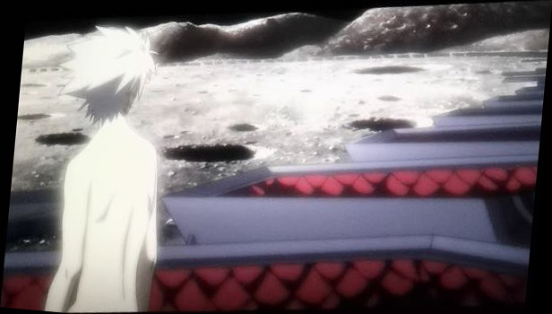</figure>
<figure>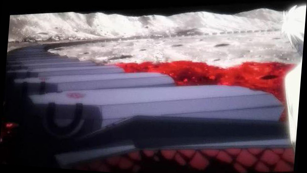</figure>
(He rises from his coffin, then gazes out at the countless coffins lined up in a circle.

Him standing up and looking out at the other coffins is repeated innumerable times.)

***

(A tiny hand reaches for Kaworu's back. 

Kaworu looks over his shoulder.) 

<strong>Shinji:</strong>

It's a magic trick for making friends. 

[<strong>NOTE</strong>: Callback to Hikari's explanation to Rei 6 of what holding hands means.]
<figure>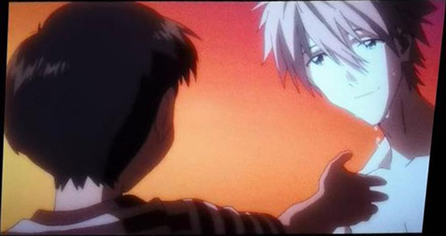</figure>
<figure>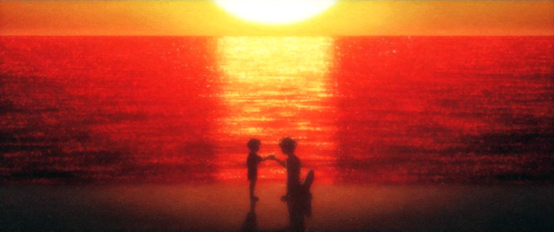</figure>
(Kaworu is moved to tears by Child-Shinji, and he clutches the boy's hand.) 

<strong>Kaworu:</strong>

Shinji-kun, you never change.&gt;<u>↓</u> 

(Office.)

[02:14:59, 2048]

<strong>Kaji:</strong>

That's why you chose him and listed his name in the Book of Life. <u>↓</u> 

<strong>Kaworu:</strong>

Thank you.

You saved me too, Ryo-chan. <u>↓</u> 

<strong>Kaji: </strong>

It was an honor, Commander Nagisa.
<figure></figure>
<strong>Kaworu:</strong>

Please no, Ryo-chan. 

Just call me "Kaworu" already. 
<figure></figure>
<strong>Kaji:</strong>

<em>*chuckles*</em>

Not just yet, Commander Nagisa.

(Atop a floodgate.) 
<figure></figure>
<strong>Kaji:</strong>

"Nagisa" is the shore, the interstice between sea and land;

the 1st Angel, who becomes the 13th. 

A name that spins the thread of humanity together. 

It suits you well. <u>↓</u> 

[02:15:28, 3309]
<figure></figure>
<strong>Kaji:</strong>

You've carried out your mission in full.

He can take over from here, don't you think? <u>↓</u> 
<figure></figure>
(Kaworu with a distant look in his eyes.

The melon patch's rusted water tap.) 

<strong>Kaji:</strong>

How about spending (y)our golden years with Katsuragi, working the fields? <u>↓</u> 

<strong>Kaworu:</strong>

Might as well. I'm fine with that.

(The two of them leave the green farm plot behind them.) 

***

(A shutter closes, and Shinji, after watching them leave, turns his head.) 

<strong>Shinji:</strong>

You're the only one left, Ayanami.
<figure></figure>
<strong>Rei:</strong>

I'm fine here.

[02:16:00, 2063]

<strong>Shinji:</strong>

The other you found a place to belong, somewhere else. 

I think even Asuka will see there's a new place for her when she returns. 

<strong>Rei:</strong>

The happiness of not piloting Evas.

I wanted you to have that, Ikari-kun.

<strong>Shinji:</strong>

I know.

That's why there's a life even for you that's not here. 

<strong>Rei:</strong>

Really?
<figure></figure>
(Footage is being projected onto the wall behind them.) 

<strong>Shinji:</strong>

Yeah.

I'm choosing a way of life where I don't pilot Evas, too.

(Highlights from the original series.)

<strong>Shinji:</strong>

I won't turn back time or revert the world. 

[02:16:30, 2072]

<strong>Shinji:</strong>

I'll just rewrite it to a world where Evas don't need to exist.

To a world where new people can live.

<strong>Rei:</strong>

A new creation of the world.

<em>Neon genesis</em>.

<strong>Shinji: </strong>

Yeah.

Also, Mari-san is picking me up after this, so don't worry.

<strong>Rei:</strong>

I see. Understood.
<figure></figure>
(She smiles sweetly...)

<strong>Rei:</strong>

Ikari-kun, thank you.

(...and they shake hands.)

<strong>Shinji:</strong>

Same.

(The shutter closes, and Shinji is left alone in an empty film studio.) 

<strong>Shinji:</strong>

I'm going to give it a try, Ayanami.

The <em>neon genesis</em>.

***
<figure></figure>
<figure></figure>
(Shinji, grasping the tiny Spear of Gaius firmly, flings it forward with a stern downward glance.

The giant spear, its tip aimed at Eva-01, glistens.
<figure></figure>
Shapeshifting into a sharp needle, it slowly moves forward.
<figure></figure>
Inside the plug, the tip of the spear draws toward Shinji's chest.)

♪　("Voyager ~Undated Gravestone~")

(A pair of hands intercept the spear tip.)

[02:17:26, 2090]

<strong>Shinji:</strong>

<em>*gasp*</em>

(A plugsuited individual within a red sea is embracing Shinji from behind.) 

<strong>Shinji:</strong>

Who's there?

(Shinji's back is pushed.)

<strong>Shinji:</strong>

&lt;<em>Uh...</em>&gt;

(As he moves toward the water's surface, he turns around.) 

<strong>Shinji:</strong>

(A smiling woman.) 

<strong>Shinji:</strong>

That's right... 

You were always inside me, waiting for this very moment, weren't you,

Mother?&gt;

(Eva-01 is now there in place of Yui.
<figure></figure>
Eva 13's image slides out of Eva-01's; 
<figure></figure>
appearing behind 01, it seizes the spear.)

[02:18:01, 2102]

<strong>Shinji:</strong>

<i></i>

I guess Father wanted to see Mother off.

It's the god-slaying that he wanted.&gt;

***

<em>{Roaring}</em>

(The two Evas float in the starry sky.
<figure></figure>
Eva 13, in behind, thrusts the spear into Eva-01.

The spear comes out the other side, penetrating 13's own body.) 

[02:18:24]

(The spear that Misato made keeps extending; 
<figure></figure>
piercing Eva-00, Eva-02, Eva-03, and the rest of the Eva Series, one after another.
<figure></figure>
Beyond all of the destroyed Evas, there's two hands and a giant body sprouting wings.

Rei's head is floating.

The headless body bends far back.

When she gently spreads her many wings, the Japanese archipelago comes in view beneath her.
<figure></figure>
Eva-01 and Eva 13 shine brightly in the sky.)

[02:18:55, 2110]

<em>{Explosion}</em>
<figure></figure>
(Countless Infinities dissipate from Rei's head.)

<strong>Shinji:</strong>

Goodbye, all Evangelions. 

(They break apart and plain white people fall out.

Mixed in with adults are a boy, dog, cow, sheep, pig, and so on.

There's also a woman with a cat.) 

[02:19:26]
<figure></figure>
(Above the gloomy clouds, the morning sun rises on the many falling people,

and vibrant color re-enters the world.

The seed storage blocks leisurely orbit around the blue Earth.

Beams of sunlight pour through a forest canopy.) 

Limpid water flowing between rocks.

An entry plug has fallen in front of Kensuke's house.

At the ruins, a rainbow hanging overhead in the blue sky, the penguins are looking at the five escape capsules stuck in the lake.) 

[02:20:01]

(Beach.

Lots of footprints have been left on the ground, and yellow flowers are blooming on the weeds growing sparsely.
<figure>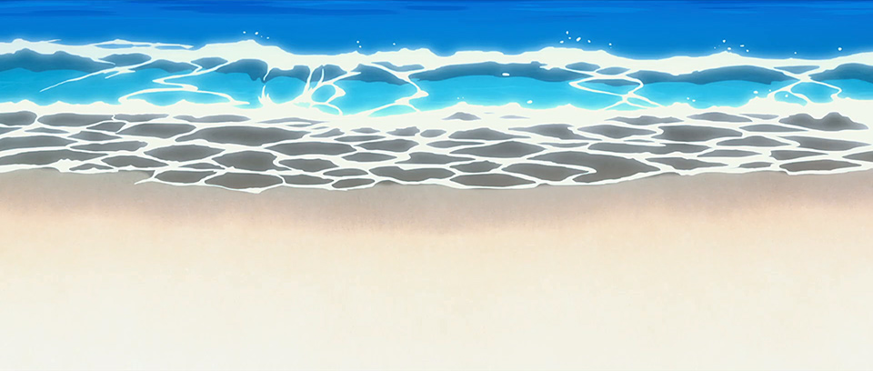</figure>
<figure>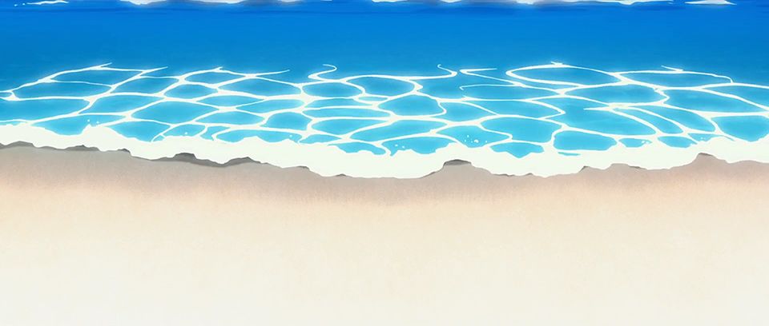</figure>
Waves break gently upon a sandy beach looking out on the blue ocean.
<figure></figure>
Before a swelling cumulonimbus, there's a single small figure. 

Shinji, wearing his school uniform, hugs his knees and looks up at the clouds.) 

[02:20:27]
<figure></figure>
(Shinji's environs change to a simple, sketch-like drawing.

The wavelets breaking and retreating become black-and-white line drawings;

Shinji is also reduced to a rough black outline.

Shinji's eyes pop wide open.) 

<strong>Shinji:</strong>

<em>*gasp*</em>

(The monochrome ocean bulges, and an Eva's head emerges from the surface.

Its massive body belaboredly rises...)

[02:21:00, 2126]

(...and the surging wave engulfs Shinji.) 

<strong>Shinji:</strong>

<em>Agh! </em>

(Shinji, soaked, looks up at the Eva.) 

<strong>Mari:</strong>

Alright! Just in time.

(She takes her glasses off.) 

<strong>Mari:</strong>

Phew. Was really cutting it close.

<strong>Shinji:</strong>

Mari-san!

(Shinji hurries over.

Mari, jumping down to the Eva's feet.

She makes a splash, and the black-and-white world returns to color.

Underwater.

The plugsuited Mari gazes toward the surface while submerging face-up.)

[02:21:26, 2136] 

<strong>Mari (thinking)</strong>:

Thank you, Eva-08+09+10+11+12. 

You did good, final Evangelion.

(The Eva vanishes in a flash of light.

Mari appears at the water's surface.

She swings her wet hair back.)
<figure></figure>
<strong>Shinji:</strong>

<em>*panting*</em>

Mari-san!

(Mari, wearing her school uniform, puts on her glasses and turns her head.) 
<figure></figure>
<strong>Mari:</strong>

Sorry to keep you waiting, Shinji-kun!

<strong>PART 4 TO BE CONCLUDED</strong>

<h3>Extended Notes</h3>

<strong>Disclaimer</strong>: Given the Escalation Into Vagueness that happens in Pt. 4, the notes will feature more of my offbeat interpretations than I might prefer. I could probably create "less biased" explanations if I tried hard enough, but I'm not sure it's necessary, since my own thought process binds others' much less than you might think. 

[02:00:56, 1860] <strong>"A world of the human mind, (...) a world you did not choose." </strong>Original line here is 「お前が選ばなかったA.T.フィールドの存在しないすべてが等しく単一な人類の心の世界」.  It's another difficult Gendo line and many thanks again go to Nicholas Miari (see comments) for helping me make a bit more sense out of it. Now the question is, when did Shinji have the option of choosing such a world, but declined? Did I miss something, or is this intentionally obfuscatory?

[02:08:52, 1968] <strong>"With the fulfillment of my hopes comes my karma."</strong> I'm leaving 報い (<em>mukui</em>) as the more ambiguous "karma", which can be good <em>or</em> bad. <a href="https://kotobank.jp/gs/?q=%E5%A0%B1%E3%81%84" rel="noopener" target="_blank">,<u>Kotobank</u></a> says that <em>mukui</em> is more commonly used nowadays to refer to the consequences of bad behavior, but remember that we're dealing with <em>Eva</em>, where seemingly contradictory interpretations frequently exist in harmony, and Anno's attitude seems to be "the more the merrier". Gendo does refer unambiguously to "punishment" below, but he also qualifies it with "I felt that...". Incidentally, <em>mukui</em> is also the word that Gendo used before getting half-eaten in EoE; the ambiguity is especially delicious -- no pun intended -- in that situation...

<strong>[02:09:56] </strong><strong>"He is the center of Instrumentality this time. The source of the rings."</strong> Super mysterious shit. The middle lines here are 「彼が 今回の補完の中心。円環の元だ」.  <strong>"This time" (</strong>今回) feels like it could be a (partial) reference to <a href="https://www.arqacrypha.net/post/eva-3-0-1-0-cc-ad-translation-pt-3#viewer-927uh" rel="noopener" target="_blank">,<u>Gendo's earlier revelation</u></a> that Dr. Katsuragi was the brains behind the Human Instrumentality Project, a hypothesis he verified through through Second Impact. That is, in <em>Eva</em>'s grand tradition of repetition, Katsuragi was the center of the form of Instrumentality that took place at 2I. (More on this <a href="https://twitter.com/ArqaZone/status/1379466520716279813?s=20" rel="noopener" target="_blank">,<u>here</u></a> and <a href="https://www.arqacrypha.net/post/last-minute-pre-release-rant-5" rel="noopener" target="_blank">,<u>here</u></a>.) 

円環の元 (<em>enkan no moto</em>) <em>could</em> be translated as something like "the origin of the circle", but this gives the entirely wrong idea. 円環 refers specifically to the <em>shape</em> -- a circle, ring, or torus -- and not to "cycles" in a more metaphorical or metaphysical sense. (A less specific term would be 輪 (<em>wa</em>); a more specific one would be 輪廻 (<em>rin'ne</em>), which is "samsara", or the endless cycle of death and rebirth.) I was initially puzzled by 円環の元, but the aforementioned Dr. Katsuragi / 8th Angel link gave the game away pretty quickly. To be at the center of HIP is also to be at the center of the Gates of Guf, generating its ripples into space-time. 

It also just so happens that the Gates of Guf phenomenon is torus-shaped, as well, so<em> that</em> could be potentially used in translation here. However, I'll save "torus" for the <u>next incidence</u> of <em>enkan</em>. 

[02:10:41, 1992] <strong>"I have to be okay with no one being around."</strong> Tricky line (at least, it is for idiots like me). Original is 「誰もいなくていいようにする」 (<em>Daremo inakute ii you ni suru</em>) . This didn't really make any sense in context at all until I tried separating it into "<em>Daremo inakute ii</em>" and "<em>you ni suru</em>", yielding something like, "I will try to be okay with no one being here", which I then simplified a little for readability. 

[02:13:28, 2028]<strong> "That's why we piloted the same Eva as you."</strong> Like basically everything else in this scene, this line -- 「だから同じエヴァに乗っていたんだね 」-- is fucking obnoxious. It doesn't specify an actual subject, just the action of piloting -- literally "getting on board" -- the same Eva. Now, from context alone, you might expect that Shinji is referring back to the last two subjects mentioned, Kaworu and Gendo; thus, Kaworu and Gendo being alike is why the two of them "piloted" the same Eva. But, wait! Shinji piloted Eva 13 as well, and the scenery here also hearkens back to Shinji's "sync training" in <em>Q</em>, so is there any possibility that he's been implicitly included in this comparison? For now, I'll go with a translation that enhances the vagueness to the max.

[02:14:25, 2043]<strong> </strong><strong>"My existence can only be erased by vacuum decay."</strong> Superficially baffling, but AFAIK this is just a way of saying that Kaworu's "existence" -- however exactly the parameters of that are defined -- is bound to the universe as we know it, and cannot be destroyed unless the universe as a whole is destroyed. <a href="https://cosmosmagazine.com/physics/vacuum-decay-ultimate-catastrophe/" rel="noopener" target="_blank">,<u>Basic primer here</u></a>. At first, this might not seem to tie into anything; but, for starters, think back earlier to when Asuka was standing in front of Eva 13, asserting that the Eva could only be forced into inactivity, not be destroyed...

[02:14:29, 2044]<strong> </strong><strong>"And so I am bound to eternally repeat my part within the predetermined toroidal narrative."</strong> This line -- in Japanese, 「だから 僕は定められた円環の物語の中で演じることを永遠に繰り返さなければならない --  is another doozy. "Torus" here is the same term in Japanese as Kaworu's "rings" <u>from earlier</u>, 円環, <em>enkan</em>. Look up "torus physics", "toroidal motion", "toroidal universe", and similar such things; and remember that the physics-inspired woo-woo is part of the fun. For those of us operating outside of a sequelist or looper mindset, I suspect this line will be instrumental in tracking down many of NTE's less obvious sources of inspiration and deciphering the movies' metaphysical laws. There's a lot of nerdy investigative work to do! (David Bohm's work is one possible lead.) 

[02:14:53, 2047] <strong>"You long for a world of complementarity. Shinji-kun, you never change."</strong> The first line doesn't specify who's doing the hoping. I would assume from context that Kaworu is referring to Shinji and not to himself, so, for now, that is what I'll go with. 

Though it sounds similar in English, "complementarity" here is 相補性 (<em>souhosei</em>), referring to the physics concept, not to the usual Eva complementation/Instrumentality, or 補完 (<em>hokan</em>). The ideas are related (note the shared kanji, 補, in both terms), though I'm not entirely clear on the specifics of "complementarity" and what it means for the world of NTE. Something to look further into. For an important bit of context, the term was also mentioned by Ritsuko toward the end of <em>Ha</em>, when she mentioned Eva-01's "swells of complementarity".

[02:14:59, 2048] <strong>"That's why you chose him and listed his name in the Book of Life."</strong> In Japanese, 「だからこそ あなたが彼を選び生命の書に名を書き連ねた」. The verb Kaji is using indicates that a name isn't simply written once, but a list is made, i.e., the "writing of the name in the book" is something that happens repeatedly. This might simply be referring to repeated iterations of "Shinji Ikari", but it also introduces the possibility that names other than "Shinji Ikari" -- e.g. incarnations of the same soul -- are included as well. Of course, this being Japanese, it doesn't have to specify <em>how</em> many different names are listed; whether one or many, you simply say 名 (<em>na</em>). 

[02:15:17, 2053] <strong>"The shore (...) is the interstice between sea and land; (...)"</strong> These lines were a bit nightmarish to render, and can still stand for some improvement. Trying to explain the translation would be a nightmare unto itself. But I'll attempt it, all the same. To start with, here's the original Japanese. It's a little hard to know where the exact sentence cut-offs are (without audio, anyway), so I won't even try.

(2053)

渚とは 海と陸のはざま

(2054)

第 1 の使徒であり

第13の使徒となる

(2055)

人類のはざまを紡ぐ

あなたらしい 名前だ

For an attempt at a basic interpretational primer... Kaji first states what a shore is; it's the transitional area between water and land that is, in a sense, both. He elaborates further, comparing this "interstice between sea and land" to Kaworu's existence as "the 1st Angel who will become the 13th". The 1st Angel here is the "sea", and the 13th is the "land". This is reinforced by the visuals, wherein the angel or goddess statue from NGE reappears, most likely serving once again as a symbol for Kaworu's original divine self. When Kaworu is sitting upon the statue's headless neck, note the statue is in the water; later, when Kaworu breaks free of the "rising from his coffin" visual allegory for "repeating the same part over and over", he appears on the beach instead...<em> the land</em>. Either side of the threshold could be considered the "shore", and, since Kaworu is "the shore", he appears on both sides as a signifier of his dual nature. 

"A name that spins the threads of humanity together" is quite dense in its implications. For me, the only way that this makes any sense is if it's proceeding logically from what came before. 
<ul>
<li>1st Angel and 13th Angel, sea and land, become the same at the shore, where they meet. </li>
<li>The shore is Kaworu Nagisa. </li>
<li>Kaworu Nagisa is something that binds humanity in general together.</li>
<li>What is the 1st Angel? Probably Adam, a divine being of light, immortal and incapable of being destroyed.</li>
<li>What is the 13th? Adam's fallen form, embodied within a Lilin-shaped vessel, capable of physically dying.</li>
<li>Therefore, 1st/sea is divinity, and 13th/land is mortality. The "shore" binds the divine side of humanity to its mortal side.</li>
<li>Another important observation is that, in one sense, what comes between the "sea" of the 1st and the "land" of the 13th is the 2nd through 12th Angels. The "threads of humanity" being brought together could thus be considered all the other Angels. Adam/Kaworu's existence is something that unifies them all. Yes, this means that we're indirectly getting confirmation that all Angels are human. (BUT ARE LILIN ANGELS?!?)</li>
</ul>
If you don't see things this way, that's fine; I'm just trying to walk through my own attempt to puzzle through these lines, in the event it helps at all.

[02:15:04, 2049] <strong>"You saved me too, Ryo-chan."</strong> Referring to Kaji's sacrifice at Third Impact and implying Kaworu might have died along with everyone else if Kaji hadn't done that? Or is Kaworu saying that he was saved by Kaji in addition to Shinji ("too"), which would provide a link, however mysterious, to Kaji's line about Kaworu choosing Shinji and listing his name in the "Book of Life" -- implying that Kaji "saved" Shinji in some way that we don't know about directly? Or... all/none of the above? Very unclear. Note that Kaworu uses a form of 救う (<em>sukuu</em>) here, the same verb that Shinji did when talking about why he wouldn't cry anymore, so keep possible double-meanings in mind.

[02:15:28, 2057] <strong>"He can take over from here, don't you think?"</strong> More Vague Vagueness. Kaji's two lines here are 「あなたは 十分に使命を果たした。あとは 彼に引き継いでもらってもいいでしょう」. Which mission? Who is "he"? What does "taking over" entail? My suspicion at the moment is that there are two possible readings here, one for Shinji and one for Gendo. 

For the Shinji side, <strong>jhonsonlopez</strong> suggests in the comments that Kaworu's mission was to restore the Earth, and Shinji will finish the rest. A straightforward interpretation, and I agree that this is one of the intended options. 

For the Gendo one: Kaji is perhaps saying, "You did what you came to do, so you don't have to be Adam anymore; let Gendo take over." Gendo is the only soul inhabiting Eva 13 at the end, ergo at that point he has truly become the Eva. He then uses the Spear of Gaius on Yui/Eva-01 and himself, and they vanish along with the other Evas. The start of their own weird Adam and Eve story, somewhere far away from Earth? Seems like a rather <em>Eva</em> thing to do.

[02:15:38, 2058]<strong> </strong><strong>"How about spending (y)our golden years with Katsuragi, working the fields?" </strong>Those who have seen the movie and can also actually speak the language (unlike<em> some</em> people /self-diss) have shared the impression that Kaji is implicitly including himself when he says this to Kaworu. Perhaps I should go along with it, tentatively, but I have SO MANY QUESTIONS -- why does Kaji suggest this? why does Kaworu agree? why is this, of all things, used to conclude Kaworu's HIP segment? what is that scamp Anno up to?!? -- that I'm going to leave it as the rather unseemly "(y)our" for now. Schrödinger's Kaji. 

"Golden years" is literally "old age". Is Kaji saying that Kaworu and Misato (and himself) are old? Or is he saying that they wait until they're old to pursue his suggestion? What about the biological age gap between them -- do they both need to be old before they do it, or just one of them? Is this more of a figurative thing, like "retirement" rather than literal "period in life after you get old"? Or is Anno fucking with us and all this is all code for something weirder than we can possibly imagine? Beats me.

<u>Return to Top</u> 
