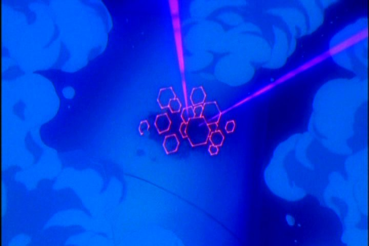

# Ireul  The Andromeda Hitcher

## Summary

When it comes to episodes of the old Neon Genesis Evangelion, Episode 13 is typically not on the list of most people's favorites. The...

## Content

When it comes to episodes of the old Neon Genesis Evangelion, Episode 13 is typically not on the list of most people's favorites. 

The titular Evangelions don't feature in the episode at all (except for a static shot of Eva-00). The pilots spend the episode in the nude(seriously!) and are thoroughly inconsequential. The Angel featured, Ireul, apparently another monster-of-the-week weirdo, is defeated by making it "evolve" to the point of death. It seems so insignificant at first blush that it is omitted in the Manga and has no clearly recognizable counterpart in the Rebuild continuity (Associations with the Twelfth Angel in that continuity are a matter of significant discussion, however). Even the consequences of an Angel invading Nerv HQ are downplayed in the very next episode by Gendo's data manipulation, leaving Ireul seemingly meaningless within the context of the show.

The rest of the episode seems like a "day in the limelight" episode for Dr. Ritsuko Akagi and features background information that, on first blush, seems to exist purely as setup for a major event in the End of Evangelion. So, Episode 13 is a bad episode with some foreshadowing and a monster of the week Angel, right? 

WRONG. 

Episode 13 does more than any other episode before End of Evangelion to explain what Angels are, why Angels exist, and why they are called "Angels" in the first place. And it does this by being a reference to both Michael Crichton's 1968 novel The Andromeda Strain and the 1971 movie adaptation directed by Robert Wise. Visual similarities between the movie version and Evangelion are best explained by <a href="https://wiki.evageeks.org/Tributes_to_Other_Fiction_in_Neon_Genesis_Evangelion#The_Andromeda_Strain" target="_blank"><u>this page on the EvaGeeks wiki</u></a>. 

In both the book and the movie, a mysterious microorganism of extraterrestrial origins is brought back to Earth aboard a satellite, killing the residents of a tiny Arizona town and forcing a team of scientists to race against the clock to figure out what they're dealing with. The Andromeda organism is a microbial colony that is brought down to earth, and the Angel Ireul, in contrast to all the huge monsters that came before it, is a microorganism, a colony of microscopic machines. 

<figure></figure>
The similarities with The Andromeda Strain, both the book and the organism, continue. These are points that I have covered in the past on the EvaGeeks wiki, but they bear repetition here  - 
<ul>
<li>Ireul's A.T. Field is represented as a pulsating grid of hexagons that pop in and out of existence, totally unlike that of any other known Angel - whose A.T. Fields are consistently octagonal (apart from clear bloopers involving Ramiel and Arael). The Andromeda organism is a colony of hexagonal microorganisms operating in concert, the physical structure of which is able to alter its mode of operation to "switch on" or "switch off" at will.</li>
</ul><ul>
<li>Oxygen is used to hold both organisms at bay. Andromeda's growth is inhibited by oxygen and the microbe prefers carbon dioxide; it grows within a narrow acidity-alkalinity range that can be disrupted by an excess of oxygen. Ireul shows an initial vulnerability to oxygen in the form of ozone that is never elaborated upon or given a meaningful in-universe explanation, since the Angel's biology and growth conditions, unlike Andromeda's, are not explored. </li>
</ul><ul>
<li>Evolution is the same factor that ends the menace of both microorganisms. Andromeda gradually evolves into a form that is benign to humans, while Ireul's evolution is steered to a point where it has no option but to die out. (Given that the next Angel in NGE, Leliel, is heavily associated with depression, Ireul's death, insofar that it was involved in shaping its successor, may be interpreted as forcing the Angel to commit suicide) </li>
</ul><ul>
<li>Both microorganisms "hitch a ride", arriving upon a human-made object, and are released by human carelessness. The tiny "planet" that contains Andromeda arrives with a satellite designed to collect lifeforms from the upper atmosphere, and released when the satellite is carelessly pried open. Ireul's method of entry is not specified, but it evidently enters in air bubbles caused by substandard construction (Aoba describes B Wing's construction as "sloppy").  The episode title "Lilliputian Hitcher" suggests that Ireul hitches a ride on the construction sections that are brought  brought deep into Nerv HQ.</li>
</ul><ul>
<li>Other minor but notable similarities include physical isolation of the facility to contain the microorganism, people undergoing thorough decontamination while naked (The Wildfire facility scientists and the Children entering the simulation bodies), and racing to prevent a nuclear self-destruct triggered by the microorganism's actions. Andromeda degrading the seals in the Wildfire facility (unintentionally) triggered the self-destruct system, while in contrast Ireul hacked the Magi and intentionally attempted to blow up Nerv HQ.</li>
</ul>

However, the biggest giveaway in the reference to the Andromeda Strain is the "Messenger Theory", which is book-specific and raises more questions than it answers. While the scientific team at Wildfire debates the origins of the Andromeda organism, a theory called the "Messenger Theory" is brought up (pages 222-224 of the 1993 Ballantine Books paperback edition. The theory is Crichton's own work, and both the communications engineer "John R. Samuels" and the "Fifth Annual Conference on Astronautics and Communication" turn up nowhere except in Andromeda Strain references and are deducibly fictitious. 

Crichton's fictitious theory suggests that the most efficient way for an advanced civilization to communicate with another species would be to send a microorganism out into space. Electromagnetic radiation attenuates and physical media are too information-inefficient for communication across space. However,  a self-replicating microorganism, containing within itself the genetic code to form an organ or even a full organism, may be used to communicate with the aliens discovering it and suggest methods of contact with the species that originally sent it. The practical difficulties of engineering a microbe and sending it out to other star systems at sub-light speeds in order to attempt contact with an alien civilization are obvious, but that doesn't prevent it from being a fantastic thought experiment, or a great hook for a science fiction story. 

The Andromeda organism is found on a tiny space rock that resembles a planet in miniature, and both the <a href="https://wiki.evageeks.org/Seed_of_Life" target="_blank">Seeds of Life</a> arrive on their respective "moons", created by the <a href="https://wiki.evageeks.org/First_Ancestral_Race" target="_blank">First Ancestral Race</a>. The humans(<a href="https://wiki.evageeks.org/Lilin" target="_blank">Lilin</a>) and Angels that descend from the Seeds of Life are in effect their messengers. The Angels were created to be immortal and had immense power and the ability to survive the most extreme of conditions; the comparatively mortal, frail humans being evolved step by step from microbes, which in turn formed out of the blood of <a href="https://wiki.evageeks.org/Lilith" target="_blank">Lilith</a>, Lilith's blood finally spreading the message of humanity. Either way, the original human race would be able to survive and communicate with whatever forms of life that were to come later. 

The idea that an alien species should send lifeforms to seed other planets with human life in an attempt to communicate (and demonstrate that it had existed) fit Evangelion's themes of existential angst and the difficulties involved in human communication perfectly. The White Moon of Adam and the Black Moon of Lilith have both served like Andromeda's space rock, bringing a new lifeform far into the cosmos. Andromeda remains utterly mysterious, and neither the book nor the movie offer any conclusive evidence that Andromeda was meant to serve as the messenger of an advanced intelligence. In contrast, the <a href="https://wiki.evageeks.org/Classified_Information_(Translation)" target="_blank"><u>Classified Information</u></a> files from the <a href="https://wiki.evageeks.org/Neon_Genesis_Evangelion_2" target="_blank"><u>Neon Genesis Evangelion 2</u></a> video game (purportedly made with the direct assistance of Hideaki Anno) <a href="https://wiki.evageeks.org/Classified_Information_(Translation)#First_Ancestral_Race" target="_blank"><u>explicitly state that</u></a> Adam and Lilith were sent out by a "First Ancestral Race", even if this ancestral species remains unseen and completely mysterious within the show's canon. 

In short, Ireul's existence is the key to unlocking the science fictional aspects of Evangelion's dense and multilayered story. Evangelion, at its heart, is arguably a story about the difficulty in human beings reaching out to each other. The very Angels that are in conflict with humanity are alternative possibilities for human existence. Ireul, in obliquely pointing at Messenger Theory, hints at an idea that becomes most clear in The End of Evangelion, the idea of a human species sending out a messenger to another world in order to reach out, make contact with whoever else is out there, and spread human existence through the cosmos. 
