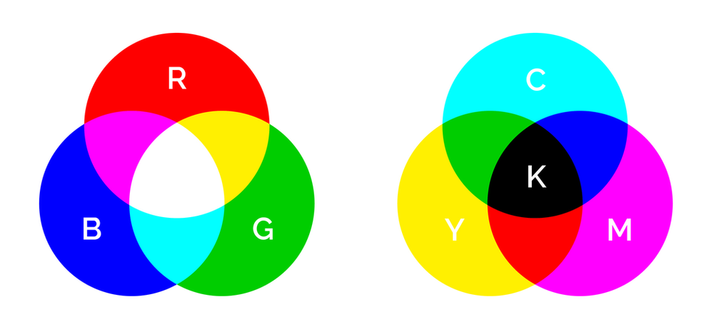

# Last-Minute Pre-Release Rant 1 At The Very Beginning

## Summary

An attempt to start chaotically unloading NTE speculah from my cranium before Shin Eva gets here in a few days.

## Content

I know there’s been a lack of updates at such a momentous time in <em>Eva</em> history. No one is more disappointed by my failure than me -- but all you can really do is pick yourself up and keep crawling ahead. Anyone who is itching for content and doesn’t use Twitter, please take a look at my feed; while nowhere near as good as full blog articles, I’ve been posting interesting and amusing stuff on a regular basis. (Also, don’t worry — any feelings you have about the platform that have kept you away from it, I more than likely share.) 

A meta post about various topics has been on my mind for weeks. I’ve been plugging away at it, but it’s obviously been very difficult to put together. Maybe the words will come more easily after I break the psychic surface tension and force myself to publish one article. <em>Any</em> article. 

Referring, of course, to this one.

Well, this is it. We have a new release date -- Mark, er, <em><strong>March</strong></em><strong> 8</strong> -- and it’s close enough that another delay feels quite unlikely. I’ve run out of time to dawdle; I get my pre-release predictions out <strong>now</strong> or never. First, some points. (Most of them are probably general enough that they should go onto a separate page specifically about explaining my analytical thought process, but I'll worry about that later.) If you already know how I operate and you don’t have a problem with it, feel free to skip most of them. 
<ol>
<li>Due to having run out of time, this and other hypothetical articles pertaining to pre-release predictions will be <strong>very rough and informal</strong>. I will be abandoning my usual “pedantic scholar” tone (i.e., the one I’m using to write these obnoxious disclaimers) for more of a “giddy storyteller” one. I will simply relay my ideas as straightforwardly as possible, without bogging them down in “probably”s, “maybe”s, “conceivably”s, “perhaps”es, and so on. There simply isn’t enough time left to be a perfectionistic twit about this.</li>
<li>So just keep in mind that the full “mental map” of these ideas is not actually as incoherent as it may appear here. Explanations DO EXIST; there are mountains of collected observations, connections, and so forth that, once laid out, would make my logical process mostly lucid. And this can all be done later, for whatever ideas survive the metaphorical onslaught of Shin Eva’s release. </li>
<li>These are “just” ideas. They are not made of stone, but are fluid and every-changing — works in progress that constantly shift to accommodate new information and realizations. My mind does not hold still, so anything I write is just a snapshot of where I happen to be at a particular moment. </li>
<li>(A.) My top priority is total explanatory power. 
(B.) Moralistic concerns do not constrain my explorations. If I am led to an idea that some (including me) might consider distasteful, that will not stop me from proceeding. An idea being “controversial” or “problematic”, etc., is no indication of its validity. You only find out for sure by shining a light into dark places.
(C.) Characters being simultaneously likeable/relatable and engaging in abhorrent acts is not an issue for me. Non-existent people being driven to acts that could be considered evil do not need to be judged as evil and shunned. Within their own narrative realities, perhaps — but it is too easy for ideas of “justice” and “right and wrong” to become a mere distraction that adds nothing to our understanding <em>as the audience</em>.  Complicated, morally ambiguous characters provide safe vessels for exploring our own dark inner workings. I consider them a good thing. </li>
<li>Lore, setting, plot… all of these things are important. The characters don’t exist in a sterile laboratory environment. Just like us, they are part of a big, messy world with its own sense of history, ruled by its own social conventions and scientific laws. In a work as carefully crafted as Eva, these things informs everything the characters are and everything they do. </li>
<li>(A.) <strong>NTE is not NGE</strong>. They are deeply complementary works that inform one another intertextually, but it is not assumed by default that setting and character details carry over. Old information must be carefully weighed against all of the changes to story and setting. Take nothing for granted. 
(B.)  Yes — this means that fandom memes like “sequel theory” and its countless variations are summarily rejected. I spent years countering “evidence” for that stuff, and I’m done with it.  Anything that is worth my time will be justified by NTE’s own plot, themes, and metaphysics — no imported assumptions required from me or anybody else.</li>
<li><em> Eva</em>, and NTE even more so than NGE, is built upon intentionally decipherable systems of visual and symbolic communication in a video-audio medium. No matter how many times the fandom misuses that famous “no <em><strong>Christian</strong></em> meaning” Tsurumaki quote, it will not come any closer to meaning what is repeatedly claimed. (Please don’t be one of those people.)  Along the same lines, shutting your mind off to well-established filmatic conventions that are used intentionally to convey meaning, or to the innumerable symbols and metaphors dating back to ancient times that are available for an artist to use in their creations, and suggesting things like “none of it means anything”, “it’s just a coincidence”, “you’re overthinking it”, and so on — this is not even slightly clever or original, and in fact these are some of the most predictable and parochial things an <em>Eva</em> fan can spout off. </li>
<li>Anno (not necessarily limited to Anno, but his sensibilities inform <em>Eva</em> the most, so bear with the simplification) has well-documented interests and fixations. Seeing them represented in the work is not “reading too much into things”, because of course art will be a reflection of the artist. To a certain extent <em>Eva</em> is designed to reflect the audience back at them, yes, but this is not the totality of what <em>Eva</em> is. It is also a DEEPLY personal work and that plays a huge role in what makes it so magnificent. The words “Death of the Author” are not a magical incantation; saying them does not make a lazy argument any less lazy. </li>
</ol>
That got much more long and annoying than I intended. You can see how many of the fandom’s less endearing personality traits live rent-free in my head. No, I don’t like it either. Yes, I probably need to get therapy for that.

Time for the fun part. Are you ready?…… Are you <em>sure</em>? This is going to get really weird, just as a warning. Like, REALLY weird. Remember, if it’s too much, you can always run away. 

Alright, switching gears to "incoherent train-of-thought rambling with no visual aids" now. I did try to warn you. (If there are any particular elements that especially rouse your curiosity, feel free to ask me about them, and if time and energy permits, I may update this document to add some explanation.) 

I’m not exaggerating when I say that the Apkallu (my theory-crafting group) and I have made more progress on NTE in the last two or so years than we collectively made in all previous years combined. The gradual trickle of information about <em>Shin Evangelion</em> has helped, but only to a certain point. The biggest breakthrough resulted from wholeheartedly embracing the vastness of NTE’s setting and all its differences from NGE. NGE is a very claustrophobic work, and that mood serves it well, but NTE, despite its superficial initial “school drama” and “romcom” elements, takes a more epic approach, and its sense of scale and scope is ridiculously vast. But this is all quite vague — what do I specifically mean?

If you followed <a href="https://www.arqacrypha.net/retro-reichu" rel="noopener" target="_blank"><u>my work on EvaGeeks</u></a> before I left, you probably have some idea. The vast sci-fi scope of NTE is not, as in NGE, relegated to “a long time ago in a doomed star system far, far away”. It’s much more like <em>Nadia</em>, where part of the total story does indeed include “ancient origins on a distant world”, but Earth itself has been a very, very busy place. There are incarnations of ancient gods walking around, “piloting” beings that are either ancient gods themselves or the modern counterfeit version. There is one ancient civilization that has shaped human history, with its influence continuing to emanate from the shadows in the present day. There might be another form of sapient life even older than that, no longer “around” in an appreciable sense, upon whom we can blame basically everything. And so on.  

Well, that’s a whole lot in just one paragraph. I’ll start off somewhere in the middle and work from there.

Seele are fourteen survivors (each member is two people fused into one via core-tech) of a humanoid sapience that, like the Atlanteans, existed on Earth long before we Lilin (”humans”) did. They had their own rise and fall; their people were brought to ruin via First Impact (which is no longer Giant Impact; it’s the same kind of event as the other Impacts now), which left their souls entombed inside the depths of the Black Moon, within failed attempts to uplift themselves to the divine state of Infinity. I tentatively call this species the “Anunnaki”, and will do so here. 

However Lilin originated — as a slave race, perhaps — the fourteen surviving Anunnaki interceded with the Lilin’s development and guided them toward a civilized and technological state not unlike what the Anunnaki once had. This is probably not because Seele care about the Lilin especially; they just happen to be useful. First Impact was a dreadful mistake, and Seele wish to undo the considerable damage it did and free the souls of their people from a perpetual purgatory. This involves a mysterious “covenant” with a creator-deity called Lilith, who seemed to undergo a fall (possibly through no fault of her own) in the past. In order for Seele to get what they want, they must restore Lilith to her prior state of splendor via a highly intricate series of rituals, which includes the sacrifice of mysterious beings called “Angels” and eventually resurrecting Lilith through the body of an Evangelion, which would then become the “True Evangelion” (double-speak for “True Gospel”). 

Since Seele are consciousness trapped inside core-based technology, they rely upon the Lilin to carry out their wishes; they are the soul, and Lilin are their body. Nerv — “nerve” — is of course an important part of this metaphor. It is through Nerv that Seele shepherd the Lilin. With “Seele” being so ancient, one wonders how long “Nerv” has existed in NTE… 

Interestingly, NTE more than once has shown us nervous systems that exist independent of a body (at least a body in the way it would normally be understood). A chamber full of inconceivably massive neurons, on Level EEE of the Black Moon, and thus far not explained at all. The “Nebuchadnezzar” specimen, a miniaturized human nervous system with a fancy syringe-like device where the brain should be. Eva-01, transforming into “energy condensate”, and in spite of this having a visible nervous system. The nerves in some sense transcend the rest of the body. Nerv exists above the rest of Lilin, subject to the whims of no greater authority than Seele. What’s being implied, exactly, when the “nerve” destroys the “soul”? More than my little brain can comprehend right now. 

While Nerv has seemingly freed itself of Seele, Seele’s actual intention was probably the other way around. They had no desire to complete the Anunnaki’s evolution into a race of deities. Rather, much like Seele in NGE, they seem to have wanted to liberate their people’s souls of fleshly existence and send them back into the Chamber of Guf (i.e., wherever the Gates lead to), to undergo purification and be “laid to rest” in some sense. On some level this involved merging all souls into one, but what would happen after? Hard to say right now. What would have happened to the Lilin — would they be part of this process? Presumably so. It is “human” instrumentality, after all. As in NGE, NTE is very confusing about what “human” actually means, and there is the usual problem that “human means ‘Lilin’ in most contexts, but sometimes ‘human’ refers to a category of beings that includes non-Lilin”. Anyway, presumably Lilin would have been part of the harvest, and would have, through some means or another, had their souls sent into the Gates as well. 

This is not what Nerv — or, more specifically, Gendo — desires, however. He wishes to embrace the Infinite and evolve humanity into gods. (This is probably what his goal in NGE was, also, though ultimately he had to ‘settle’ for leaving Earth with already-deified souls like the Angels and Evas along with those Lilin who actually desired ascension for themselves; leaving those satisfied with mortality behind on Earth. The never-explicitly-stated parts of EoE’s ultimate conclusion are delightfully strange…) What exactly is the Infinite? We’ve heard about “failures of Infinity”, but what in the blazes does Infinity actually refer to?

First, let’s take a step away from the Seele-vs.-Nerv drama and go back. Way, way back. To the very beginning.

As in NGE, NTE has a cosmology that is heavily influenced by things such as Kabbalah and string theory, and this wacky blend of mysticism and science makes it very difficult to pin down. Anno has of course made everything more explicitly strange than ever before, assaulting our senses with the uncanny from the very beginning and filling the mythos with all manner of profound, seemingly inexplicable strangeness. Giant beings (Angels and Evas; neither of these terms have been especially well-defined in NTE, incidentally) capable of developing halos (which vary widely in their morphology and circumstances under which they appear). When some of these giants die, a rainbow spontaneously appears. Some, but not all, of these giants revert into a blood-like substance (LCL), and they may explode into a far greater volume of this substance than could possibly have fit inside their bodies when solid, with the implied cause of the polluted red oceans being the ultimate testament to this. A.T. Fields carry over from NGE, but it’s unclear how much of the “science” is the same. There are black hole-like rips in space-time — the Gates of Guf with the presumed Chamber at the center — that can be generated by a certain level tier of these aforementioned mysterious giants, with difficult-to-explain variations observed depending on who is generating the Gates. Synchronization rate, that all-important measure from NGE, has been largely (but not entirely) supplanted by “plug depth” — a seemingly straightforward concept, but actually anything but, around which shifts in the fabric of reality and physical transmutations are seen to repeatedly occur. Undoubtedly, there are more than three spatial dimensions in NTE, but exactly how many? How are they interconnected? What’s their significance? How does this all work?

I wish I knew. But one pervasive element in all this is COLOR. Colors were always an important motif in NGE, but, like just about everything else, this has been cranked to ridiculous levels of sophistry. The color metaphors operate on multiple levels, referencing multiple symbolic systems at once. There’s a way to eventually sort through all this and penetrate to the deeper truth that makes everything clear, but it will take time and effort. Which, if you like these kinds of puzzles, is not a problem at all. It’s actually fun, in its own way. Every step made in breaking the code is immensely rewarding. 
<figure></figure>
Every NTE film has come attached to a different color. Red, orange, blue, and finally white. The first three reference “blood types” from the original <em>Evangelion</em>. Here is a block of text I already had lying around on the matter:

Basically, the idea is that the theme colors correspond to different wavelength patterns / "Blood Types". Red, orange, and blue are all called out by name in the original work, and we know at least two of those have carried over to the new movies. 

Pattern red has something to do with the origins of life and things 'returning to the beginning'. The applications for Eva 1.0 are immediately obvious: it returns to the series' roots to get the ball rolling. 

Pattern orange's meaning is never made explicitly clear, but apparently it means "indeterminate", which seems to fit its appearances in NGE. Applied to Eva 2.0, it also approximately fits. Is this NGE, or is this something new? It's hard to categorize. Hence, pattern orange. 

Pattern blue is for non-Lilin Angels. Correlating this one to 3.0 feels a little trickier -- or, at least, putting the analogy into words has been hard for me. Pattern blue is associated with "high energy" (makes sense; blue is just behind violet in being the most energetic part of the visible EM spectrum), which goes along with Q being the "quickening", or the "kyuu" of the Jo-Ha-Kyu dramatic structure. Additionally, while the Angels tend to be "alien" in nature, they can at least be reliably recognized AS Angels. I suppose this can be loosely applied to 3.0's status as something that is mostly alien and unfamiliar, while still being identifiable (as Evangelion). I'm a little iffy on how to phrase the analogy. 

The last movie uses white as its theme color, though. But... there IS no pattern white. Not that we know of. So in that sense, we are going into completely uncharted territory. At the same time, the color scheme on <em>Evangelion</em>'s official website has given NGE the theme color black, which is a complement to white. (Some might say "opposite", but that doesn't feel as "Eva-like".) So are we being told to expect something "unknown" that also complements the original Eva? 

So we have quite the mystery on our hands here. But one thing about white that is without a doubt relevant to our interests: white light can be split into the seven colors of the visible light spectrum. The RGB color system functions on a similar basis. There is a complementary color system, CMYK, that is termed additive rather than subtractive, and the fusion of all colors is black rather than white. Black and white being complements is an ancient concept, and we can see this at work implicitly in the colors used to represent NGE, or "Old Eva", versus that used to represent <em>Shin Evangelion</em>, wherein "Shin" can mean ‘new’ (hence, "New Eva") and it is the culmination of the <em>Evangelion Shingekijouban</em>, or "Evangelion New Theatrical Edition", series.
<figure></figure>
This wasn’t supposed to be a color analysis, though, so I’m getting away from myself a bit. Back to the subject of cosmology, one idea I’ve considered is that “white” could be said to represent the “whole of reality”, and the seven primary colors are “slivers” of this reality. This gets very, very weird when you try to account for things like how Eva 13’s Gates of Guf are rainbow-like but, defiantly, do not conform to an actual spectral rainbow. There is something “wrong” about its Gates, and that’s probably important. (Brings to mind how the room from which Eva 13 deploys is full of interconnecting diagrams that are sort of like Sephirotic Trees, but none of them are <em>quite</em> right...) The Gates of Guf at Second Impact, however, were a perfect rainbow, radiating outward with no ripples, no repetition. A perfect splitting of white. 

It’s very difficult to put these ideas into words — they are very BIG, very visual, and involve a lot of overlapping, difficult systems — so for now I will leave things at “white” representing a sort of integrated wholeness, whereas individual colors only provide a slice of the full reality. Every color is its own unique state, its own facet of reality. They all coexist along the same arrow of time, together but also separate; and beings that lack the limitations of mortals can shift their vision from one “color” to another to experience different parts of reality. (Eyes being able to take on different-colored glows -- probably important here? Yes, very.)

I suspect that the slice of reality where most of NTE happens is the “blue” one, perhaps overlapping a bit with the “green” one. This is the material ("lower") world, a physical world, where organic life as we understand it can thrive.* And in contrast to boring blue physical reality, there is the red one, the "upper" world, that of the spirit. Now, having said this, this "spiritual" quality is very abstract and relative; for example, the “red universe” in NTE seems to be full of astral bodies, not unlike ours. <a href="https://www.arqacrypha.net/post/three-one-and-going-home" rel="noopener" target="_blank"><u>In a previous article</u></a>, I wrote about how there might be a star map hidden on the inner surface of the door to Lilith’s chamber leading to a location in this “red universe”, . What would you expect to find there? The NTE equivalent of the First Ancestral Race, I suspect. That is, the sapience that is ultimately behind everything: Adam, Lilith, the Black Moon, the Anunnaki, all of it. I finally read <em>Devilman</em> (the original) fairly recently, and Satan’s final expodump tickles the imagination. His race, which he refers to as “God”, sounds like it isn’t too far removed from a very plausible NTE progenitor race. Are they still around in any appreciable way? Who knows. “God’s in his heaven; all’s right with the world”. Whatever they’re up to, whether they’re extinct or still extant, it may not make much of a difference. <em>Shin Eva</em> will probably provide some useful hints on this front.

* (And this is what I mean about competing systems of color symbolism making things confusing and difficult. Blue = our boring reality, but it’s also the wavelength pattern for god-like beings... ones with (typically) red cores, and whose eyes (typically) glow red. How to reconcile this? You just keep plugging away at the problem and hoping for the best, really. )

Assuming these distant progenitors exist, one tentative guess we can make is that these beings… this figurative “God”… at some point sent a being out into the greater universe. Was this being one of them, or was it a creation — a god created by “God”, as are the Seeds of Life NGE? Was it sent out to colonize the universe? Was it an exile of some sort… a “fallen” figure like <em>Devilman</em>’s Satan, banished forever onto a godforsaken piece of barren rock? There’s so much information still missing that so many things are possible, and I am happy to wait for further clarity. But assigning tentative detail as a sort of placeholder can make it easier to test ideas, so allow me to speculate a bit about what may have happened, and how...

<a href="https://www.arqacrypha.net/post/last-minute-pre-release-rant-2" rel="noopener" target="_blank"><u>Next time</u></a>, I'll return to the idea of "Infinity" and what it actually is.... <em>and</em> I'll make a terrible pun about "splitting" it!  This is also where the really strange and controversial new stuff will start appearing. (Also, "next time" will be in a couple of days and not in a month. Probably.)
