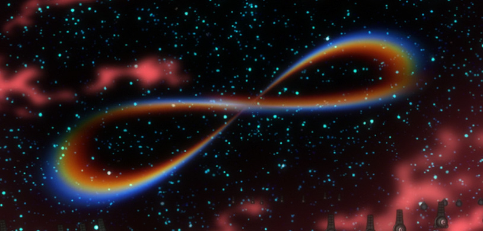

# Last-Minute Pre-Release Rant 2 Splitting Infinity

## Summary

In a primordial family drama, Infinity undergoes a progressive, irresistible diffraction.

## Content

<figure></figure>
Picking up <a href="https://www.arqacrypha.net/post/last-minute-pre-release-rant-1" rel="noopener" target="_blank"><u>from last time</u></a>… (Same disclaimers all still hold, including my apologies for the absence of much-needed images. I’m going to keep calling it a “rant” because self-deprecation is something I cannot live without.)

To start with, I accidentally ended up writing a couple of paragraphs that would be better suited for the previous post. I’ll dump them here first and move them after a few days because more readers will probably see them that way.

Previously, I discussed the possibility of NTE’s original sapient race originating within a “<strong>red</strong>" domain of the universe. According to Kabbalistic concepts, this “red” aspect of dimensional reality, or (very very tentatively) “<strong>Atziluth</strong>”, would be the second emanation of an original cause — <strong>Ein Sof</strong> (= The Unknowable God), the Big Bang, or whatever you prefer. (The first emanation is Adam Qadmon, which… I’m not going to get into right now.) 

Appropriately, red has the lowest frequency wavelength of the colors in the visible spectrum, and this is why, as noted last time, it is used in EoE to represent a full reversion to the beginning. Red is the Alpha of existence. With subsequent, further-reaching emanations of the cosmic origin, further colors would appear, adding additional planes of dimensionality. So I suppose this could mean that the Original Cause is 1D, Adam Qadmon is 2D, the red world of Atziluth is 3D, and so on, until we finally get to the “blue world” (very tentatively “Asiyah”). 

With two “dimensions” preceding the first spectral color, we could also fit black and white into this scheme. The Original Cause would be black, because it emerges from "nothing" (see also: the Kabbalistic concept of <strong>Ayin</strong>); and Adam Qadmon, being a very spiritual concept (and also because of the obvious “Adam as Radiant Giant” tie-in…), would be white. Very nice! Black coming before white also goes along well with how <em>Neon Genesis</em> (black) precedes <em>Shin Eva</em> (white). 

Now, in Kabbalah, there are only four “worlds” following Adam Qadmon, or so I understand, but NTE probably does not follow this cosmological model exactly; it’s clearly mashing many models together to create something uniquely its own. Figuring out what’s really going on will require cross-referencing multiple systems with the plethora of evidence in NTE until the required lucidity is achieved, and that kind of endeavor is really not possible until later, so I should probably stop tripping over my own feet here.

Moving onto what was promised… (in the usual, not-as-direct-as-you-might-prefer kind of way…)

You may or may not already be familiar with <a href="https://forum.evageeks.org/thread/19857/Adams-Children-and-the-Nature-of-the-Cycle/" rel="noopener" target="_blank"><u>that thread about the Adams and the Eva pilots</u></a> that I started in 2019.  Whether your answer is “yes” or “no”, it might be simplest to walk ya'll through a summary of that thread’s main ideas before proceeding. My framework has evolved considerably since then, becoming MUCH more complex and layered — not for the <em>sake</em> of making it more complex, but because it was <em>necessary</em>; the previous framework simply couldn’t accommodate all of the observations being made and provide satisfying explanations for them — and <em>because</em> it’s so complex, having a much simpler, however flawed, framework in mind from the beginning will likely make it easier to make the necessary mental adjustments. So let’s start with that. 

<h3><strong>Adams From Adam 
(And More Where That Came From)</strong></h3>

(Again, remember this is a summary of something I now consider <strong>obsolete</strong>. It is being provided here as a tentative stepping stone. For additional detail and clarification, please see the original thread.) 

Here it’s assumed that, as in NGE, Earth has two progenitor beings, Adam and Lilith. Lilith’s origins and nature are generally a big unknown. Adam, alternatively, is a sort of successful “mini-Instrumentality” of four individuals. The members of this tetrad are tentatively named after the four Zoas from Blake’s personal mythology -- four principle aspects that divided out of an original divine being called Albion -- and are thus called <strong>Urthona</strong>, <strong>Luvah</strong>, <strong>Urizen</strong>, and <strong>Tharmas</strong>. It’s not known who they really are or where they came from; what they’ve achieved together is what matters. Seele, interested in Instrumentality themselves, set a team led by Misato’s father to the task of studying Adam, the First Angel, discovered inert beneath the South Pole. Perhaps in the interest of attempting to replicate whatever process had originally created Adam, the research team attempted to add Lilith to the fusion. But not the entire thing; the experiment was restricted to her surgically removed core. 

The introduction of a fifth element*, however, destabilized the four-in-one fusion, with the result that Adam split into four beings, subsequently referred to as “Adams”. (”Adams”, annoyingly, is both a collective noun and an individual one. So each of the four is an Adams. Just pretends “Adams” is like the surname “Adams” — “This is John; he’s an Adams too!” — and this may help alleviate any irritation you might feel.) The Adams called Urthona was the “most divine” of them all, and could be informally viewed as “the leader” from that perspective; but he was not the one who actually kept the fusion together. This was instead Luvah; the tetrad remained joined because of the other three’s mutual love for<em> him</em>. Lilith’s core, however, dangled a forbidden fruit before Luvah (literally? metaphorically? both, probably), and he splintered off from Adam to claim Lilith for himself, becoming a two-cored being in the process. With Luvah gone, Urizen and Tharmas left the fusion as well; Adam was reduced to Urthona alone. 

* (Insert “multipass” joke here.)

Somehow, this destabilization and splintering resulted in Second Impact. Urthona, playing a role roughly equivalent to Adam from NGE, did not survive; his body was destroyed in an extremely over-the-top version of what would later happen to many Angels. (That is: A.T. Field collapses; a catastrophic amount of energy is released; the body disintegrates into an utterly implausible volume of LCL.) However, he did leave <em>something</em> behind: the organic part of the Key of Nebuchadnezzar. The other three Adams all survived more or less intact, but they were separated by the force of the Impact. Luvah was cast out of the epicenter and reached the shores of Japan via LCL megatsunami, still possessing Lilith’s core within its body. Tharmas was blasted to Mare Tranquilitatis of the Moon via LCL geyser. Urizen remained trapped at the epicenter of Second Impact, hidden beneath the black dome of an absolutely gigantic egg-like object, and would still be holding the Gates of Guf open fifteen years later. 

Nerv’s Artificial Evolution Laboratory was given the task of incarnating (= embodying the divine within human form) all five giants (four Adams plus Lilith), along with producing the cybernetic Evangelions for these incarnations to “pilot” under controlled conditions. The incarnations are as follows:

<u>Urthona</u>: Kaworu Nagisa

<u>Luvah</u>: Shinji Ikari

<u>Urizen</u>: Asuka Shikinami Langley

<u>Tharmas</u>: Mari Makinami Illustrious

<u>Lilith</u>: Rei Ayanami 

The three Adams whose bodies survived mostly intact would also all eventually be salvaged by Nerv and modified into Evangelions themselves. Here’s the full breakdown of where all five giants end up:

<u>Urthona</u>: The Key of Nebuchadnezzar (organic part)

<u>Luvah</u>: Evangelion Unit-01

<u>Urizen</u>: Evangelion 13

<u>Tharmas</u>: Evangelion Mark.06

<u>Lilith</u>: Herself 

However, it seems things were not quite this simple, and that the original cores of these giants, when available, were eventually used as a basis for Eva units that would operate independently of their original bodies. Conveniently, the separated cores retain a metaphysical link to their bodies, allowing these so-called “Adams’ Vessels” Eva units to influence their bodies remotely, in a way that cannot be interrupted using traditional methods (like signal-jamming); the Vessel must be completely destroyed to break the link. This scheme allows Seele and Nerv to turn one extremely overpowered target into two extremely overpowered targets, making things much more difficult for the opposition, Wille. 

At the time of this older speculation, Evangelion Mark.09 could be pinned down as the Adams’ Vessel possessing Urizen’s core, and the full designation of its black-and-red form as provided via merchandise (heh) revealed that Mark.09 was in fact the <em>First</em> Adams’ Vessel, very directly implying the existence of others. It was simple enough to see that three Evas were missing in between 09 and 13, and, if those were all Adams’ Vessels, you would conveniently end up with four, making the following breakdown a near certainty. 

<u>Mark.09</u>: 1st Adams’ Vessel: Core of Urizen

<u>Mark.10</u>: 2nd Adams’ Vessel: Core of ?

<u>Mark.11</u>: 3rd Adams’ Vessel: Core of ?

<u>Mark.12</u>: 4th Adams’ Vessel: Core of ?

(Yes, I came up with this long before Mark.10 was revealed.)

I say “Core of ?”, but the sorts of number games that Anno has shown himself to be rather fond of in NTE dictate that Mk.10 is most likely Luvah’s core (because 10 is 01 flipped, and because Eva-01 absorbed the 10th Angel), while Mark.12 is probably Mark.06’s core (12 is of course 6x2, and the version of the 12th Angel encountered in <em>Q</em> has fused with Mark.06), leaving Mark.11 to, most likely, be Urthona’s core. But enough about Vessels for now… 

In conclusion: though very outdated now, and overly simplistic, this model was a<em><strong> really</strong></em> good beginning. It basically changed everything. No longer was it necessary to yield to sequelists and multidimensional loopers on the matter of Kaworu’s lines not making any apparent Watsonian sense. Now they made perfect sense: Kaworu had uniquely retained memories of being Adam, and he could thus make cryptic references to a past where he was intimately familiar with Shinji’s previous self. The Adams/Pilot framework also created a pathway into the greater NTE universe; where before we had simply been skimming the surface, unable to break through that thick layer of ice, this theory was the equivalent of one of those gigantic drills they use in Antarctic research to obtain deep ice samples. There was, finally, a way down into layers of the work that had been previously unimaginable. 

After this breakthrough, my personal theory-crafting progress became so rapid that it was difficult enough just to keep a small inner circle of buddies (”The Postdiluvian Apkallu”, or “Apkallu” for short, after the rather silly name of the server I created to hash out things with them) up to pace. I made one significant attempt at a mega-thread that was supposed to, eventually, get everyone caught up, but the poor thing died before it could truly live. So it goes.

And here we are, out of time, and with me having to effectively vomit up some version of the latest framework. Anything at all will be better than nothing. This is going to be very weird and very confusing, even for me. 

<h3><strong>Albion, The White</strong></h3>

In <em>Devilman</em>, “God” is a race of androgynous winged humanoid beings who are capable of merging together to form more powerful entities, and just as easily unmerging. (Should tickle the<em> Eva</em> fan’s imagination at least a little.) In the original <em>Devilman</em> manga at least (I can’t speak for follow-ups / expansions), Satan explains: 

 “The earth, the moon, this little pocket of space… 

it was created by progenitors, long, long ago.

You humans call them ‘God’. 

It was they who planted the seeds of life in this corner of the universe.” 

<em>Devilman</em>, Vol.2 (The Classic Collection). Go Nagai. 

Published by Seven Seas. Translation by Adrienne Beck.

There’s more to the backstory than this, and it may have important implications for the distant past of NTE, but for now I won’t try to push the comparison too much further. What we have here goes along very, very nicely with there being effectively divine beings who originate from “somewhere else” (Atziluth) and who are, whether directly or indirectly, responsible for life on Earth. And, in accordance with both <em>Devilman</em> and <em>Ultraman</em> being significant influences upon NTE, perhaps it’s not too far-fetched an idea that a member of their own kind ended up alone on Earth, for whatever reason.

I will call this hypothetical entity “<strong>Albion</strong>” after the primordial man from William Blake’s mythology, out of whom the other deities progressively splintered. (At first glimpse, the name might seem quite silly and not very <em>Eva</em>-like. “Albion” is a fancy name for “England”, after all! But it actually fits frighteningly well. I’ll get into “why” a bit later.) And let’s just say that Albion <em>was</em> a member of this “God” progenitor species from Atziluth who, for reasons unknown, was sent down to the plane of Asiyah, all alone, within an immense space-faring vessel. You can perhaps guess what happened next. This vessel crashed into Earth, causing the<strong> Giant Impact </strong>(which, remember, is no longer equivalent to First Impact). A substantial amount of the vessel’s mass was lost in the collision and this, along with huge quantities of molten rock from Earth, was thrown into space, eventually coalescing to form the<strong> Moon</strong> (as in Luna, Earth’s satellite). Albion’s spacecraft was reduced to a damaged core; somewhat resembling an apple core, or a giant goblet. We call this the <strong>Black Moon</strong>. (In NTE, there is probably no White Moon.) 

Albion, perhaps feeling rather lonely, finally began to engage in <strong>Creation</strong>. This first act of creation was comprised of cleaving itself into two equal parts, generating a pair of beings that were simultaneously new and old: the “masculine” <strong>Adam</strong>, and the “feminine” <strong>Lilith</strong>.* At first, love of Self and love of Other were one and the same, and the division of Albion resulted in no turmoil. Continuing the Creation, the two of them engaged in an act of intermingling that was not possible when they were one — they <strong>mated</strong>, in effect — and this produced an entity that was not a mere splinter, but completely new. I will call this being “<strong>Luvah</strong>”**, after one of Blake’s four Zoas, the pre-fallen form of Orc.

* (I will refer to them as “he” and “she” for ease of communication. Contrary to my appraisal of NGE, where I hold that Adam and Lilith are reproductively competing females, here I thus far cannot justify Albion’s two halves possessing binary sexes. The split results in both becoming “thematically sexed” — or very loosely acquiring “gender” — but they both remain “<em>actually</em> androgynous”, if that makes any sense.) 

** (Luvah will be informally referenced in the masculine, though Luvah is, like his parents, androgynous; simultaneously male and female — or, alternatively, <em>neither.</em>)

As the first (and perhaps only “true”) child of Albion, Luvah was, in effect, a spoiled<strong> baby</strong>. And, in a tale as old as time, the arrival of the baby disrupted the perfect <strong>harmony</strong> that had previously existed between the <strong>parents</strong>. 

At this point it almost becomes easier to simply quote from some prose I wrote; a hypothetical scenario where Lilith is explaining to Luvah what went wrong, back in those young and distant days:

 “We both loved you more than anything. But your existence… created problems. Imbalance. We were no longer happy with one another. We competed for your affections. We came to love you more than we loved one another. And then, when Adam realized you simply loved me more than he, through no fault of his own-- he could not accept it. But he blamed me. Never you. But <em>me</em>. 

 “This anger was not like him. I was afraid. I could no longer be close. He was no longer someone I could recognize as having once been part of myself. Soon his anger, bitterness, and jealousy grew so great that it terrified even him. And so, he stripped all of those things from himself, and he contained them within a new being, whom he birthed from his right side.”

(Yes, yes, it’s fanfiction, and by using it I am implicitly “conceding” that all of this is fanfiction, or something… <strong>P’shaw</strong>. Sometimes prose is the most efficient way to communicate certain ideas. Rabbis have known about this for a long time; look up “midrashim” to see what i mean.)

Thus: a more or less perfect entity cleaved in two, reproduced, and then began to experience “marital problems” due to there now being <strong>three</strong> where there had once been <strong>two</strong>. A new consciousness had emerged that was not part of the “original system”, and it was unpredictable, a source of <strong>chaos</strong>. Even gods are all too human, and so Adam and Lilith reacted in less than perfect ways. What had originally been a mutually blissful division spiraled out of control, and cracks continued to spread throughout the ego of Albion.

What Adam did in a desperate attempt to restore the balance was reject his <strong>negative Shadow</strong> elements. Yes — the Jungian Shadow, except here it is not merely figurative. Gods capable of freely cleaving and fusing can simply break their Shadow off into a new being. But… is that <em>really</em> such a good idea? 

<h3><strong>Urizen, The Crimson</strong></h3>

 “This was <strong>Urizen</strong>. An angry, jealous god, intensely preoccupied with a sense of right and wrong. And into Urizen, Adam also partitioned the pain of the intensity of his love for you, all the wounds upon his heart… Urizen was made of everything that Adam no longer wanted to have within himself.”

 “Urizen” is, of course, another placeholder name taken from Blake, attached to perhaps the most prominent of the four Zoas, a figure who is at once the Demiurge (i.e., the God of the Old Testament) and the Devil. The original Urizen is male, but for the NTE equivalent, I am going with a pronoun convention of “she”. (The summary from earlier makes it obvious as to why, and the next paragraph will probably reinforce this in a less than subtle manner.) 

 “Even though he is her creator, Adam wants nothing to do with her. And she has always resented him for it. Long ago she abandoned any interest in him. For most of her existence, there has been only indifference if not antipathy. But you’re different, Luvah. Yes, she is built of Adam’s resentment, and so she despises you. But so too does she desperately desire from you exactly what Adam wants. Affirmation. Unity. The most intense love possible in this universe.<em> Everything</em>. Refuse her, and she will rip you open and take what she wants forcibly. I have always been sympathetic to her, but she is also terrifying, and very difficult. I did not feel capable of handling her on my own. And so… 

 “I followed Adam’s lead, and I allowed a new being to emerge from my left side. You know <em>her</em> as well: <strong>Tharmas</strong>.”

(Tharmas is named for yet another of Blake’s Zoas, and I will use the pronoun convention “she/her” for this entity. This is the last Zoa name I'll be borrowing for the updated version of the framework; the absence of "Urthona" is intentional.)

<h2><strong>Tharmas, The Green</strong></h2>

To balance the chaos sowed by Urizen’s birth, <strong>Tharmas</strong> was created as a <strong>perfect complement</strong> to Urizen. Lilith separated out not her negative Shadow, but her<em> positive</em> one. This may initially sound paradoxical — a <strong><em>positive Shadow</em></strong><em>??</em>— but it actually isn’t. I will quote <a href="https://en.wikipedia.org/wiki/Shadow_(psychology)" rel="noopener" target="_blank"><u>Wikipedia’s article</u></a> here since it efficiently conveys the relevant ideas:

 “Contrary to a Freudian definition of shadow, however, the Jungian shadow can include everything outside the light of consciousness and may be positive or negative. Because one tends to reject or remain ignorant of the least desirable aspects of one's personality, the shadow is largely negative. There are, however, positive aspects that may also remain hidden in one's shadow (especially in people with low self-esteem, anxieties, and false beliefs).”

The creation of Tharmas allowed Lilith to “cover more ground” -- and accomplish more as the “Team Mom” -- than she possibly could alone. Tharmas and Lilith were both slightly <strong>distant</strong> but nonetheless genuinely caring <strong>guardian</strong> figures; they both wished to see the life to which they were bound grow and thrive. Lilith, once “de-shadowed”, became a much more muted version of her original self, with Tharmas now containing much of her intensity, sensuality, and warmth; but this division allowed Lilith to place her focus upon Adam and Luvah. Tharmas, meantime, could dedicate her energies to the previously unmanageable Urizen and, on account of being Urizen’s complement, she was successful in her efforts. With Tharmas’ companionship, Urizen was able to transcend her “daddy complex” — let’s face it, being born from your father figure’s psychological discards is an inherently debasing concept, and even a god would be hard-pressed to <em>not</em> be fucked up by that, on<em> multiple</em> levels — and even move beyond her inherited need for Luvah’s unconditional love. 

Now, you might be wondering where, in all this god family drama, the Anunnaki and Lilin fit in. You’re also probably wondering when I’ll stop referring to these beings exclusively with weird, mostly fanonical names, and start referring to them in terms that are actually understandable (like “Kaworu”, “Rei”, “Shinji”, and so on). All in good time. (Hah! as if there’s any time left!) There are <em>many</em> plausible developments in the ancient past — Urizen and Tharmas becoming a duo of gods who actively intervene in the affairs of mortals, Lilith’s “fall” at the hands of her own offspring, the creation and destruction of an ORIGINAL set of Angels (!!), the spiritual politics of the Anunnaki and how their leadership’s hubris brought their entire species to ruin — that can be extrapolated from various subtle cues scattered throughout the movies, and I hope to cover as many of those as possible. But before that, I must first return to the conflict within the original Trinity -- that is, the two halves of Albion and their big baby <em>baka-</em>Luvah.

<h3><strong>The Tyranny of Love</strong></h3>

So Adam, having created Urizen and washed his hands of his less pleasant personality traits  — or so he thought, anyway —, returned once more to the matter of cultivating Luvah’s love. Purging out his Shadow, however, did not actually fix anything; he was simply running away from unpleasantness. In its place, he pursued pleasure with both Lilith and Luvah, aloof to the damage he had done, and which Urizen continued to incur. Lilith, still whole and forced to be the responsible one, created Tharmas. Adam did not approve, naturally, since many of the traits he admired and loved within his other half were now divided across two beings; and one of those beings was intended for his Shadow, not for <em>him</em>. Adam and Lilith’s relationship had started to fracture as soon as Luvah was born, but this was the final nail in its coffin. The splitting of Infinity, of Albion, had finally left Adam and Lilith unable to connect, and at last they “divorced” one another. 

At this point, Adam’s obsession with his own child began to take on an incredibly dark new dimension. Lilith may have no longer been whole, and same with Adam himself… but Luvah’s existence was fundamentally a “remixed” version of Albion. Luvah was a whole being, an <em>un</em>split Infinity, formed from the combination of Adam and Lilith’s spiritual and physical traits, born of their love for self-self and other-self. Thus, Luvah now embodied not only something Adam desired that he was never able to truly achieve — the equal love of a child who preferred Mother to Father — but now also things Adam once possessed and had, through his own recklessness, lost: Lilith as a whole person and complement to Adam himself. 

Possessing Luvah completely became Adam’s greatest wish, possibly the only thing continuing to drive him onward. He would do anything to make this wish come true, even if it meant forcibly altering Luvah and undermining his sense of will and personal growth. It would also mean undermining his other half, since Lilith only wanted what was best for her child, and yearned to see him mature into a divine consciousness truly equal to what Albion once had been — someone who valued his connections to others but who could also stand on his own two feet emotionally. What Adam and Lilith desired for Luvah were antithetical forces, unable to coexist. Something had to give, sooner or later. 

A mysterious series of events involving Tharmas (and thus probably Urizen as well), which I will discuss another time, saw Lilith “cast down” — cursed in some way, stripped of most of her power, and rendered unable to protect Luvah any longer. This left Adam completely unbalanced, and able to impose his tyrannical love upon Luvah. The end result of this was that Luvah himself was forcibly deprived of everything that went against Adam’s designs for him. Despite having undergone tremendous personal growth over the millennia, he was reduced to the psychological stature of his original super-dependent and baby-like self; the “adult” part of him was exorcised by Adam. Did it simply vanish, though? Oh, if only things were that simple. So what happened to it, then? 

I’ll talk about that bit of insanity in part 3 of <em>The Rant</em>. 

<h3><strong>Albion, The Infinite </strong></h3>

So I never <em>did</em> really answer the question of what “<strong>Infinity</strong>” is, did I? Recently, I stumbled across a very suggestive tidbit from Blake’s <em>Book of Urizen</em>, wherein Blake’s gods are referred to as “Eternals”, and can be collectively referred to as…<em> wait for it</em>… <strong>ETERNITY.</strong> This analogy applies flawlessly to NTE: “Infinity”, logically, would refer to this original class of divine beings from Atziluth. Albion was one; Luvah, as a sort of “alternate Albion” (a new being created from the recombination of Adam and Lilith), is another. Since the exact technical definition is not currently known — at what point is “Infinity” no longer infinite? when does a true god become false? — I will also, for now, group Earth’s remaining primordial pantheon under the term. Adam, Lilith, Urizen, Tharmas: all of them are “Infinity”. 

Nor did I say, exactly, why “Albion” was a very fitting name for NTE’s first life-form on Earth. Well… consider that “Albion” derives from the Latin word for “<strong>white</strong>” (albus/alba/album). <em>Yep</em>. This original being is thus the “white light” that splits all colors out of itself. (And, yes, there is even more splitting to come. It doesn’t end with the division of Luvah’s soul, not by a long shot.) Another neat thing here is that there is a sort of meta-level fun with language going on, which Anno has repeatedly shown is very much his jam. If you write “Albion” in katakana, you get the following:

アルビオン
A RU BI O N

By a very strange coincidence, this is only one character away from NGE’s original temp title, “Alcyon”:

アルシオン

A RU SHI O N

BI vs. SHI. In yet another strange coincidence, both of these, if you added vowel lengtheners, would communicate the English language pronunciations for the letters B (ビー) and C (シー). Notice how there is only one letter difference between them. How peculiar. 

This gets stranger still if you take a big step back and view this all as one big meta joke. “Alcyon” is what came before “Evangelion”; one evolved or developed into the other, speaking in Doyleist production-based terms. What about “Albion”? In-universe, it’s the ultimate origin of all beings called “Evangelions”. 

Alcyon → (<em>Neon Genesis</em>) <em>Evangelion</em>

Albion → (Humanoid All-Purpose Decisive Weapon Artificial Human) Evangelions 

Interesting, no? 

Another fun detail here, which <strong>Derantor</strong> was able to articulate for me, is that in the “switch” from Alcyon to Albion, we go backwards, from C to B. Remember how “Evangelion” (エヴァンゲリオン) was written in the Japanese titles of the first three films? “Wevangeliwon” (ヱヴァンゲリヲン). Obsolete katakana for phonemes not used in modern Japanese (ヱ, ヲ) were swapped in for their modern equivalents (the “we”/ヱ sound became simplified to “e”/エ, and “wo”/ヲ became simplified to “o”/オ). So in terms of these two particular sounds, the orthography went backwards, analogous to how one must go backwards from C to reach B.

<h3><strong>Closing Comments</strong></h3>

This is probably quite an overwhelming post, and I bet you’re just itching to tell me how crazed and delusional my silly fanfic is. Hold off, if you can. Subsequent write-ups should make these ideas more accessible and palatable, and further explorations will provide “balance” to any unforgivable insult you might perceive toward your Personal Fave. (It will obviously be much, MUCH easier for me to focus on writing if I’m not getting flamed before I can fully explain myself.) I also know that visuals would help a <strong>lot</strong>, but putting them together unfortunately takes a lot of time and energy, so they may have to come later. If I can fart out something crude in the downtime between writing sessions, I will, but I can’t guarantee anything. 

If all goes well, this will continue in a couple of days, with an <em>extremely</em> strange idea about Shinji that I’m incredibly excited about and <strong>madly</strong> hope comes true in <em>Shin Evangelion</em>. Think you can guess what it is?<em> Smirk.</em>
