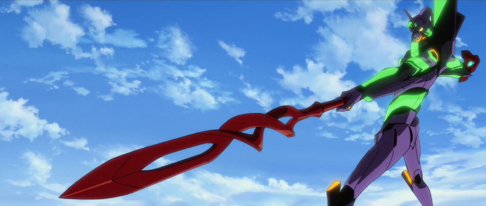
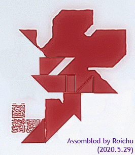
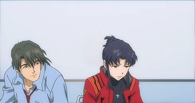
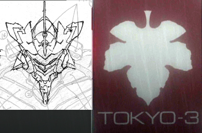

# Last-Minute Pre-Release Rant 3

## Summary

Fruits and fig leafs and snakes, oh my!

## Content

Lack of images really hurts, as usual. Forgive me. I also did not manage to write my way to the thing about Shinji that I teased about, but, uhhh… I’ll try to have another article ready for tomorrow to make up for it? 

So last time, I regaled you with a strange Jungian parable about a group of five gods who all used to be one. To very quickly recap: the first being who reached Earth was a divine androgyne called Albion. Albion split into two beings, Adam and Lilith, who intermingled their bodies and souls to create Luvah, a new god hypothetically equal in stature to Albion. The birth of Luvah strained Adam and Lilith’s relationship, and resulted in Adam’s dark personality traits taking prominence. In an attempt to restore things to how they had been, Adam split his Shadow into a new entity, Urizen. This fixed nothing, and only forced Lilith to split herself in two to create a counterbalance to Urizen, a new being called Tharmas. This successfully brought Urizen’s worst impulses to heel, but the ego of Albion continued to fracture without pause. Deprived of their respective shadows, Adam and Lilith had become strangers to one another. Luvah was the only thing that still bound them together, but the two parents bitterly contested his destiny. 

You’ve probably noticed that this “splitting of Albion” myth doesn’t address the origins of the Anunnaki, and that’s simply because their origins are a big blank. Seele seem to venerate Lilith as God, so… did Lilith create them at some point? There’s a lot of unknowns here. I’ve attempted to make headway on the matter by researching mythological systems included in NTE’s vast tapestry of allusions, and, while there is definitely a lot of suspicious shit going on, right now it’s unfortunately a big mess of conflicting data and wild uncertainties in chronology; additional cues from the last movie are probably needed to sort signal from noise and make further progress. So, for now, let's tentatively assume that somewhere during the unfolding of the Albion Family Drama, the Anunnaki were created, and what resulted was a sort of “World of Gods and Men”. A humanoid species (not Lilin, but Lilin-<em>like</em>) developed a flourishing civilization on an Earth where gods were very real… but how involved in the affairs of mortals <em>were</em> they, exactly? Good question.

And to address  that, I must first tangle with a couple of NTE's big elephants in the room: “what the hell are the fruits, anyway?” and “what the hell is original sin and when did it start?”. Because Gendo comes right out with the “Angels have the Fruit of Life, humans have the Fruit of Knowledge” tidbit almost immediately in <em>Eva 1.11</em>, it’s been a bit easy to take for granted that the relevant mythology is the same. By all indications, though, it’s been completely reworked. And good thing, too. I was always a bit alone in thinking so, but the fruit shit was one of the biggest messes in NGE’s lore. (“Okay, so you’re telling me that the Fruit of Life can be easily identified as being more or less equivalent to the S2 Engine… but the Fruit of Knowledge can’t be concretely pinned down to anything that Adam’s Children fundamentally lack in a ‘you have to actually eat it from someone to obtain it’ kind of way? Good to know!”) Not enough time to get too deep into it, because, as usual, there is way too much data to sort through, and it’s so dizzying it makes me feel a bit sick thinking about it, but basically… 

The Fruit of Life is probably still basically the S2 Engine. The movies have been cagey about this point, but… yeah. I found what is probably the original inspiration for the S2 Engine, and it not only sheds light on the phenomenology in NGE beyond my wildest dreams, but it also seems very consistent with NTE’s motifs. (A nice breakdown of that will come when I can manage.) The finding implants the suggestion that the S2 Engine is a heart-shaped (as in the organ) object made of spirals, and its structure somehow extends into normally imperceptible domains of space and draws from the hidden bounty of energy found there. The heart shape brings to mind some peculiarities of the big moment at the end of <em>Ha</em>, where Eva-01 fuses with the giant core-Rei. The revision process of the key frame animation for this sequence shows that at one point Eva-01’s heart was going to be the source of light, but the heart was replaced with the core — and all of the blood vessels were left attached to it. 

The implications for Evangelion anatomy are quite strange, but <em>Anima</em> (which often feels like it’s referencing deeply hidden aspects of NTE’s setting and lore) sheds some light here with one of its strange digressions in Vol.1, where it claims that Evas bleed something that isn't blood, and they lack hearts but Eva-01's S2 engine has a heartbeat-like pulse. This helped push me to the realization that, in NTE, Evas probably don't have regular blood; they use red LCL for blood instead. And so, in place of a separate heart, the core -- as a portal to the Sea of LCL, or its NTE equivalent -- is the center of the Eva circulatory system. A heart-shaped S2 engine lurking inside the core goes along with this alarmingly well. 
<figure></figure>
But, right, where was I… The Fruit-related symbolism in NTE is mind-numbingly complicated, and just to give you an idea of how multi-faceted it is, it involves all of the following: 
<ul>
<li> Alchemy and the Magnum Opus / Philosopher’s Stone. </li>
<li>Color symbolism — LOTS of color symbolism. (And this gets confusing really quickly, because of all the competing systems of color symbolism, but one important thing to remember is that the end product of the magnum opus can be represented with the colors gold, red, and purple. By some strange coincidence, these colors show up in NTE together quite often. For some examples, <a href="https://twitter.com/ArqaApocrypha/status/1354448717647114242?s=20" rel="noopener" target="_blank"><u>see this Twitter thread</u></a>.) </li>
<li>Imagery of goblets and other vessels for holding liquids. Related concepts: The Holy Grail, The Elixir of Life. </li>
<li>LCL. Remember that we have both golden LCL (as seen coming from Lilith in <em>Jo</em>) and the red LCL seen the rest of the time. </li>
<li>The red substance that comprises cores. There are also three mysterious variations on core-like material, colored blue, purple, and white. </li>
<li>Fig leaf and fruit (e.g. apple) imagery. </li>
<li><strong>SNAKES</strong>. That might sound stupid at first, but snakes are very, very important.<strong> </strong> </li>
</ul>
On and on it goes. It would take an incredible amount of work to sort through all of the relevant observations, so again forgive me for glossing over the specifics in order to just hash out some loose possibilities.

The tentative idea that I have is basically this: the dichotomy between the Fruit of Life and the Fruit of Knowledge doesn’t exist. Adam and Lilith both intrinsically possess the Fruit of Life; the thematic split between them is now defined differently. So what is the Fruit of Knowledge, then? It's basically just the “fallen” form of the Fruit of Life, a version that’s been stripped of the all-important infinite life, infinite energy, etc., aspects. 

The animated version of the Nerv logo (see GIFs below) seems like it might be depicting the reduction of the Fruit of Life into the Fruit of Knowledge: it shows an apple that, as it tumbles, gets carved into by a half fig leaf that is acting like a knife. (A tool, in other words…) Part of the fruit is peeled away by the fig leaf, and the peel seemingly vanishes, revealing an exposed core of purplish light. The fruit and leaf then turn into the Nerv logo as normally seen. Very mysterious. It’s an extremely dense image and I can’t do analysis of it justice at the moment. But some of it should be straightforward enough. 

The fig leaf represents humanity covering up its "nakedness" -- for its inadequacies, in other words. The half fig leaf here is "tool use". In the grander scheme of Nerv and its logo, it could be seen as “technology”. This idea is supplemented by the use of a full fig leaf to represent Tokyo-3. The city is intended to represent a sort of technological utopia, the peak of human civilization. NTE is acknowledging Gendo and Fuyutsuki’s philosophical chats from NGE about science/technology and cities/civilization. Interestingly, the fig leaf iconography can also be identified with all three of the Adams-based Evangelions. The Tokyo-3 fig leaf resembles the head of Mark.06 when seen from the front. The Neo-Nerv tangram can be unscrambled into something that resembles a one-horned Eva like Eva-01 or Eva 13. And the half fig leaf in the original Nerv logo… If you look closely in the animation playing behind Misato and Kaji, this fig leaf is, somewhat suspiciously, green on one side and magenta or fuchsia on the other. Magenta/fuchsia are commonly used to represent a “high-energy version” of purple; and the combination of green and purple might bring Eva-01 to mind. Incidentally, the title of the song used when Eva-01 awakens is called (very mysteriously) “Sin from Genesis”. 
<figure></figure>
<figure></figure>
<figure></figure>
<figure></figure>
I told you this was all wicked complicated, didn’t I?

Once the fig leaf cuts out the slice of the apple, it’s put to use partly covering up the gap it’s generated. The implications here are fascinating but quite confusing. The suggestion seems to be that Luvah is responsible for reducing the full form of the apple — the Fruit of Life — into the incomplete form — the Fruit of Knowledge. He is the green and purple tool that made this incision. But if he is a god created by gods, does this imply he was manipulated into reducing the fruit? Otherwise, in what sense was he a tool? And what’s the relation here to Original Sin? Gendo refers to Original Sin in <em>Ha</em>; it’s apparently a real thing and Impacts can be used to get rid of it. I still wouldn’t be able to tell you exactly what it is, though, even after considering the problem from many different possible angles. 

Belatedly, it does occur to me that there is a rather relevant visual in the main trailer for <em>Shin Eva</em>:
<figure></figure>
...where Eva-01 is engaging in a bit of tool use herself. And you might notice that the side of the Spear of Cassius she's pointing at her target (Eva 13, presumably) looks suspiciously like an apple peeler. This gives me a good feeling that the animated Nerv logo will be fully explained (or we fans will be fully equipped to explain it, rather) by the events of <em>Shin</em>. So, contrary to my burblings above, perhaps it's the combination of Eva and Spear that enables the transformation of the Fruit from one form to another. I can feel the seed of something neat germinating inside my head; I'll have to think about it more. 

Couple more things I’d like to point out before moving along. The strip of the fruit that gets cut off… the purplish glow that lurks within the fruit… Both bits of iconography lead us to the ceremonies preceding Fourth Impact, with the 12th Angel and Eva 13. When Mark.06 is decapitated, two “snakes” come out of it (one from the head, one from the body). These snakes wrap around Eva 13, and they turn into a giant core as they start to suck up Lilith’s LCL from the pool below. Cross-reference here with the iconography of the Orphic Egg — an egg with a snake wrapped around it that hatches into the dazzling androgyne Phanes. (You might notice how the Orphic Egg is referenced in Seele’s logo, as well.) Eva 13 is the purplish light within the fruit; the serpents are the peel that’s cut off; and the LCL/core is the remainder of the fruit. 

Snakes, contrary to their bad rap, are an ancient symbol of resurrection and immortality — so it makes perfect sense that the part that’s missing from the Fruit of Knowledge that let it transform back into the Fruit of Life would be represented using serpentine iconography. <a href="https://forum.evageeks.org/post/894020/Thrice-Upon-A-Humanity-The-Deep-Lore-of-NTE-WIP/#894020" rel="noopener" target="_blank"><u>I’ve discussed on EGF in the past</u></a> how Lilith is “the Serpent”, but it’s not quite this simple; both Lilith <em>and</em> Adam are the figurative Serpents. There isn’t one, but two. (This ties into how Lilith’s mate after Adam is classically Sammael. NTE!Adam is both Adam and Sammael at the same time. Not as weird as it might first sound when you remember that <em>Eva</em>’s Adam has always had this sort of “Satan rising from the depths of Cocytus and ushering in Hell on Earth” thing going on, and Adam’s incarnation, Kaworu, is an expy of Satan from <em>Devilman</em>, and even undergoes a “fall” in <em>Q</em>.) Seele’s logo may only show a single serpent, but when you know there are really two serpents, referencing both creator deities at once, it takes on a double meaning. Lilith is the Serpent / Dragon as Guardian of Immortality, like Ladon guarding the Golden Apples of the Hesperides. Perhaps the most blunt manifestation of this metaphor is Eva-00 piloted by Rei (both of them likely vessels for Lilith’s soul) wielding an “Enchanted Shield of Virtue” shaped like a dragon’s head. (Though of course that example by itself is rather confusing, since the dragon’s head is used to keep the 6th Angel’s golden light <em>out</em>… but Eva-00 also has yellow-orange armor covering parts of its body, so *head explodes*. I’ll have to go through the more subtle examples another time.) Adam is the Serpent as Tempter, which plays out in <em>Eva:Q </em>with Kaworu convincing Shinji to go down to Central Dogma, and this ridiculous Garden of Eden visual metaphor playing out that ends with Eva 13 chomping down on the “fruit” (which is the resurrected body of Lilith herself). 

Incidentally, this isn’t the only instance of the “two serpents -&gt; awakened Eva with functioning Fruit of Life” thing. It’s there at Eva-01’s awakening (覚醒) too, but in a much more subtle way. You definitely wouldn’t think so at first glance, but Eva-01 is undergoing the NTE version of a Kundalini awakening (クンダリニー覚醒).  Kundalini yoga is a category of mysticism that overlaps a lot with Kabbalah, so it’s not too surprising to see it represented. I’m a pretty huge newbie about this stuff, so I won’t talk about it too much, but after Eva-01 goes Radiant Giant, there are chakras visible throughout her body (along the central axis, in her hands and feet, and so on), and of course her third eye has opened. During the long panning shot up the wings into the black void of the Chamber, the double helix of the ascending Kundalini is visible inside Eva-01’s body. Kundalini is traditionally visualized as a serpent coiled up at the base of the spine, and she ascends up the spinal column during an awakening. In a lot of diagrammatic representations, though, Kundalini is depicted as <em>two</em> serpents in a double helical formation, a bit like the Caduceus. 

If that makes your brain flash with thoughts of SPEARS!!!, I assume it’s probably on purpose. I’m not entirely sure where the spears fit into all this, but... we’ll get there. I’m also not sure what we’re meant to take away from the wildly different uses of “serpents -&gt; ascension” in the cases of Eva-01 and Eva 13. Eva-01’s “serpents” seem to already be inside her, and Rei simply lets them finish their climb, as it were; but Eva 13 isn’t able to undergo even the first stage of <em>giji shinka</em> (pseudo evolution / false deification) until after devouring Lilith, implying it could not awaken until it took the two “serpents” that came out of Mark.06 into itself. At which point its awakening happened very, very quickly, of course. 

So to bring this back to ancient times and, reiterating the point that “there is probably no way to resolve a lot of the most obvious and niggling questions right this moment”, let me get through some more of my silly ideas.

The Anunnaki, despite the provisional name I gave them, are not gods in the way that the Infinities are. Gendo tells us that Seele are Fruit of Knowledge beings. So let’s say for shits and giggles that the Fruit of Knowledge, while a lesser form of the Fruit of Life, isn’t exactly nothing. Perhaps it is roughly equivalent to the Neshamah from Judaism — it’s the part of the soul that only sapient beings (i.e. humans) possess. But it’s possible for this to be completed with the double helix of divinity, the two serpents, and when that happens the gaps in the fruit are filled and a complete metaphorical “egg” is created, the Fruit of Life, which enables one to “hatch” and be reborn as a god. The circumstances under which the Anunnaki were created is not known, but perhaps Lilith and/or Adam, seeing how trying it was to create a single god out of nothing (Luvah), decided to proceed by creating something less than gods. The chaos that would invariably be born from these new consciousnesses would be manageable, hypothetically. From this vantage, Luvah could in some sense be considered the “knife of sin” that degrades the Fruit of Life; his creation puts Adam and Lilith off the idea of giving the complete fruit to new beings and causes them to downgrade the fruit before giving it to the Anunnaki. 

Now, if you were the Anunnaki, you’d probably want to know just why your creators are forcing you to suffer through sickness and old age and death and all that other fun stuff, while they sit on a fat stash of immortality, waggling their giant white fingers at you and going “none for you!” You might get a bit frustrated and upset about it, eventually. If there’s anything about humans that’s a universality, it’s that they always want what they don’t have. So to immortals, it might be self-evident that immortality is a huge responsibility and it kind of sucks, but the mortals don’t care. “I want; gimme!” Some kind of conflict between the mortals and the gods feels, eventually, inevitable. 

One of the more mind-blowing and game-changing connections I made was realizing that the Bethany Base sequence was in fact much more than an action extravaganza that exists to piss NGE purists off. In fact, Anno-sensei was using the sequence as a showcase for NTE’s extremely dense and clever uses of purely visual and symbolic storytelling. It helped pave the way to the bigger realization that all of the dizzyingly fast-paced action sequences in NTE seem to be heavily coded vehicles for communicating information about the past, present, and future; and once you know the general “trick”, decoding them is a really fun puzzle that pays off in the most delightfully unexpected ways. For Bethany Base here, I will focus on one specific facet of the many that are going on, and that’s how the battle between Eva-05 and the 3rd Angel is a big fat reference to Marduk versus Tiamat in the <em>Enuma Elish</em>. 

If you don’t know anything about the Babylonian creation myth, I would recommend Googling up some overviews of the story and the scholarship on it. The feminist angle deserves special attention due to the memetic overlap with the story of Lilith. (Anno seems to have been reading up on “fallen female mythological figures” and the relevant feminist criticism, since the ones referenced in NTE aren’t limited to Lilith and Tiamat. More on that another time.) The basic gist of it is a “paternalistic god of civilization, who just so happens to be the patron god of Babylon, defeats the maternalistic goddess of primordial chaos and her forces, and creates a new world of order from her remains”. It’s pretty fucked up. Eva-05 with its heroic “knight on horseback” motif represents Marduk (its design even specifically references Marduk in some subtle ways, like the “beard” and the big funny “hat”), and the 3rd Angel is, of course, Tiamat. Tiamat was a goddess and often described in terms of womanly attributes, but she’s also been represented as a giant sea serpent. The 3rd Angel is a serpent on legs that’s fought at sea, and the “upside-down omega” shape at the center of its spinal column also creates the illusion of a pregnant belly, providing the “maternal goddess” allusion. What is the purpose of the allusion, then? Well, sequences like this one, though their densely layered metatextuality, convey a huge sense of time and place using very little. The past, present, and future are all converging in this event that’s playing out before our eyes. 

The true identity of “3rd Angel as Tiamat” should be fairly straightforward: it’s Lilith. So then, who is “Eva-05 as Marduk”? The Third Angel, being a “snake with legs”, implies that a fairly ancient battle is being reenacted. Lilith in the present day appears to be in a fallen and disgraced state, cursed some way; even when she regenerates and bloats to massive size in Third Impact, her legs don’t fully grow back, and she’s found crawling on the ground, like the Biblical Serpent condemned to crawl on its belly after the Fall. Since the Third Angel <em>does</em> have legs and can walk around just fine, it must represent Lilith before her fall. The battle ends with “Lilith” defeated at the hands of “Marduk”, whoever that is. But deciphering that one shouldn't be too difficult, either. Mari, inside a visored, spear-wielding Eva that has golden trim? I haven’t quite covered it yet, but Mari being the incarnation of Mark.06 is something that carries over into the current version of the “Adams/Pilots” framework, so… there you go. Eva-05 stands in for Tharmas, fighting her other half, and apparently winning. With this in mind, the fact that the 3rd Angel refuses to attack Eva-05 anywhere but its prostheses looks rather different, doesn’t it? If this is a reenacted battle between Lilith and Tharmas, it’s showing that Lilith probably lost because she refused to harm Tharmas. (There’s also a fully in-universe explanation for why the Angel refuses to meaningfully attack Eva-05, but, uh… I’m not going to touch that bit of insanity today.)

Why would Tharmas fight Lilith, though? And defeat Lilith so badly that there’s no way to fix her short of full-on <strong>resurrection</strong>? More on that next time.
