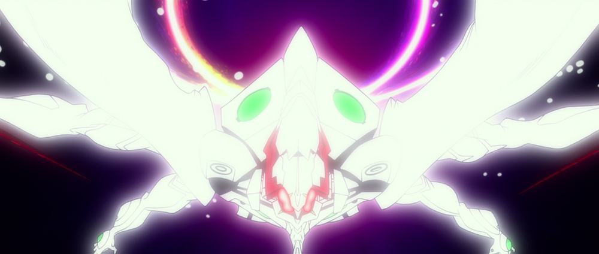

# Last-Minute Pre-Release Rant 4

## Summary

Further explorations of NTE's ancient world: an original set of Angels, the disastrous First Impact, and those who survived the calamity.

## Content

(Note: Posting this as-is so I can have the psychological satisfaction of doing so before crashing for the night and recuperating for the somehow even more Lovecraftian monster of a text wall I need to write today. This is a horrific mess and again I apologize, but hopefully you’ll find at least some amusing tidbits within. I’ll tidy it up as I can; the appearance of an article subtitle means that I’ve successfully accomplished basic clean-up.)

*<em>watches the extremely tepid rate at which articles for Mk.09 and beyond have accumulated hearts</em>* 

Well, I guess it’s not completely surprising. I’m a little disappointed at the Mk.09 article reception, since that was part of an initial attempt to make a difficult and confusing topic easily accessible, but it just doesn’t seem to get people’s motors going. The rants aren’t really proper articles and make no allowances for accessibility, so those making most people’s eyes glaze over, I can totally understand. Hopefully once I get this garbage out of my system, I can get back into a flow of writing proper articles (with pictures and everything!) about a variety of things and get some steady interest going again. During the uneasy transition period between Shin Eva’s theatrical release and getting my hands on my own HD copy, I do wonder how many NTE-related things will actually be worth writing about. Could be a chance to get some <em>Neon Genesis</em> stuff off of my backlog. Any-way...

Something I should have clarified back in Rant 2, but carelessly forgot to, is which parts of the Adams/Pilot framework from 2019 survive to the current, pre-“mauled by <em>Shin Eva</em>” form of my ideas. And that is:

<u>Luvah</u>: Body survives as Eva-01, soul is incarnated as Shinji

<u>Urizen</u>: Body survives as Eva 13, core is possessed by Mark.09, soul is incarnated as Asuka

<u>Tharmas</u>: Body survived as Mark.06, soul is incarnated as Mari

(It’s assumed that Luvah and Tharmas have Vessels as well, and these are probably Mk.10 and Mk.12 respectively, as noted in Rant 2.)

And of course, Kaworu is Adam’s incarnation, while Rei is Lilith’s. Notice how I’m not addressing the fate of Adam’s body here, or mentioning the Key of Nebuchadnezzar at all. There’s a reason for that, and I’ll hash out the relevant speculah in the post right after this one. It’s going to be a <em>beast</em>. 

Meantime, for this particular post, I need to get the rest of the fun and silly “Ancient World” stuff out of my system. It will almost certainly end up being wrong — but, hey, I look at it this way: even if it’s wrong, I get to keep lots of interesting ideas for my personal creative writing. Plus with NTE having such an immense sense of scope, these explorations do in fact end up being helpful, as they provide a tentative sense of form to a complete unknown and generally make it much easier to slot in new information. So, we’re handed some seemingly inexplicable new thing that has most people scratching their heads, and meantime I’m like, “Oh, I already thought about this! I know exactly where this thing goes!” But that could just be wishful thinking on my part. We’ll see soon!

Remember all that stuff from the end of Rant 3 about civilization being a sort of order imposed upon chaos? Do you also remember how Tharmas -- who can be identified with Marduk, a patron god of civilization -- was created in response to Urizen? While Luvah’s birth was the original source of chaos within the Albion family dynamic, Urizen was the most potent source of it, without a doubt. NTE may openly hint at this in some ways that are just a wee bit confusing, with its recurring use of one particular symbol, the eight-pointed star, or <a href="https://en.wikipedia.org/wiki/Star_of_Ishtar" rel="noopener" target="_blank"><u>Star of Ishtar</u></a>. (Ishtar is a Mesopotamian goddess of love and war, strongly identified with Inanna and Astarte.) 

Eva-02 -- an avatar of Urizen -- is shown at the center of 8-pointed stars at least three times over the course of NTE by my count. On top of that, the designs of both Wunder and its Nerv counterpart have eight-pointed stars incorporated somewhere (rocket nozzles; energy projection spheres), and both ships are likely related to Urizen in some manner (with Mark.09, or Urizen's core, being the ‘master’ of one ship, and the other having suspiciously Mark.09-like colors). On top of that Eva 13 (Urizen’s body) uses 8-pointed stars (= the RS Hoppers) to keep Eva-02 (a false body in use by Urizen's soul) away. There are many other instances that we've caught, and, true enough, not <em>all</em> of them obviously have something to do with Urizen, but cracking that puzzle can wait for a dedicated article on the Star of Ishtar later. 

It's a bit unclear to me what exactly the goddess Ishtar has to do with things, aside from one obvious connection. (One of Ishtar’s animal symbols is a lion, and she's been depicted as a lioness herself -- fighting a serpent, at that! And yes, this means that Eva-02 turning into a big cat in Q was not only extremely silly-cool, it was actually a Genius Bonus all along!) Fortunately, there’s another meaning hidden inside the Eight-Pointed Star that can provide some more immediately useful clues, and that’s the <a href="https://en.wikipedia.org/wiki/Symbol_of_Chaos" rel="noopener" target="_blank"><u>Symbol of Chaos</u></a>. (Yes, yes, the Elric one.) So if Urizen is positioned at the center of the Star of Ishtar (i.e., on its solar disc) on multiple occasions, that’s also signifying that chaos radiates outward in all directions from poor Urizen’s existence. Now think back to Gendo and Fuyutsuki overlooking the South Pole, having their metaphysical conversation about order and chaos. Who’s beneath them, at the center of the Gates of Guf, holding them open all these years after Second Impact? Why, our pal Urizen, of course. Interestingly, Gendo doesn’t believe that “chaos” really exists; rather, what we term as such is simply part of the natural order. In other words, Gendo can turn chaos into order simply through the force of his personal world view. How very Urizen-like of him. He’s going to be right at home inside Eva 13, isn’t he?

Going back to ancient times: once Urizen was harmonized by Tharmas, she would be able to transcend her purely chaotic origins, and start to find a sense of purpose in the world where, like Blake’s Urizen or Gendo, she could change chaos into order through force of will. Embracing a strict sense of order and justice would act to compensate for beginnings where there was no certainty other than being feared and unwanted by her creator. When your life is a complete mess, you control what you can; and when you’re a god, it turns out you can influence quite a lot. Having suffered considerably herself, Urizen decided that it was her responsibility to reduce suffering among mortals, and she named herself arbiter and judge, and began to impose her rigid sense of morality upon those beneath her.  

(I bet you think I’m pulling that 100% out of my ass, right? O ye of little faith…)
<figure></figure>
<figure></figure>
(...Okay. I do know full well I’m pulling a LOT of this out of my ass. My brain hums overwhelmingly with the plethora of possibilities that exist, waiting to be narrowed down by the information in <em>Shin Eva</em>. So of course whatever I offer here is just me semi-arbitrarily picking just one possibility, because if I don’t, I’ll end up writing either nothing, or writing something even more incoherent than this.)

As Urizen’s counterbalance, Tharmas followed her in these endeavors, and the two of them began their informal careers as gods of heaven and earth. Though good-intentioned, Urizen had the air of a temperamental storm god, fickle and impossible to please. Tharmas, simply by being herself, inadvertently earned the trust and admiration of the mortal world, and came to be worshipped voluntarily as a benevolent guardian spirit of civilization. Urizen was worshipped too, but more in fear than in admiration. Urizen claimed she neither wanted nor needed anyone’s affirmation, but this state of affairs clearly did not make her happy, and Tharmas wanted her to be happy. 

The Anunnaki lusted for the golden elixir of life possessed by Adam and Lilith. And here, Tharmas saw an opportunity. Tharmas and Urizen were immortal themselves, but, as shadows, they could not pass their immortality down. Adam and Lilith refused to test their small children to see if they were worthy of immortality — but what if Tharmas and Urizen stole the elixir and shared it? Urizen’s desire for order and need to impose judgment would be a perfect fit; she could do what Adam and Lilith refused to. So they devised a Promethean plan wherein each of them would attack their other half and incapacitate them with a spear (I have no idea where the spears come from in NTE’s continuity; they’re rather annoying) and grant mortals transformative access to their bodies. 

Tharmas battles Lilith and achieves a sound victory. It is hardly a fight at all, since Lilith refuses to truly bring harm upon her more intense and proactive half. Urizen is less successful, and her father subjects her to a cruel (and appropriately Prometheus-like) punishment for trying to steal from him. This would be the event that “Eva-03 versus the Dummy System” re-enacts, on account of Eva-03 representing Urizen, her attempt to merge with Eva-01 acting as a threat to Adam’s own designs, and finally the DMYSYS (which is likely Kaworu-based) acting as an embodiment of Adam’s wrath toward his shadow. As a god, Urizen is of course fine, but her lust for revenge is now stronger than ever.

The subjugation of Lilith at spearpoint results in an event that is big and transformative but isn’t quite an Impact (so is roughly comparable to what happened to Eva-04 and the Second Branch). Remember how Lilith is “Tiamat”? Here we witness the creation of “Tiamat’s monsters”, but it’s all rather delightfully distorted from the <em>Enuma Elish</em> version. The defeat of Lilith is what ushers in the much longer battle, as opposed to bringing the fight to an end. Anunnaki are exposed to the elixir of life under conditions that aren’t properly controlled; Lilith’s body is ravaged. Rather than ascend to Infinity, these Anunnaki become inhuman giants and beasts. 

In other words, they become Angels. The very first ones. 

<strong>TIME-OUT FOR OVERWROUGHT EXPLANATION</strong>

So now you’re probably thinking, “Whoa, whoa, whoa. Slow down, Reichu. What's all this crap about 'the very first Angels'? Just... WHY?” 

Put simply, it comes from the difficulty of explaining certain showcases of technology in the present day (as of Q and Shin), combined with NTE’s recurrent motif of history repeating itself and “past, present, and future converging”. First off, there’s the considerable mystery of the AAA Wunder — and now to add onto that, we have its “dark counterpart”, which I will call temporarily call Unheil (<a href="https://twitter.com/ArqaApocrypha/status/1365450753586982916?s=20" rel="noopener" target="_blank"><u>see this thread for explanation</u></a>). The kneejerk explanation for Wunder has been “it's the 11th Angel” or something, but this never withstood much scrutiny and it doesn’t penetrate deep enough. My preferred explanation for the 11th Angel is that it’s hiding in plain sight: it was this huge motherfucker whose death resulted in the Moon getting splattered with LCL. (Remember that the epicenter of Third Impact is underground, and even Second Impact only managed to shoot a tiny amount of LCL to the Moon.) Imagine the epic battle we were deprived of, and weep. The Wunder and Unheil are, quite simply, something else. They<em> can't be</em> part of the current Angel line-up. In Central Dogma, Mari says that the 12th Angel is the last one that should exist, and when Mark.09 attacks Wunder, it’s in the interest of <em>subjugating </em>the ship, not destroying it. And on top of that, Mark.09 is acting on Seele’s behalf, helping to bring about the final outcome of their covenant, which is human instrumentality. If Wunder really was the 11th Angel, it would have been annihilated as one of the Angels that needed to be destroyed as part of the covenant, before the scenario could proceed with HIP. 

So then, what<em> are </em>the ships? Well, they’re definitely “angelic”. But they’re not autonomous entities. They don’t have cores of their own. Instead, strange egg-shaped objects (made of a mysterious black-and-purple material on the outside, and having a uterus-like organic interior, and thus imitating the shell of an egg and its internal membranes) are, at least in Wunder’s case, used as a core substitute.  We see with Eva-01, and with Mark.09’s superficial (i.e. not complete) override of the controls that Evas can be placed within this egg to “fill the core” — providing both the soul and the energy source. The ship becomes an extension of the Eva’s body, with A.T. Field and halo manifestation, energy projection, and so forth capable of occurring throughout the body, often through the use of technology built on top of the ship’s skeletal base form. The combination of “skeleton plus technological additions” brings the Third Angel to mind, and suggests that the skeleton is the most important part of the ship, that which gives it its unique properties. The technology is simply there to allow those properties to be harnessed and to, at least in Wunder’s case, allow the ship to provide human habitation. 

Where did this enormous, bizarre skeleton that can act as an extension of an Eva’s body actually come from? 

The lack of a core is important. It means that, whatever the ships are, they are unlike the Angels and “fake Angels” (04 Series Evangelions) we’ve seen. The former, with perhaps only a couple of ambiguous exceptions, dissolve into LCL when their A.T. Fields collapse. Although Lilith is probably a different kind of being from Angels 3 to 12, she too dissolves after the spears are withdrawn from her corpse (implying the spears were somehow preventing her from undergoing image collapse). The “fake Angels” we’ve seen either dissolve into LCL, explode, or both. Contrast all of those to, say, Eva-03 or Eva-02. We see the completely mangled remains of Eva-03 after the 9th Angel has been destroyed; it needs to be slowly taken apart and disposed of, like the Angels in NGE. Eva-03 expressly did NOT dissolve into LCL. And likewise with Eva-02. Asuka detonates its self-destruct against Mark.09, and afterward we see what’s left of the Eva, with the core either destroyed or removed from its housing and stored elsewhere. No core, and therefore no possibility of an A.T. Field; and yet the body refuses to dissolve. Eva-00’s legs also stubbornly stick around after the rest has been devoured; blood spouts out the top, but there’s not an explosive LCL release. (Admittedly, though, Eva-00's case is much more ambiguous than the other two, and an argument could be made either way.) Generally speaking, it seems that the Evas are built upon the assumption that their cores can be removed at will, i.e., that the integrity of their bodies is a given and not contingent upon an A.T. Field. See also the way the IPEA storage silos functions; hypothetically, any of Nerv’s Evas at the time of <em>Ha</em> could be accommodated down there. 

Interestingly, nowhere in any of this has it been confirmed or denied what happens to Lilin when their A.T. Fields collapse. This uncertainty deepens the mystery of the whole thing. Lilith, the Angels, and the fake Angels all dissolve into LCL in a way that intentionally evokes Lilin from NGE, but we can’t confirm if the same holds for Lilin in NTE! It’s very suggestive, though, isn’t it? Lilith of course has an intimate implied connection to the Lilin, on account of the similar names and the source folklore. There’s also a thread running through NTE, linking Second Impact, Eva-04’s pseudo-Impact, and Third Impact together. All of these events are tied to the emergence of a new kind of being: the Angels, the 04 Series Evas, and the Failures of Infinity, respectively. 

In the case of the latter, it’s all but stated that the Failures (or, at least, the ones the camera pans over during Kaworu’s speech; confusingly, there are multiple FoI “demographics”) are transformed Lilin. The 04 Series Evas are obviously connected to Eva-04 in some way, and there was an impact-like event that happened around Eva-04 that would have affected the entire 2nd Branch — and all of the people working there. So the chances of Fuyutsuki’s “fake Angel” armies being something other than transmutated and enslaved Americans is pretty slim. And then you have the Angels. The movies have not said a single word about the Angels being an alternate form of life attached to Adam rather than Lilith; all evidence indicates that they are only superficially similar to their NGE counterparts. Storytelling economy and Rule of Three don’t leave too much ambiguity about what’s going on with them, IMO. The Angels, or at least some of them (more on that another time), are Lilin who were present in the affected radius during Second Impact, and were transmutated into beings with the Fruit of Life. (And yes, this means Misato’s dad and his entire research team probably got turned into Angels, and appeared onscreen and enjoyed “redeath” at the Evas’ hands, without most of the audience realizing it was them. If you’ve been following my Twitter feed, you probably already know which Angel(s) they are, but if not… I’ll talk about it soon. Crazy, crazy shit.)

Ahem. I got a bit carried away there. So anyway, it’s clear to me that we don’t understand the body-soul relationship in NTE particularly well, and the sheer variety in entities and mysterious events by which they can originate makes it difficult to come to even tentative conclusions. But one thing should be apparent, anyway. For whatever reason, sometimes we end up with entities with unstable forms that collapse as soon as the A.T. Field is gone, and other times we have entities that don’t seem dependent on a soul at all to keep their shape. The “classic” Evas fall in the second group, and the rule seems to apply regardless of whether they’re modified Adams (01, 06, 13) or were presumably generated from scratch by Nerv. (Eva 13 acts as pretty definitive proof on the Adams end of things. The version of it that sorties in<em> Q </em>has no inherent A.T. Field-generating ability; it’s a completely empty vessel. And its body is <strong>super</strong> resilient all the same.) Now suppose we actually knew the reason why things were this way, and it turned out that the condition Evas are in wasn’t exactly exclusive to Evas. Under the right conditions, non-Eva beings could be produced that had similarly hardy bodies. 

And now, finally, I circle back to the idea of there being an original set of Angels in ancient times. Superficially similar to the post-2I Angels, but in absolute terms, more similar to the Angels from NGE, in that their bodies stick around after they die. This would go a surprisingly long way to explaining Wunder and Unheil. They were, at one point, ancient Angels. Given the similarities, and the Yin-Yang thing they have going on with their color schemes, maybe they were even an Israfel-type Angel: one capable of freely splitting into two essentially identical entities, and merging back into one at will. They were defeated and their bodies coopted by their vanquisher. Kaworu’s explanation in episode 24* for why he’s able to control Eva-02, taken to its logical conclusion, would hypothetically justify Evas controlling the dead bodies of Angels. As long as they share an origin, and one of the bodies doesn’t have a soul getting in the way, it’s all good. Consider now that we’re told the Wunder’s original / true master is Mark.09, and Mark.09 is actually just Eva 13’s core with a core-based Eva unit built up around it; and remember also that 09 and 13 are aspects of Urizen, Asuka’s true self. What’s one of the changes made to Asuka for NTE? She’s a captain in the air forces now. That goes along rather well with the “Wunder’s master” thing, doesn’t it? So Urizen being the “slayer and tamer” of this hypothetical ancient Angel, or pair of Angels, makes perfect sense. 

* [I bring up NGE because a lot of its “mentioned once in passing and then dropped” ideas have been getting picked up again for NTE, and with all of the unresolved weirdness in episodes like #24, there’s no shortness of things to expand upon. (The inevitability of Kaworu getting absorbed into Eva 13 is one such item. “I could merge with [Eva-02], if only it had no soul…” Eva 13, of course, has no soul when Kaworu dies inside it.) ]

 

And, as Urizen was an autonomous god, free to act as she desired, her improvised use of Angel corpses would have been something outside the domain of mortal control. Much later on, when Urizen herself is subjugated and imprisoned through Anunnaki and Lilin technology, and her existence splintered into two Evas and a pilot, what would happen to the ships? Well, they would similarly need to be changed into a form that mortals could control. This is where Seele and Nerv’s weird experiments, like the mutilations visited upon the Third Angel, come into play. Yui’s experiment shows that, despite Seele hailing from an ancient civilization with plenty of weird tricks up their sleeves (like the sealing pillars), they were actively working on the problem of how to make gods pilotable after Second Impact. They didn’t already have solutions to the issue lined up and ready to go; they needed to put their Lilin Task Force to work figuring it out. Since the technology was actually new, all of the experiments provided valuable data that brought Seele incrementally closer to their goals, and eventually Nerv’s technology was developed to the point where they could subjugate not only post-2I Angels (as witnessed later with the 12th) but apply those lessons to relics of the ancient world, like whatever Wunder and Unheil started off as.

Incidentally, Wunder and Unheil aren’t the only mysteries that could be conveniently explained with an ancient line-up of Angels. Take a good hard look at Nerv HQ itself. Around the time of Third Impact, the familiar pyramid with its inverted pool somehow became entombed at the bottom of a gigantic structure shaped like an <em>upside-down</em> pyramid, with the point of this bigger pyramid connected to the Black Moon (still underground) via a Main Shaft seemingly much bigger than the one the 10th Angel successfully invaded. Looking down the inside of the Neo-Nerv pyramid, it’s hard not to think (at least a little bit) of the interior close-up shot of the 6th Angel that was shown when it began its first onscreen transformation. The overall setup of Neo-Nerv HQ, as a tetrahedron atop a long, thin shaft that penetrates the ground and connects to Lilith’s chamber, is also extremely reminiscent of the 6th Angel with its goal of drilling down to Lilith. There are additional subtle visuals that reinforce the parallel. A comparison is being drawn, but why? 

I suspect there are multiple levels to this, and I can’t cover them all here. But one important element of the parallel, I think, is that of eldritch geometry. The 6th Angel is a being that exists beyond three dimensions; its transformations have a kaleidoscopic quality and they blatantly defy conventional geometric and spatial sense, with the moments when its core seemingly divides into four smaller targets being the ultimate testament to this. Watching <em>Q</em>, one is left wondering exactly how old Nerv HQ ended up isolated at the bottom of an inverted pyramid, and where on earth the rest of the Geofront went. Careful observation reveals that the remaining Geofront seems to be walled off somewhere inside the inverted pyramid, but this barely helps at all, really. How did the old, mostly familiar-looking setup from the first two films transform into the completely incomprehensible visual mindfuck we see in <em>Q</em>? Fans, including the Apkallu and I, have tried to apply their brains to the issue, but the more you try to push it, the more you find yourself staring into the abyss, with the abyss staring right back and crying “Tekeli-li!”. 

To get to the point, it almost becomes easier on the mind if the reason Neo-Nerv HQ makes no sense is because it uses an ancient Angel corpse as the basis for its construction. And funny enough, Neo-Nerv HQ does have one of those Wunder-style eggs inside it. We’re obviously meant to think that Eva 13 was somehow grown in there, but Eva 13 is a modified Adams; it already existed, and at most it was healed from whatever damage it might have taken at Second Impact and modified into an Evangelion. Was it really modified into an Eva by sticking it into an artificial uterus inside a structure identical to Wunder’s engine? I get the feeling that there’s much more going on with the egg than it initially seems, and odds are it has something to do with the pyramid and its weird eldritch powers (like remember the red beams it starts firing into the Gates of Guf after Mark.09 is destroyed?). Very tentative suggestion, but perhaps Eva 13’s time soaking in there helped “bond” it to the pyramid in some way, which would be an important part of Gendo and Fuyutsuki’s plans for it as the Final Executor. 

<strong>END OF OVERWROUGHT EXPLANATION</strong>

Errr… where were we? Something about Tharmas fucking up Lilith with a Spear, and somehow this resulted in the creation of a pre-First Impact set of Angels? I’m tentatively going with a weird fusion of a Prometheus tale and Pandora’s Jar/Box here (those myths aren’t unrelated, incidentally), where two gods act as crude Prometheus stand-ins, hoping to gift mortals with something the higher gods have been stingily keeping to themselves. One of these gods, Urizen, fails and is punished, like Prometheus proper. The other, through her successful subjugation of Lilith, ends up accidentally taking the lid off the jar and unleashing “evils” into the world. These evils, in this case, weren’t negative attributes that befall the Anunnaki, but actual monstrous gods. The Anunnaki presumably desired the same kind of godhood that their creators had — Infinity — but instead, those who tasted the elixir were twisted by it, becoming giant monsters and beasts who cast their humanity aside. 

Tharmas and Urizen took responsibility for their scheme. They couldn’t simply undo the damage to Lilith, but they could start to make things right by slaying the monsters born from her desecrated body. (Also, I have no idea what Luvah is doing during all of this. Probably something important; I just haven’t figured it out yet. He’ll be accounted for eventually — fear not.) These ancient Angels take on the roles of ancient mythological monsters, and the three most important ones, those whose corpses survived to the present day, can perhaps be crudely compared to the three big Biblical monsters: Behemoth, Leviathan, and Ziz. The twin ships are bird-whale sorts of things associated with both sea and sky, making both them Leviathan and Ziz simultaneously. The pyramid being Behemoth is a bit more of a stretch, but it’s emerged from the ground and it looks like it’s made of stone, even resembling a ziggurat, plus Behemoth is often used as a synonym for something very big (which the pyramid is). 

Urizen slayed Leviathan-Ziz and turned it into a bio-extension of her own body, to enhance her already formidable martial prowess. Tharmas, meanwhile, turned the Behemoth into a temple-fortress capable of freely moving between land and sky. (On that note, see also the real-life Etemanki, built to honor Marduk and considered the inspiration for the Biblical Tower of Babel.)

The Anunnaki’s leadership watched these developments with great interest. Their species was led politically and spiritually by fourteen individuals, who were sorted into seven balanced pairs of complementary individuals, each duo regarded as a single “Apkallu”. (Not to be confused -- at least, not TOO much -- with my private Discord server and the people there.) These were, of course, the ones who would eventually become Seele. They desired the “hope” at the bottom of the Pandora’s Box that Tharmas had opened — i.e., true godhood for their species at large; and the exploits of the Shadows provided inspiration as to how this might be achieved. But they didn’t want to be turned into monsters robbed of their humanity, of course; they desired the Infinite, to have status equal to their creators. 

They concocted a plan for achieving precisely this and worked toward its execution. However, there were those among the Anunnaki who knew of the Apkallu’s designs and fiercely opposed them, foremost among them a patrician-priest named Sin. (Terribly on the nose, I know, but Sin <em>is</em> an actual mythological figure, and I’m not introducing him as a hypothetical character right now simply for shits and giggles, though shits and giggles are at least part of it.) He was an esteemed spiritual servant of the moon goddess (Lilith, of course), and he supported the idea of finding a way to restore Lilith’s glory, not continuing to exploit the gods who had gifted the Anunnaki with existence in the blind and selfish pursuit of unearned godhood. In Sin’s mind, there was nothing inherently inferior or shameful about being mortal; it was simply different, and no one should be so quick to discard one form of existence for another. He cited Lilith’s monsters as evidence that the mortal mind could not handle immortality and the Apkallu were being reckless fools. But Sin was but a voice of reason trying to change the course of a raging river; his humanitarianism was no match for the fear of death and the lust for power.

The Angels were all slain, ultimately. But this is <em>Eva</em>, so of course that was not the end of things. Lilith in her fallen state was not immediately usable as an active agent, so the Apkallu tapped into Adam and Luvah to make their dreams happen, finding the psychologies of those two gods uniquely exploitable. (History repeats, and all that…) Through their own means (likely involving spears in some way I can’t begin to comprehend), they triggered what later would become known as the First Impact. In this, Luvah’s body and will was at last completely subjugated to Adam’s desire for completion, and Luvah was absorbed, making Adam a sort of “Saturn devouring his son” figure (hello there, <em>Nadia</em>), though Adam’s motivations are obviously much different from Cronus/Saturn’s. This merger, along with the use of any necessary spears, initiated the evolution of the Anunnaki into Infinity. 

Tharmas and Urizen saw this, and, regarding themselves as defenders of the mortal world, decided that it must be stopped, whatever the cost to themselves. Knowing that cold temperatures are one of the only weaknesses possessed by their kind, they were able to corral Adam to the South Pole, but at that point it became necessary to forcibly seal his power. But how could two mere Shadows possibly stop him? 

By becoming part of the fusion and countering Adam from the inside, that’s how.  

So that’s precisely what happens. Tharmas and Urizen forced their way into “mega-Adam” and became part of it along with the unwitting Luvah. Their combined will and might was able to overwhelm Adam enough to put the fusion — this twisted, fake Albion forged from desperation and hate — into deep freeze. 

Unfortunately, their efforts did not spare the Anunnaki — in fact, the Anunnaki were indefinitely condemned by the heroic effort. Their souls had been liberated from their old bodies and collected inside the Black Moon, where they had started to undergo transformation into Infinity. But with Adam’s power sealed away, their evolution was left unfinished, and countless headless bodies of incomplete, broken gods remained inside the lower goblet portions of the Black Moon, waiting for their salvation. (Meaning, yes, the approximately ten gazillion Failures of Infinity that emerge from the Black Moon — screaming ecstatically — after the Black Moon rises during Fourth Impact are not from Third Impact, but <em>First</em>, and they are the Anunnaki crying out in bliss that finally their deliverance has come. As for why they’re shaped like Eva-01 when Luvah was not dressed up like Eva-01 when First Impact happened… Well, I’m sure there’s a perfectly reasonable explanation; we can worry about that later.) However, the Shadows did not merely fight for the Anunnaki, but for all mortals unable to oppose the gods on their own, and so this is where I come to a species that’s been a little neglected so far in this telling: the Lilin. 

Now, as with many things, I wouldn’t be able to tell you right now exactly how the Lilin came to be. But it feels reasonable enough that they started off as a slave race to the Anunnaki, similar the status of humans as a slave race to the Atlanteans in <em>Nadia</em>. And <em>since</em> they were a slave race, elites like the Apkallu would have deemed them inferior beings, unsuited for the gift of divinity; naturally, it was only something that <em>their</em> kind ought to to enjoy. First Impact was thus designed to exclude the Lilin, and their souls were spared from harvesting, which turned out to be to their advantage — the aborted Impact left the Anunnaki species perpetually frozen, allowing the Lilin to inherit the Earth. 

But there were at least some Anunnaki who escaped this time of devastation. The Apkallu, the very ones who desired First Impact the most, selfishly had a means of preserving themselves should something go wrong, and this was by transforming their souls using core-based technology. As if boarding their own personal arks, they entered their core-monoliths two by two, discarding their bodies while immortalizing their thoughts, knowledge, and hopes. Sin, too, was able to escape from his people’s fate, by exercising his deep knowledge of spiritual alchemy, and liberating his soul from the bonds of Anunnaki flesh. Transmigrating into the Lilin’s cycle of samsara, he would undergo countless reincarnations over the millennia, his Anunnaki memories remaining sealed away and asleep but never quite disappearing... waiting for the day when, at last, Sin would be able to rise again and return the Anunnaki civilization to its previous state of glory.

The Lilin, due to their natural curiosity, would eventually discover the Apkallu monoliths. This contact would begin the process by which the Apkallu uplift the Lilin to a sophisticated, civilized, and technological state (confer with Rant 1), and they would eventually rebrand themselves as “Seele”. Over the course of 100,000 to 400,000 years or so, the Lilin would finally have advanced to a state where they could be put to work undoing Seele’s mess. 

And I’ll tell you <em><strong>all</strong></em> about that in another terrifying text wall, coming to your local ArqaCrypha blog very soon.

P.S. So, yes… All pretty crazy, but at least a <em>little</em> fun, I hope. How many of you can figure out who Sin is supposed to be, I wonder? Potentially relevant tidbit: a possible reading of “Shin Evangelion” is “The Gospel of Sin”. <em>I love it.</em>
