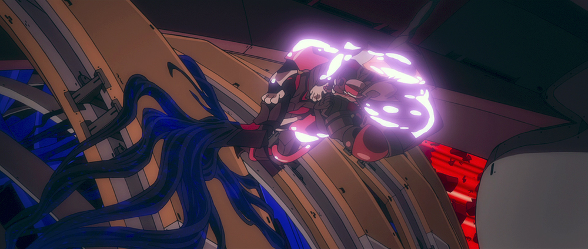
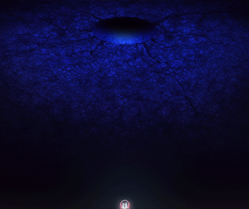
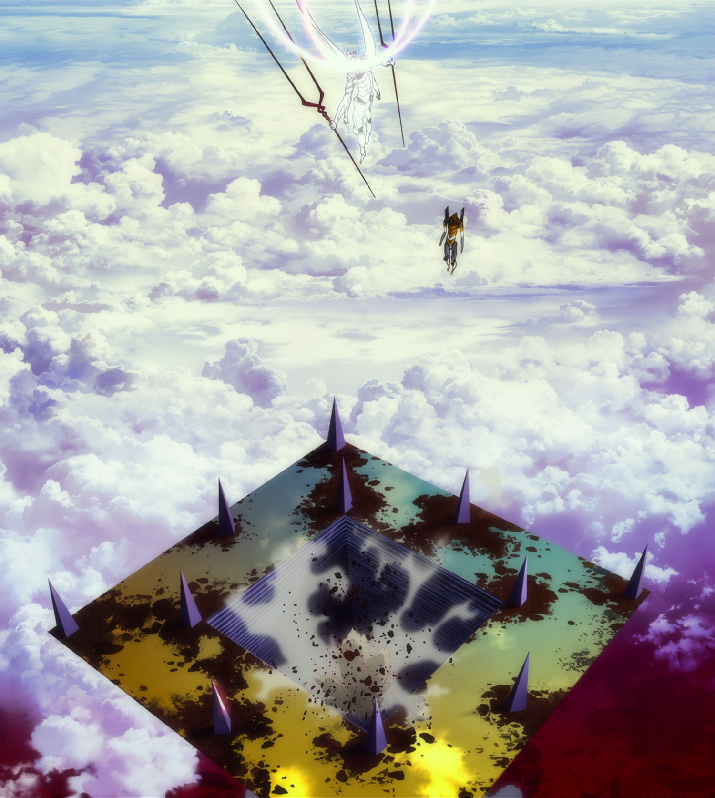
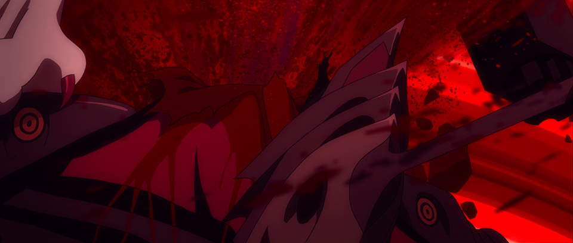
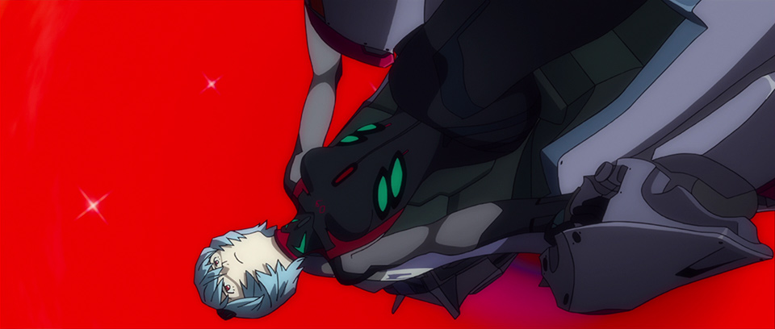
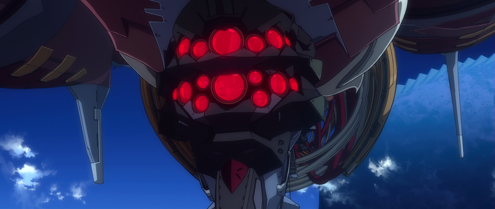
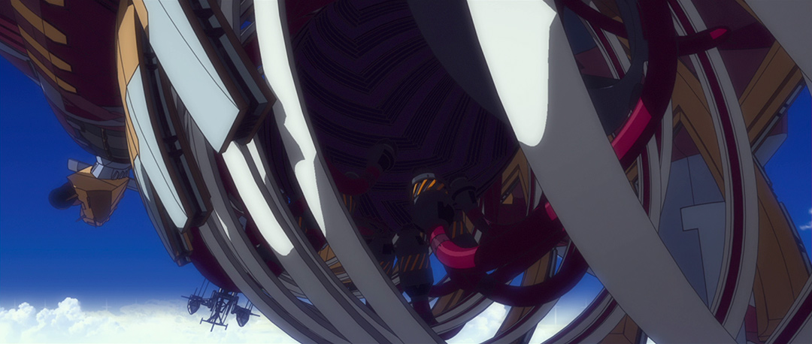

# Master and Vessel, Pt. 1 Mk.09

## Summary

An in-depth overview of Eva Mark.09's characteristics and behavior. Part 1 of 4.

## Content

With the possibility of more Adams’ Vessels on the horizon, and Wunder being joined by an evil twin, I figured it was time to write about these two interconnected groups of beings. This first section will go over the Mark.09-relevant happenings in <em>Q </em>to make sure we’re all on the same page, since the important scenes can be rather disorienting. This will probably be a little tedious, but… well… so are Adams’ Vessels. After that, current plan is for <strong>part 2</strong> to review the Wunder side of things, <strong>part 3</strong> to synthesize 1 &amp; 2 and provide some tentative conclusions, and for <strong>part 4</strong> to finally offer some juicy speculation about Vessel and ship-related matters in <em>Shin</em>. That sounds like overkill right now, but I'll have no trouble writing (at least) four articles of the usual length, trust me. 

<h3><strong>MARK.09, ADAMS’ VESSEL</strong></h3>

So back in <em>Q</em>, after the Nemesis Series attack, an Eva that looks suspiciously similar to Eva-00 shows up to snatch Shinji and bring him to New Nerv HQ. 
<figure></figure>
Yet we saw Eva-00 get devoured onscreen in <em>Ha</em>. Its core was retrieved and ultimately integrated into Eva-01, true — but despite Shinji’s wishful thinking, this new Eva is clearly something else. Mari blows the Eva’s head completely off, and it barely slows down, 
<figure></figure>
prompting Mari to say:

MARI:

So it’s an Adams’ Vessel after all?
<figure></figure>
(The inclusion of the article “an” is tentative. I go this direction because, as I’ll show another time, there’s reason to think that “Adams’ Vessel” refers to a class of beings, and not one specific entity.) 

Her reaction is quite interesting… Normally unflappable, she abruptly comes to a complete halt as soon as she realizes what this Eva is, and she looks a little shocked by the revelation. Mari obviously knows something that we don’t. She doesn’t stop shooting, but she <em>does</em> stop approaching. Is that because she knows how powerful an “<strong>Adams’ Vessel</strong>” is? That it’s better to not get too close if you can avoid it? We can deduce that she’s encountered at least one of these things before, since Wille already has a term to describe it, and Mari’s able to immediately identify it due to its behavior upon being decapitated. But clearly the last time they had a run-in, the Vessel(s) didn’t look quite like this. This one was deliberately camouflaged.

As for the term itself... "Adams' Vessel" is <em>Adamusu no utsuwa (</em>アダムスの器) -- note the use of plural "Adams", the same thing that appeared in <em>Jo</em>'s Next Time Preview, and has, rather peculiarly, not been uttered once in the actual film dialogue until now. 
<figure></figure>
What is "Adams' Vessel" even supposed to mean? Why "Adams' <em>Vessel</em>" specifically, and not just "Adams"? Well... all things in good time.  Just one disclaimer right off the bat, though: despite the pun I use in the article title, the word for "vessel" here, <em>utsuwa</em>, does not refer to ships in any sense; the "naval vessel" analogy doesn't work in Japanese. Rather, <em>utsuwa</em> refers to a container, something that has the purpose of holding something else. <a href="https://www.google.com/search?tbm=isch&amp;q=%E3%81%86%E3%81%A4%E3%82%8F" rel="noopener" target="_blank"><u>Look up </u><em><u>utsuwa</u></em><u> on Google</u></a> and prepare to be overwhelmed with options for fine dining stoneware! 

So later, this same Eva unit is send down to Central Dogma alongside Evangelion 13. The head hasn't been replaced, but the Eva seems perfectly operational.
<figure></figure>
Kaworu doesn’t use the phrase “Adams’ Vessel” and instead refers to the Eva as “<strong>Mark.09</strong>”.  This suggests that Wille don’t have up-to-date information on Nerv and Seele’s Evas, nor the means to easily obtain it, corroborated by the fact that, when Eva 13 activates for the first time, they can only tell that it’s a new Eva, not determine which specific Eva it is. (And the movie ends with Wille still not knowing that 13 <em>is</em> 13.) 
<figure></figure>
It also possibly implies that the categorization “Adams’ Vessel” is something invented by Wille, and isn't necessarily recognized as "a thing" by Nerv or Seele. 

Down in Lilith's chamber, Wille's Evas ambush 13 and 09, with Asuka taking on Eva 13 while Mari keeps Mark.09 busy from her sniping encampment in the ceiling. While Rei 6 hides under Lilith's cross, Mari says something kind of interesting:

MARI:

Hello, Seele's provisional pilot.

I know you can hear me.

I suggest you clear out of there before you become part of Adams' Vessel.

Note that in the original Japanese, Mari doesn’t say “part of”; the Dansubs add this, perhaps to clarify the implied meaning. So Mari actually just says “become Adams’ Vessel” (アダムスの器になる), presumably referring to Rei “becoming” the Eva she’s currently inside, as opposed to her becoming a second entity that is also called an Adams’ Vessel. But with such vague language implying such unclear things, who really knows… 

Also note here the part about Rei 6 being <em>Seele's</em> pilot. This suggests (<u>as more directly confirmed later</u>) that Mark.09 itself is in Seele's service, not Nerv's, similar to the previous high-profile "Mark" unit, Mark.06. Also hard not to notice that "9" is an upside-down "6"....

Things start to heat up after Rei 6 carries out her orders and decapitates Mark.06. First, right as the 12th Angel (plus Mark.06, plus Lilith…) is transforming into a copy of Lilith’s head, Rei loses control of Mk.9, and the Seele program (<a href="https://www.arqacrypha.net/post/rei-6-the-programmable-human" rel="noopener" target="_blank"><u>that’s apparently inside her own head</u></a>) takes over. At the same time, Shinji loses control of Eva 13. 
<figure></figure>
<figure></figure>
<figure></figure>
Hmm, seems kind of fishy. Almost like it’s not a coincidence and maybe something is going on between 09 and 13. Remember this; it will be on the pop quiz later.

In the same vein, after Eva 13 absorbs the 12th Angel, goes Radiant Giant, sprouts a halo, and jets out of Central Dogma... look who’s following, with a halo of its very own. 
<figure></figure>
<figure></figure>
And not only did Mk.09 sprout a halo around the same time as Eva 13, its halo is fairly similar to Eva 13’s, as well. Considering the diversity in halo appearances throughout NTE, that’s not a minor detail.
<figure></figure>
As soon as Wunder starts harassing Eva 13 (successfully enough that it’s briefly able to get 13 to <a href="https://static.wixstatic.com/media/87d07b_4f80574ebe7c47388dd9676bc3a17381~mv2.gif" rel="noopener" target="_blank"><u>turn purple again</u></a>), Mk.09 provides a counter-offensive, quickly disabling Wunder’s weapons and freeing Eva 13. Mark.09 is able to engage in typical Angel energy projection abilities (cross-shaped flare, stock sound effect, giant fireball goes off somewhere… that sort of thing) without having eyes (which are usually used for “targeting”) or even a head at all. 
<figure></figure>
But it quickly fixes this, growing a seriously cool-looking new head with a horn and 12 eyes while Ritsuko provides her obligatory mysterious exposition.

RITSUKO:

The Adams' Vessel is Wunder's true master.

It intends to take the ship's controls back from Eva-01!
<figure></figure>
Disclaimer here that, since everything is very mysterious and lacking in context, it’s entirely unclear if Ritsuko is talking about one specific Adams’ Vessel or about Adams’ Vessels in general. Japanese is tricky that way… Since Ritsuko speaks of intention without further clarifying what the subject is, presumably she is just talking about the entity hovering over Wunder at that very moment, and not hypothetical other such beings, but one can never be too careful.

“True” here is “<em>honrai no</em>” (本来の), so, in the sense of "original" or "rightful". Also, possibly not very important but cool regardless: Ritsuko uses the word “<em>nushi</em>” (主) for “master”. This might sound familiar, since it’s a common component of the names of kami. Makes me wonder…

In any case, this is a rather interesting thing for Ritsuko to say. At this point, Mk.9 is only attacking the ship, so logically it's doing this so that Eva 13 can continue Fourth Impact unmolested. And yet… Ritsuko is <em>instead </em>saying all this crap about how Mk.9 is the true master of the ship and it’s going to take Wunder back, which then demands we ask, "why is she saying this?" What does she know that we don't? Is there any additional information we can squeeze from the situation by comparing her statement to what Mark.09 has done to prompt it? Possibly; I'll revisit this later.

As noted, the moment Ritsuko speaks up is the same moment that Mk.9 grows a new head. Appropriate in a visually symbolic sort of way, since the head is the "master" of one's body… And, hmm, about that. As soon as the head is complete, Mk.9 fires off another energy blast, and look what it hits.
<figure></figure>
We get a close-up of the Wunder’s bridge section from the front, and the blast seems to hit just behind the bridge. And you notice what the bridge looks like, right? 
<figure></figure>
Suspiciously similar to Mark.09’s new head, with the horn and everything. 

This latest explosion seems to effectively cut the Wunder’s head off from the body — or put another way, it’s separating the crew in the anchoring plug from Eva-01. Mk.09 is cutting them out before it cuts Eva-01 out. Makes sense. Thinking back to the symbolic relevance of Mk.09 regrowing its head, then: what Wunder has is a facsimile, a fake. The bridge is just a shell in a shape that resembles Mark.09; it's not a real head. So what Mk.09 has done is separated the fake head from the ship's body so that it can go about reasserting the "true head" -- that of Wunder's true master, itself. 

Mk.09’s next order of business is to touch down on the starboard side of Wunder’s “rib cage”, slightly aft of the engine, where it formally begins its takeover. Consult this helpful image:
<figure></figure>
Just as its feet make contact, its entire body flashes (a suspiciously familiar shade of) blue, very briefly. 
<figure></figure>
As the flash subsides, we see that Mk.09’s Eva-00-like coloration has changed to a fairly uniform black, while the normally dark parts showing in between the armor plates are now red. The halo also vanishes here. Soon thereafter, the Wunder’s viewscreen flickers and the repeating incantation of the Seele program takes over.  
<figure></figure>
At this point, we see that Mk.09’s legs have turned into glowing blue bundles of root-looking things below the knees. These are dangling off the edges of the strut, into the guts of the ship. 
<figure></figure>
Next we see these tendrils plopping onto the main engine, and they seem to melt into it. 
<figure></figure>
<figure></figure>
<figure></figure>
The roots have the blue version of the core texture, similar to the 9th Angel, though it's hard to make out. Close-up of previous GIF for your convenience:
<figure></figure>
 There are some weird staging issues here, in that the movie is cut to make it <em>seem like</em> Mk.09 is dropping its tendrils directly onto the engine, but it’s not actually over the engine at all; it's standing aft of it, as previously noted. Also peculiarly, there’s no sign of the "roots" spanning the length of ship from where 09 is standing over to where the engine is; they just drop from 09 and (seemingly) vanish. 
<figure></figure>
I remember spending a lot of time on this particular headache months ago, and, since I’ve heard that the <em>3.333</em> version reworks the staging for this sequence extensively, I’m just not going to worry about it right now. Maybe <em>3.333</em> will elaborate upon what's going on, maybe not. We'll see.

Eva-02 fires an anti-ATF armor piercing round onto Mk.09, and, unlike what happened with Eva 13, it successfully contacts, destroying the torso plate that covers the core. Unfortunately, there’s just another, far sturdier plate beneath it, in the shape of an “Angel face” with the "Seven Eyes of God" symbol on it. 
<figure></figure>
Asuka calls this out as a seemingly typical example of Seele trickery, and somehow she seems to already know that there is no breaching that core-shield (or "Seele mask", as per the script). She never tries firing directly onto this backup plate, or even getting around it with an angled shot! Weirdly specific knowledge; contrast with how Asuka was unloading ammo into the 12th Angel earlier like there was no tomorrow. What would make the core-shield so special? No idea.  

Also of interest here is the part of Mk.09 that’s been exposed. We see a fairly normal core — looks much as you would expect — and then there’s the exposed area <em>around</em> the core. It doesn’t look like living tissue, but it doesn’t really look like core, either. It’s kind of… <em>in the middle</em>.
<figure></figure>
Mk.09 quickly recovers, and immediately tries to destroy its foe with a fireball bigger than Wunder. Seriously, look at the size of this thing. The screenshot doesn't do it justice, really.
<figure></figure>
The movie reduces it to a background event, and everything is so fast and furious that you’d be forgiven for not consciously acknowledging what you’re seeing. That being: proof that Mark.09 is ridiculously overpowered (well… when it wants to be) and that Asuka had good reason to go straight into Beast Mode there. 

Eva-02 viciously engages Mark.09 one-on-one, quickly casting aside its unleashed humanoid form for a blatantly feline one. Having gotten rid of 09’s shoulder pylons earlier in <a href="https://static.wixstatic.com/media/87d07b_de3a7fc4e2544cbcb6c4f7b1a3c44e45~mv2.gif" rel="noopener" target="_blank"><u>freeze-frame bonuses</u></a>, 02 is able to get at 09’s head real good and rip that fucker right off. 
<figure></figure>
The camera lingers on 09’s head dangling by a couple of threads — and strangely, unlike before, the removal of the head disables the Eva. Mark.09  doesn’t “shut down”, but it seems to lose awareness and freeze up, like it’s dazed or something. The decapitation also seems to forcibly reboot Rei’s entry plug. Is this a consequence of how the Seele program functions? (Mk.09 wasn’t running on it the last time it lost its head.) Or of Mk.09’s current form? The decapitation and the reboot are shown to be related via the back-to-back “upside-down” imagery, but what's the actual connection? I'll come back to this in Pt.3. 
<figure></figure>
<figure></figure>
So, Rei is able to take advantage of the system reboot and eject herself. Asuka in turn takes advantage of the exposed entry plug hatch to get at the core. (Since the inserted end of an entry plug interfaces with an Eva's core, 09's empty entry system provides a clear line of fire.) 
<figure></figure>
Several bullets unpleasantly ricocheting off the core plate and exiting the lower body in big bloody sprays later, Mk.09 finally shuts down for real. But only for a moment. Then something peculiar happens. Suddenly the Eva turns completely red (its main body does, rather; the root-like projections remain blue, with the lower legs gradating to purple) and four things happen in concert:

1) The bullet wounds seal up.

2) The big hole in the core seals up too. 

3) The head spontaneously reattaches itself.

4) The Eva starts to stand up again.
<figure></figure>
Note how the outline of the armor is still present, but the armor itself is not visible — we can see the core without obstruction.

While 2 to 4 are still happening, the Eva starts raising its arms and turning its head toward Eva-02, and things get weirder… The red silhouette of its body fills in completely with cores. <em>Lots and lots of cores</em>, all smooshed together into a humanoid shape. 
<figure></figure>
The armor phases back in a moment later, and Mk.09 appears much as it did before, except now it has an open mouth. 

After seeing this, Asuka comments “The whole thing is a core!” (こいつ、全身がコア！) Alternatively, “The whole thing is core!” (as in, the material) or “The whole thing is cores!” It’s Japanese, so… <em>yeah.</em> Since it’s visibly made of many cores mashed together, I’d probably go with the plural interpretation, but either the second or the third work. 

At this point, Asuka is forced to  engage Eva-02's self-destruct and eject her plug. 09’s last act is to crush Eva-02’s head inside its jaws as the detonator counts down. 
<figure></figure>
Eva-02 wraps tightly around 09 as its body takes on a white-hot glow, making sure there’s no escape. Mk.09 almost looks like it takes a bow in its final moments. (Not necessarily intended, but I find it an endless source of amusement regardless.)
<figure></figure>
See in this previous shot that the engine has turned completely blue. Makes one wonder at what point 09’s work would have actually been finished. What was its real end game there? (It had long since removed the bridge crew’s influence, but not Eva-01’s — the ship as a whole was still running, and <em>not</em> in accordance with Mk.09’s commands.)

The blast goes off, Wunder deploys an ATF right beneath it to protect the ship, and a rainbow’s appearance confirms the kill. The Wunder’s viewscreen returns to normal. The ship is clearly still running, but apparently not too well, since Ritsuko says the main engine needs to be restored (<em>fukugen sareru</em>, 復元される) before the target Eva (13, that is) can be pursued. <em>What</em> exactly this entails, given the thing has been invaded with weird 9th Angel-esque blue crap, is not specified. 

Next time we see Wunder, the engine seems back to normal -- having reverted to its purple coloration, while the tubing is red again. 
<figure></figure>
<figure></figure>
Even with Mark.09 apparently gone, the bridge exterior continues to serve as a reminder of who the ship really belongs to. But, for now, it seems all is well. 

That’s it for the Mark.09 overview. Next time, I'll take a closer look at the AAA Wunder itself, in an attempt to unpack this "master of the ship" business a bit more. See you there!
