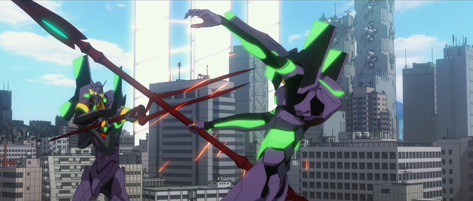

# Rei 6 The Doll Who Shouted "I"

## Summary

Where Rei 6's journey might take her in Shin Eva. Part 2 of 2.

## Content

<a href="https://www.arqacrypha.net/post/rei-6-the-programmable-human" rel="noopener" target="_blank"><u>Last time</u></a>, I talked a little about Rei 6's beginnings as an artificial being who achieves awareness and a desire for self-actualization. Now, I'll explore how her character arc might play out going forward. Expect plenty of shameless speculation!

At the end of <em>Q</em>, and on into the beginning of <em>Shin</em>, Rei 6 stops existing to carry out the will of others -- and starts living for herself instead. She takes a fresh new look at her experiences, starting with what's happened since she was dispatched to retrieve Shinji. And we see a lot of changes happen very quickly. 

To start with, Rei seems to realize that she’s actually interested in others and wants to be near them, even if she doesn’t know what to say or how to act. 
<figure></figure>
<figure></figure>
<figure></figure>
She develops a sense of empathy, evident for example in the tiny gesture of her turning around to make sure Shinji is still okay (notice Asuka doesn’t bother, though I can’t really blame her) 
<figure></figure>
and in her ability to acknowledge the symbolic significance of objects like the SDAT. 
<figure></figure>
<figure></figure>
<figure></figure>
<figure></figure>
<figure></figure>
She would seemingly have no way of knowing that the SDAT is important and worth picking up... aside from remembering that Shinji treated it as significant and thought she should have it, which means she’s able to now see from another person’s point of view. Rei 6 even becomes markedly more expressive in a very short period of time. 
<figure></figure>
<figure></figure>
Her extremely rapid personality development provokes a great many questions. How is this possible? Was the facility somehow acting as a “psychological inhibitor”? Or her medication? Is just a short period of cessation enough to lift the effects? Whatever the case, I’m really looking forward to seeing it play out. 
<figure></figure>
It’s interesting yet entirely understandable that she seems to stick closer to Asuka in the shots we've seen from <em>Shin</em>. (For more, <a href="https://eva-fan.com/blog-entry-2723.html" rel="noopener" target="_blank"><u>here's a breakdown</u></a> of storyboards from the relevant scene that are hidden in the "Peaceful Times" short film.) Asuka shows right away that she knows what Rei is, 

ASUKA:

Hey, you're that pilot.

One from the original Ayanami batch, huh?

and Rei must be very curious about her origins. On top of that, Asuka gave her that push to save herself back there on the hull of the Wunder. Even if the effects weren’t intended, the impact of Asuka’s words must leave a significant impression. It’s easy to think that Rei will look up to Asuka and expect some <em>oneesama</em>-like guidance from her, and I definitely hope we get some interactions to that effect.

As uplifting as Rei 6’s blossoming personality is, she unfortunately does not leave all her problems behind by abandoning her post at Nerv HQ. Just because her Seele masters are dead, that doesn’t remove the program from her head, and it would be a bit too convenient if it were never heard from ever again -- so that’s a dangling plot thread that needs to be resolved. An even bigger issue regards her long-term prospects. From a certain point of view this might be a moot point, considering we don’t even know what the prospects of humanity as a whole are — for all we know, we’re getting an<em> Ideon</em> ending — but just assuming that the Earth is somehow restored and people can go on living… what would happen to Rei 6? Would there be a life waiting for her?

Much as I’m rooting for her, I’m not sure the prognosis looks all that good. And that reality might combine very messily with her newfound lust for life. 

The most obvious problem is that it’s implied she doesn’t even have a soul of her own. Kaworu somewhat vaguely suggests that her soul isn’t where a soul ought to be — so presumably, it’s somewhere <em>other</em> than inside her own body. Meaning... <em>what</em>, exactly?

We know that pieces of Lilith’s body can maintain a metaphysical link even after being severed and separated by some distance, 
<figure></figure>
so it’s not much of a stretch to suggest that Lilith’s soul is capable of “diffusing” into multiple vessels as well. This very phenomenon might be implied with Eva-01 early on, when Shinji hears and sees a vision of Rei inside Eva-01, long before Rei’s soul is taken into the Eva. 

REI:

Shinji... Shinji... Ayanami... Shinji...?

Rei... Rei... Ikari... Rei...?

No... Ayanami Rei.
<figure></figure>
After that, he has "Hell Train" interactions with Rei after losing consciousness inside Eva-01 on two separate occasions. Something very strange is going on. 

So we can extrapolate that Rei 6, and all other clones like her, are “borrowing” Lilith’s soul through some variation on the “quantum magic” (for lack of better term) phenomenon that first appeared in NGE. In effect, Lilith’s soul is anchored to one specific vessel, but it’s shared between a potentially infinite number of additional bodies. We could also tentatively speculate that sharing the same soul =/= sharing a mind and memories (at least, not by default), and thus every iteration of Rei has the potential to be unique. 

What is driving this phenomenon? Is it indefinitely sustainable? How long can you live off a borrowed soul? Is any kind of regular technological support required to maintain such an existence — such as, say, specialized drugs, or regular access to Rei’s facility?

There is some reason to think that Rei 2’s spiritual situation was similar to the one that’s been reconstructed for NGE. That is, Lilith’s soul was “split” between Rei 2’s body and Eva-00’s core, and undergoing fusion with an Angel resulted in the soul being made whole again. (The exact specifics may be slightly different in NTE, of course, so this is just a tentative hypothesis.) The reason I bring this up is that despite seemingly possessing a soul, or at least part of one, Rei 2’s body seemed very fragile. She regularly took some kind of medication for an unknown purpose, Ritsuko kept tabs on her health, and it’s rather directly implied that Rei 2 could not live without access to her facility. Does the same hold for all active Rei clones? 

Rei 6 takes a medication and regularly uses the facility, but data is lacking otherwise. The logistics of <em>all </em>Rei clones being dependent on that little facility are a bit mind mind-boggling since we may have something called “Rei Infinity” heading our way, but it’s also possible that the Infinity series only needs to be active for a short period (i.e., they just need to last long enough to do what's required of them for Final Impact). Another possibility that I can’t fully discount, due to lack of knowledge regarding NTE's metaphysical rule set, is that Rei 2’s possession of a soul ironically made her more fragile than other clones and made her uniquely depend upon the facility to live. 

That very lack of knowledge, however, means I can’t rule out the idea that Rei 6 might <em>also</em> rely upon the facility to live. And if she<em> does</em> need it, I foresee a pretty immediate problem: she more than likely does not know that she depends on it. Not yet, anyway. Remember, as far as she was concerned, she was just “waiting for orders”, and the facility played no greater role to her than that. As she was never away from it for very long, how could she have possibly known of her dependency? The poor girl wouldn’t have any idea. 

Following up on this line of thought, there’s some evidence to suggest that <em>something</em> will happen to her and she’ll be forced to return to Nerv HQ. None of this is conclusive, but taken together it’s certainly suggestive.

In <em>Until You Come To Me</em>, a mysterious short film that ties into post-<em>Q</em> events, there are two shots I want to look at. One seems to show Shinji’s hand walking along a wall, then, in the next, Rei 6 repeats the gesture. 
<figure></figure>
Partway through, her arm starts crumbling apart. So what’s being suggested is that, after an initial rather rough start, the two of them will finally start to form a connection, with Rei learning a little from Shinji about "becoming more human", but it’s disrupted by Rei 6 shattering or breaking in some sense. Metaphorically? Or is, perhaps, her literal body “breaking”? 

The transition between cuts has me especially intrigued. The second-to-last key frame before Shinji's hand fades out, look where his finger touches down. This point becomes, for Rei 6, a literal break in the continuity of the wall. Her hand shatters right before she would otherwise reach this dividing line and attempt to cross over it. Some of the symbolism feels straightforward enough -- there's a "line" that Rei 6 "cannot cross", or even reach at all -- but the imagery of Shinji's fingers leaving this "line" for Rei as they transition out puzzles me at the moment. A lot here to chew on.

Take note of the choice to show Rei 6's hand and arm shattering. When Rei 3 started to fall apart in EoE, what was it that fell off first? 
<figure></figure>
Her arm. NTE does love its meta references...

It might be possible to link the suggestion planted by the UYCTM shots to this shot from trailer #3 of Rei extending her hand:
<figure></figure>
The shot imitates Kaworu extending his hand to Shinji, 
<figure></figure>
and Rei 6 is pointedly holding the SDAT, so presumably she too is offering her hand to Shinji (as opposed to someone else). But will he be able to accept it? And I don't simply mean "will he trust Rei 6 enough to take her hand as he took Kaworu's?" -- rather, will Rei even have a hand left to hold by the time he accepts her offer? Or will her body pick a most inconvenient time to start falling apart? 

Consider: The time of day could be sunset or sunrise. (Sunset seems more likely; as a general rule of thumb, sunsets are "warmer", and sunrises are "cooler".) If the former, that’s rather symbolically poignant. Sunset is when day turns into night, and it represents a major change or transformation, the idea that -- for better or worse --- something will soon come to an end; for example, a particular stage in one's life. Since sunset involves light succumbing to darkness, it can be a metaphor for the passage of the living into the world of the dead. Recall the bleeding angel statue set against the sunset in the credits of <em>Death</em>, or Eva-01 ripping apart Eva-03 as the sun goes down. 
<figure></figure>
<figure></figure>
Thus, the setting sun could represent Rei 6's time running out, i.e. she is very close to death if the situation doesn't change very soon. 

Of course, not actually knowing the context, this <em>could</em> possibly be a sunrise, thereby signifying the start of a new beginning in Rei 6 and Shinji’s relationship. Either one could be appropriate, in theory. Hence we move onto the next bit of evidence, Shinji looking at the SDAT in trailer #2.
<figure></figure>
This shot mirrors the one from <em>Q</em>, where Shinji was looking at the SDAT after Ritsuko returned it to him: 
<figure></figure>
On its own, this is a little ominous… Back in <em>Q</em>, the SDAT was the sole token Shinji was left with of “his” Rei. Remember that in <em>Ha</em>, Shinji actually threw the SDAT into the trash, and he only got it back because Rei found it and took it into battle with her, and ultimately its compositional data followed Rei’s soul into Eva-01’s entry plug, where the object was later reconstituted. Toward the end of <em>Q</em>, Shinji was separated from his SDAT once again — accidentally dropping it and being too apathetic to retrieve it — and now, because of a different Rei, it’s been restored to his possession. The paralleled situation hinted at by these two shots is not exact, of course -- Shinji's emotional state seems very different from one to the next, for example -- but I don’t think it bodes well for the idea that Rei 6 will be joining everyone else on board the Wunder. 

Next up is a visual parallel (noticed by <strong>Velorex</strong>). 
<figure></figure>
<figure></figure>
The shot of the shocked, glassy-eyed Rei with creepy Fuyutsuki is actually a callback to Rei 6 contemplating Asuka’s words “What do YOU want to do?!” There being a parallel doesn’t necessarily prove this is #6, but it feels like the most likely possibility. She’s the already-established Rei — any clones that get introduced in <em>Shin</em> would presumably just be accessories to her development — and she has her character arc from <em>Q</em> to finish. So, assuming this <em>is</em> her, her scene with Fuyutsuki in <em>Shin</em> might act as a cruel subversion of the progress she’s made up to that point. Rei 6 had started to break free of her prison with the realization that she was her own person with desires of her own that she could act upon, and seemed to be growing more “human-like” at a remarkable pace — yet here, she is drawn in a way very deliberately evoking the creepy doll children from EoE.
<figure></figure>
So what’s going on? It’s easy to imagine that Fuyutsuki is torturing her with some manner of expo-dump intended to break Rei’s spirit and show that, no matter what she’s recently started letting herself believe, she really is just a doll after all. In other words, the facsimile of a human being, created by actual human beings for their own delight. Her own desires are immaterial; dolls don’t have wants or needs. Discovering her potential as a human being is met only by slamming brutally against the barriers imposed on her existence as an artificial creation. 

If all of this adds up, then what might happen is that during the trip to rendezvous with Wunder, Rei 6’s body starts to fail. (An arm abruptly falls off, for example.) As a result, she’s forced to return to Nerv HQ to recuperate and try to find a way to live while preserving her new sense of autonomy. Though it might feel counterintuitive, this prompt reversal in her fortunes would function as a natural and necessary part of her character arc. There’s the raw survival aspect, of course, but also: one cannot thrive in ignorance. Rei must learn about her true nature and decide how to feel about it. What to DO about it. 

Let’s revisit that shot of Fuyutsuki and Rei. This one incredible visual, combined with the direction Fuyutsuki’s character <a href="https://forum.evageeks.org/thread/20167/Nemesis-Ra-Kozo-Fuyutsukis-Possible-Role-in-Shin/" rel="noopener" target="_blank"><u>seems to be heading</u></a>, suggests that Nerv’s deputy commander might subject #6-kun to a condensed version of what Shinji was put through in <em>Q</em>. In other words, brutalize her with exposition and make her feel utter despair — and then offer a way out. 

The world isn’t fair and the cards were stacked against Rei 6 from the beginning. She might be a doll, but she's not just any doll: she is a proverbial Pinocchio, a puppet that has miraculously developed a desire for what the living take for granted. (This would tie into NTE’s fairy tale motifs, naturally.) But how could a puppet possibly make such a wish -- to have a strong, healthy body and a soul of her own -- come true? I think you know the answer.
<figure></figure>
<figure></figure>
The obstacles that Rei 6 faces are immaterial in the face of the unbelievable power that the Evangelions wield. 

And understandably, you’re probably asking, “Why?” Why would Fuyutsuki seek to manipulate Rei 6 with the promise of an actual future? It’s no secret that Nerv will be making preparations for Final Impact early in<em> Shin Evangelion</em>. Part of this will involve ensuring that Kaworu’s soul is properly seated within Evangelion 13, and then Gendo will use the Key of Nebuchadnezzar on himself and follow in Yui’s footsteps, entering <a href="https://static.wixstatic.com/media/87d07b_672e679b43754ed6ba98b02b63c07505~mv2.jpg" rel="noopener" target="_blank"><u>one of Eva 13’s cores</u></a>. But that only takes care of the spiritual issue previously satisfied by using the double entry system. That doesn’t mean that a pilot won’t still be needed. 

And perhaps, in theory, any Rei clone would do. But maybe Fuyutsuki doesn’t want to use just any Rei clone. He doesn’t want to put just any puppet into 13’s entry plug. He wants to use a Rei that’s developed a sense of volition. And that’s Rei 6. 
<figure></figure>
Fuyutsuki’s behavior in <em>Q</em> establishes that a rift has formed between him and Gendo. Gendo is, of course, completely indifferent to this fact; he’s focused singlemindedly upon his goals, and nothing else matters. He’s come to take Fuyutsuki for granted. And so, if Fuyutsuki happens to prefer an outcome not entirely consistent with Gendo’s plans, there would be little in the way of him pursuing it. Gendo, left entirely to his own devices, will soon remove his direct influence from the game board. As always, Fuyutsuki will be asked to handle the rest. That will make subverting Gendo’s desires incredibly easy. But Fuyutsuki presumably can’t pilot Eva 13 himself, so he needs to mold a pilot to act in a way that will pay off for him... (And you might wonder what Fuyutsuki’s plans could possibly be, such that they would require betraying his long-term partner in crime. Well… that's for another write-up, hopefully soon.) 

Rei 6’s reasons for cooperating with the old man would be entirely sympathetic. She wants to live a life that's all her own, nothing more. Piloting Eva 13 and ushering in Final Impact would give her that chance. Why not take it? Given her ignorance and naivete, it would probably not be difficult to get her to overlook any ethical complications her actions would result in. She has a perfectly legitimate excuse for not knowing any better. If Shinji eventually seizes the opportunity for redemption and attempts to stop her, what is he supposed to say? “Sorry, but you're not allowed to have that”? Would he be in any position to tell that to someone else, after his <em>own</em> willingness to initiate an Impact for the sake of a single person's life? 

The sorts of very raw and real feelings this dilemma would invoke — the will to live is one of the most universal drives of all — make me giddy over the possibilities for an eventual showdown. Which, if Rei 6 indeed becomes the pilot for Eva 13, we know for a fact will happen. 
<figure></figure>
Artificial life fighting for self-actualization is a classic tale and as potent now as it ever was. Whatever ends up happening to Rei 6, I hope that she receives a rich and nuanced treatment where the outcome, no matter how bleak, has her pursuing her own unique sense of self to the very end. A Rei who is terrified of disappearing, but unlike Rei 3 never returns to the collective. We shall soon see.
