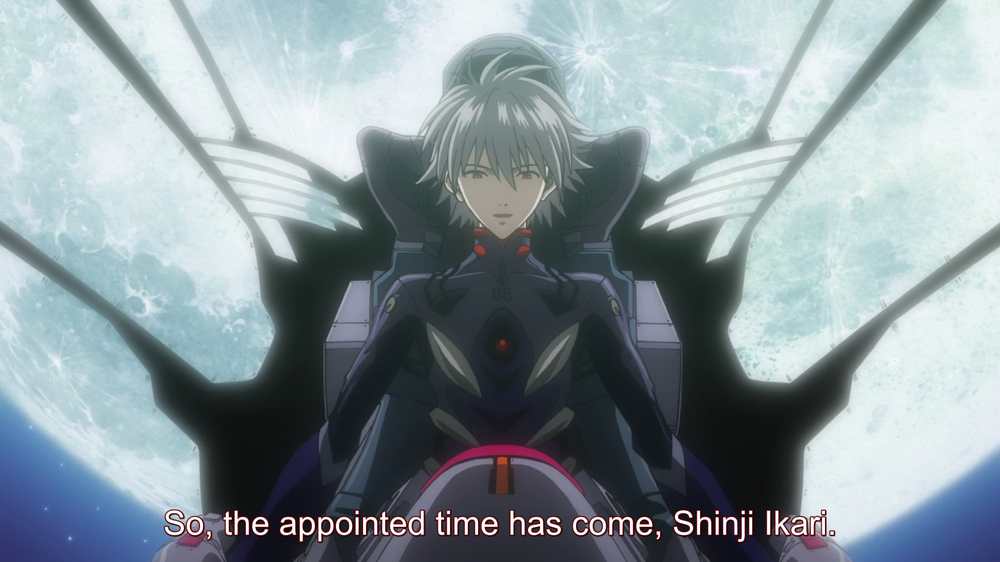

# Release Day!

## Summary

Happy Shin Evangelion release day, everyone! After an astounding 9 year hiatus and multiple delays, the final installment of the New...

## Content

<figure></figure>
Happy Shin Evangelion release day, everyone! After an astounding 9 year hiatus and multiple delays, the final installment of the New Theatrical Edition tetralogy is finally out there in the world. Hard to believe it's finally real, isn't it?

It's been a wild day and there are all kinds of spoilers to sift through and information to process. For those of us not lucky enough to live in Japan (and speak Japanese), it's going to be a long couple days discerning the truth about what's going on. Lots to do and lots to look forward to! 

Everyone hoping to avoid spoilers, I wish you the best of luck, and hope that you're able to experience the movie on your own terms. More power to you for your patience and resilience! For those of you who aren't, Reichu's started up a second twitter account dedicated just for spoilery stuff, so you don't have to worry about seeing them on the main Arqa Apocrypha account! You can find that here at <a href="https://twitter.com/ArqaZone" rel="noopener" target="_blank"><u>Arqa Spoiler Zone</u></a>. 

Now come the final revelations (until the CRCs, at least), and with that inevitably comes the reality that fan theories will be debunked, and speculation will be wrong. That's just the nature of things, and you know what? That's perfectly okay. It's all right to be wrong. To me, at least, speculation is about the fun of trying to solve a mystery that's been handed to you with the available evidence, and without the full picture, that evidence isn't always going to lead where you think. The only prize for being right is the satisfaction of knowing you figured something out, which is nice! But not being right has its own rewards too. There are whole new avenues you might never have considered suddenly open to explore, and as a person who loves "Deep Lore?" It's amazing to have <em>more </em>than you ever thought you did.

What I'm saying is: If your favorite theory ends up not being true, that's okay. Try not to let it get you down or weigh too heavily on your mind. Instead, try to take a good, earnest look at what you've been given instead. You might find something even better in it.

We expect a lot or even all of our speculation to be completely off the mark, and we're fine with that! The fun is just beginning!
