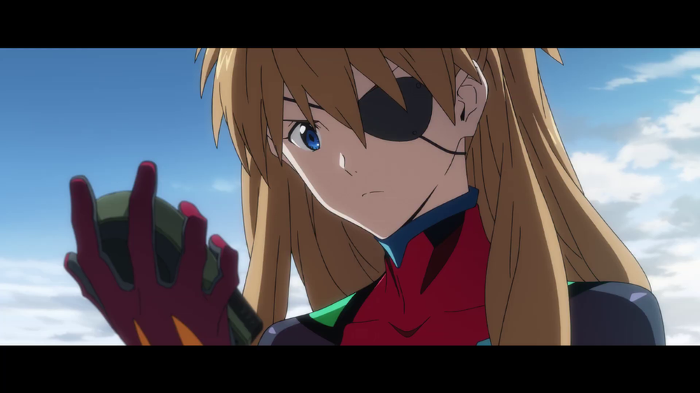

# The Mysterious Miscreant Mari Makinami Illustrious

## Summary

Greetings, Arqa readers! BlueBasilisk here! Some of you may recognize me from the EvaGeeks Forums or the EGF discord server. Lately I've...

## Content

<figure></figure>
Greetings, Arqa readers! BlueBasilisk here! Some of you may recognize me from the EvaGeeks Forums or the EGF discord server. Lately I've been hanging around Reichu's Apkallu server (mentioned in her previous post) helping out with all the furious speculating. Reichu asked me if I'd be willing to make some guest contributions to the site, and with Shin Eva suddenly less than a week away and closing quickly, it seemed wise to follow her example and get this out into the wild before time renders it <em>totally</em> obsolete. This won't be as polished as I would have liked, but substance matters more than style.

So let's get right into the thick of things. One of the mysteries that's been hanging before us for more than a decade now is the identity of Mari's mysterious benefactor in 2.0. It's clear that she's working with <em>some </em>mysterious faction, but who are they exactly? In the future world of 3.0 and Shin Evangelion, Mari has thrown her lot in with the Wille crew, working alongside Misato, Asuka and the others to put a stop to the machinations of Seele and Neo-Nerv, so it would seem like that plot thread has possibly been abandoned, doesn't it? That seems to be a fairly common refrain among the fandom.

Not necessarily. Let's take a look at what we do know and see if we can't tie the threads together and get a better picture of who Mari really is.

2.0 starts us off with a good foot forward. Mari helms the opening sequence, and in her very first outing as an Evangelion pilot, she self-destructs Eva-05, destroying it, the escaping 3rd Angel, and a good portion of the huge black egg that makes up Bethany Base. Immediately after the battle concludes, we cut over to Kaji, who fled earlier in a jet along with the Key of Nebuchadnezzar. He offers us this crucial bit of information:
<blockquote>Kaji: Looks Looks like Unit Five's self-destruct mechanism functioned properly... I just don't like using kids as pawns for the convenience of adults.</blockquote>
A sentiment which is echoed by Mari, who's now floating on the red ocean in Eva-05's entry plug:
<blockquote>"I don't like using adults as pawns for the convenience of kids."</blockquote>
What this little exchange tells us is that our mystery girl is partnered up with one of Eva's familiar old faces, Mr. Ryoji Kaji himself. This idea is alluded to earlier in the scene as well, with Kaji speaking to her as she's running through Eva-05's start-up sequence in prep for launch:

<blockquote>Kaji: Too bad the new plugsuits weren't ready. [...] And I'm sorry to have to send you into battle with a provisional Eva.</blockquote>
<blockquote>Mari: I'm just happy to finally be a pilot. No problem.</blockquote>
<blockquote>Kaji: Well, you were a troublemaker. But we're counting on you now. </blockquote>
There's also a character relationship chart in the 2.0 edition of the Evangelion Chronicle encyclopedia/supplementary magazine labelling Kaji as Mari's superior, and her as his subordinate. Eva Chronicle can be a...dubious resource (it somewhat infamously claimed that Eva-02 looks different in EoE because it was <em>completely overhauled</em> in the short time frame between 24 and 25'), but fortunately this particular claim has very solid support in the text of the film itself.

I'm not entirely sure what Mari means when she says she doesn't like using adults for her convenience, but I think it's meant to show that the relationship is professional and transactional rather than something more personal like Shinji and Misato's relationship, or even the relationship Asuka had with Kaji in the corresponding part of NGE. Kaji doesn't appear to be her guardian, and she's not sexually interested in him like Asuka Soryu was (<em>thank god</em>). She provides him access to an Eva pilot, and he lets her pilot Evas.

Their could be further dimensions to their relationship, of course. This is just what I've been able to piece together with the available evidence. 

It's pretty likely that Kaji is the person who calls Mari after she crashes on the roof of Shinji's school too. There's no <em>direct </em>confirmation of this and the text on Mari's phone is too small to read, if it's even supposed to be legible at all, but whoever it was ordered Mari to enter Japan to sneak into Japan "covertly," they're in a position to run interference with the officials at Nerv-Euro, and in the scene immediately following this, Kaji intercepts Shinji at Nerv HQ while he's fussing over his SDAT, which Mari broke when she hit him. That new model plug suit he was talking about also shows up in time for Mari's fight against the 10th Angel during the film's climax. The signs are definitely pointing in Kaji's direction, I think. 

So who is Kaji working for then? That's a bit trickier. Kaji is something of an enigma himself. His counterpart in Neon Genesis was officially a Special Inspector for Nerv, but he worked covertly as a spy for the Japanese Ministry of the Interior and as a spy for Seele. Fuyutsuki describes the NTE continuity's Kaji as "Chief Inspection Officer Ryoji Kaji." No agency is ever specified, but he wears a Nerv uniform and Misato says he's supposed to be stationed somewhere within Euro-Nerv (which he was), so I think it's fairly safe to deduce that his above-board position is still part of Nerv. 

Behind the scenes, however, he's still doing intelligence and espionage. The plot to put Bethany Base and Eva 05 out of commission? That was <em>Gendo's </em>plan:
<blockquote>Kaji: (speaking to Gendo and Fuyutsuki: I've got to say, that was quite an assignment. This "accident" solves the issue of the 3rd Angel and Unit 05. This will deal a setback to the Marduk Plan at Bethany Base. </blockquote>
<blockquote>Everything is proceeding according to your scenario.</blockquote>
We know that he's in a position to spy on Seele for Gendo and to get his hands on some <em>extremely</em> sensitive intelligence, like the report he gives Gendo on the construction of Eva Mark.06 at the 7th Branch on the Moon. Fuyutsuki says that the Eva Project's development plans don't extend beyond Eva-05, so he's privy to at least some information that hasn't been disclosed to Gendo and Seele yet. 

Whether or not he's still spying on Seele's behalf is unclear. NTE Seele aren't as clandestine as their NGE counterparts were. Misato already knows of their existence as Nerv's parent organization but not a whole lot more, and Kaji warns her off of pursuing that lead any further. Mark.06 was under construction at a numbered Nerv branch, so it's possible Kaji's clearance as Chief Inspection Officer opens these kinds of doors for him. Kaji is shown spying on Gendo, but he's never seen feeding information back to Seele, for what that's worth.

Over the years, I've seen two fairly common theories about who Mari is. One is that she's secretly a spy working for Seele, and the other is that she's Gendo's inside woman in Wille. The idea that she's a Seele spy can be safely discarded I think. A great many of her actions run counter to their interests. Sabotaging Bethany Base and eliminating the valuable specimens there was a blow against Seele's plans, albeit a rather small one they claimed was within the scope of amendment. Mari was also responsible for shutting down 4th Impact when she intercepted Eva-13 and ejected Shinji, scuttling Seele's plans right when they were on the cusp of victory! If she did ever have any kind of loyalty toward Seele, she's definitely turned face by 3.0. But again, I don't think she was a member of that camp.

As for Gendo...sorta-kinda? As we covered above, she and Kaji did have some kind of alliance going on with Gendo during 2.0, but the full extent of it is very vague. It may simply be an enemy mine situation against the common enemy of Seele. Mari signals in various little ways throughout 2.0 that she's no Nerv loyalist and actively tries to impede their efforts at every turn in 3.0.

The information we've covered so far provides some plausible answers for two mysterious aspects of Mari's character. How and why does a teenage girl know so much about the deep mysteries of Eva? Because she's partnered with Kaji, who traffics in exactly this kind of forbidden knowledge. In 3.0, she calls Gendo "Gendo-kun," which suggests familiarity. Why does she call him that? Same reason. She's familiar with him through her work with Kaji. And because she's a flippant sort of person. "Troublemaker," remember?

Not the most exciting or glamorous solutions to these mysteries, I know, but what we know points me in this direction.  A lot of people think or hope that Mari is secretly a contemporary of Yui's somehow stunted into adolescence for decades via the curse of Eva thanks in large part to Stage 96.5 of Sadamoto's manga. Sadamoto himself debunked that theory in a 2016 interview, which you can read in full <a href="https://wavemotioncannon.com/2017/02/21/the-current-status-of-gainax-interview-hiroyuki-yamaga-yoshiyuki-sadamoto-september-2016" rel="noopener" target="_blank"><u>here</u></a>. The timelines for that wouldn't match up regardless. Even if she skipped grades, going to college with Yui would put Mari in her early 20s before there was so much as a functional prototype of an Eva. I think it might be possible she knew Gendo and Yui as a child through the Artificial Evolution Lab, but I'll come back to that later.

But there is still one more major point to cover. The point that sparked the conversation that lead to this article in the first place: the reactivation of Eva-02 to fight the 10th Angel.

<figure></figure>
A running background plot point throughout 2.0 is that there are political shenanigans going on between Euro and Japan. In the scene right before Mari's arrival in Japan, Ritsuko, Misato and Maya are discussing the bind they're put in by the limitations of the Vatican Treaty, and Ritsuko offers this little seed of information:
<blockquote>Ritsuko: With their Unit 05 lost, Euro and Russia are getting Asia involved with their claims.</blockquote>
The fruit is borne a little later on. Following the untimely and totally-an-accident demise of Eva-04, the US government gets cold feet and dumps Eva-03 on Nerv Japan. Under the articles of the Vatican Treaty, each country can only have 3 Evas, so one of them has to go into storage. Seele wants to get rid of Eva-00 and refuses to fund repairs because its role is almost finished. I have suspicions that they intended for Mark.06 to absorb it and Lilith's soul but Gendo beat them to the punch with Eva-01, but that's a topic for another time. Instead, Eva-02 is put into containment and Asuka is removed from her role as a pilot because Euro still retains full ownership of Eva 02. 

<figure></figure>
Here we're introduced to a new organization that wasn't part of any previous Evangelion continuity: The UN International Project Evangelion Agency, or IPEA. You can probably already see where I'm headed with this.

Take note of the writing on the wall behind Asuka above and below the catwalk. The Eva containment silo is split into two jurisdictions. Everything above the catwalk is under Nerv's control. Everything below, where the Eva resides, is under the IPEA's jurisdiction. Note that Asuka, Ritsuko and Maya are required to wear these guest ID badges while they observe Eva-02 being sealed.

<figure></figure><figure></figure>
Keep in mind that Ritsuko is the current head of Project Evangelion at Nerv HQ, and even she has little to no authority in this. And yet Mari is able to commandeer Eva-02 later. How is that possible?

I've seen it repeated again and again and again ad nauseum that Mari hijacked Eva-02 here without authorization, which is often used to bash her as it's proof she's a Mary Sue or something nonsense like that (bleh). But nope, that's not the case at all. Nobody stole anything and I'd really like to know how people think Mari even had the means to hijack an entire Eva by herself. The devil, as with many thing Eva-related, is in the little details. I can understand people missing this crucial information because it's in the background and damn near drowned out by blaring sirens and the mechanics at work inside the silo.

Take a look at what the IPEA technicians are saying while Mari is suiting up. Bolding the most important part for emphasis:
<blockquote>??: Eva Unit Two's containment measures have been unlocked. We are currently opening up Silo Two.</blockquote>
<blockquote>??: Final safety systems have been disabled. Removal of all restraining gear is now complete.</blockquote>
<blockquote>??: Entry plug currently moving into position. Thirty seconds to insertion lock position.</blockquote>
<blockquote><strong>??: Core unit automatic reconfiguration sequence has begun.</strong></blockquote>
<blockquote><strong>??: Rewriting access key. The new designated pilot will be registered as Mari Makinami Illustrious, pass code zero five.</strong></blockquote>
<blockquote>??: Two minutes forty seconds until activation program start.</blockquote>
See? No theft. What we do have is a much bigger deal than that. Eva-02's accesses and core data have been rewritten so that Mari is now officially Eva-02's pilot. There's a whole lot to digest in this short scene. Not only does Mari have the credentials to access Nerv HQ, she's able to get into this containment silo, which is outside of Nerv's usual jurisdiction. The crew in this silo (evidently) know who Mari is, possess the new plugsuit Kaji was talking about way back in the beginning of the film, have Mari's pilot data on hand and access to it to perform the core reconfiguration, <strong>and </strong>they have the authority to put her in the pilot seat in a moment's notice. Keep in mind Mari is supposed to be in Japan in secret.

 Not only that, they are able to independently arm and deploy Eva 02 into combat with zero input from Nerv HQ's command staff. Operations didn't even know it <em>had </em>been<em> </em>launched until Misato passed it on the express elevator and no order had been issued to do so. 

One possibility here is Euro. After all, they do retain ownership over Eva-02 as previously covered and Misato tells the bridge crew to request that they position it inside the GeoFront to protect HQ. When Mari spoke to Kaji on the phone back on the rooftop, she asked him to work something out with them. This could have been what they were talking about; negotiating things with Euro command to make Mari the pilot of Eva 02.

I don't think it was them though, for a few reasons. One, if Euro intended to replace Asuka as the pilot of Eva 02, there's no reason to be clandestine about it. It's their Eva and their call. Asuka's been transferred to Japan so that probably makes it easier for that call to come down if that's what they desire. And the mission Mari discussed was supposed to end with an extraction. Covert entry and extraction don't really track with a long-term piloting engagement.

Two, again, the silo is outside of Nerv's control, so it's very questionable whether Euro has the authority to authorize that. This is unclear since the political situation in Japan has shifted yet again thanks to the destruction of Eva-03 reducing the number of Evas back down to 3. 

Third, the lack of communication or orders. Up til now, Euro has been raising a huge stink with Japan, but then they suddenly just decide not to in a crisis situation? General Henderson had no problem waving his jurisdiction in Misato's face during the 7th Angel battle when he pre-empted her orders with Task 02 and deployed a European Evangelion into combat in Japanese airspace.

<figure></figure>
But Nerv HQ is completely in the dark and Mari has disabled communications from inside the Eva. Very secretive. 

My conclusion from this: I think there's a very strong possibility that Kaji and Mari are either working for or in conjunction with the IPEA. Kaji's work is focused around Nerv facilities where Evangelions are. Eva-02 is already en route to Europe by the time the 3rd Angel is released, so Bethany Base is the only facility in Euro who has an Evangelion (on the books, anyway). 

Once that is handled, they leave Euro and head to Japan's HQ where all the other active Evangelions are. 06 is under construction on the moon and inaccessible. 04 is an incomplete prototype and 03 is finished but not in service. HQ is where all the action is with the 3rd Angel sent off. 

An organization regulating the Evangelion Project having a pilot that's not affiliated with Nerv in their employ would be a very logical step too, and a big change from NGE. Kaji's partnership with Mari gives him a lot more agency and power than his previous incarnation ever had. An Eva pilot who's willing to help him with his dirty work? That's a big, <em>big </em>deal.

I haven't been able to figure out what Mari's secret mission in Japan actually is, but after talking it over with Reichu, we've come up with two ideas. Mari and Kaji may have been planning to sabotage and ultimately destroy Eva-02 like they did Eva-05. Yeah, it's associated with Asuka and all, but Eva-02 is still a cog in Seele's plans and it's one of Euro's freaky experimental Evas. Its loss would be a small setback, but better than nothing. Mari very nearly pulled this off fighting the 10th Angel, and would have died herself in the attempt if Rei hadn't thrown her clear of the blast. Good thing for Wille that Rei II came through, huh?

The other is that they may have intended to pre-empt both Gendo and Seele's plans by dispatching the 10th Angel before either of them could use it to awaken their respective Evas. There were still two more Angels left after that, but the 10th seemed to be The Big One. Seele had Eva Mark.06 ready to deploy as soon as the Angel showed up, so Kaji may have had intel that they were prepared to move. The climax of 2.0 sees a whole mess of conflicting plans converging and no less than 3 parties playing Xanatos Speed Shogi against each other so it's really, <em>really </em>hard to pin down who knew what and how.

One last possibility that recently came to light is that they could secretly be working for Wille. It's my understanding that one of the changes featured in 3.333 is that the crashed VTOLs inside the Black Moon now feature Wille's logo on them. I think the common assumption was that Wille was founded from Nerv defectors forming an alliance with some other groups such as the JSSDF for an attack on Nerv and getting re-organized into Wille proper around or following Third Impact. I haven't seen this cut myself, but if true, it's solid proof that Wille itself existed during or shortly after the 2.0 era. 

It's intriguing, and a lot of people Kaji knows (Mari, Misato, Ritsuko, Takao, Asuka) do end up in Wille's force in 3.0, but I don't think I can do much with this idea without more evidence than we currently have. But it's out there in the ether so it deserved a mention to cover all the bases if nothing else. 

I promised I'd come back to this later, and it feels like a good way to close out this subject. I said it might have been possible for Mari to have known Gendo and Yui during her childhood via the Artificial Evolution Lab. To see how, let's go back to Fuyutsuki's photo of Yui and Shinji:
<figure></figure>
The mysterious woman on the right side has been a real hot topic of debate for several years now. A lot of people think she's NTE's version of Asuka's mom. I did too for a long time. But upon closer examination, especially with the color corrections, I think she has much more in common with Mari than she does with Asuka. Asuka Shikinami's hair is a lighter auburn color, but this woman has very dark hair, sort of reddish-brown. 

<figure></figure>
It's not the same color as Mari's either. Mari's hair is a medium brown, but it's much closer to that shade than Asuka's.

The woman's shirt is pink and white, a color scheme associated with Mari because of her second and third plugsuits. She has red glasses like Mari, and her hair barrette is red, like Mari's hair ties. The hairband with Mari's neural connectors is blue, but if you look at the rubber bands holding her pigtails...they're red! Sure, all that could mean nothing. Misato and Asuka also wear pink and white at various points, after all. But there are too many overlapping color schemes and design choices there to dismiss the idea out of hand for me.

We know Gendo, Yui, Shinji and Rei were all present at the Artificial Evolution Lab at some point or other. Asuka may have been as well since the design sheet for her puppet describes her being at a lab as a child. If this woman is Mari's mother, she would have been part of the Evangelion project (the photo was taken in the Main Eva Control Building), and it's possible a young Mari could have met them that way. Shinji had his memories tampered with and doesn't seem to be able to remember any of that but the other Children are up in the air. Just some food for thought.

That's all for for my first outing here on Arqa. Thanks for taking the time to read this, and maybe I'll see you around for another article in the future1
